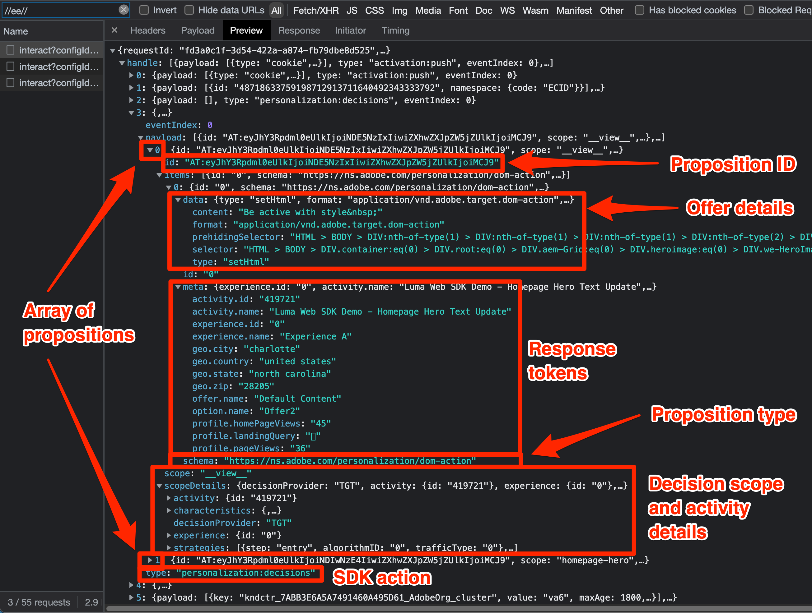

# 使用Platform Web SDK除錯Target

驗證Target活動並偵錯Web SDK，以疑難排解實作、內容傳送或對象資格問題。 此移轉指南頁面說明使用at.js和Platform Web SDK進行偵錯的差異。

下表總結了測試和偵錯方法的功能和支援。

| 特徵或工具 | at.js支援 | 平台網頁SDK支援 |
| --- | --- | --- |
| 活動QA URL | 是 | 是 |
| `mboxDisable` URL引數 | 是 | 請參閱下列資訊以停用Target功能[&#128279;](#disable-target-functionality) |
| `mboxDebug` URL引數 | 是 | 使用`alloy_debug`引數取得類似的偵錯資訊 |
| `mboxTrace` URL引數 | 是 | 使用Experience Platform Debugger瀏覽器擴充功能 |
| Adobe Experience Platform Debugger擴充功能 | 是 | 是 |
| `alloy_debug` URL引數 | 不適用 | 是 |
| Adobe Experience Platform Assurance | 不適用 | 是 |

## Adobe Experience Platform Debugger瀏覽器擴充功能

適用於Chrome和Firefox的Adobe Experience Platform Debugger擴充功能會檢查您的網頁，協助您驗證Adobe Experience Cloud實作。

您可以在任何網頁上執行Platform Debugger，而擴充功能可存取公開資料。 若要使用擴充功能存取非公開資料（例如Target追蹤資訊），您必須透過&#x200B;**[!UICONTROL 登入]**&#x200B;連結向Experience Cloud進行驗證。

### 取得並安裝Adobe Experience Platform Debugger

Adobe Experience Platform Debugger可安裝在Google Chrome中。 請依照下列適當的連結來安裝擴充功能：

- [Chrome](https://chrome.google.com/webstore/detail/adobe-experience-platform/bfnnokhpnncpkdmbokanobigaccjkpob)

安裝Chrome擴充功能或Firefox附加元件後，圖示()會新增至擴充功能列。 選取此圖示以開啟擴充功能。

請參閱專屬指南，以取得有關[Adobe Experience Platform Debugger擴充功能](https://experienceleague.adobe.com/docs/experience-platform/debugger/home.html)以及如何偵錯所有Adobe Web應用程式的詳細資訊。

## 使用QA URL預覽Target活動

at.js和Platform Web SDK都可讓您使用Target QA URL來預覽Target活動，而且這兩種實作方法都支援相同的QA功能。

Target QA URL可透過指示at.js或Platform Web SDK將特定Cookie寫入名為`at_qa_mode`的瀏覽器來運作。 此Cookie用於強制特定活動和體驗的資格。

>[!CAUTION]
>
>Platform Web SDK 2.13.0版或更新版本支援Target QA模式功能。 已根據`xdm.web.webPageDetails.URL`呼叫中傳遞的`sendEvent`值啟用目標QA模式。 對此值所做的任何修改（例如將所有字元設為小寫），都可能導致Target QA模式無法正常運作。

請參閱專用指南，以取得有關[Target活動QA](https://experienceleague.adobe.com/docs/target/using/activities/activity-qa/activity-qa.html)的詳細資訊。

## Debug Target實作

下表列出at.js與Platform Web SDK除錯策略之間的差異：

| at.js功能 | Platform Web SDK對等函式 |
| --- | --- |
| **Mbox停用** — 停用Target擷取和轉譯功能，以檢查頁面是否損毀，而不進行Target互動  使用URL引數載入頁面： `mboxDisable=true` | 沒有直接的對等方法。 您可以使用瀏覽器的開發人員工具封鎖所有Platform Web SDK請求。 |
| **Mbox偵錯** — 記錄瀏覽器主控台中的每個at.js動作，以協助疑難排解轉譯問題  載入具有URL引數的頁面： `mboxDebug=true` | **Alloy Debug** — 記錄詳細的SDK動作，包括但不限於Target個人化動作。  載入包含URL引數的頁面： `alloy_debug=true`   或在您的開發人員主控台中執行`alloy("setDebug", { "enabled": true });` |
| **目標追蹤** — 若在Target UI中產生mbox追蹤權杖，`window.___target_trace`物件下會提供包含參與決策程式之詳細資料的追蹤物件。  載入包含URL引數的頁面： `mboxTrace=window&authorization={TOKEN}` | 使用Adobe Experience Platform Debugger擴充功能或Platform Assurance。 |

>[!NOTE]
>
>以上列出的所有at.js偵錯功能都可以與Adobe Experience Platform Debugger的增強功能搭配使用。

### 停用Target功能

Platform Web SDK目前沒有選擇性地抑制Target回應的功能。 不過，您可以使用瀏覽器的開發人員工具、各種瀏覽器擴充功能或協力廠商應用程式來隱藏Platform Web SDK請求。 例如，若要使用Google Chrome封鎖Platform Web SDK：

1. 在頁面上的任何位置按一下滑鼠右鍵，然後選取&#x200B;**檢查**
1. 選取&#x200B;**網路**&#x200B;標籤
1. 依字串`//ee//`篩選，僅檢視Platform Web SDK呼叫
1. 重新載入頁面
1. 用滑鼠右鍵按一下其中一個已篩選的網路要求，並選取&#x200B;**封鎖要求網域**
1. 重新載入頁面，並注意網路要求遭到封鎖
1. 完成偵錯後，用滑鼠右鍵按一下封鎖的網路要求，然後選取&#x200B;**解除封鎖**，或關閉[開發人員工具]面板

### 檢視偵錯記錄

使用`mboxDebug=true` URL引數針對at.js進行除錯記錄，會顯示有關每個Target請求、回應及嘗試將內容轉譯至頁面的詳細資訊。 Platform Web SDK有類似的偵錯記錄，使用`alloy_debug=true` URL引數。

| 資訊已記錄 | at.js (`mboxDebug=true`) | Platform Web SDK (`alloy_debug=true`) |
| --- | --- | --- |
| 篩選的記錄前置詞 | `AT:` | `[alloy]` |
| 頁面載入請求詳細資料 | 是 | 是 |
| Mbox或範圍要求詳細資料 | 是 | 是 |
| 請求狀態 | 是 | 是 |
| 回應詳細資料 | 是 | 是 |
| 呈現狀態 | 成功和錯誤 | 僅限錯誤 |
| 演算詳細資料 | 是 | 是 |

>[!NOTE]
>
>at.js和Platform Web SDK的除錯記錄檔提供類似層級的詳細資訊，但值得注意的例外是，Web SDK僅會通知由於無效的選取器而發生轉譯錯誤。 除錯記錄目前不會確認轉譯成功。

### 檢視目標追蹤

Target追蹤提供關於活動資格和訪客Target設定檔的詳細資訊。 由於Target追蹤包含無法公開取得的資訊，檢視這些追蹤需要授權權杖或在Adobe Experience Platform Debugger瀏覽器擴充功能視窗中驗證。

| Target追蹤方法 | at.js  | 平台網頁SDK |
| --- | --- | --- |
| `mboxTrace` URL引數 | 是 | 無 |
| Adobe Experience Platform Debugger瀏覽器擴充功能 | 是 | 是 |
| Adobe Experience Platform Assurance | 無 | 是 |

若要使用Adobe Experience Platform Debugger檢視Platform Web SDK Target追蹤，請執行下列動作：

1. 導覽至網站上已使用Platform Web SDK實作Target的頁面
1. 選取瀏覽器導覽列中的圖示()，開啟Adobe Experience Platform Debugger擴充功能
1. 選取&#x200B;**[!UICONTROL 登入]**&#x200B;連結
1. 使用您的Adobe Experience Cloud登入憑證進行驗證
1. 選取左側的&#x200B;**[!UICONTROL 記錄檔]**&#x200B;索引標籤
1. 選取頂端的&#x200B;**[!UICONTROL Edge]**&#x200B;索引標籤
1. 選擇性地為您的偵錯工作階段命名，然後按一下&#x200B;**[!UICONTROL 連線]**&#x200B;按鈕
1. 重新載入頁面，且日誌應填入邊緣網路互動的詳細資訊
1. 將焦點放在描述中以「目標追蹤」開頭的記錄專案，並選取&#x200B;**[!UICONTROL 檢視]**&#x200B;以檢視Target追蹤詳細資料

{zoomable="yes"}

選取&#x200B;**[!UICONTROL 檢視]**&#x200B;後，會出現一個覆蓋圖，讓您檢視與請求相關的下列資訊：

- 符合的活動
- 不符的活動
- 請求詳細資料
- 設定檔快照

如需有關Target追蹤的詳細資訊，請參閱有關[偵錯Target內容傳遞](https://experienceleague.adobe.com/docs/target/using/activities/troubleshoot-activities/content-trouble.html)的專用指南。

### 疑難排解Assurance

可在Adobe Experience Platform Debugger瀏覽器擴充功能和Assurance應用程式（先前稱為Project Griffon）中檢視Target追蹤資訊。 若要在Assurance中檢視Target追蹤，請執行下列動作：

1. 開啟Adobe Experience Platform Debugger瀏覽器擴充功能，並依上述步驟連線遠端偵錯工作階段
1. 選取工作階段名稱位於偵錯記錄上方的連結
1. Platform Assurance會針對您在實作資料流中設定的所有Adobe應用程式，載入並顯示其詳細記錄
1. 依`adobe.target`篩選記錄檔
1. 選取型別為`com.adobe.target.trace`的記錄專案
1. 展開承載的詳細資訊並檢視`context > targetTrace`下的資訊

{zoomable="yes"}

## 檢查網路要求與回應

Platform Web SDK `sendEvent`呼叫的要求裝載和回應與at.js不同。 使用瀏覽器的開發人員工具檢查網路呼叫時，以下概述應可協助您瞭解要求與回應的結構。

### 內容請求承載

{zoomable="yes"}

- 設定檔、實體和其他非mbox引數是在`data.__adobe.target`下的事件陣列中傳遞
- 決定範圍位於`query.personalization.decisionScopes`下的事件陣列中
- 對應到下游mbox引數的XDM資料位於`xdm`下的事件陣列中

### 內容回應內文

{zoomable="yes"}

- Platform Web SDK會針對`handle`物件下的所有Adobe應用程式傳回動作
- `personalization:decisions`動作表示來自Target或Offer Decisioning的回應
- 目標主張以陣列形式呈現，每個都具有以`AT:`為前置詞的唯一主張ID
- 決定範圍和活動詳細資訊位於主張陣列中
- 選件詳細資料位於`items`下的`data`陣列中
- 回應Token位於`items`下的`meta`陣列中

### 主張事件裝載

{zoomable="yes"}

- Target特定SDK事件在曝光時為`decisioning.propositionDisplay`或互動時為`decisioning.propositionInteract`，例如點按
- 主張事件的詳細資訊位於`xdm._experience.decisioning`下的事件陣列中
- 顯示或互動事件的主張ID應符合從Target傳回的內容主張ID

恭喜，您已結束本教學課程！ 祝您將Adobe Target實作移轉至Web SDK！

>[!NOTE]
>
>我們致力協助您成功將Target從at.js移轉至Web SDK。 如果您在移轉時遇到問題，或覺得本指南中缺少重要資訊，請在[此社群討論](https://experienceleaguecommunities.adobe.com/t5/adobe-experience-platform-data/tutorial-discussion-migrate-target-from-at-js-to-web-sdk/m-p/575587#M463)中張貼以告知我們。
