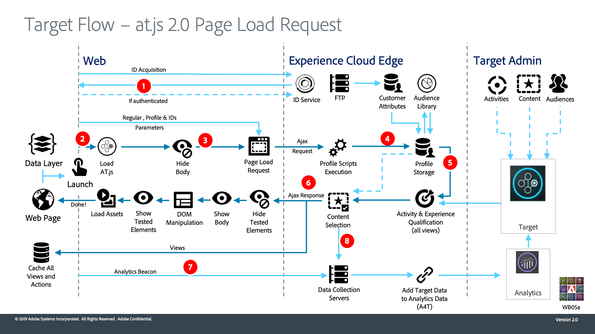

# at.js與Platform Web SDK的比較

獨立Adobe Target at.js程式庫與Platform Web SDK有顯著差異。 下表提供參考資料，協助您評估在移轉程式中可能需要著重於的實作領域。

檢閱下列資訊並評估您目前的at.js技術實作後，您應該就能了解下列內容：

- Platform Web SDK支援哪些Target功能
- 哪些at.js函式有等同於Platform Web SDK的函式
- 如何將Target設定套用至Platform Web SDK
- at.js和Platform Web SDK的資料流程有何不同

若您是初次使用Platform Web SDK，請不要擔心，本教學課程會詳細說明下列項目。

## 功能比較

|  | Target at.js 2.x | 平台Web SDK |
|---|---|---|
| 更新Target設定檔 | 支援 | 支援 |
| 觸發SPA檢視 | 支援 | 支援 |
| Target Recommendations | 支援 | 支援 |
| 擷取表單式選件 | 支援 | 支援 |
| 追蹤事件 | 支援 | 支援 |
| A4T:單頁應用程式 | 支援 | 支援 |
| A4T:點擊追蹤 | 支援 | 支援 |
| A4T:用戶端記錄 | 支援 | 支援 |
| A4T:伺服器端記錄 | 支援 | 支援 |
| 套用選件 | 支援 | 支援 |
| 在SPA中重新轉譯檢視而不發出通知 | 支援 | 支援 |
| 混合應用程式 | 支援 | 支援 |
| QA URL | 支援 | 支援 |
| Mbox第三方ID | 支援 | 支援 |
| 客戶屬性 | 支援 | 支援 |
| 遠端選件 | 支援 | 支援 |
| 重新導向選件 | 支援 | 支援.不過，不支援從具有Platform Web SDK的頁面重新導向至具有at.js的頁面（且方向相反）。 |
| 裝置上決策 | 支援 | 目前不支援 |
| 預先擷取mbox | 支援 | 2022年10月1日之後開始的所有新移轉均預設啟用 |
| 自訂事件 | 支援 | 不支援。請參閱 [公共路線圖](https://github.com/orgs/adobe/projects/18/views/1?pane=item&amp;itemId=17372355{target="_blank"}) 的URL。 |
| 回應 Token | 支援 | 支援.請參閱 [專用回應token檔案](https://experienceleague.adobe.com/docs/target/using/administer/response-tokens.html) at.js和Platform Web SDK之間的程式碼範例和差異 |
| 資料提供者 | 支援 | 不支援。自訂程式碼可用來觸發Platform Web SDK `sendEvent` 命令。 |

## 值得注意的圖說文字

|  | Target at.js 2.x | 平台Web SDK |
|---|---|---|
| 忽隱忽現緩解 | 非同步實作的預先隱藏程式碼片段使用的樣式ID為 `at-body-style`. at.js會在收到回應時尋找此元素ID以移除樣式。 | 預設的預先隱藏程式碼片段使用的樣式ID為 `alloy-prehiding`. Web SDK與at.js預先隱藏程式碼片段不相容，因此在移轉程式中必須加以變更。 |
| 在頁面載入時自動轉譯內容 | 以Target全域設定控制。 啟用時機 `pageLoadEnabled` 設為 `true`. | 在Platform Web SDK中指定 `sendEvent` 命令。 啟用，方法是設定 `renderDecisions` 選項 `true`. |
| 手動轉譯內容 | 此 `applyOffer()` 和 `applyOffers()` 函式僅支援設定HTML | 此 `applyPropositions` 命令支援設定、替換或附加HTML以增加靈活性 |
| 追蹤自訂事件 | 支援 `trackEvent()` 和 `sendNotifications()` 函式。 這些函式是Target專屬函式，不會影響Adobe Analytics量度。 | 來自Platform Web SDK的所有資料 `sendEvent` 呼叫會轉送至Target。 Target特別需要的補充資料應包含在 `sendEvent` 命令，其中eventType為 `decisioning.propositionDisplay` 或 `decisioning.propositionInteract` 以確保Adobe Analytics量度不受影響。 |
| 目標CNAME | 支援.這與用於Analytics的CNAME和Experience CloudID服務不同。 | 不再相關。 單一CNAME可用於所有平台Web SDK呼叫。 |
| 為  除錯 | 此 `mboxDisable`, `mboxDebug`，和 `mboxTrace` URL參數可用於使用瀏覽器的開發人員工具進行除錯。  Adobe Experience Platform偵錯工具也是支援的偵錯工具。 | 此 `mboxDisable`, `mboxDebug`，和 `mboxTrace` 不支援URL參數。  您可以新增 `alloy_debug=true` 或執行 `alloy("setDebug", { "enabled": true });` 在開發人員主控台中。  Adobe Experience Platform Debugger瀏覽器擴充功能可用來起始除錯的邊緣追蹤。  請參閱 [對Platform Web SDK進行偵錯](debugging.md) 檔案以取得詳細資訊。 |
| Analytics for Target (A4T) | 使用SDID值來拼接Target和Analytics呼叫 | 原生支援，不需匯整 |

>[!NOTE]
>
>不支援將Target移轉至Platform Web SDK，同時保留指定頁面的現有AppMeasurement Adobe Analytics實作。
>
> 您可以一次將at.js（和AppMeasurement.js）實作移轉至Platform Web SDK。 若您採用此方法，最好將 [`idMigrationEnabled`](https://experienceleague.adobe.com/docs/experience-platform/edge/fundamentals/configuring-the-sdk.html#id-migration-enabled) 和 [`targetMigrationEnabled`](https://experienceleague.adobe.com/docs/experience-platform/edge/fundamentals/configuring-the-sdk.html#targetMigrationEnabled) 選項 `true` 和 `configure` 命令。

## at.js函式和Platform Web SDK等效值

下表列出許多at.js函式使用Platform Web SDK時，都有相同的方法。 如需 [at.js函式](https://developer.adobe.com/target/implement/client-side/atjs/atjs-functions/atjs-functions/)，請參閱Adobe Target開發人員指南。

| at.js 2.x函式 | Platform Web SDK的對等方法 |
| --- | --- | 
| `getOffer()` 和 `getOffers()` | 請求和 [自動呈現](https://experienceleague.adobe.com/docs/experience-platform/edge/personalization/rendering-personalization-content.html#automatically-rendering-content) 以Target VEC為基礎的體驗，請使用 `sendEvent` 命令並設定 `renderDecisions` 選項設為true。  若要要求表單式體驗或 [手動轉譯](https://experienceleague.adobe.com/docs/experience-platform/edge/personalization/rendering-personalization-content.html#manually-rendering-content) 內容，指定陣列 `decisionScopes` (mbox) `sendEvent` 命令。 |
| `applyOffer()` 和 `applyOffers()` | 使用 [`applyPropositions`](https://experienceleague.adobe.com/docs/experience-platform/edge/personalization/rendering-personalization-content.html#applypropositions) 命令來應用內容。 您可以選擇設定、替換或附加HTML至特定選擇器。 |
| `triggerView()` | Platform Web SDK會自動觸發 [檢視變更](https://experienceleague.adobe.com/docs/experience-platform/edge/personalization/adobe-target/web-sdk-atjs-comparison.html#how-to-trigger-a-view-change-in-a-single-page-application) 以用於SPA VEC，若 `web.webPageDetails.viewName` 屬性設定於 `xdm` 選項 `sendEvent` 命令。 |
| `trackEvent()` 和 `sendNotifications()` | 使用 `sendEvent` 命令 [特定 `eventType`](https://experienceleague.adobe.com/docs/experience-platform/edge/personalization/adobe-target/web-sdk-atjs-comparison.html#how-to-track-events) 設定：  `decisioning.propositionDisplay` 代表活動轉譯  `decisioning.propositionInteract` 代表使用者與活動的互動，例如滑鼠點按。 |
| `targetGlobalSettings()` | 沒有直接等同的。 請參閱 [Target設定比較](detailed-comparison.md) 以取得其他詳細資訊。 |
| `targetPageParams()` 和 `targetPageParamsAll()` | 傳入 `xdm` 選項 `sendEvent` 命令已對應至Target mbox參數。 由於mbox參數是使用序列化點記號來命名，因此移轉至Platform Web SDK可能需要更新現有對象和活動，才能使用新的mbox參數名稱。   作為 `data.__adobe.target` 的 `sendEvent` 命令映射到 [Target設定檔和Recommendations特定參數](https://experienceleague.adobe.com/docs/experience-platform/edge/personalization/adobe-target/target-overview.html#single-profile-update). |
| at.js 自訂事件 | 不支援。請參閱 [公共路線圖](https://github.com/orgs/adobe/projects/18/views/1?pane=item&amp;itemId=17372355{target="_blank"}) 的URL。 [回應Token](https://experienceleague.adobe.com/docs/experience-platform/edge/personalization/adobe-target/accessing-response-tokens.html) 會公開為 `propositions` 回應 `sendEvent` 呼叫。 |

## at.js設定和Platform Web SDK等效值

您可以在Target UI中使用各種設定來設定及下載at.js程式庫。 這些設定也可以使用 [`targetGlobalSettings()`](https://developer.adobe.com/target/implement/client-side/atjs/atjs-functions/targetglobalsettings/) 函式。 下表比較這些設定與Platform Web SDK提供的設定。

| at.js設定 | Platform Web SDK的對等方法 |
| --- | --- |
| `bodyHiddenStyle` | 設定 [`prehidingStyle`](https://experienceleague.adobe.com/docs/experience-platform/edge/fundamentals/configuring-the-sdk.html#prehidingStyle) 和 `configure` 命令 |
| `bodyHidingEnabled` | 若 `prehidingStyle` 是以 `configure` 命令，則此功能將啟用。 如果未定義樣式，則Platform Web SDK不會嘗試隱藏任何內容。 |
| `clientCode` | 自動配置 |
| `cookieDomain` | 不適用 |
| `crossDomain` | 設定 `thirdPartyCookiesEnabled` 選項 `true` 和 `configure` 為跨網域使用案例啟用第一方和第三方cookie的命令 |
| `cspScriptNonce` 和 `cspStyleNonce` | 請參閱相關檔案 [設定CSP](https://experienceleague.adobe.com/docs/experience-platform/edge/fundamentals/configuring-a-csp.html) |
| `dataProviders` | 不支援 |
| `decisioningMethod` | 所有平台Web SDK `sendEvent` 命令使用伺服器端決策。 不支援混合決策和裝置上決策。 |
| `defaultContentHiddenStyle` 和 `defaultContentVisibleStyle` | 僅適用於at.js 1.x。與at.js 2.x類似，使用自訂程式碼即可緩解表單式體驗的忽隱忽現問題。 |
| `deviceIdLifetime` | 不支援。若 `targetMigrationEnabled` 設為 `true` 和 `configure` 命令 `mbox` cookie會以設定為2年的裝置存留期進行設定。 此值不可配置。 |
| `enabled` | 資料流配置啟用或禁用Target功能 |
| `globalMboxAutoCreate` | 設定 `renderDecisions` 選項 `true` 和 `sendEvent` 命令來自動擷取及轉譯VEC型體驗。  要求 `decisionScope` for `__view__` 如果您偏好手動呈現VEC型體驗。 |
| `imsOrgId` | 設定 `orgId` 和 `configure` 命令 |
| `optinEnabled` 和 `optoutEnabled` | 請參閱平台網頁SDK [隱私權選項](https://experienceleague.adobe.com/docs/experience-platform/edge/consent/supporting-consent.html). 此 `defaultConsent` 選項適用於Platform Web SDK支援的所有Adobe解決方案。 |
| `overrideMboxEdgeServer` 和 `overrideMboxEdgeServerTimeout` | 不適用. 所有Platform Web SDK請求皆使用Adobe Experience Platform Edge網路。 |
| `pageLoadEnabled` | 設定 `renderDecisions` 選項 `true` 和 `sendEvent` 命令 |
| `secureOnly` | 不支援。Platform Web SDK會使用 `secure` 和 `sameSite="none"` 屬性。 |
| `selectorsPollingTimeout` | 不支援。Platform Web SDK使用5秒的值。 如有必要，可使用自訂程式碼手動轉譯內容。 |
| `serverDomain` | 使用 `edgeDomain` 設定 `configure` 命令 |
| `telemetryEnabled` | 不適用 |
| `timeout` | 不支援。建議您確認任何忽隱忽現的緩解程式碼皆包含適當的逾時。 |
| `viewsEnabled` | 不支援。Target檢視的內容一律會在第一個 `sendEvent()` 呼叫 `renderDecisions` 設為 `true` 或 `__view__` decisionScope包含在請求中。 |
| `visitorApiTimeout` | 不適用 |

## 系統圖比較

下列圖表應可協助您了解使用at.js的Target實作和使用Platform Web SDK的實作之間的資料流差異。

### at.js 2.x系統圖

{zoomable=&quot;yes&quot;}

| 呼叫 | 詳細資訊 |
| --- | --- |
| 1 | 呼叫會傳回Experience CloudID(ECID)。 如果使用者已驗證，則另一個呼叫會同步客戶ID。 |
| 2 | at.js程式庫會同步載入並隱藏檔案內文（也可以使用將頁面上實作的程式碼片段預先隱藏的選用功能，以非同步方式載入at.js）。 |
| 3 | 提出頁面載入請求，包括所有已設定的參數、ECID、SDID和客戶ID。 |
| 4 | 設定檔指令碼會執行並饋送至設定檔存放區。 存放區會從對象資料庫中要求合格對象(例如從Analytics、Audience Manager等共用的對象)。 客戶屬性會透過批次程式傳送至設定檔存放區。 |
| 5 | Target會根據URL、請求參數和設定檔資料，決定要針對目前頁面和未來檢視傳回給訪客的活動和體驗。 |
| 6 | 傳回至頁面的目標內容，選擇性地包括其他個人化的設定檔值。  目前頁面上目標內容會儘快出現，不會有忽隱忽現的預設內容。  系統會在瀏覽器中快取單頁應用程式未來檢視的目標內容，以便在觸發檢視時立即套用，而不需額外的伺服器呼叫。 (請參閱下一個圖表，了解triggerView()行為)。 |
| 7 | 從頁面傳送至資料收集伺服器的Analytics資料。 |
| 8 | Target 資料會透過 SDID 來比對 Analytics 資料，然後經過處理放入 Analytics 報表儲存體中。然後就可以在 Analytics 與 Target 中，透過 A4T 報表來檢視 Analytics 資料。 |

如需如何取得的詳細資訊，請參閱開發人員指南 [使用at.js針對單頁應用程式實作Target](https://developer.adobe.com/target/implement/client-side/atjs/how-to-deployatjs/target-atjs-single-page-application/).

### Platform Web SDK 系統圖

| 呼叫 | 詳細資訊 |
| --- | --- |
| 1 | 裝置會載入Platform Web SDK。 Platform Web SDK會傳送含有XDM資料、資料流環境ID、傳入參數以及客戶ID（選用）的要求至邊緣網路。 頁面（或容器）已預先隱藏。 |
| 2 | 邊緣網路會傳送要求至邊緣服務，以便透過訪客ID、同意及其他訪客內容資訊（例如地理位置和裝置易記名稱）豐富該請求。 |
| 3 | 邊緣網路會使用訪客ID和傳入的參數，將擴充的個人化請求傳送至Target邊緣。 |
| 4 | 設定檔指令碼執行，然後饋送至Target設定檔儲存體。 設定檔儲存區會從對象庫擷取區段(例如，從Adobe Analytics、Adobe Audience Manager、Adobe Experience Platform共用的區段)。 |
| 5 | Target會根據URL要求參數和設定檔資料，決定要針對訪客顯示哪些活動和體驗，以用於目前的頁面檢視和未來的預先擷取檢視。 然後Target會將這個傳回至邊緣網路。 |
| 6 | a.邊緣網路會將個人化回應傳回至頁面，選擇性地包括其他個人化的設定檔值。 目前頁面上的個人化內容會盡快出現，不會有忽隱忽現的預設內容。  b.系統會快取單頁應用程式(SPA)中因使用者動作而顯示的檢視個人化內容，以便立即轉譯，而不需額外的伺服器呼叫。  c.邊緣網路會傳送訪客ID和Cookie中的其他值（例如同意、工作階段ID、身分、Cookie檢查、個人化等）。 |
| 7 | 邊緣網路會將Analytics for Target(A4T)詳細資訊（活動、體驗和轉換中繼資料）轉送至Analytics邊緣。 |

如需如何取得的詳細資訊，請參閱開發人員指南 [使用適用於單頁應用程式的Platform Web SDK實作Target](https://experienceleague.adobe.com/docs/experience-platform/edge/personalization/adobe-target/spa-implementation.html).

在您對目前的Target實作和您使用的功能有充分的技術了解後，下一步就是執行 [初始設定](initial-setup.md).

>[!NOTE]
>
>我們致力協助您成功從at.js移轉至Web SDK。 如果您在移轉過程中遇到障礙，或覺得本指南中遺漏了重要資訊，請在 [此社區討論](https://experienceleaguecommunities.adobe.com/t5/adobe-experience-platform-launch/tutorial-discussion-implement-adobe-experience-cloud-with-web/td-p/444996).
