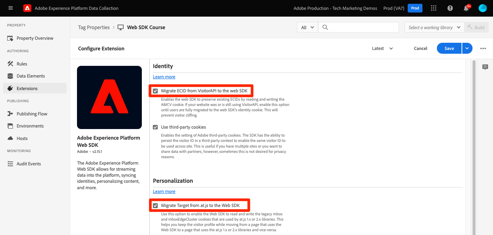

# 將at.js程式庫取代為Platform Web SDK

了解如何取代頁面上的Adobe Target實作，從at.js移轉至Platform Web SDK。 基本替換由以下步驟組成：

* 檢閱Target管理設定，並記下您的IMS組織ID
* 將at.js程式庫取代為Platform Web SDK
* 更新同步程式庫實作的預先隱藏程式碼片段
* 在頁面上配置Platform Web SDK

>[!NOTE]
>
>提供的範例僅供說明之用，而您的實際Target實作可能會有所不同。 如果您現有的Target實作使用Adobe的資料收集標籤管理器，您也可以參閱 [Platform Web SDK Target實作教學課程](https://experienceleague.adobe.com/docs/platform-learn/implement-web-sdk/applications-setup/setup-target.html) 以取得其他資訊。


## 檢閱Target管理設定

將Target移轉至Platform Web SDK的第一步，是檢閱Target介面 **[!UICONTROL 管理]** 區段。

### [!UICONTROL 實作]

#### [!UICONTROL 帳戶詳細資訊]

* **[!UICONTROL IMS組織Id]**  — 請記下此值，因為需要設定Platform Web SDK。
* **[!UICONTROL 裝置上決策]** - Platform Web SDK不支援此功能。 移轉後以及如果您的任何網站上不再使用at.js，或有任何伺服器端的On-Device Decisioning使用案例，即可停用此設定。

#### [!UICONTROL 實作方法]

中所有可編輯的設定 **[!UICONTROL 實作方法]** 區段僅適用於at.js。 這些設定可用來產生您實作的自訂at.js程式庫。 檢閱這些設定，以檢查您是否有任何自訂程式碼，或是為跨網域使用案例設定第一方和第三方Cookie。

此 **[!UICONTROL 描述檔存留期]** 設定只能由Adobe客戶服務變更。 您的實作方法不會影響Target訪客設定檔存留期。 at.js和Platform Web SDK都使用相同的訪客設定檔存留期。

#### [!UICONTROL 隱私]

* **[!UICONTROL 模糊化訪客IP位址]**  — 此設定會影響地理定位功能。 at.js和Platform Web SDK都會為地理定位目的使用相同的後端IP模糊化設定。

### [!UICONTROL 環境]

Platform Web SDK使用資料流設定，可讓您明確定義 [!UICONTROL 環境ID] 用於個別開發、測試和生產資料流。 此設定的主要使用案例是行動應用程式實作，其中URL不存在，可輕鬆區分環境。 此設定為選用，但可用來確保所有要求皆正確與指定環境相關聯。 這與at.js實作不同，在at.js實作中，您必鬚根據網域和主機群組規則指派Target環境。

>[!NOTE]
>
>如果資料流設定中未指定環境ID，則Target會依照 **主機** 區段。

如需詳細資訊，請參閱 [資料流配置](https://experienceleague.adobe.com/docs/experience-platform/edge/datastreams/configure.html#target) 指南和目標 [主機](https://experienceleague.adobe.com/docs/target/using/administer/hosts.html) 檔案。

## 部署Platform Web SDK

Target功能由at.js和Platform Web SDK提供。 如果同時使用兩個程式庫，您可能會遇到轉譯和追蹤問題。 若要成功移轉至Platform Web SDK，第一步是移除at.js，並將其取代為Platform Web SDK(alloy.js)。

假設使用at.js進行簡單的Target實作：

* 靠近頁面頂端的資料層可提供Target和其他應用程式的資訊
* 一或多個可在Target活動（例如jQuery）中使用功能的協力廠商協助程式庫
* 預先隱藏程式碼片段以緩解忽隱忽現情形
* Target at.js資料庫以非同步方式載入，並使用預設設定來自動要求和呈現活動：

```HTML
<!doctype html>
<html>
<head>
  <title>Example page</title>
  <!--Data Layer to enable rich data collection and targeting-->
  <script>
    var digitalData = { 
      // Data layer information goes here
    };
  </script>
  <!--Third party libraries that may be used by Target offers and modifications-->
  <script src="https://ajax.googleapis.com/ajax/libs/jquery/3.6.1/jquery.min.js"></script>
  <!--prehiding snippet for Target with asynchronous deployment-->
  <script>
    ;(function(win, doc, style, timeout) {
      var STYLE_ID = 'at-body-style';

      function getParent() {
        return doc.getElementsByTagName('head')[0];
      }

      function addStyle(parent, id, def) {
        if (!parent) {
          return;
        }
        var style = doc.createElement('style');
        style.id = id;
        style.innerHTML = def;
        parent.appendChild(style);
      }

      function removeStyle(parent, id) {
        if (!parent) {
          return;
        }
        var style = doc.getElementById(id);
        if (!style) {
          return;
        }
        parent.removeChild(style);
      }
      addStyle(getParent(), STYLE_ID, style);
      setTimeout(function() {
        removeStyle(getParent(), STYLE_ID);
      }, timeout);
    }(window, document, "body {opacity: 0 !important}", 3000));
  </script>
  <!--Target at.js library loaded asynchonously-->
  <script src="/libraries/at.js" async></script>
</head>
<body>
  <h1 id="title">Home Page</h1><br><br>
  <p id="bodyText">Navigation</p><br><br>
  <a id="home" class="navigationLink" href="#">Home</a><br>
  <a id="pageA" class="navigationLink" href="#">Page A</a><br>
  <a id="pageB" class="navigationLink" href="#">Page B</a><br>
  <a id="pageC" class="navigationLink" href="#">Page C</a><br>
  <div>Homepage Hero Banner Content</div>
</body>
</html>
```

若要升級Target以使用Platform Web SDK，請先移除at.js:

```HTML
<!--Target at.js library loaded asynchonously-->
<script src="/libraries/at.js" async></script>
```

並以目前支援的Platform Web SDK(alloy.js)版本取代：

```HTML
<!--Platform Web SDK base code-->
<script>
  !function(n,o){o.forEach(function(o){n[o]||((n.__alloyNS=n.__alloyNS||
  []).push(o),n[o]=function(){var u=arguments;return new Promise(
  function(i,l){n[o].q.push([i,l,u])})},n[o].q=[])})}
  (window,["alloy"]);
</script>
<!--Platform Web SDK loaded asynchonously. Change the src to use the latest supported version.-->
<script src="https://cdn1.adoberesources.net/alloy/2.13.1/alloy.min.js" async></script>
```

預先建置的獨立版本需要直接新增至頁面的「基礎程式碼」，以建立名為alloy的全域函式。 使用此函式與SDK互動。 如果您想要為全域函式命名其他名稱，請變更 `alloy` 名稱。

>[!TIP]
>
> 使用標籤功能（舊稱Launch）實作Web SDK時，alloy.js程式庫會借由新增Adobe Experience Platform Web SDK擴充功能而新增至標籤程式庫。


請參閱 [安裝Platform Web SDK](https://experienceleague.adobe.com/docs/experience-platform/edge/fundamentals/installing-the-sdk.html?lang=zh-Hant) 其他詳細資訊和部署選項的檔案。


## 更新內容預先隱藏方法

視程式庫是非同步或同步載入，Platform Web SDK實作可能需要預先隱藏程式碼片段。

### 非同步實作

就像使用at.js一樣，如果Platform Web SDK程式庫以非同步方式載入，則在Target執行內容交換之前，頁面可能會完成轉譯。 此行為可能會導致所謂的「閃爍」問題，發生此問題時，會先短暫地顯示預設內容，然後再更換為Target指定的個人化內容。 若要避免發生這種閃爍問題，Adobe建議您在非同步Platform Web SDK指令碼參考前，立即新增特殊的預先隱藏程式碼片段。

如果您的實作與上述範例不同步，請使用與Platform Web SDK相容的下列版本取代at.js預先隱藏程式碼片段：

```HTML
<!--Prehiding snippet for Target with asynchronous Web SDK deployment-->
<script>
  !function(e,a,n,t){var i=e.head;if(i){
  if (a) return;
  var o=e.createElement("style");
  o.id="alloy-prehiding",o.innerText=n,i.appendChild(o),setTimeout(function(){o.parentNode&&o.parentNode.removeChild(o)},t)}}
  (document, document.location.href.indexOf("mboxEdit") !== -1, ".body { opacity: 0 !important }", 3000);
</script>
```

預先隱藏程式碼片段會在含有您選擇之CSS定義的頁面標題中建立樣式標籤。 收到來自Target的回應或逾時時，就會移除此樣式標籤。

預先隱藏行為是由程式碼片段尾端的兩個設定所控制。

* `body { opacity: 0 !important }` 指定在Target載入前，要用於預先隱藏的CSS定義。 依預設，會隱藏整個頁面。 您可以將此定義更新為要預先隱藏的選取器，以及要如何隱藏選取器。 您可以包含多個定義，因為此值只是插入到預先隱藏樣式標籤中的值。 如果您有可輕鬆識別的容器元素將內容包裝在導覽下，則可使用此設定將預先隱藏限制在該容器元素。

* `3000` 指定預隱藏的逾時（毫秒）。 如果在逾時前未收到來自Target的回應，則會移除預先隱藏的樣式標籤。 達到此逾時的情況應少之又少。

>[!NOTE]
>
>請務必為Platform Web SDK使用正確的程式碼片段，因為它使用的樣式ID不同 `alloy-prehiding`. 如果使用at.js的預先隱藏程式碼片段，該程式碼片段可能無法正常運作。

### 同步實作

Adobe建議以非同步方式實作Platform Web SDK，以獲得最佳的整體頁面效能。 不過，如果程式庫是同步載入，則不需要預先隱藏程式碼片段。 而是在Platform Web SDK設定中指定預先隱藏樣式。

同步實作的預先隱藏樣式可使用 [`prehidingStyle`](https://experienceleague.adobe.com/docs/experience-platform/edge/fundamentals/configuring-the-sdk.html#prehidingStyle) 選項。 Platform Web SDK設定將於下一節說明。

>[!TIP]
>
> 使用標籤功能（舊稱Launch）實作Web SDK時，可在Adobe Experience Platform Web SDK擴充功能設定中編輯預先隱藏樣式。

若要進一步了解Platform Web SDK如何管理忽隱忽現的情形，請參閱指南區段：  [管理個人化體驗的忽隱忽現情形](https://experienceleague.adobe.com/docs/experience-platform/edge/personalization/manage-flicker.html)

## 配置平台Web SDK

每次載入頁面時都必須設定Platform Web SDK。 此 `configure` 命令必須一律為第一個名為的SDK命令。 下列範例假設在單一部署中將整個網站升級至Platform Web SDK:

>[!BEGINTABS]

>[!TAB JavaScript]

此 `edgeConfigId` 是 [!UICONTROL 資料流ID]

```JavaScript
alloy("configure", {
  "edgeConfigId": "ebebf826-a01f-4458-8cec-ef61de241c93",
  "orgId":"ADB3LETTERSANDNUMBERS@AdobeOrg"
});
```

>[!TAB 標籤]

在標籤實作中，許多欄位會自動填入，或可從下拉式功能表中選取。 請注意，不同的平台 [!UICONTROL 沙箱] 和 [!UICONTROL 資料流] 可針對每個環境選取。 資料流會根據發佈程式中標籤程式庫的狀態而變更。


>[!ENDTABS]

如果您打算逐頁從at.js移轉至Platform Web SDK，則需要下列設定選項：


>[!BEGINTABS]

>[!TAB JavaScript]

```JavaScript
alloy("configure", {
  "edgeConfigId": "ebebf826-a01f-4458-8cec-ef61de241c93",
  "orgId":"ADB3LETTERSANDNUMBERS@AdobeOrg",
  "targetMigrationEnabled":true,
  "idMigrationEnabled":true
});
```

>[!TAB 標籤]


>[!ENDTABS]

以下概述與Target相關的值得注意的設定選項：

| 選項 | 說明 | 範例值 |
| --- | --- | --- |
| `edgeConfigId` | 資料流ID | `ebebf826-a01f-4458-8cec-ef61de241c93` |
| `orgId` | Adobe Experience Cloud組織ID | `ADB3LETTERSANDNUMBERS@AdobeOrg` |
| `targetMigrationEnabled` | 使用此選項可讓Web SDK讀取和寫入at.js使用的舊版mbox和mboxEdgeCluster Cookie。 這可協助您從使用Web SDK的頁面移至使用at.js程式庫的頁面時，保留訪客設定檔，反之則可。 | `true` |
| `idMigrationEnabled` | 若為true，則SDK會讀取並設定舊的AMCV Cookie。 此選項可協助您移轉至使用Platform Web SDK，而網站的某些部分可能仍使用Visitor.js。 | `true` |
| `thirdPartyCookiesEnabled` | 啟用Adobe第三方Cookie的設定。 SDK可在協力廠商內容中保留訪客ID，以便跨網站使用相同的訪客ID。 如果您有多個網站，請使用此選項；不過，有時出於隱私權原因，不需要此選項。 | `true` |
| `prehidingStyle` | 用於建立CSS樣式定義，在從伺服器載入個人化內容時隱藏網頁的內容區域。 這隻適用於SDK的同步部署。 | `body { opacity: 0 !important }` |

>[!NOTE]
>
>`thirdPartyCookiesEnabled` 可設為 `true` 來跨多個網域維持一致的Target訪客設定檔。 此選項應設為 `false` 或省略，除非需要多網域訪客設定檔持續性。

>[!TIP]
>
> 使用標籤功能（舊稱Launch）實作Web SDK時，可在Adobe Experience Platform Web SDK擴充功能設定中管理這些設定。

如需完整的選項清單，請參閱 [配置Platform Web SDK](https://experienceleague.adobe.com/docs/experience-platform/edge/fundamentals/configuring-the-sdk.html?lang=zh-Hant) 指南。

## 實作範例

當Platform Web SDK正確設定後，範例頁面會如下所示。

```HTML
<!doctype html>
<html>
<head>
  <title>Example page</title>
  <!--Data Layer to enable rich data collection and targeting-->
  <script>
    var digitalData = { 
      // Data layer information goes here
    };
  </script>

  <!--Third party libraries that may be used by Target offers and modifications-->
  <script src="https://ajax.googleapis.com/ajax/libs/jquery/3.6.1/jquery.min.js"></script>

  <!--Prehiding snippet for Target with asynchronous Web SDK deployment-->
  <script>
    !function(e,a,n,t){var i=e.head;if(i){
    if (a) return;
    var o=e.createElement("style");
    o.id="alloy-prehiding",o.innerText=n,i.appendChild(o),setTimeout(function(){o.parentNode&&o.parentNode.removeChild(o)},t)}}
    (document, document.location.href.indexOf("mboxEdit") !== -1, ".body { opacity: 0 !important }", 3000);
  </script>

  <!--Platform Web SDK base code-->
  <script>
    !function(n,o){o.forEach(function(o){n[o]||((n.__alloyNS=n.__alloyNS||
    []).push(o),n[o]=function(){var u=arguments;return new Promise(
    function(i,l){n[o].q.push([i,l,u])})},n[o].q=[])})}
    (window,["alloy"]);
  </script>

  <!--Platform Web SDK loaded asynchonously. Change the src to use the latest supported version.-->
  <script src="https://cdn1.adoberesources.net/alloy/2.13.1/alloy.min.js" async></script>
  
  <!--Configure Platform Web SDK-->
  <script>
    alloy("configure", {
      "edgeConfigId": "ebebf826-a01f-4458-8cec-ef61de241c93",
      "orgId":"ADB3LETTERSANDNUMBERS@AdobeOrg"
    });
  </script>
</head>
<body>
  <h1 id="title">Home Page</h1><br><br>
  <p id="bodyText">Navigation</p><br><br>
  <a id="home" class="navigationLink" href="#">Home</a><br>
  <a id="pageA" class="navigationLink" href="#">Page A</a><br>
  <a id="pageB" class="navigationLink" href="#">Page B</a><br>
  <a id="pageC" class="navigationLink" href="#">Page C</a><br>
  <div id="homepage-hero">Homepage Hero Banner Content</div>
</body>
</html>
```

>[!TIP]
>
> 使用標籤功能（舊稱Launch）實作Web SDK時，標籤內嵌程式碼會取代上述的「Platform Web SDK基本程式碼」、「非同步載入的Platform Web SDK」和「設定Platform Web SDK」區段。

請務必注意，僅包含和設定上述的Platform Web SDK程式庫，不會執行對Adobe Edge網路的任何網路呼叫。

接下來，學習如何 [要求和套用VEC型活動](render-vec-activities.md) 到頁面。

>[!NOTE]
>
>我們致力協助您成功從at.js移轉至Web SDK。 如果您在移轉過程中遇到障礙，或覺得本指南中遺漏了重要資訊，請在 [此社區討論](https://experienceleaguecommunities.adobe.com/t5/adobe-experience-platform-launch/tutorial-discussion-implement-adobe-experience-cloud-with-web/td-p/444996).