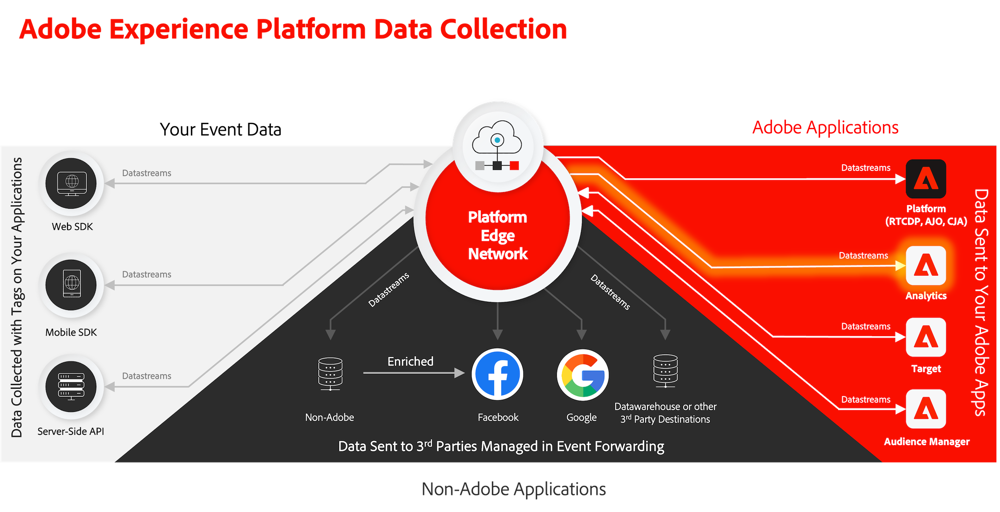

# Analytics對映

瞭解如何將行動資料對應至Adobe Analytics。

此 [事件](events.md) 您在先前的課程中收集並傳送至Platform Edge Network的資料，會轉送至您在資料流中設定的服務，包括Adobe Analytics。 將資料對應至報表套裝中的正確變數。



## 先決條件

* 瞭解ExperienceEvent追蹤。
* 已成功在您的範例應用程式中傳送XDM資料。
* 資料流已設定為Adobe Analytics

## 學習目標

在本課程中，您將會：

* 瞭解Analytics變數的自動對應。
* 設定處理規則，將XDM資料對應至Analytics變數。

## 自動對應

許多標準XDM欄位會自動對應至Analytics變數。 請參閱[這裡](https://experienceleague.adobe.com/docs/experience-platform/edge/data-collection/adobe-analytics/automatically-mapped-vars.html?lang=en)的完整清單。

### 範例#1 - s.products

一個很好的範例是 [products變數](https://experienceleague.adobe.com/docs/analytics/implementation/vars/page-vars/products.html?lang=zh-Hant) 無法使用處理規則填入的專案。 透過XDM實施，您可將所有必要資料傳入 `productListItems` 和 `s.products` 透過Analytics對應自動填入。

此物件：

```swift
"productListItems": [
    [
      "name":  "Yoga Mat",
      "SKU": "5829",
      "priceTotal": "49.99",
      "quantity": 1
    ],
    [
      "name":  "Water Bottle",
      "SKU": "9841",
      "priceTotal": "30.00",
      "quantity": 3
    ]
]
```

結果為：

```
s.products = ";Yoga Mat;1;49.99,;Water Bottle,3,30.00"
```

>[!NOTE]
>
>目前 `productListItems[N].SKU` 被自動對應忽略。


### 範例#2 - scAdd

仔細檢視，所有事件都有兩個欄位 `value` （必要）和 `id` （選擇性）。 此 `value` 欄位用於增加事件計數。 此 `id` 欄位用於序列化。

此物件：

```swift
"commerce" : {
  "productListAdds" : {
    "value" : 1
  }
}
```

結果為：

```
s.events = "scAdd"
```

此物件：

```swift
"commerce" : {
  "productListAdds" : {
    "value" : 1,
    "id": "321435"
  }
}
```

結果為：

```
s.events = "scAdd:321435"
```

## 使用保證進行驗證

使用 [保證](assurance.md) 您可以確認自己正在傳送體驗事件、XDM資料正確且Analytics對應如預期般發生。 例如：

1. 傳送productListAdds事件

1. 檢視ExperienceEvent點選。

   

1. 檢閱JSON的XDM部分。

   ```json
   "xdm" : {
     "productListItems" : [ {
       "SKU" : "LLWS05.1-XS",
       "name" : "Desiree Fitness Tee",
       "priceTotal" : 24
     } ],
   "timestamp" : "2023-08-04T12:53:37.662Z",
   "eventType" : "commerce.productListAdds",
   "commerce" : {
     "productListAdds" : {
       "id" : "LLWS05.1-XS",
       "value" : 1
     }
   }
   // ...
   ```

1. 檢閱 **[!UICONTROL analytics.mapping]** 事件。

   

在Analytics對應中注意下列事項：

* **[!UICONTROL 事件]** 填入 `scAdd` 根據 `commerce.productListAdds`.
* **[!UICONTROL pl]** （產品變數）會填入一個串連值，根據 `productListItems`.
* 此事件還有其他有趣的資訊，包括所有內容資料。


## 與內容資料對應

轉送至Analytics的XDM資料會轉換為 [內容資料](https://experienceleague.adobe.com/docs/mobile-services/ios/getting-started-ios/proc-rules.html?lang=en) 包含標準和自訂欄位。

內容資料索引鍵的建構遵循下列語法：

```
a.x.[xdm path]
```

例如：

```
// Standard Field
a.x.commerce.saveforlaters.value

// Custom Field
a.x._techmarketingdemos.appinformationa.appstatedetails.screenname
```

>[!NOTE]
>
>自訂欄位會放置在您的Experience Cloud組織識別碼下。
>
>`_techmarketingdemos` 會取代為您組織的唯一值。


以下是使用此資料的處理規則的外觀：

* 您 **[!UICONTROL 覆寫值]** (1) **[!UICONTROL 應用程式畫面名稱(eVar2)]** (2)的值是 **[!UICONTROL a.x._techmarketingdemo.appinformation.appstatedetails.screenname]** (3)如果 **[!UICONTROL a.x._techmarketingdemo.appinformation.appstatedetails.screenname]** (4) **[!UICONTROL 已設定]** (5)。

* 您 **[!UICONTROL 設定事件]** (6) **[!UICONTROL 新增至願望清單（事件3）]** (7)至 **[!UICONTROL a.x.commerce.saveForLaters.value(Context)]** (8)如果 **[!UICONTROL a.x.commerce.saveForLaters.value(Context)]** (9) **[!UICONTROL 已設定]** (10)。


>[!IMPORTANT]
>
>
>有些自動對應的變數可能無法用於處理規則。
>
>
>第一次對應到處理規則時，介面不會顯示XDM物件的內容資料變數。 若要修正選取的任何值，請儲存並返回編輯。 所有XDM變數現在都會顯示。


如需處理規則和內容資料的其他資訊，請參閱 [此處](https://experienceleague.adobe.com/docs/analytics-learn/tutorials/implementation/implementation-basics/map-contextdata-variables-into-props-and-evars-with-processing-rules.html?lang=en).

>[!TIP]
>
>和先前的行動應用程式實作不同，頁面/畫面檢視和其他事件沒有區別。 反之，您可以增加 **[!UICONTROL 頁面檢視]** 量度，設定 **[!UICONTROL 頁面名稱]** 處理規則中的維度。 由於您正在收集自訂 `screenName` 欄位，強烈建議將熒幕名稱對應至 **[!UICONTROL 頁面名稱]** 在處理規則中。

>[!SUCCESS]
>
>您已設定應用程式，將您的Experience Edge XDM物件對應至Adobe Analytics變數，以在您的資料流中啟用Adobe Analytics服務，並在適用的情況下使用處理規則。<br/> 感謝您花時間學習Adobe Experience Platform Mobile SDK。 如果您有疑問、想要分享一般意見或有關於未來內容的建議，請在此分享這些內容 [Experience League社群討論貼文](https://experienceleaguecommunities.adobe.com/t5/adobe-experience-platform-launch/tutorial-discussion-implement-adobe-experience-cloud-in-mobile/td-p/443796).

下一步： **[Experience Platform](platform.md)**
