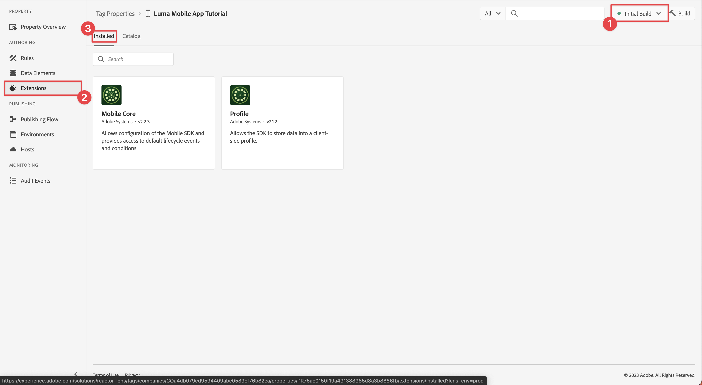

# 設定標籤屬性

瞭解如何在中設定標籤屬性 [!UICONTROL 資料彙集] 介面。

Adobe Experience Platform 標記是新一代 Adobe 標記管理功能。標籤可讓客戶透過簡單的方式部署及管理必要的分析、行銷及廣告標籤功能，以便支援相關客戶體驗。 進一步瞭解 [標籤](https://experienceleague.adobe.com/docs/experience-platform/tags/home.html) 產品檔案內。

## 先決條件

若要完成課程，您必須擁有建立標籤屬性的許可權。 此外，對於標籤有基本的瞭解也會很有幫助。

>[!NOTE]
>
> platform launch （使用者端）現在為 [標籤](https://experienceleague.adobe.com/docs/experience-platform/tags/home.html?lang=zh-Hant)

## 學習目標

在本課程中，您將會：

* 安裝並設定行動標籤擴充功能。
* 產生SDK安裝指示。

## 初始設定

1. 在資料收集介面中建立新的行動標籤屬性：
   1. 選取 **[!UICONTROL 標籤]** ，位於左側導覽器中。
   1. 選取 **[!UICONTROL 新增屬性]**
      .
   1. 對於 **[!UICONTROL 名稱]**，輸入 `Luma Mobile App Tutorial`.
   1. 對於 **[!UICONTROL Platform]**，選取 **[!UICONTROL 行動]**.
   1. 選取「**[!UICONTROL 儲存]**」。

      

      >[!NOTE]
      >
      > 邊緣型行動sdk實施的預設同意設定（例如您在本課程中正在執行的設定）來自 [!UICONTROL 同意擴充功能] 而非 [!UICONTROL 隱私權] 標籤屬性組態中的設定。 您可在本課程稍後的章節中新增並設定同意擴充功能。 如需詳細資訊，請參閱 [說明檔案](https://developer.adobe.com/client-sdks/edge/consent-for-edge-network/).

1. 開啟新屬性。
1. 建立程式庫:

   1. 前往 **[!UICONTROL 發佈流程]** ，位於左側導覽器中。
   1. 選取 **[!UICONTROL 新增程式庫]**.

      

   1. 對於 **[!UICONTROL 名稱]**，輸入 `Initial Build`.
   1. 對於 **[!UICONTROL 環境]**，選取 **[!UICONTROL 開發（開發）]**.
   1. 選取   **[!UICONTROL 新增所有變更的資源]**.
   1. 選取 **[!UICONTROL 儲存並建置到開發環境]**.

      

   1. 最後，選取 **[!UICONTROL 初始建置]** 作為工作程式庫，從 **[!UICONTROL 選取工作程式庫]** 功能表。
      
1. 檢查擴充功能：

   1. 確定 **[!UICONTROL 初始建置]** 已選取作為預設程式庫。

   1. 選取左側邊欄中的&#x200B;**[!UICONTROL 「擴充功能」]**。

   1. 選取 **[!UICONTROL 已安裝]** 標籤。

      此 [!UICONTROL 行動核心] 和 [!UICONTROL 個人資料] 擴充功能應預先安裝。

      

## 擴充功能組態

1. 確定您位於 **[!UICONTROL 擴充功能]** 在行動應用程式屬性內。

1. 選取 **[!UICONTROL 目錄]**.

   

1. 使用  **[!UICONTROL 搜尋]** 欄位以尋找 **身分** 副檔名。

   1. 搜尋 `Identity`.

   2. 選取 **[!UICONTROL 身分]** 副檔名。

   3. 選取 **[!UICONTROL 安裝]**.

      

   此擴充功能不需要任何進一步的設定。

1. 使用  **[!UICONTROL 搜尋]** 欄位以尋找並安裝 **AEP保證** 副檔名。

   此擴充功能不需要任何進一步的設定。

1. 使用  **[!UICONTROL 搜尋]** 欄位以尋找並安裝 **同意** 副檔名。 在設定畫面中：

   1. 選取 **[!UICONTROL 擱置中]**. 在本教學課程中，您進一步在應用程式中管理同意。 進一步瞭解中的同意擴充功能 [說明檔案](https://developer.adobe.com/client-sdks/documentation/consent-for-edge-network/).
   1. 選取 **[!UICONTROL 儲存至程式庫]**.

      

1. 使用  **[!UICONTROL 搜尋]** 欄位以尋找並安裝 **Adobe Experience Platform Edge Network** 副檔名。

   1. 在 **[!UICONTROL 資料串流]** 選取 **[!UICONTROL 資料流]** 您建立於 [上一步](create-datastream.md) 例如，針對每個環境 **[!DNL Luma Mobile App]**.

   1. 如果尚未填入，請指定 **[!UICONTROL 邊緣網路網域]** 範圍 **[!UICONTROL 網域設定]**. Edge Network網域是您組織的名稱，後面接著 `data.adobedc.net`，例如 `techmarketingdemos.data.adobedc.net`.

   1. 從 **[!UICONTROL 儲存至程式庫]** 功能表，選取 **[!UICONTROL 儲存至程式庫並建置]**.

      

您的程式庫是針對新的擴充功能和設定所建置。 成功的組建會由 ● 在 **[!UICONTROL 初始建置]** 按鈕。

## 產生SDK安裝指示

1. 選取 **[!UICONTROL 環境]** 從左側邊欄。

1. 選取 **[!UICONTROL 開發]** 安裝圖示  .

   

1. 在 **[!UICONTROL 行動安裝指示]** 對話方塊中，選取 **[!UICONTROL iOS]** 標籤。

1. 您可以複製  使用CocoaPods設定專案的指示。 CocoaPods可用來管理SDK版本和下載。 若要進一步瞭解，請檢閱 [CocoaPods檔案](https://cocoapods.org/). 如果您使用Android™作為開發平台，Gradle是可管理SDK版本、下載和相依性的工具。 若要進一步瞭解，請檢閱 [Gradle檔案](https://gradle.org/)

   安裝指示提供您實作的良好起點。 您可以找到其他資訊 [此處](https://developer.adobe.com/client-sdks/documentation/getting-started/get-the-sdk/).

   >[!INFO]
   >
   >在本教學課程的其餘部分中，您將 **非** 使用CocoaPods指示，但改用原生Swift Package Manager (SPM)型設定。
   >

1. 選取 **[!UICONTROL Swift]** 標籤在下 **[!UICONTROL 新增初始化程式碼]**. 此程式碼區塊說明如何匯入必要的SDK並在啟動時註冊擴充功能。 如需詳細資訊，請參閱 [安裝SDK](install-sdks.md).

1. 複製  此 **[!UICONTROL 環境檔案ID]** 並儲存在您稍後需要的位置。 此唯一ID會指向您的開發環境。 每個環境（生產、測試、開發）都有各自的唯一ID值。

   

>[!NOTE]
>
>應將安裝指示視為起點，而非最終檔案。 您可以在官方網站找到最新的SDK版本和程式碼範例 [檔案](https://developer.adobe.com/client-sdks/home/).

## 行動標籤架構

如果您熟悉Tags的網頁版本（前身為Launch），瞭解行動裝置上的差異很重要。

* 在Web上，標籤屬性會轉譯為JavaScript，然後（通常）在雲端中託管。 該JavaScript檔案會在網站中直接參照。

* 在行動標籤屬性中，規則和設定會轉譯為雲端託管的JSON檔案。 JSON檔案會由行動應用程式中的行動核心擴充功能下載和讀取。 擴充功能是不同的SDK，可共同運作。 如果您將擴充功能新增至標籤屬性，也必須更新應用程式。 如果您變更擴充功能設定或建立規則，當您發佈更新的標籤庫時，應用程式會反映這些變更。 這種彈性可讓您修改設定(例如Adobe Analytics報表套裝ID)，或甚至變更應用程式的行為（使用資料元素和規則，您將在後續課程中看到），而不需變更應用程式中的程式碼並重新提交應用程式商店。

>[!SUCCESS]
>
>您現在擁有行動標籤屬性，可在本教學課程的其餘部分使用。
>
>感謝您花時間學習Adobe Experience Platform Mobile SDK。 如果您有疑問、想要分享一般意見或有關於未來內容的建議，請在此分享這些內容 [Experience League社群討論貼文](https://experienceleaguecommunities.adobe.com/t5/adobe-experience-platform-data/tutorial-discussion-implement-adobe-experience-cloud-in-mobile/td-p/443796)

下一步： **[安裝SDK](install-sdks.md)**
