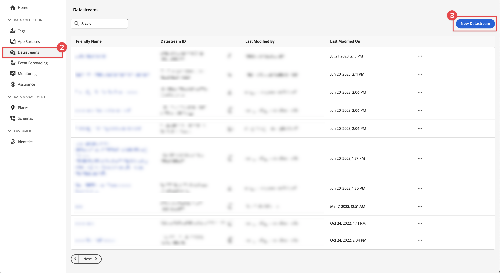

# 建立資料串流

瞭解如何在Experience Platform中建立資料串流。

資料流是Platform Edge Network上的伺服器端設定。 資料流可確保將傳入Platform Edge Network的資料正確路由至Adobe Experience Cloud應用程式和服務。 如需詳細資訊，請參閱 [檔案](https://experienceleague.adobe.com/docs/experience-platform/datastreams/overview.html?lang=zh-Hant) 或這個 [視訊](https://experienceleague.adobe.com/docs/platform-learn/data-collection/edge-network/configure-datastreams.html).

## 先決條件

若要建立資料串流，您的組織必須在資料收集介面(先前稱為 [!UICONTROL Launch])，而且您必須擁有管理使用者許可權和檢視資料串流。

## 學習目標

在本課程中，您將會：

* 瞭解何時使用資料流。
* 建立資料串流。
* 設定資料流.

## 建立資料串流

資料串流可建立於 [!UICONTROL 資料彙集] 介面使用 [!UICONTROL 資料流] 設定工具。 若要建立資料串流：

1. 當資料串流定義在沙箱層級時，請確保您處於正確的Experience Platform沙箱中。
1. 選取 **[!UICONTROL 資料串流]** 在左側邊欄中。
1. 選取「**[!UICONTROL 新資料流]**」。

   

1. 提供 **[!UICONTROL 名稱]**，例如 `Luma Mobile App` 和 **[!UICONTROL 說明]**，例如 `Datastream for Luma Mobile App`.

   >[!NOTE]
   >
   >最終提醒：如果您正在閱讀本教學課程，但有一個沙箱容納多個人員，或者您使用共用帳戶，請考慮在命名慣例中附加或附加身分識別。 舉例來說，請避免使用 `Luma Mobile App Event Dataset`，改用 `Luma Mobile App Event Dataset - Joe Smith`。另請參閱以下說明： [概觀](overview.md).

1. 選取您在上一堂課中建立的結構描述，從 **事件結構描述** 清單。
1. 選取「**[!UICONTROL 儲存]**」。

   

## 新增服務

當您瀏覽時（可選） [Analytics](analytics.md) 和 [Experience Platform](platform.md) 在本教學課程中，您會將服務新增至資料流，以便將傳送至Platform Edge Network的資料轉送至這些應用程式。

<!--

### Adobe Analytics

1. Select **[!UICONTROL Add Service]**.

1. Add **[!UICONTROL Adobe Analytics]** from the [!UICONTROL Service] list, 

1. Enter the name of the report site that you want to use in **[!UICONTROL Report Suite ID]**.

1. Enable the service by switching **[!UICONTROL Enabled]** on.

1. Select **[!UICONTROL Save]**.

   

### Adobe Experience Platform

You might also want to enable the Adobe Experience Platform service. 

>[!IMPORTANT]
>
>You can only enable the Adobe Experience Platform service when having created an event dataset. If you don't already have an event dataset created, follow the instructions [here](platform.md).

1. Click  **[!UICONTROL Add Service]** to add another service.

1. Select **[!UICONTROL Adobe Experience Platform]** from the [!UICONTROL Service] list.

1. Enable the service by switching **[!UICONTROL Enabled]** on.

1. Select the **[!UICONTROL Event Dataset]** that you created as part of the [Create a dataset](platform.md#create-a-dataset) instructions, for example **Luma Mobile App Event Dataset**

1. Select **[!UICONTROL Save]**.

   
1. The final configuration should look something like this.
   
   

-->

>[!NOTE]
>
>啟用貴組織使用的每項服務，可確保行動應用程式中收集的資料能夠用於任何地方。 如需資料流設定的詳細資訊，請檢閱此檔案 [此處](https://experienceleague.adobe.com/docs/experience-platform/datastreams/overview.html?lang=zh-Hant).

在您自己的應用程式中實作Platform Mobile SDK時，您最終應建立三個資料串流以對應至您的三個標籤環境（開發、預備和生產）。 如果您使用Platform Mobile SDK搭配Adobe Real-time Customer Data Platform或Adobe Journey Optimizer等平台式應用程式，請務必在適當的沙箱中建立這些資料串流。

>[!SUCCESS]
>
>您現在有資料串流可用於教學課程的其餘部分。
>
>感謝您花時間學習Adobe Experience Platform Mobile SDK。 如果您有疑問、想要分享一般意見或有關於未來內容的建議，請在此分享這些內容 [Experience League社群討論貼文](https://experienceleaguecommunities.adobe.com/t5/adobe-experience-platform-data/tutorial-discussion-implement-adobe-experience-cloud-in-mobile/td-p/443796)

下一步： **[設定標籤屬性](configure-tags.md)**
