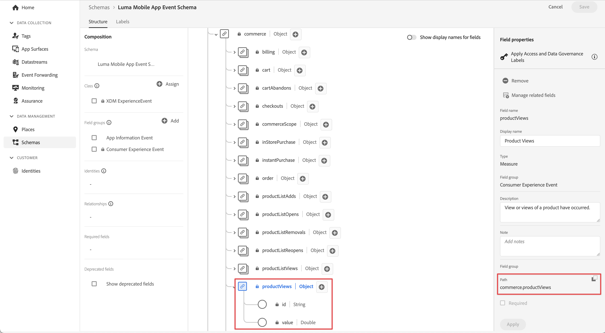
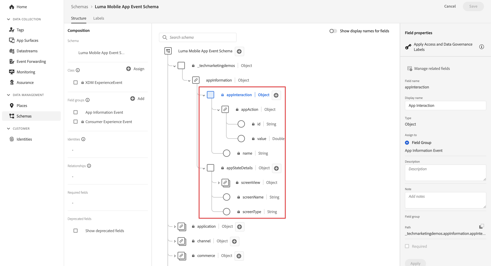

# 活動

瞭解如何追蹤行動應用程式中的事件。

Edge Network擴充功能提供API，可將Experience事件傳送至Platform Edge Network。 體驗事件是包含符合XDM ExperienceEvent結構描述定義的資料的物件。 更簡單地說，這類功能可擷取使用者在您的行動應用程式中的動作。 Platform Edge Network收到資料後，即可將其轉送至資料流中設定的應用程式和服務，例如Adobe Analytics和Experience Platform。 進一步瞭解 [體驗事件](https://developer.adobe.com/client-sdks/documentation/getting-started/track-events/) 產品檔案內。

## 先決條件

* Xcode專案中所有的套件相依性。
* AppDelegate中註冊的擴充功能。
* 已將MobileCore設定為使用您的開發appId。
* 匯入的SDK。
* 使用上述變更成功建置並執行應用程式。

## 學習目標

在本課程中，您將會：

* 瞭解如何根據結構描述來建構XDM資料。
* 根據標準欄位群組傳送XDM事件。
* 根據自訂欄位群組傳送XDM事件。
* 傳送XDM購買事件。
* 使用保證進行驗證。

## 建構體驗事件

Adobe Experience Platform Edge擴充功能可傳送遵循先前定義XDM結構描述的事件至Adobe Experience Platform Edge Network。

程式如下……

1. 識別您嘗試追蹤的行動應用程式互動。

1. 檢閱您的結構並識別適當的事件。

1. 檢閱您的結構描述，並識別應用於描述事件的任何其他欄位。

1. 建構並填入資料物件。

1. 建立並傳送事件。

1. 驗證.


### 標準欄位群組

對於標準欄位群組，程式看起來像這樣：

* 在您的結構描述中，識別您嘗試收集的事件。 在此範例中，您會追蹤商務體驗事件，例如產品檢視(**[!UICONTROL 產品檢視]**)事件。

  

* 若要在您的應用程式中建構包含體驗事件資料的物件，請使用如下的程式碼：

  ```swift {highlight="2-8"}
  var xdmData: [String: Any] = [
      "eventType": "commerce.productViews",
      "commerce": [
          "productViews": [
            "id": sku,
            "value": 1
          ]
      ]
  ]
  ```

   * `eventType`：說明已發生的事件，使用 [已知值](https://github.com/adobe/xdm/blob/master/docs/reference/classes/experienceevent.schema.md#xdmeventtype-known-values) 可能的話。
   * `commerce.productViews.id`：代表產品SKU的字串值
   * `commerce.productViews.value`：提供事件的數值。 如果是布林值(或Adobe Analytics中的「計數器」)，此值一律設為1。 如果是數值或貨幣事件，值可以是> 1。

* 在您的結構描述中，識別與商務產品檢視事件相關聯的任何其他資料。 在此範例中，包括 `productListItems` 這是用於任何商務相關事件的標準欄位集：

  
   * 請注意 `productListItems` 是一個陣列，因此可提供多個產品。

* 若要新增此資料，請展開 `xdmData` 物件以包含補充資料：

```swift {highlight="9-16"}
var xdmData: [String: Any] = [
    "eventType": "commerce.productViews",
        "commerce": [
        "productViews": [
            "id": sku,
            "value": 1
        ]
    ],
    "productListItems": [
        [
            "name":  productName,
            "SKU": sku,
            "priceTotal": priceString,
            "quantity": 1
        ]
    ]
]
```

* 然後您使用該資料結構來建立 `ExperienceEvent`：

  ```swift
  let productViewEvent = ExperienceEvent(xdm: xdmData)
  ```

* 並使用sendEvent API將事件和資料傳送至Platform Edge Network：

  ```swift
  Edge.sendEvent(experienceEvent: productViewEvent)
  ```

現在，讓我們在您的Xcode專案中實際實作此程式碼。
您的應用程式中有不同的商務產品相關動作（檢視、新增至購物車、儲存以供稍後使用、購買），而您想要根據使用者執行的這些動作傳送事件。

1. 若要建構傳送體驗事件的結構，請前往 `MobileSDK`，並將以下專案新增至 `sendCommerceExperienceEvent` 函式。 此函式將商務體驗事件和產品視為引數：

   ```swift {highlight="2-22"}
   func sendCommerceExperienceEvent(commerceEventType: String, product: Product) {
     let xdmData: [String: Any] = [
         "eventType": "commerce." + commerceEventType,
         "commerce": [
             commerceEventType: [
                 "id": product.sku,
                 "value": 1
             ]
         ],
         "productListItems": [
             [
                 "name": product.name,
                 "priceTotal": product.price,
                 "SKU": product.sku
             ]
         ]
     ]
   
     Logger.viewCycle.info("About to send commerce experience event of type  \(commerceEventType)..."
     let commerceExperienceEvent = ExperienceEvent(xdm: xdmData)
     Edge.sendEvent(experienceEvent: commerceExperienceEvent)
   }
   ```

1. 在 `ProductView` 將各種呼叫新增至 `sendCommerceExperienceEvent` 函式：

   1. 在 `.task` 中的修飾元 `ATTrackingManager.trackingAuthorizationStatus` 關閉。 此 `.task` 當產品檢視初始化並顯示時，會呼叫修飾元，因此您想在該特定時間傳送產品檢視事件。

      ```swift {highlight="4-5"}
      .task {
          if ATTrackingManager.trackingAuthorizationStatus == .authorized {
               // Send commerce experience event
              MobileSDK.shared.sendCommerceExperienceEvent(commerceEventType: "productView", product: product)
          }
      }
      ```

   1. 針對工具列中「產品檢視」可用的每個按鈕（儲存以供稍後使用、「加入購物車並購買」），新增相關呼叫。

      * 針對儲存以供稍後使用/新增至願望清單：

        ```swift {highlight="5-6"}
        Button {
            Task {
                if ATTrackingManager.trackingAuthorizationStatus == .authorized {
                // Send saveForLater commerce experience event
                    MobileSDK.shared.sendCommerceExperienceEvent(commerceEventType: "saveForLaters", product: product)
                }
            }
            showSaveForLaterDialog.toggle()
        } label: {
            Label("", systemImage: "heart")
        }
        .alert(isPresented: $showSaveForLaterDialog, content: {
            Alert(title: Text( "Saved for later"), message: Text("The selected item is saved to your wishlist…"))
        })
        ```

      * 新增至購物車：

        ```swift {highlight="5-6"}
        Button {
            Task {
                if ATTrackingManager.trackingAuthorizationStatus == .authorized {
                    // Send productListAdds commerce experience event
                    MobileSDK.shared.sendCommerceExperienceEvent(commerceEventType: "productListAdds", product: product)
                }
            }
            showAddToCartDialog.toggle()
        } label: {
                Label("", systemImage: "cart.badge.plus")
        }
        alert(isPresented: $showAddToCartDialog, content: {
            Alert(title: Text( "Added to basket"), message: Text("The selected item is added to your basket…"))
        })
        ```

      * 購買：

        ```swift {highlight="5-6"}
        Button {
            Task {
                if ATTrackingManager.trackingAuthorizationStatus == .authorized {
                    // Send purchase commerce experience event
                    MobileSDK.shared.sendCommerceExperienceEvent(commerceEventType: "purchases", product: product)
                }
            }
            showPurchaseDialog.toggle()
        } label: {
            Label("", systemImage: "creditcard")
        }
        .alert(isPresented: $showPurchaseDialog, content: {
            Alert(title: Text( "Purchases"), message: Text("The selected item is purchased…"))
        })
        ```

### 自訂欄位分組

想像您想要追蹤應用程式本身的熒幕檢視和互動情形。 請記住，您已為此型別事件定義自訂欄位群組。

* 在您的結構描述中，識別您嘗試收集的事件。
  

* 開始建構物件。

  >[!NOTE]
  >
  >  標準欄位群組一律以物件根目錄開始。
  >
  >  自訂欄位群組一律以Experience Cloud組織獨有的物件開頭， `_techmarketingdemos` 在此範例中。

  針對應用程式互動事件，您可以建構如下的物件：

  ```swift
  let xdmData: [String: Any] = [
    "eventType": "application.interaction",
    "_techmarketingdemos": [
      "appInformation": [
          "appInteraction": [
              "name": "login",
              "appAction": [
                  "value": 1
                  ]
              ]
          ]
      ]
  ]
  ```

  對於熒幕追蹤事件，您可以建構如下的物件：

  ```swift
  var xdmData: [String: Any] = [
    "eventType": "application.scene",
    "_techmarketingdemos": [
        "appInformation": [
            "appStateDetails": [
                "screenType": "App",
                    "screenName": "luma: content: ios: us: en: login",
                    "screenView": [
                        "value": 1
                    ]
                ]
            ] 
        ]
  ]
  ```


* 接著使用資料結構來建立 `ExperienceEvent`.

  ```swift
  let event = ExperienceEvent(xdm: xdmData)
  ```

* 將事件和資料傳送至Platform Edge Network。

  ```swift
  Edge.sendEvent(experienceEvent: event)
  ```


同樣地，讓我們在您的Xcode專案中實際實作此程式碼。

1. 為方便起見，您在中定義了兩個函式 `MobileSDK`.

   一個用於應用程式互動。 將醒目提示的程式碼新增至 `sendAppInteractionEvent(actionName)` 中的函式 **[!UICONTROL MobileSDK]**：

   ```swift {highlight="2-16"}
   func sendAppInteractionEvent(actionName: String) {
        let xdmData: [String: Any] = [
           "eventType": "application.interaction",
           tenant : [
               "appInformation": [
                   "appInteraction": [
                       "name": actionName,
                       "appAction": [
                           "value": 1
                       ]
                   ]
               ]
           ]
       ]
       let appInteractionEvent = ExperienceEvent(xdm: xdmData)
       Edge.sendEvent(experienceEvent: appInteractionEvent)
   }
   ```

   另一個用於熒幕追蹤。 將醒目提示的程式碼新增至 `sendTrackScreenEvent(stateName)` 中的函式 **[!UICONTROL MobileSDK]**：

   ```swift {highlight="2-17"}
   func sendTrackScreenEvent(stateName: String) {
      let xdmData: [String: Any] = [
          "eventType": "application.scene",
          tenant : [
              "appInformation": [
                  "appStateDetails": [
                      "screenType": "App",
                      "screenName": stateName,
                      "screenView": [
                          "value": 1
                      ]
                  ]
              ]
          ]
      ]
      let trackScreenEvent = ExperienceEvent(xdm: xdmData)
      Edge.sendEvent(experienceEvent: trackScreenEvent)
   }
   ```

1. 瀏覽至 **[!UICONTROL 登入工作表]**.

   * 將下列醒目提示的程式碼新增至「登入」按鈕的關閉處：

     ```swift {highlight="3"}
     Button("Login") {                               
        // Send app interaction event
        MobileSDK.shared.sendAppInteractionEvent(actionName: "login")
        dismiss()
     }
     .disabled(currentEmailId.isValidEmail == false)
     .buttonStyle(.bordered)
     ```

   * 將下列醒目提示的程式碼新增至 `onAppear` 修飾元：

     ```swift {highlight="13"}
     .onAppear {
        Task {
            if currentEmailId == "testUser@gmail.com" || currentEmailId.isValidEmail == false {
                // still allow to log in
                disableLogin = false
            }
            else {
                disableLogin = true
            }
        }
        // Send track screen event
        MobileSDK.shared.sendTrackScreenEvent(stateName: "luma: content: ios: us: en: login")
     }
     ```

### 驗證

1. 檢閱 [設定指示](assurance.md) 區段並將模擬器或裝置連線至Assurance。
1. 執行應用程式以登入並與產品互動。

   1. 將「保證」圖示移至左側。
   1. 選取 **[!UICONTROL 首頁]** 標籤列中的。
   1. 選取 **[!UICONTROL 登入]** 按鈕以開啟「登入」工作表。
   1. 選取 **[!UICONTROL A|]** 按鈕以插入隨機電子郵件和客戶id。
   1. 選取 **[!UICONTROL 登入]**.
   1. 選取 **[!UICONTROL 產品]** 標籤列中的。
   1. 選取產品。
   1. 選取 **[!UICONTROL 儲存以供稍後使用]**.
   1. 選取 **[!UICONTROL 加入購物車]**.
   1. 選取 **[!UICONTROL 購買]**.

        


1. 尋找 **[!UICONTROL hitReceived]** 來自的事件 **[!UICONTROL com.adobe.edge.konductor]** 廠商。
1. 選取事件並檢閱中的XDM資料 **[!UICONTROL 訊息]** 物件。
   


### Luma應用程式中的實作

您現在應該擁有所有工具，可以開始將資料收集新增至Luma應用程式。 您可以新增更多智慧來瞭解使用者如何與您的產品互動，也可以新增更多應用程式互動和熒幕追蹤呼叫至您的應用程式：

* 實施訂單、結帳、清空購物籃和其他功能至應用程式，並新增相關商務體驗事件至此功能。
* 重複呼叫 `sendAppInteractionEvent` 搭配適當的引數，以追蹤使用者在應用程式中的其他應用程式互動。
* 重複呼叫 `sendTrackScreenEvent` ，並使用適當的引數來追蹤使用者在應用程式中檢視的每個畫面。

>[!TIP]
>
>檢閱 [完整實施的應用程式](https://github.com/Adobe-Marketing-Cloud/Luma-iOS-Mobile-App) 以取得更多範例。


## 將事件傳送至Analytics和Platform

現在您已收集事件並傳送至Platform Edge Network，接著會傳送至中設定的應用程式和服務 [資料流](create-datastream.md). 在稍後的課程中，您會將此資料對應至 [Adobe Analytics](analytics.md) 和 [Adobe Experience Platform](platform.md).

>[!SUCCESS]
>
>您現在已設定應用程式，追蹤商務、應用程式互動和畫面追蹤事件，以連線至Adobe Experience Platform Edge Network以及您在資料流中定義的所有服務。<br/>感謝您花時間學習Adobe Experience Platform Mobile SDK。 如果您有疑問、想要分享一般意見或有關於未來內容的建議，請在此分享這些內容 [Experience League社群討論貼文](https://experienceleaguecommunities.adobe.com/t5/adobe-experience-platform-launch/tutorial-discussion-implement-adobe-experience-cloud-in-mobile/td-p/443796).

下一步： **[網頁檢視](web-views.md)**
