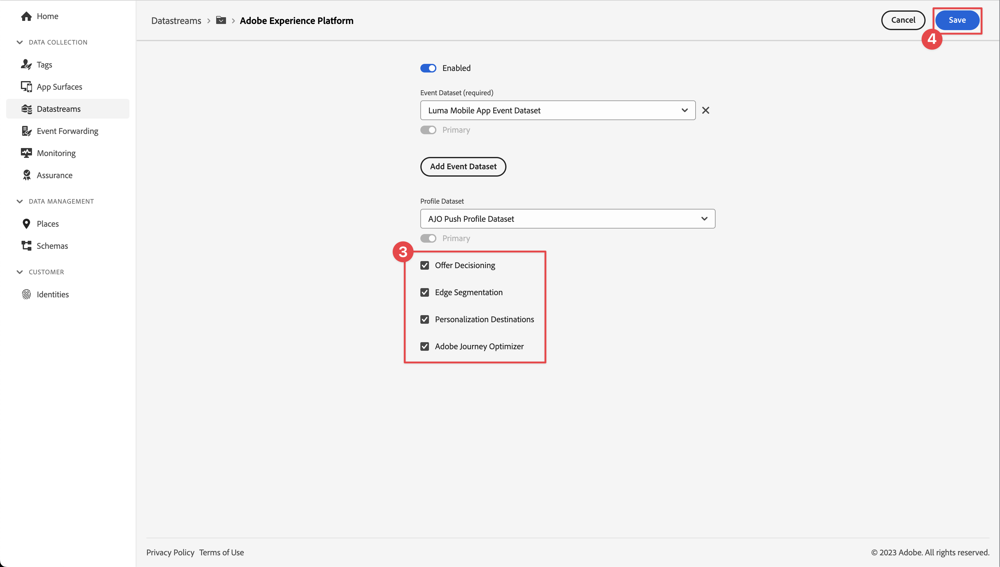

# 建立和傳送應用程式內訊息

瞭解如何使用Experience Platform Mobile SDK和Journey Optimizer為行動應用程式建立應用程式內訊息。

Journey Optimizer可讓您建立行銷活動，以傳送應用程式內訊息給目標對象。 Journey Optimizer中的行銷活動是用來透過各種管道，將一次性內容傳送給特定對象。 透過行銷活動，可同時執行動作 (立即執行或根據指定的排程執行)。使用歷程時(請參閱 [Journey Optimizer推播通知](journey-optimizer-push.md) 課程)，動作會依序執行。


在使用Journey Optimizer傳送應用程式內訊息之前，您必須確保有適當的設定和整合。 若要瞭解Journey Optimizer中的應用程式內傳訊資料流程，請參閱 [說明檔案](https://experienceleague.adobe.com/docs/journey-optimizer/using/in-app/inapp-configuration.html?lang=en).

>[!NOTE]
>
>本課程為選修課程，僅適用於想要傳送應用程式內訊息的Journey Optimizer使用者。


## 先決條件

* 成功建立並執行應用程式，且已安裝並設定SDK。
* 為Adobe Experience Platform設定應用程式。
* 如所述存取Journey Optimizer和足夠的許可權 [此處](https://experienceleague.adobe.com/docs/journey-optimizer/using/configuration/configuration-message/push-config/push-configuration.html?lang=en). 此外，您需要足夠的許可權才能使用下列Journey Optimizer功能。
   * 管理行銷活動.
* 付費的Apple開發人員帳戶，具有建立憑證、識別碼和金鑰的足夠存取權。
* 實體iOS裝置或模擬器以進行測試。


## 學習目標

在本課程中，您將學習

* 向Apple推播通知服務(APN)註冊應用程式ID。
* 在AJO中建立應用程式表面。
* 安裝並設定Journey Optimizer標籤擴充功能。
* 更新您的應用程式以註冊Journey Optimizer標籤擴充功能。
* 驗證Assurance中的設定。
* 在Journey Optimizer中定義您自己的促銷活動和應用程式內訊息體驗。
* 從應用程式內傳送您自己的應用程式內訊息。

## 設定

>[!TIP]
>
>如果您已將環境設定為 [Journey Optimizer推送訊息](journey-optimizer-push.md) 課程，您可能已執行過此設定章節中的某些步驟。


### 在資料收集中新增應用程式表面

1. 從 [資料收集介面](https://experience.adobe.com/data-collection/)，選取 **[!UICONTROL 應用程式表面]** 在左側面板中。
1. 若要建立組態，請選取 **[!UICONTROL 建立應用程式表面]**.
   
1. 輸入 **[!UICONTROL 名稱]** 例如，針對設定 `Luma App Tutorial`  .
1. 從 **[!UICONTROL 行動應用程式設定]**，選取 **[!UICONTROL Apple iOS]**.
1. 在中輸入行動應用程式套件組合ID **[!UICONTROL 應用程式ID (iOS套件組合ID)]** 欄位。 例如,  `com.adobe.luma.tutorial.swiftui`.
1. 選取「**[!UICONTROL 儲存]**」。

   

### 更新資料流設定

為確保將從您的行動應用程式傳送到Edge Network的資料轉送到Journey Optimizer，請更新您的Experience Edge設定。

1. 在資料收集UI中，選取 **[!UICONTROL 資料串流]**，並選取您的資料串流，例如 **[!DNL Luma Mobile App]**.
1. 選取  的 **[!UICONTROL Experience Platform]** 並選取  **[!UICONTROL 編輯]** 從內容功能表。
1. 在 **[!UICONTROL 資料串流]** >  >  **[!UICONTROL Adobe Experience Platform]** 畫面，確認 **[!UICONTROL Adobe Journey Optimizer]** 已選取。 另請參閱 [Adobe Experience Platform設定](https://experienceleague.adobe.com/docs/experience-platform/datastreams/configure.html?lang=en#aep) 以取得詳細資訊。
1. 若要儲存資料流設定，請選取 **[!UICONTROL 儲存]**.

   


### 安裝Journey Optimizer標籤擴充功能

若要讓應用程式與Journey Optimizer搭配使用，您必須更新標籤屬性。

1. 瀏覽至 **[!UICONTROL 標籤]** > **[!UICONTROL 擴充功能]** > **[!UICONTROL 目錄]**.
1. 開啟您的屬性，例如 **[!DNL Luma Mobile App Tutorial]**.
1. 選取 **[!UICONTROL 目錄]**.
1. 搜尋 **[!UICONTROL Adobe Journey Optimizer]** 副檔名。
1. 安裝擴充功能。
1. 在 **[!UICONTROL 安裝擴充功能]** 對話方塊
   1. 選取環境，例如 **[!UICONTROL 開發]**.
   1. 選取 **[!UICONTROL AJO推播追蹤體驗事件資料集]** 資料集 **[!UICONTROL 事件資料集]** 清單。
   1. 選取 **[!UICONTROL 儲存至程式庫並建置]**.
      

>[!NOTE]
>
>如果您沒有看到 `AJO Push Tracking Experience Event Dataset` 如需使用，請聯絡客戶服務。
>

### 在應用程式中實作Journey Optimizer

如先前課程所述，安裝行動標籤擴充功能僅會提供設定。 接下來，您必須安裝並註冊傳訊SDK。 如果這些步驟不清楚，請查閱 [安裝SDK](install-sdks.md) 區段。

>[!NOTE]
>
>如果您已完成 [安裝SDK](install-sdks.md) 區段，則該SDK已安裝，且您可以略過此步驟。
>

1. 在Xcode中，確認 [AEP傳訊](https://github.com/adobe/aepsdk-messaging-ios.git) 會新增至套件相依性中的套件清單中。 另請參閱 [Swift封裝管理程式](install-sdks.md#swift-package-manager).
1. 瀏覽至 **[!DNL Luma]** > **[!DNL Luma]** > **[!UICONTROL AppDelegate]** 在「Xcode專案」導覽器中。
1. 確定 `AEPMessaging` 是匯入清單的一部分。

   `import AEPMessaging`

1. 確定 `Messaging.self` 是您註冊的擴充功能陣列的一部分。

   ```swift
   let extensions = [
       AEPIdentity.Identity.self,
       Lifecycle.self,
       Signal.self,
       Edge.self,
       AEPEdgeIdentity.Identity.self,
       Consent.self,
       UserProfile.self,
       Places.self,
       Messaging.self,
       Optimize.self,
       Assurance.self
   ]
   ```


## 使用保證驗證設定

1. 檢閱 [設定指示](assurance.md#connecting-to-a-session) 區段來將您的模擬器或裝置連線到Assurance。
1. 在Assurance UI中，選取 **[!UICONTROL 設定]**.
   
1. 選取  按鈕旁邊 **[!UICONTROL 應用程式內傳訊]**.
1. 選取「**[!UICONTROL 儲存]**」。
   
1. 選取 **[!UICONTROL 應用程式內傳訊]** 從左側導覽。
1. 選取 **[!UICONTROL 驗證]** 標籤。 確認您沒有收到任何錯誤。

   


## 建立您自己的應用程式內訊息

若要建立您自己的應用程式內訊息，您必須在Journey Optimizer中定義行銷活動，以根據發生的事件觸發應用程式內訊息。 這些事件可以是：

* 資料傳送至Adobe Experience Platform，
* 核心追蹤事件，例如動作，或透過行動核心通用API的PII資料狀態或集合，
* 應用程式生命週期事件，例如，啟動、安裝、升級、關閉或當機。
* 地理位置事件，例如進入或退出地標。

在本教學課程中，您將會使用行動核心通用和獨立於擴充功能的API (請參閱 [行動核心通用API](https://developer.adobe.com/client-sdks/documentation/mobile-core/#mobile-core-generic-apis))以方便使用者畫面、動作和PII資料的事件追蹤。 這些API產生的事件會發佈至SDK事件中樞，並可由擴充功能使用。 SDK事件中樞提供與所有Mobile Platform SDK擴充功能繫結的核心資料結構，並維護註冊的擴充功能和內部模組清單、註冊的事件接聽程式清單以及共用狀態資料庫。

SDK事件中心會發佈並接收來自已註冊擴充功能的事件資料，以簡化與Adobe和協力廠商解決方案的整合。 例如，安裝「最佳化」擴充功能時，事件中樞會處理所有請求以及與Journey Optimizer — 決定管理優惠引擎的互動。

1. 在Journey Optimizer UI中，選取 **[!UICONTROL 行銷活動]** 從左側邊欄。
1. 選取 **[!UICONTROL 建立行銷活動]**.
1. 在 **[!UICONTROL 建立行銷活動]** 畫面：
   1. 選取 **[!UICONTROL 應用程式內訊息]** 並從中選擇應用程式表面 **[!UICONTROL 應用程式表面]** 清單，例如 **[!DNL Luma Mobile App]**.
   1. 選取 **[!UICONTROL 建立]**
      
1. 在Campaign定義畫面中， **[!UICONTROL 屬性]**，輸入 **[!UICONTROL 名稱]** 例如，促銷活動 `Luma - In-App Messaging Campaign`，和 **[!UICONTROL 說明]**，例如 `In-app messaging campaign for Luma app`.
   
1. 向下捲動至 **[!UICONTROL 動作]**，並選取 **[!UICONTROL 編輯內容]**.
1. 在 **[!UICONTROL 應用程式內訊息]** 畫面：
   1. 選取 **[!UICONTROL 強制回應]** 作為 **[!UICONTROL 訊息配置]**.
   2. 輸入 `https://luma.enablementadobe.com/content/dam/luma/en/logos/Luma_Logo.png` 針對 **[!UICONTROL 媒體URL]**.
   3. 輸入 **[!UICONTROL 頁首]**，例如 `Welcome to this Luma In-App Message` 並輸入 **[!UICONTROL 內文]**，例如 `Triggered by pushing that button in the app...`.
   4. 輸入 **[!UICONTROL 關閉]** 作為 **[!UICONTROL 按鈕#1文字（主要）]**.
   5. 請注意預覽的更新方式。
   6. 選取 **[!UICONTROL 檢閱以啟動]**.
      
1. 在 **[!UICONTROL 檢閱以啟動（Luma — 應用程式內傳訊行銷活動）]** 熒幕，選取  在 **[!UICONTROL 排程]** 圖磚。
   
1. 返回 **[!DNL Luma - In-App Messaging Campaign]** 熒幕，選取  **[!UICONTROL 編輯觸發程式]**.
1. 在 **[!UICONTROL 應用程式內訊息觸發器]** 對話方塊中，您可以設定觸發應用程式內訊息之追蹤動作的詳細資訊：
   1. 移除 **[!UICONTROL 應用程式啟動事件]**，選取  .
   1. 使用  **[!UICONTROL 新增條件]** 重複建置以下邏輯 **[!UICONTROL 顯示訊息條件]**.
   1. 按一下&#x200B;**[!UICONTROL 「完成」]**。
      

   您已定義追蹤動作，其中 **[!UICONTROL 動作]** 等於 `in-app` 和 **[!UICONTROL 內容資料]** ，動作為的索引鍵值組 `"showMessage" : "true"`.

1. 返回 **[!DNL Luma - In-App Messaging Campaign]** 熒幕，選取 **[!UICONTROL 檢閱以啟動]**.
1. 在 **[!UICONTROL 檢閱以啟動（Luma — 應用程式內傳訊行銷活動）]** 熒幕，選取 **[!UICONTROL 啟動]**.
1. 您會看到 **[!DNL Luma - In-App Messaging Campaign]** 具有狀態 **[!UICONTROL 即時]** 在 **[!UICONTROL 行銷活動]** 清單。
   


## 觸發應用程式內訊息

您已具備傳送應用程式內訊息的所有要素。 剩下的是如何在應用程式中觸發此應用程式內訊息。

1. 前往 **[!DNL Luma]** > **[!DNL Luma]** > **[!DNL Utils]** > **[!UICONTROL MobileSDK]** 在「Xcode專案」導覽器中。 尋找 `func sendTrackAction(action: String, data: [String: Any]?)` 函式，並新增下列程式碼，其會呼叫 [`MobileCore.track`](https://developer.adobe.com/client-sdks/documentation/mobile-core/api-reference/#trackaction) 函式，根據引數 `action` 和 `data`.


   ```swift
   // Send trackAction event
   MobileCore.track(action: action, data: data)
   ```

1. 前往 **[!DNL Luma]** > **[!DNL Luma]** > **[!DNL Views]** > **[!DNL General]** > **[!UICONTROL 組態檢視]** 在「Xcode專案導覽器」中。 尋找應用程式內訊息按鈕的程式碼，並新增下列程式碼：

   ```swift
   // Setting parameters and calling function to send in-app message
   Task {
       AEPService.shared.sendTrackAction(action: "in-app", data: ["showMessage": "true"])
   }
   ```

## 使用您的應用程式進行驗證

1. 在模擬器中或從Xcode在實體裝置上重建並執行應用程式，使用 .

1. 前往 **[!UICONTROL 設定]** 標籤。

1. 點選 **[!UICONTROL 應用程式內訊息]**. 您會在應用程式中看到應用程式內訊息。

   


## 驗證Assurance中的實作

您可以在Assurance UI中驗證應用程式內訊息。

1. 檢閱 [設定指示](assurance.md#connecting-to-a-session) 區段來將您的模擬器或裝置連線到Assurance。
1. 選取 **[!UICONTROL 應用程式內傳訊]**.
1. 選取 **[!UICONTROL 事件清單]**.
1. 選取 **[!UICONTROL 顯示訊息]** 登入點。
1. Inspect原始事件，尤其是 `html`，其中包含應用程式內訊息的完整版面和內容。
   


## 後續步驟

您現在應該擁有所有相關和適用的所有工具，以便開始新增應用程式內訊息。  例如，根據您在應用程式中追蹤的特定互動來促銷產品。

>[!SUCCESS]
>
>您已將應用程式啟用應用程式內傳訊，並已針對Experience Platform Mobile SDK使用Journey Optimizer和Journey Optimizer擴充功能新增應用程式內傳訊行銷活動。<br/>感謝您花時間學習Adobe Experience Platform Mobile SDK。 如果您有疑問、想要分享一般意見或有關於未來內容的建議，請在此分享這些內容 [Experience League社群討論貼文](https://experienceleaguecommunities.adobe.com/t5/adobe-experience-platform-launch/tutorial-discussion-implement-adobe-experience-cloud-in-mobile/td-p/443796).

下一步： **[建立和顯示優惠方案](journey-optimizer-offers.md)**
