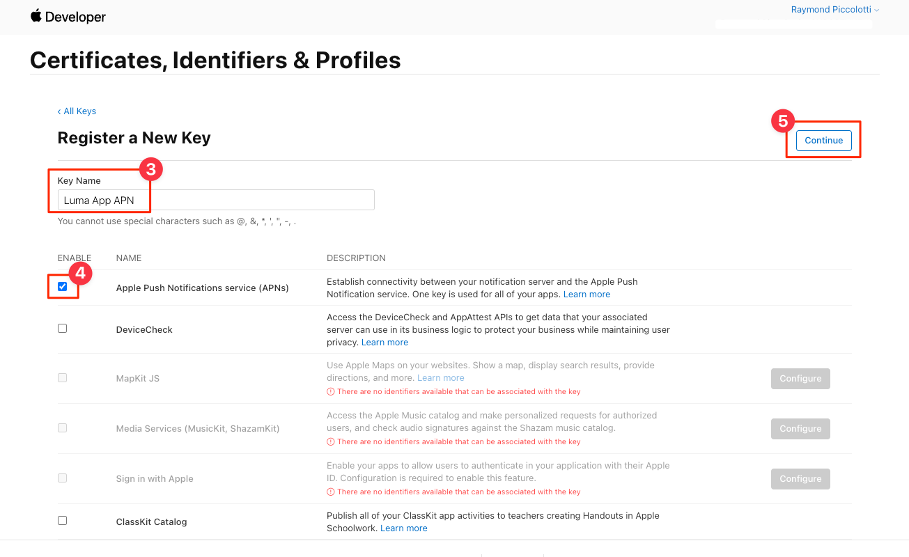
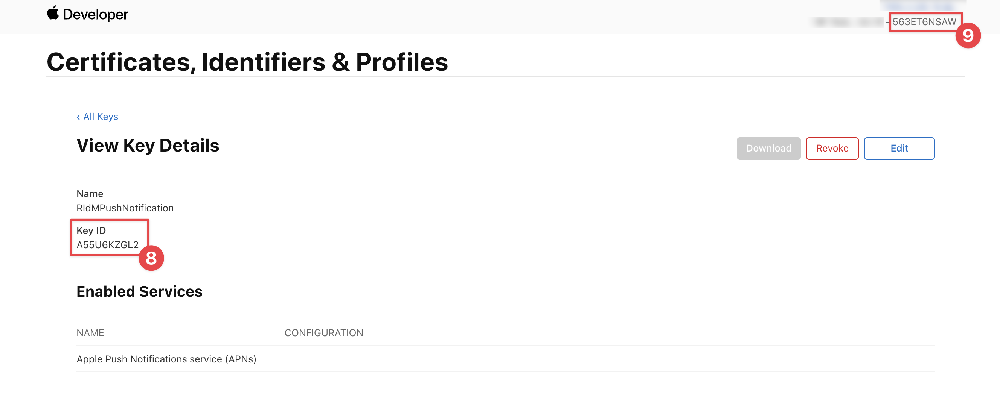
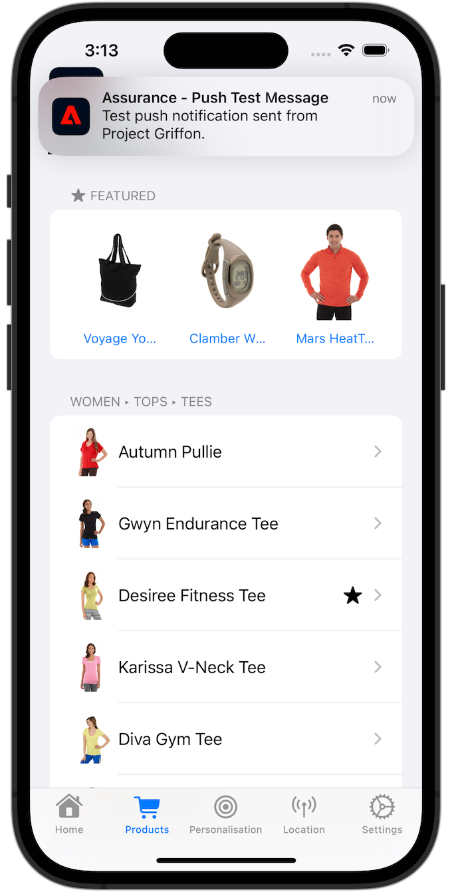

# 建立和傳送推播通知

瞭解如何使用Experience Platform Mobile SDK和Journey Optimizer為行動應用程式建立推播通知。

Journey Optimizer可讓您建立歷程，並傳送訊息給目標對象。 在使用Journey Optimizer傳送推播通知之前，您必須確保有適當的設定和整合。 若要瞭解Journey Optimizer中的推播通知資料流程，請參閱 [檔案](https://experienceleague.adobe.com/docs/journey-optimizer/using/configuration/configuration-message/push-config/push-gs.html).


>[!NOTE]
>
>本課程為選修課程，僅適用於想要傳送推播通知的Journey Optimizer使用者。


## 先決條件

* 成功建立並執行應用程式，且已安裝並設定SDK。
* 為Adobe Experience Platform設定應用程式。
* 如所述存取Journey Optimizer和足夠的許可權 [此處](https://experienceleague.adobe.com/docs/journey-optimizer/using/configuration/configuration-message/push-config/push-configuration.html?lang=en). 此外，您需要足夠的許可權才能使用下列Journey Optimizer功能。
   * 建立應用程式表面。
   * 建立歷程.
   * 建立訊息.
   * 建立訊息預設集.
* 付費的Apple開發人員帳戶，具有建立憑證、識別碼和金鑰的足夠存取權。
* 實體iOS裝置或模擬器以進行測試。

## 學習目標

在本課程中，您將學習

* 向Apple推播通知服務(APN)註冊應用程式ID。
* 在Journey Optimizer中建立應用程式表面。
* 更新您的結構描述以包含推送訊息欄位。
* 安裝及設定Journey Optimizer標籤擴充功能。
* 更新您的應用程式以註冊Journey Optimizer標籤擴充功能。
* 驗證Assurance中的設定。
* 從保證傳送測試訊息
* 在Journey Optimizer中定義您自己的推播通知事件、歷程和體驗。
* 從應用程式內傳送您自己的推播通知。


## 設定

>[!TIP]
>
>如果您已將環境設定為 [Journey Optimizer應用程式內傳訊](journey-optimizer-inapp.md) 課程，您可能已執行過此設定章節中的某些步驟。

### 向APN註冊應用程式ID

下列步驟並非特定於Adobe Experience Cloud，而是旨在引導您完成APN設定。

#### 建立私密金鑰

1. 在Apple開發人員入口網站中，導覽至 **[!UICONTROL 金鑰]**.
1. 若要建立金鑰，請選取 **[!UICONTROL +]**.
   

1. 提供 **[!UICONTROL 金鑰名稱]**.
1. 選取 **[!UICONTROL Apple推播通知服務] (APNs)** 核取方塊。
1. 選取 **[!UICONTROL 繼續]**.
   
1. 檢閱設定並選取 **[!UICONTROL 註冊]**.
1. 下載 `.p8` 私密金鑰。 本課程稍後將用於App Surface設定。
1. 記下 **[!UICONTROL 金鑰ID]**. 它用於App Surface設定。
1. 記下 **[!UICONTROL 團隊ID]**. 它用於App Surface設定。
   

其他檔案包括 [可在此處找到](https://help.apple.com/developer-account/#/devcdfbb56a3).

#### 在資料收集中新增應用程式表面

1. 從 [資料收集介面](https://experience.adobe.com/data-collection/)，選取 **[!UICONTROL 應用程式表面]** 在左側面板中。
1. 若要建立組態，請選取 **[!UICONTROL 建立應用程式表面]**.
   
1. 輸入 **[!UICONTROL 名稱]** 例如，針對設定 `Luma App Tutorial`  .
1. 從 **[!UICONTROL 行動應用程式設定]**，選取 **[!UICONTROL Apple iOS]**.
1. 在中輸入行動應用程式套件組合ID **[!UICONTROL 應用程式ID (iOS套件組合ID)]** 欄位。 例如,  `com.adobe.luma.tutorial.swiftui`.
1. 切換至 **[!UICONTROL 推送認證]** 切換即可新增您的認證。
1. 拖放您的 `.p8` **Apple推播通知驗證金鑰** 檔案。
1. 提供 **[!UICONTROL 金鑰ID]**，在建立期間指派的10個字元字串 `p8` 驗證金鑰。 此路徑位於 **[!UICONTROL 金鑰]** 索引標籤中的 **憑證、識別碼和設定檔** Apple開發人員入口網站頁面的頁面。 另請參閱 [建立私密金鑰](#create-a-private-key).
1. 提供 **[!UICONTROL 團隊ID]**. 團隊ID是一個值，可在下找到 **會籍** 標籤或Apple開發人員入口網站頁面頂端的標籤。 另請參閱 [建立私密金鑰](#create-a-private-key).
1. 選取「**[!UICONTROL 儲存]**」。

   

### 更新資料流設定

為確保將從您的行動應用程式傳送到Edge Network的資料轉送到Journey Optimizer，請更新您的Experience Edge設定。

1. 在資料收集UI中，選取 **[!UICONTROL 資料串流]**，並選取您的資料串流，例如 **[!DNL Luma Mobile App]**.
1. 選取  的 **[!UICONTROL Experience Platform]** 並選取  **[!UICONTROL 編輯]** 從內容功能表。
1. 在 **[!UICONTROL 資料串流]** >  >  **[!UICONTROL Adobe Experience Platform]** 畫面：

   1. 如果尚未選取，請選取 **[!UICONTROL AJO推播設定檔資料集]** 從 **[!UICONTROL 設定檔資料集]**. 使用時，需要此設定檔資料集 `MobileCore.setPushIdentifier` API呼叫(請參閱 [註冊推播通知的裝置代號](#register-device-token-for-push-notifications))可確保推送通知的唯一識別碼（亦即推送識別碼）會儲存為使用者設定檔的一部分。

   1. **[!UICONTROL Adobe Journey Optimizer]** 已選取。 另請參閱 [Adobe Experience Platform設定](https://experienceleague.adobe.com/docs/experience-platform/datastreams/configure.html?lang=en#aep) 以取得詳細資訊。

   1. 若要儲存資料流設定，請選取 **[!UICONTROL 儲存]**.

   


### 安裝Journey Optimizer標籤擴充功能

若要讓應用程式與Journey Optimizer搭配使用，您必須更新標籤屬性。

1. 瀏覽至 **[!UICONTROL 標籤]** > **[!UICONTROL 擴充功能]** > **[!UICONTROL 目錄]**，
1. 開啟您的屬性，例如 **[!DNL Luma Mobile App Tutorial]**.
1. 選取 **[!UICONTROL 目錄]**.
1. 搜尋 **[!UICONTROL Adobe Journey Optimizer]** 副檔名。
1. 安裝擴充功能。
1. 在 **[!UICONTROL 安裝擴充功能]** 對話方塊
   1. 選取環境，例如 **[!UICONTROL 開發]**.
   1. 選取 **[!UICONTROL AJO推播追蹤體驗事件資料集]** 資料集 **[!UICONTROL 事件資料集]** 清單。
   1. 選取 **[!UICONTROL 儲存至程式庫並建置]**.
      

>[!NOTE]
>
>如果您沒有看到 **[!UICONTROL AJO推播追蹤體驗事件資料集]** 如需使用，請聯絡客戶服務。
>

## 使用保證驗證設定

1. 檢閱 [設定指示](assurance.md#connecting-to-a-session) 區段來將您的模擬器或裝置連線到Assurance。
1. 在Assurance UI中，選取 **[!UICONTROL 設定]**.
   
1. 選取  旁邊 **[!UICONTROL 推送偵錯]**.
1. 選取「**[!UICONTROL 儲存]**」。
   
1. 選取 **[!UICONTROL 推送偵錯]** 從左側導覽。
1. 選取 **[!UICONTROL 驗證設定]** 標籤。
1. 從中選擇您的裝置 **[!UICONTROL 使用者端]** 清單。
1. 確認您沒有收到任何錯誤。
   
1. 選取 **[!UICONTROL 傳送測試推播]** 標籤。
1. （選擇性）變更預設詳細資料 **[!UICONTROL 標題]** 和 **[!UICONTROL 內文]**
1. 選取  **[!UICONTROL 傳送測試推播通知]**.
1. 檢查 **[!UICONTROL 測試結果]**.
1. 您應該會看到測試推播通知出現在應用程式中。

   


## 將推播通知功能新增至您的應用程式

>[!IMPORTANT]
>
>若要在iOS應用程式中實作與測試推播通知，您必須擁有 **付費** Apple開發人員帳戶。 如果您沒有付費的Apple開發人員帳戶，可以略過本課程的其餘部分。

1. 在Xcode中，選取 **[!DNL Luma]** 從 **[!UICONTROL 目標]** 清單中，選取 **[!UICONTROL 簽署與功能]** 索引標籤中，選取 **[!UICONTROL +功能]** 按鈕，然後選取 **[!UICONTROL 推播通知]**. 這可讓您的應用程式接收推播通知。

1. 接下來，您需要將通知擴充功能新增至應用程式。 返回 **[!DNL General]** 標籤並選取 **[!UICONTROL +]** 圖示於 **[!UICONTROL 目標]** 區段。

1. 系統會提示您為新目標選取範本。 選取 **[!UICONTROL 通知服務延伸模組]** 然後選取 **[!UICONTROL 下一個]**.

1. 在下一個視窗中，使用 `NotificationExtension` 作為擴充功能的名稱，然後按一下 **[!UICONTROL 完成]** 按鈕。

您現在應該將推播通知擴充功能新增至應用程式，類似於下列畫面。


## 在應用程式中實作Journey Optimizer

如先前課程所述，安裝行動標籤擴充功能僅會提供設定。 接下來，您必須安裝並註冊傳訊SDK。 如果這些步驟不清楚，請查閱 [安裝SDK](install-sdks.md) 區段。

>[!NOTE]
>
>如果您已完成 [安裝SDK](install-sdks.md) 區段，則該SDK已安裝，且您可以略過此步驟。
>

1. 在Xcode中，確認 [AEP傳訊](https://github.com/adobe/aepsdk-messaging-ios.git) 會新增至套件相依性中的套件清單中。 另請參閱 [Swift封裝管理程式](install-sdks.md#swift-package-manager).
1. 瀏覽至 **[!DNL Luma]** > **[!DNL Luma]** > **[!UICONTROL AppDelegate]** 在「Xcode專案」導覽器中。
1. 確定 `AEPMessaging` 是匯入清單的一部分。

   `import AEPMessaging`

1. 確定 `Messaging.self` 是您註冊的擴充功能陣列的一部分。

   ```swift
   let extensions = [
       AEPIdentity.Identity.self,
       Lifecycle.self,
       Signal.self,
       Edge.self,
       AEPEdgeIdentity.Identity.self,
       Consent.self,
       UserProfile.self,
       Places.self,
       Messaging.self,
       Optimize.self,
       Assurance.self
   ]
   ```

## 註冊推播通知的裝置代號

1. 新增 [`MobileCore.setPushIdentifier`](https://developer.adobe.com/client-sdks/documentation/mobile-core/api-reference/#setpushidentifier) API至 `func application(_ application: UIApplication, didRegisterForRemoteNotificationsWithDeviceToken deviceToken: Data)` 函式。

   ```swift
   // Send push token to Mobile SDK
   MobileCore.setPushIdentifier(deviceToken)
   ```

   此函式擷取安裝應用程式的裝置所獨有的裝置代號。 然後使用您已設定的設定來設定推播通知傳送的代號，該設定依賴Apple的推播通知服務(APN)。

>[!IMPORTANT]
>
>此 `MobileCore.updateConfigurationWith(configDict: ["messaging.useSandbox": true])` 判斷推播通知是使用APNs沙箱或生產伺服器來傳送推播通知。 在模擬器中或裝置上測試應用程式時，請確定 `messaging.useSandbox` 設為 `true` 所以您會收到推播通知。 使用Apple的Testflight將應用程式部署到生產環境以進行測試時，請務必設定 `messaging.useSandbox` 至 `false` 否則，您的生產應用程式將無法接收推播通知。


## 建立您自己的推播通知

若要建立自己的推播通知，您必須在Journey Optimizer中定義觸發歷程的事件，負責傳送推播通知。

### 更新您的結構描述

您即將定義新的事件型別，目前無法當作結構描述中定義之事件清單的一部分使用。 您稍後將在觸發推播通知時使用此事件型別。

1. 在Journey Optimizer UI中，選取 **[!UICONTROL 方案]** 從左側邊欄。
1. 選取 **[!UICONTROL 瀏覽]** 標籤列中的。
1. 選取您的結構描述，例如 **[!DNL Luma Mobile App Event Schema]** 以開啟它。
1. 在架構編輯器中：
   1. 選取 **[!UICONTROL eventtype]** 欄位。
   1. 在 **[!UICONTROL 欄位屬性]** 窗格，向下捲動以檢視事件型別的可能值清單。 選取 **[!UICONTROL 新增列]**，並新增 `application.test` 作為 **[!UICONTROL 值]** 和 `[!UICONTROL Test event for push notification]` 作為 `DISPLAY NAME`.
   1. 選取&#x200B;**[!UICONTROL 「套用」]**。
   1. 選取「**[!UICONTROL 儲存]**」。
      

### 定義事件

Journey Optimizer中的事件可讓您一直觸發歷程以傳送訊息，例如推播通知。 另請參閱 [關於事件](https://experienceleague.adobe.com/docs/journey-optimizer/using/configuration/configure-journeys/events-journeys/about-events.html?lang=en) 以取得詳細資訊。

1. 在Journey Optimizer UI中，選取 **[!UICONTROL 設定]** 從左側邊欄。

1. 在 **[!UICONTROL 儀表板]** 熒幕，選取 **[!UICONTROL 管理]** 中的按鈕 **[!UICONTROL 活動]** 圖磚。

1. 在 **[!UICONTROL 活動]** 熒幕，選取 **[!UICONTROL 建立事件]**.

1. 在 **[!UICONTROL 編輯事件event1]** 窗格：

   1. 輸入 `LumaTestEvent` 作為 **[!UICONTROL 名稱]** 事件的。
   1. 提供 **[!UICONTROL 說明]**，例如 `Test event to trigger push notifications in Luma app`.

   1. 選取您先前在中建立的行動應用程式體驗事件結構描述 [建立XDM結構描述](create-schema.md) 從 **[!UICONTROL 結構描述]** 清單，例如 **[!DNL Luma Mobile App Event Schema v.1]**.
   1. 選取  在 **[!UICONTROL 欄位]** 清單。

      

      在 **[!UICONTROL 欄位]** 對話方塊中，確定已選取下列欄位(在永遠選取的預設欄位之上(**[!UICONTROL _id]**， **[!UICONTROL id]**、和 **[!UICONTROL timestamp]**)。 您可以使用下拉式清單在 **[!UICONTROL 已選取]**， **[!UICONTROL 全部]** 和 **[!UICONTROL 主要]** 或使用  欄位。

      * **[!UICONTROL 已識別的應用程式(ID)]**，
      * **[!UICONTROL 事件型別(eventType)]**，
      * **[!UICONTROL 主要（主要）]**.

      

      然後選取 **[!UICONTROL 確定]**.

   1. 選取  在 **[!UICONTROL 事件ID條件]** 欄位。

      1. 在 **[!UICONTROL 新增事件ID條件]** 對話方塊，拖放 **[!UICONTROL 事件型別(eventType)]** 開啟到 **[!UICONTROL 將元素拖放到這裡]**.
      1. 在彈出視窗中，捲動到底部並選取 **[!UICONTROL application.test]** （這是您先前新增至事件型別清單的事件型別，做為的一部分） [更新您的結構描述](#update-your-schema))。 然後向上捲動到頂端並選取 **[!UICONTROL 確定]**.
      1. 選取 **[!UICONTROL 確定]** 以儲存條件。
         

   1. 選取 **[!UICONTROL ECID (ECID)]** 從 **[!UICONTROL 名稱空間]** 清單。 自動 **[!UICONTROL 設定檔識別碼]** 欄位已填入 **[!UICONTROL 對應identityMap的索引鍵ECID的第一個元素的ID]**.
   1. 選取「**[!UICONTROL 儲存]**」。
      

您剛才已根據您先前在本教學課程中建立的行動應用程式體驗事件結構描述建立事件設定。 此事件設定將使用您的特定事件型別(`application.test`)，因此您確定只有從該行動應用程式起始的特定型別事件，才會觸發您在下一個步驟中建立的歷程。 在真實情境中，您可能會想要從外部服務傳送推播通知，但相同的概念適用：從外部應用程式傳送體驗事件至Experience Platform，該事件具有您可在這些事件觸發歷程之前用來套用條件的特定欄位。

### 建立歷程

您的下一個步驟是建立歷程，在收到適當事件時觸發推播通知的傳送。

1. 在Journey Optimizer UI中，選取 **[!UICONTROL 歷程]** 從左側邊欄。
1. 選取 **[!UICONTROL 建立歷程]**.
1. 在 **[!UICONTROL 歷程屬性]** 面板：

   1. 輸入 **[!UICONTROL 名稱]** 例如，對於歷程 `Luma - Test Push Notification Journey`.
   1. 輸入 **[!UICONTROL 說明]** 例如，對於歷程 `Journey for test push notifications in Luma mobile app`.
   1. 確定 **[!UICONTROL 允許重新進入]** 已選取並設定 **[!UICONTROL 重新進入等待期]** 至 **[!UICONTROL 30]** **[!UICONTROL 秒]**.
   1. 選取 **[!UICONTROL 確定]**.
      

1. 回到歷程畫布，從 **[!UICONTROL 活動]**，拖放您的  **[!DNL LumaTestEvent]** 在它顯示的畫布上 **[!UICONTROL 選取進入事件或讀取對象活動]**.

   * 在 **[!UICONTROL 事件： LumaTestEvent]** 面板，輸入 **[!UICONTROL 標籤]**，例如 `Luma Test Event`.

1. 從 **[!UICONTROL 動作]** 下拉式清單、拖放  **[!UICONTROL 推播]** 於  顯示在您的右側 **[!DNL LumaTestEvent]** 活動。 在 **[!UICONTROL 動作：推播]** 窗格：

   1. 提供 **[!UICONTROL 標籤]**，例如 `Luma Test Push Notification`，提供 **[!UICONTROL 說明]**，例如 `Test push notification for Luma mobile app`，選取 **[!UICONTROL 異動]** 從 **[!UICONTROL 類別]** 清單並選取 **[!DNL Luma]** 從 **[!UICONTROL 推播表面]**.
   1. 選取  **[!UICONTROL 編輯內容]** 以開始編輯實際的推播通知。
      

      在 **[!UICONTROL 推播通知]** 編輯者：

      1. 輸入 **[!UICONTROL 標題]**，例如 `Luma Test Push Notification` 並輸入 **[!UICONTROL 內文]**，例如 `Test push notification for Luma mobile app`.
      1. 若要儲存並離開編輯器，請選取 .
         

   1. 若要儲存並完成推播通知定義，請選取「 」 **[!UICONTROL 確定]**.

1. 您的歷程應如下所示。 選取 **[!UICONTROL 發佈]** 以發佈並啟用您的歷程。
   


## 觸發推播通知

您已具備傳送推播通知的所有要素。 剩下的問題是如何觸發此推播通知。 本質上，與您之前看到的一樣：只要傳送具有適當有效負載的體驗事件（如所示）即可 [活動](events.md))。

此時，您即將傳送的體驗事件未建構為建構簡單的XDM字典。 您即將使用 `struct` 代表推播通知裝載。 定義專用資料型別是在應用程式中實作建構體驗事件裝載的替代方式。

1. 瀏覽至 **[!DNL Luma]** > **[!DNL Luma]** > **[!UICONTROL 模型]** > **[!UICONTROL XDM]** > **[!UICONTROL TestPushPayload]** 在Xcode專案導覽器中檢查程式碼。

   ```swift
   import Foundation
   
   // MARK: - TestPush
   struct TestPushPayload: Codable {
      let application: Application
      let eventType: String
   }
   
   // MARK: - Application
   struct Application: Codable {
      let id: String
   }
   ```

   程式碼可呈現您要傳送以觸發測試推播通知歷程的下列簡單裝載

   ```json
   {
      "eventType": string,
      "application" : [
          "id": string
      ]
   }
   ```

1. 瀏覽至 **[!DNL Luma]** > **[!DNL Luma]** > **[!DNL Utils]** > **[!UICONTROL MobileSDK]** 在Xcode專案導覽器中，新增下列程式碼至 `func sendTestPushEvent(applicationId: String, eventType: String)`：

   ```swift
   // Create payload and send experience event
   Task {
       let testPushPayload = TestPushPayload(
           application: Application(
               id: applicationId
           ),
           eventType: eventType
       )
       // send the final experience event
       await sendExperienceEvent(
           xdm: testPushPayload.asDictionary() ?? [:]
       )
   }
   ```

   此程式碼會建立 `testPushPayload` 使用提供給函式的引數建立例項(`applicationId` 和 `eventType`)然後呼叫 `sendExperienceEvent` 將裝載轉換為字典時。 這次的程式碼也考慮到了呼叫Adobe Experience Platform SDK的非同步層面，該環節使用Swift的並行模式，並基於 `await` 和 `async`.

1. 瀏覽至 **[!DNL Luma]** > **[!DNL Luma]** > **[!DNL Views]** > **[!DNL General]** > **[!UICONTROL 組態檢視]** 在「Xcode專案」導覽器中。 在推播通知按鈕定義中，新增下列程式碼，以傳送測試推播通知體驗事件裝載，以便在點選按鈕時觸發您的歷程。

   ```swift
   // Setting parameters and calling function to send push notification
   Task {
       let eventType = testPushEventType
       let applicationId = Bundle.main.bundleIdentifier ?? "No bundle id found"
       await MobileSDK.shared.sendTestPushEvent(applicationId: applicationId, eventType: eventType)
   }
   ```


## 使用您的應用程式進行驗證

1. 在模擬器中或從Xcode在實體裝置上重建並執行應用程式，使用 .

1. 前往 **[!UICONTROL 設定]** 標籤。

1. 點選 **[!UICONTROL 推播通知]**. 您會看到推播通知出現在應用程式中。

   


## 後續步驟

您現在應該擁有在應用程式中處理推播通知的所有工具。 例如，您可以在Journey Optimizer中建立歷程，在應用程式的使用者登入時傳送歡迎推播通知。 或使用者在應用程式中購買產品時的確認推播通知。 或輸入位置的地理柵欄（如您所見） [地點](places.md) 課程)。

>[!SUCCESS]
>
>您現在已針對Experience Platform Mobile SDK使用Journey Optimizer和Journey Optimizer擴充功能啟用推播通知應用程式。<br/>感謝您花時間學習Adobe Experience Platform Mobile SDK。 如果您有疑問、想要分享一般意見或有關於未來內容的建議，請在此分享這些內容 [Experience League社群討論貼文](https://experienceleaguecommunities.adobe.com/t5/adobe-experience-platform-launch/tutorial-discussion-implement-adobe-experience-cloud-in-mobile/td-p/443796).

下一步： **[建立和傳送應用程式內訊息](journey-optimizer-inapp.md)**
