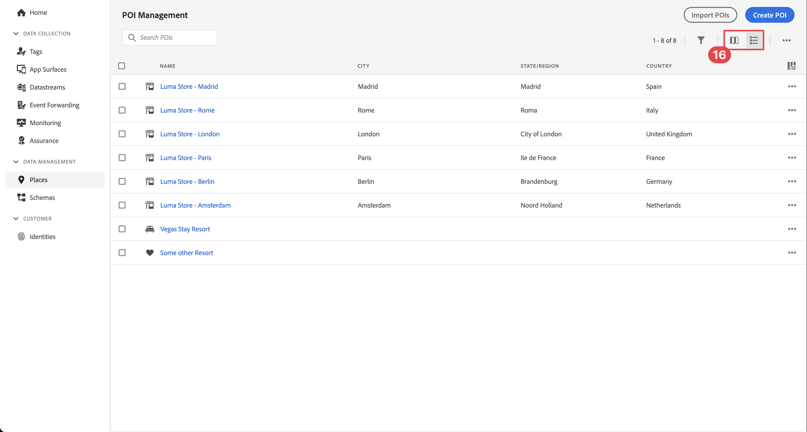
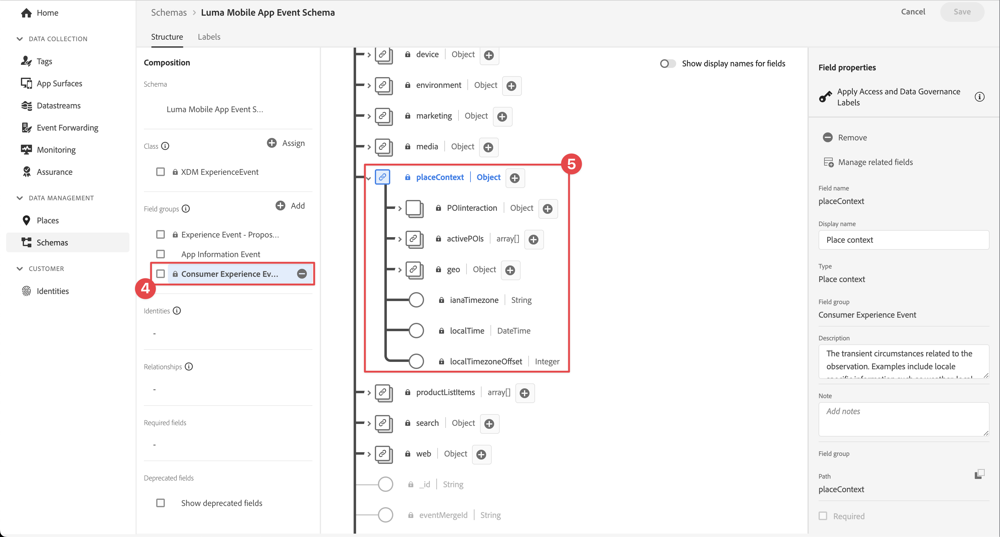
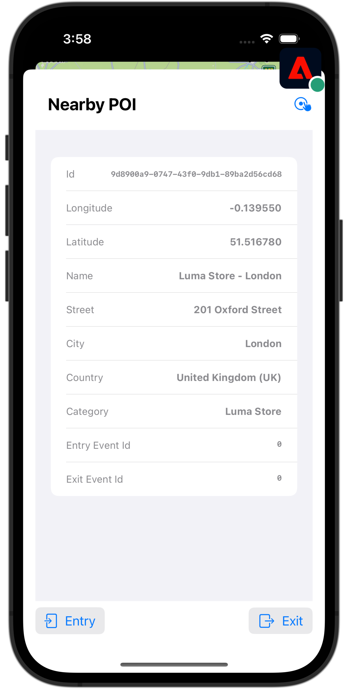

# 使用地標

瞭解如何在應用程式中使用Places地理位置服務。

Adobe Experience Platform Data Collection Places Service是一項地理位置服務，可讓具備位置感知功能的行動應用程式瞭解位置內容。 此服務使用豐富且簡單易用的SDK介面，並隨附彈性的興趣點資料庫(POI)。

## 先決條件

* 所有套件相依性都在Xcode專案中。
* AppDelegate中註冊的擴充功能。
* 已將MobileCore設定為使用您的開發appId。
* 匯入的SDK。
* 已順利建置並執行應用程式，包含上述變更。

## 學習目標

在本課程中，您將學習

* 瞭解如何在Places服務中定義地標。
* 使用Places擴充功能更新您的標籤屬性。
* 更新您的結構描述以擷取地理位置事件。
* 驗證Assurance中的設定。
* 更新您的應用程式以註冊Places擴充功能。
* 從應用程式中的Places服務實作地理位置追蹤。


## 設定

若要讓Places服務在您的應用程式和Mobile SDK中運作，您必須進行一些設定。

### 定義地標

您可以在Places服務中定義一些地標。

1. 在資料收集UI中，選取 **[!UICONTROL 地點]**.
1. 選取 .
1. 從內容功能表中，選取 **[!UICONTROL 管理程式庫]**.
   
1. 在 **[!UICONTROL 管理程式庫]** 對話方塊，選取 **[!UICONTROL 新增]**.
1. 在 **[!UICONTROL 建立資料庫]** 對話方塊輸入 **[!UICONTROL 名稱]**，例如 `Luma`.
1. 選取 **[!UICONTROL 確認]**.
   
1. 若要關閉 **[!UICONTROL 管理程式庫]** 對話方塊，選取 **[!UICONTROL 關閉]**.
1. 返回 **[!UICONTROL POI管理]**，選取 **[!UICONTROL 匯入POI]**.
1. 選取 **[!UICONTROL 開始]** 在 **[!UICONTROL 匯入地標]** 對話方塊。
1. 選取 **[!DNL Luma]** 從程式庫清單中，
1. 選取&#x200B;**[!UICONTROL 「下一步」]**。
   
1. 下載 [Luma POIs ZIP檔案](assets/luma_pois.csv.zip) 並將它擷取到您電腦上的某個位置。
1. 在 **[!UICONTROL 匯入地標]** 對話方塊，拖放擷取的 `luma_pois.csv` 檔案開啟到 **[!UICONTROL 選擇CSV檔案 — 拖放您的檔案]**. 您應該會看到 **[!UICONTROL 驗證成功]** - **[!UICONTROL 已成功驗證CSV檔案]**.
1. 選取 **[!UICONTROL 開始匯入]**. 您應該會看到 **[!UICONTROL 成功]** - **[!UICONTROL 已成功新增6個POI]**.
1. 選取 **[!UICONTROL 完成]**.
1. 在 **[!UICONTROL POI管理]**，您應該會看到清單中已新增六家新的Luma商店。 您可以切換  清單和  地圖檢視。
   .


### 安裝Places擴充功能

1. 瀏覽至 **[!UICONTROL 標籤]** 並尋找您的行動標籤屬性並開啟屬性。
1. 選取 **[!UICONTROL 擴充功能]**.
1. 選取 **[!UICONTROL 目錄]**.
1. 搜尋 **[!UICONTROL 地點]** 副檔名。
1. 安裝擴充功能。

   

1. 在 **[!UICONTROL 安裝擴充功能]** 對話方塊：
   1. 選取 **[!DNL Luma]** 從 **[!UICONTROL 選取程式庫]** 清單。
   1. 確認您已挑選工作程式庫，例如 **[!UICONTROL 初始建置]**.
   1. 選取 **[!UICONTROL 儲存至程式庫並建置]** 從 **[!UICONTROL 儲存至程式庫]**.
      .

1. 已重建您的程式庫。


### 驗證您的結構描述

驗證您的結構描述是否如中定義 [建立結構描述](create-schema.md)，整合了必要的欄位群組和類別，以便收集POI和地理位置資料。

1. 導覽至資料收集介面並選取「 」 **[!UICONTROL 方案]** 從左側邊欄。
1. 選取 **[!UICONTROL 瀏覽]** 從頂端列。
1. 選取要開啟的結構描述。
1. 在架構編輯器中，選取 **[!UICONTROL 消費者體驗事件]**.
1. 您會看到 **[!UICONTROL placeContext]** 物件，具有物件和欄位，可擷取POI互動和地理位置資料。
   .


### 更新您的標籤屬性

Tags的Places擴充功能提供監視地理位置事件的功能，可讓您根據這些事件觸發動作。 您可以使用此功能，將您必須在應用程式中實施的API編碼減至最少。

**資料元素**

您先建立數個資料元素。

1. 前往資料收集UI中的標籤屬性。
1. 選取 **[!UICONTROL 資料元素]** 從左側邊欄。
1. 選取&#x200B;**[!UICONTROL 「新增資料元素」]**。
1. 在 **[!UICONTROL 建立資料元素]** 畫面，輸入名稱，例如 `Name - Entered`.
1. 選取 **[!UICONTROL 地點]** 從 **[!UICONTROL 副檔名]** 清單。
1. 選取 **[!UICONTROL 名稱]** 從 **[!UICONTROL 資料元素型別]** 清單。
1. 選取 **[!UICONTROL 目前POI]** 底下 **[!UICONTROL TARGET]**.
1. 選取 **[!UICONTROL 儲存至程式庫]**.
   

1. 使用下表中的資訊重複步驟4至8，以建立其他資料元素。

   | 名稱 | 擴充功能 | 資料元素型別 | TARGET |
   |---|---|---|---|
   | `Name - Exited` | 地點 | 名稱 | 上次退出的POI |
   | `Category - Current` | 地點 | 類別 | 目前POI |
   | `Category - Exited` | 地點 | 類別 | 上次退出的POI |
   | `City - Current` | 地點 | 城市 | 目前POI |
   | `City - Exited` | 地點 | 城市 | 上次退出的POI |

   您應該有以下資料元素清單。

   

**規則**

接下來，您將定義處理這些資料元素的規則。

1. 在您的標籤屬性中，選取 **[!UICONTROL 規則]** 從左側邊欄。
1. 選取 **[!UICONTROL 新增規則]**.
1. 在 **[!UICONTROL 建立規則]** 畫面，輸入規則的名稱，例如 `POI - Entry`.
1. 選取  底下 **[!UICONTROL 活動]**.
   1. 選取 **[!UICONTROL 地點]** 從 **[!UICONTROL 副檔名]** 清單並選取 **[!UICONTROL 輸入POI]** 從 **[!UICONTROL 事件型別]** 清單。
   1. 選取&#x200B;**[!UICONTROL 「保留變更」]**。
      .
1. 選取  底下 **[!UICONTROL 動作]**.
   1. 選取 **[!UICONTROL 行動核心]** 從 **[!UICONTROL 副檔名]** 清單，選取 **[!UICONTROL 附加資料]** 從 **[!UICONTROL 動作型別]** 清單。 此動作會附加裝載資料。
   1. 在 **[!UICONTROL JSON裝載]**，貼上下列裝載：

      ```json
      {
          "xdm": {
              "eventType": "location.entry",
              "placeContext": {
                  "geo": {
                      "city": "{%%City - Current%%}"
                  },
                  "POIinteraction": {
                      "poiDetail": {
                          "name": "{%%Name - Current%%}",
                          "category": "{%%Category - Current%%}"
                      },
                      "poiEntries": {
                          "value": 1
                      }
                  }
              }
          }
      }
      ```

      您也可以插入 `{%% ... %%}` JSON中的資料元素預留位置值，方法是選取 . 快顯對話方塊可讓您挑選您建立的任何資料元素。

   1. 選取&#x200B;**[!UICONTROL 「保留變更」]**。
      

1. 選取  在 **[!UICONTROL 行動核心 — 附加資料]** 動作。
   1. 選取 **[!UICONTROL Adobe Experience Platform Edge Network]** 從 **[!UICONTROL 副檔名]** 清單並選取 **[!UICONTROL 將事件轉送至Edge Network]**. 此動作可確保將事件和其他裝載資料轉送到Platform Edge Network。
   1. 選取&#x200B;**[!UICONTROL 「保留變更」]**。

1. 若要儲存規則，請選取「 」 **[!UICONTROL 儲存至程式庫]**.

   

讓我們建立另一個規則

1. 在 **[!UICONTROL 建立規則]** 畫面，輸入規則的名稱，例如 `POI - Exit`.
1. 選取  底下 **[!UICONTROL 活動]**.
   1. 選取 **[!UICONTROL 地點]** 從 **[!UICONTROL 副檔名]** 清單並選取 **[!UICONTROL 輸入POI]** 從 **[!UICONTROL 事件型別]** 清單。
   1. 選取&#x200B;**[!UICONTROL 「保留變更」]**。
1. 選取  底下 **[!UICONTROL 動作]**.
   1. 選取 **[!UICONTROL 行動核心]** 從 **[!UICONTROL 副檔名]** 清單，選取 **[!UICONTROL 附加資料]** 從 **[!UICONTROL 動作型別]** 清單。
   1. 在 **[!UICONTROL JSON裝載]**，貼上下列裝載：

      ```json
      {
          "xdm": {
              "eventType": "location.exit",
              "placeContext": {
                  "geo": {
                      "city": "{%%City - Exited%%}"
                  },
                  "POIinteraction": {
                      "poiExits": {
                          "value": 1
                      },
                      "poiDetail": {
                          "name": "{%%Name - Exited%%}",
                          "category": "{%%Category - Exited%%}"
                      }
                  }
              }
          }
      }
      ```

   1. 選取&#x200B;**[!UICONTROL 「保留變更」]**。

1. 選取  在 **[!UICONTROL 行動核心 — 附加資料]** 動作。
   1. 選取 **[!UICONTROL Adobe Experience Platform Edge Network]** 從 **[!UICONTROL 副檔名]** 清單並選取 **[!UICONTROL 將事件轉送至Edge Network]**.
   1. 選取&#x200B;**[!UICONTROL 「保留變更」]**。

1. 若要儲存規則，請選取「 」 **[!UICONTROL 儲存至程式庫]**.

   


若要確保標籤中的所有變更皆已發佈

1. 選取 **[!UICONTROL 初始建置]** 作為要建置的程式庫。
1. 選取 **[!UICONTROL 建置]**.
   


## 驗證Assurance中的設定

若要驗證Assurance中的設定：

1. 前往Assurance UI。
1. 如果左側邊欄中尚未提供，請選取 **[!UICONTROL 設定]** 在左側邊欄中並選取  旁邊 **[!UICONTROL 活動]** 和 **[!UICONTROL 地圖和模擬]** 底下 **[!UICONTROL PLACES SERVICE]**.
1. 選取「**[!UICONTROL 儲存]**」。
1. 選取 **[!UICONTROL 地圖和模擬]** 在左側邊欄中。
1. 將地圖移至其中一個POI的位置。
1. 選取  模擬載入POI。 您的POI會使用圓圈和圖釘來識別。
1. 選取您的POI。
1. 從快顯視窗中選取  **[!UICONTROL 模擬進入事件]**.
   
1. 選取 **[!UICONTROL 活動]** 從左側邊欄中，應該會看到您模擬的事件。
   


## 在您的應用程式中實作地標

如先前課程所述，安裝行動標籤擴充功能僅會提供設定。 接下來，您必須安裝並註冊Places SDK。 如果這些步驟不清楚，請查閱 [安裝SDK](install-sdks.md) 區段。

>[!NOTE]
>
>如果您已完成 [安裝SDK](install-sdks.md) 區段，則會顯示Places SDK已安裝，且您可以略過此步驟。
>

1. 在Xcode中，確認 [AEP地點](https://github.com/adobe/aepsdk-places-ios) 會新增至套件相依性中的套件清單中。 另請參閱 [Swift封裝管理程式](install-sdks.md#swift-package-manager).
1. 瀏覽至 **[!DNL Luma]** > **[!DNL Luma]** > **[!DNL AppDelegate]** 在「Xcode專案」導覽器中。
1. 確定 `AEPPlaces` 是匯入清單的一部分。

   ```swift
   import AEPPlaces
   ```

1. 確定 `Places.self` 是您註冊的擴充功能陣列的一部分。

   ```swift
   let extensions = [
       AEPIdentity.Identity.self,
       Lifecycle.self,
       Signal.self,
       Edge.self,
       AEPEdgeIdentity.Identity.self,
       Consent.self,
       UserProfile.self,
       Places.self,
       Messaging.self,
       Optimize.self,
       Assurance.self
   ]
   ```

1. 瀏覽至 **[!DNL Luma]** > **[!DNL Luma]** > **[!DNL Utils]** > **[!UICONTROL MobileSDK]** 在Xcode專案導覽器中，並找到 `func processRegionEvent(regionEvent: PlacesRegionEvent, forRegion region: CLRegion) async` 函式。 新增下列程式碼：

   ```swift
   // Process geolocation event
   Places.processRegionEvent(regionEvent, forRegion: region)
   ```

   這個 [`Places.processRegionEvent`](https://developer.adobe.com/client-sdks/documentation/places/api-reference/#processregionevent) API會將地理位置資訊通訊至Places服務。

1. 瀏覽至 **[!DNL Luma]** > **[!DNL Luma]** > **[!DNL Views]** > **[!DNL Location]** > **[!DNL GeofenceSheet]** 在Xcode的專案導覽器中。

   1. 針對「輸入」按鈕，輸入下列代碼

   ```swift
   // Simulate geofence entry event
   Task {
       await MobileSDK.shared.processRegionEvent(regionEvent: .entry, forRegion: region)
   }
   ```

   1. 針對「結束」按鈕，輸入下列程式碼

   ```swift
   // Simulate geofence exit event
   Task {
       await MobileSDK.shared.processRegionEvent(regionEvent: .exit, forRegion: region)
   }
   ```

## 使用您的應用程式進行驗證

1. 在裝置上或在模擬器中開啟您的應用程式。

1. 前往 **[!UICONTROL 位置]** 標籤。

1. 四處移動（拖曳）地圖，確保藍色中間圓圈位於其中一個POI的上方，例如倫敦。

1. 點選  直到您看到類別和名稱出現在帶有圖釘的紅色位置的標籤中。

1. 點選POI的標籤，這會開啟 **[!UICONTROL 附近的POI]** 工作表。

   

1. 按下 **[!UICONTROL 登入點]** 或 **[!UICONTROL 退出]** 按鈕來模擬應用程式中的地理柵欄登入和地理柵欄退出事件。

   

1. 您應該會在Assurance UI中看到事件。


## 後續步驟

您現在應該有所有的工具，以便開始將更多功能新增至應用程式中的地理位置功能。 當您為設定應用程式後，將事件轉送至「邊緣網路」 [Experience Platform](platform.md)，您應該會看到針對應用程式中所用設定檔顯示的體驗事件。

在本教學課程的Journey Optimizer一節中，您會看到體驗事件可用來觸發歷程(請參閱 [推播通知](journey-optimizer-inapp.md) 和 [應用程式內傳訊](journey-optimizer-push.md) 使用Journey Optimizer)。 例如，當應用程式使用者進入實體商店的地理柵欄時，傳送推播通知給該使用者並進行某些產品促銷的常見範例。

您見過應用程式的功能實作，大多是由Places服務以及您在標籤屬性中定義的資料元素和規則所驅動。 因此，請儘可能減少應用程式中的程式碼。 或者，您可以使用直接在應用程式中實作相同的功能 [`Edge.sendEvent`](https://developer.adobe.com/client-sdks/documentation/edge-network/api-reference/#sendevent) API (請參閱 [活動](events.md) 瞭解更多資訊)，其XDM裝載包含已填入的 `placeContext` 物件。

>[!SUCCESS]
>
>您現在已使用Experience Platform Mobile SDK中的Places擴充功能，為地理定位服務啟用應用程式。
>
>感謝您花時間學習Adobe Experience Platform Mobile SDK。 如果您有疑問、想要分享一般意見或有關於未來內容的建議，請在此分享這些內容 [Experience League社群討論貼文](https://experienceleaguecommunities.adobe.com/t5/adobe-experience-platform-data/tutorial-discussion-implement-adobe-experience-cloud-in-mobile/td-p/443796).

下一步： **[將資料對應至Adobe Analytics](analytics.md)**
