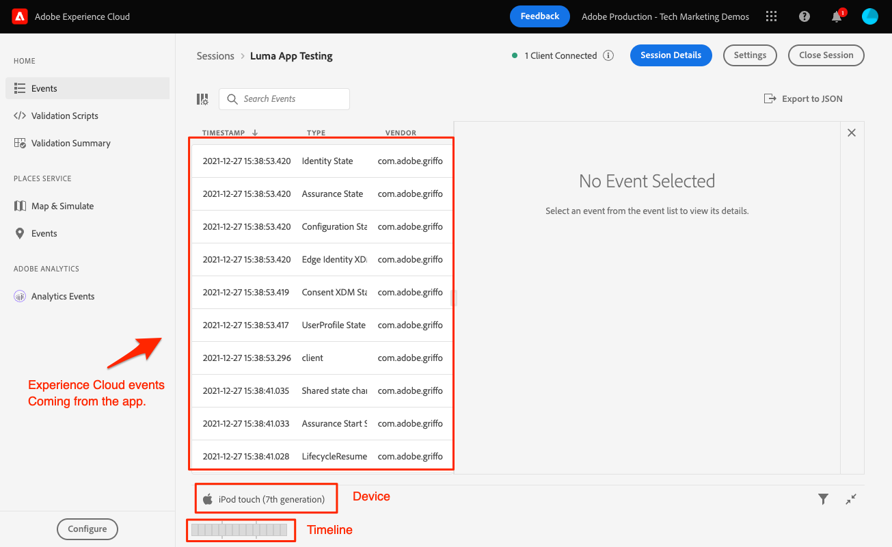

# Assurance

瞭解如何在行動應用程式中設定Adobe Experience Platform保證。

>[!INFO]
>
> 在2023年11月下旬，此教學課程將由使用新範例行動應用程式的新教學課程取代

Assurance （正式名稱為Project Griffon）可協助您檢查、證明、模擬及驗證如何在行動應用程式中收集資料或提供體驗。

Assurance 可協助您檢查 Adobe Experience Platform Mobile SDK 產生的原始 SDK 事件。SDK 收集的所有事件都可供檢查。SDK 事件會載入清單檢視，並依時間排序。每個事件都有一個可提供更多詳細資料的詳細檢視。此外，也提供瀏覽SDK設定、資料元素、共用狀態和SDK擴充功能版本的其他檢視。 進一步瞭解 [保證](https://experienceleague.adobe.com/docs/experience-platform/assurance/home.html) 產品檔案內。


## 先決條件

* 成功建立並執行已安裝及設定SDK的範例應用程式。

## 學習目標

在本課程中，您將會：

* 確認您的組織擁有存取權（如果您沒有存取權，請提出要求）。
* 設定您的基底URL。
* 新增必要的iOS特定程式碼。
* 連線到工作階段.

## 確認存取

完成下列步驟，確認貴組織可以存取「保證」：

1. 造訪 [https://experience.adobe.com/#/assurance](https://experience.adobe.com/griffon){target="_blank"}
1. 使用您用於Experience Cloud的Adobe ID憑證登入。
1. 如果您被帶到 **[!UICONTROL 工作階段]** 熒幕，則表示您擁有存取權。 如果您進入測試版存取頁面，請選取 **[!UICONTROL 註冊]**.

## 實作

除了一般 [SDK安裝](install-sdks.md) 您已完成先前的課程，iOS還需要下列新增專案。 將下列程式碼新增至 `AppDelegate.swift` 檔案:

```swift
func application(_ app: UIApplication, open url: URL, options: [UIApplication.OpenURLOptionsKey: Any] = [:]) -> Bool {
    Assurance.startSession(url: url)
    return true
}
```

本教學課程提供的範例Luma使用iOS 12.0。如果您使用iOS 13及更新版本，並搭配您自己的場景型應用程式進行作業，請使用 `UISceneDelegate's scene(_:openURLContexts:)` 方法如下：

```swift
func scene(_ scene: UIScene, openURLContexts URLContexts: Set<UIOpenURLContext>) {
    // Called when the app in background is opened with a deep link.
    if let deepLinkURL = URLContexts.first?.url {
        Assurance.startSession(url: deepLinkURL)
    }
}
```

可以找到更多資訊 [此處](https://developer.adobe.com/client-sdks/documentation/platform-assurance-sdk/api-reference/){target="_blank"}.

## 設定基礎URL

1. 開啟Xcode並選取專案名稱。
1. 導覽至 **資訊** 標籤。
1. 向下捲動至 **URL型別** 並選取 **+** 按鈕以新增一個。
1. 設定 **識別碼** 和 **URL配置** 到「lumadeeplink」。
1. 建置並執行應用程式。


若要進一步瞭解iOS中的URL配置，請檢閱 [Apple的檔案](https://developer.apple.com/documentation/xcode/defining-a-custom-url-scheme-for-your-app){target="_blank"}.

Assurance的運作方式是透過瀏覽器或QR碼開啟URL，該URL的開頭為基本URL，此URL會開啟應用程式並包含其他引數。 這些唯一引數用於連線工作階段。

## 連線到工作階段

1. 導覽至 [保證UI](https://experience.adobe.com/griffon){target="_blank"}.
1. 選取 **[!UICONTROL 建立工作階段]**.
1. 提供 **[!UICONTROL 工作階段名稱]** 例如 `Luma App QA` 和 **[!UICONTROL 基礎URL]** `lumadeeplink://default`
1. 選取&#x200B;**[!UICONTROL 「下一步」]**。
   
1. **[!UICONTROL 掃描QR碼]** 如果您使用實體裝置。 如果您使用模擬器，則 **[!UICONTROL 複製連結]** 並在模擬器中使用Safari來開啟。
   
1. 應用程式載入時，畫面會顯示強制回應視窗，要求您輸入上一步驟中的PIN。
   
1. 如果連線成功，您將會在Assurance Web UI中看到事件，並在應用程式中看到浮動的Assurance圖示。
   * 保證圖示浮動。
     
   * Experience Cloud在Web UI中傳入的事件。
     

如果您遇到任何挑戰，請檢閱 [技術](https://developer.adobe.com/client-sdks/documentation/platform-assurance-sdk/){target="_blank"} and [general documentation](https://experienceleague.adobe.com/docs/experience-platform/assurance/home.html){target="_blank"}.

下一步： **[同意](consent.md)**

>[!NOTE]
>
>感謝您花時間學習Adobe Experience Platform Mobile SDK。 如果您有疑問、想分享一般意見或有關於未來內容的建議，請分享這些內容 [Experience League社群討論貼文](https://experienceleaguecommunities.adobe.com/t5/adobe-experience-platform-launch/tutorial-discussion-implement-adobe-experience-cloud-in-mobile/td-p/443796)
