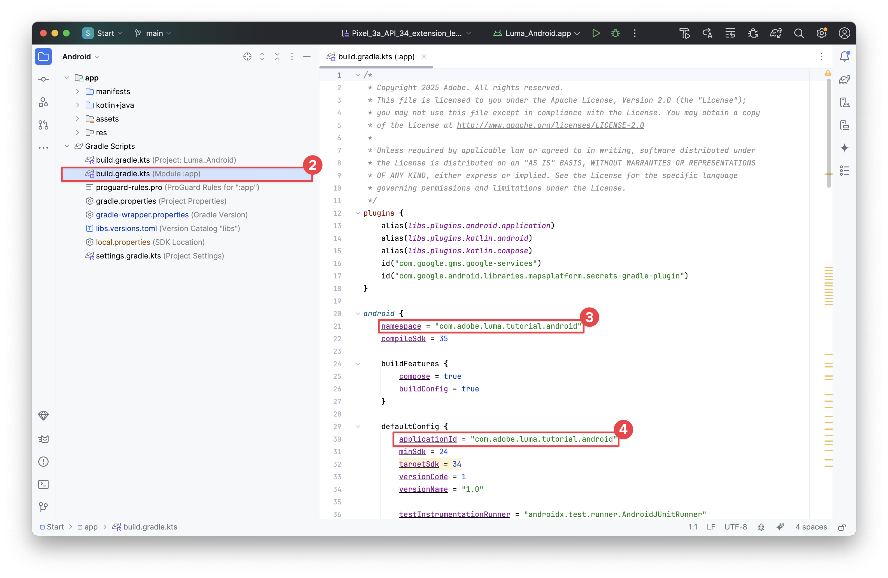
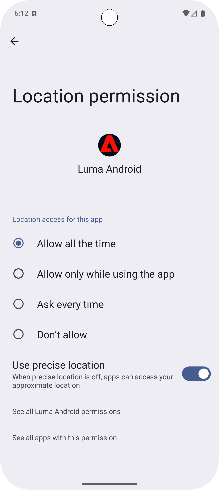
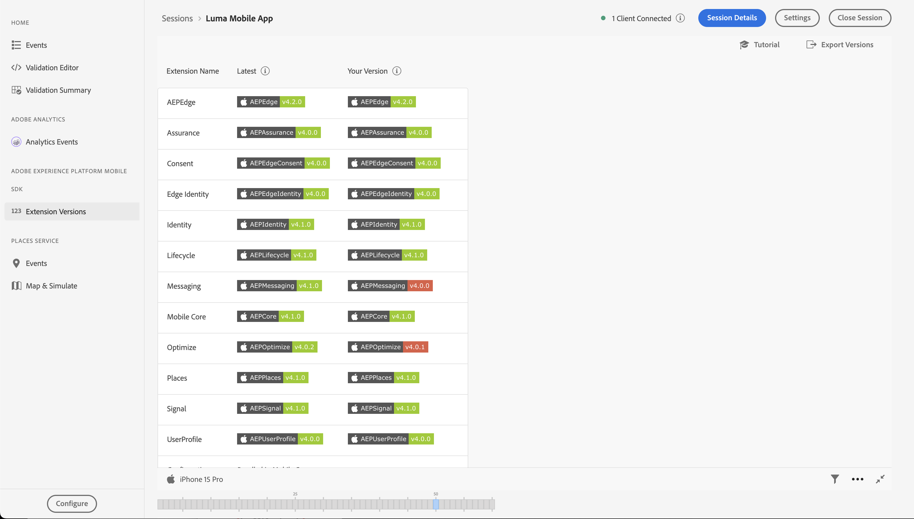

# 設定Assurance

瞭解如何在行動應用程式中設定Adobe Experience Platform Assurance。

Assurance （正式名稱為Project Griffon）可協助您檢查、證明、模擬及驗證如何在行動應用程式中收集資料或提供體驗。

Assurance 可協助您檢查 Adobe Experience Platform Mobile SDK 產生的原始 SDK 事件。SDK 收集的所有事件都可供檢查。SDK 事件會載入清單檢視，並依時間排序。每個事件都有一個可提供更多詳細資料的詳細檢視。此外，也提供可瀏覽SDK設定、資料元素、共用狀態和SDK擴充功能版本的其他檢視。 在產品檔案中進一步瞭解[Assurance](https://experienceleague.adobe.com/zh-hant/docs/experience-platform/assurance/home)。


## 先決條件

* 已成功安裝並設定SDK以設定應用程式。

## 學習目標

在本課程中，您將會：

* 確認您的組織擁有存取權（如果您沒有存取權，請提出要求）。
* 設定您的基底URL。
* 新增必要的iOS特定程式碼。
* 連線到工作階段。

## 確認存取

確認您的組織有權存取Assurance。 您身為使用者，應新增至Adobe Experience Platform的設定檔。 如需詳細資訊，請參閱Assurance指南中的[使用者存取權](https://experienceleague.adobe.com/en/docs/experience-platform/assurance/user-access)。

## 實作

若要在應用程式中實施Assurance：

>[!BEGINTABS]

>[!TAB iOS]

除了一般[SDK安裝](install-sdks.md)之外，iOS還需要下列額外程式碼，才能為您的應用程式啟動Assurance工作階段。

1. 導覽至Xcode專案導覽器中的&#x200B;**[!DNL Luma]** > **[!DNL Luma]** > **[!UICONTROL SceneDelegate]**。

1. 將下列程式碼新增至 `func scene(_ scene: UIScene, openURLContexts URLContexts: Set<UIOpenURLContext>`:

   ```swift
   // Called when the app in background is opened with a deep link.
   if let deepLinkURL = URLContexts.first?.url {
       // Start the Assurance session
       Assurance.startSession(url: deepLinkURL)
   }
   ```

   當應用程式於背景並使用深層連結開啟時，此程式碼就會啟動保證工作階段。

>[!TAB Android]

除了一般[SDK安裝](install-sdks.md)之外，Android還需要下列額外程式碼，才能為您的應用程式啟動Assurance工作階段。

1. 在Android Studio中，以&#x200B;**[!UICONTROL Android]**&#x200B;檢視導覽至&#x200B;**[!UICONTROL 應用程式]** > **[!UICONTROL kotlin+java]** > **[!UICONTROL com.adobe.luma.tutorial.android]** > **[!UICONTROL LumaApplication]**。

1. 將下列程式碼新增至 `fun handleDeeplink(deeplink: String?)`:

   ```kotlin
   // Called when the app in background is opened with a deep link.
   if (deeplink.isNullOrEmpty()) {
      Log.w("Luma", "Deeplink is null or empty")
      return
   }
   
   Log.i("Luma", "Handling deeplink: $deeplink")
   Assurance.startSession(deeplink)
   ```

   當應用程式於背景並使用深層連結開啟時，此程式碼就會啟動保證工作階段。

>[!ENDTABS]


如需詳細資訊，請參閱[Assurance API參考](https://developer.adobe.com/client-sdks/documentation/platform-assurance-sdk/api-reference/){target="_blank"}。


## 定義套件組合識別碼

您必須提供應用程式的唯一套件組合識別碼。

>[!BEGINTABS]

>[!TAB iOS]

1. 在Xcode中開啟專案。
1. 在專案導覽器中選取&#x200B;**[!DNL Luma]**。
1. 選取&#x200B;**[!DNL Luma]**&#x200B;目標。
1. 選取「**簽署與功能**」標籤。
1. 定義&#x200B;**[!UICONTROL 組合識別碼]**。

請確定您使用&#x200B;_唯一_&#x200B;組合識別碼並取代`com.adobe.luma.tutorial.swiftui`組合識別碼，因為每個組合識別碼必須是唯一的。 一般而言，您會使用反向DNS格式作為套件組合ID字串，例如`com.organization.brand.uniqueidentifier`。 例如，此教學課程的完成版本使用`com.adobe.luma.tutorial.swiftui`。

{zoomable="yes"}

>[!TAB Android]

1. 在Android Studio中開啟專案。
1. 在導覽器中選取&#x200B;**[!UICONTROL build.gradle.kts （模組:app）]**。
1. 確定您使用&#x200B;_唯一_&#x200B;組合識別碼，並在`com.adobe.luma.tutorial.android`中取代`namespace`的`android`值
1. 確定您使用相同的&#x200B;_唯一_&#x200B;組合識別碼，並在`com.adobe.luma.tutorial.android`中為`applicationId`中的`defaultConfig`取代`android`

一般而言，您會使用反向DNS格式作為套件組合ID字串，例如`com.organization.brand.uniqueidentifier`。 例如，此教學課程的完成版本使用`com.adobe.luma.tutorial.android`。

{zoomable="yes"}{zoomable="yes"}

>[!ENDTABS]


## 設定基礎URL

您必須設定基底URL，以確保深層連結可正常運作。

>[!BEGINTABS]

>[!TAB iOS]

1. 前往Xcode中的專案。
1. 在專案導覽器中選取&#x200B;**[!DNL Luma]**。
1. 選取&#x200B;**[!DNL Luma]**&#x200B;目標。
1. 選取&#x200B;**資訊**&#x200B;索引標籤。
1. 若要新增基底URL，請向下捲動至&#x200B;**URL型別**&#x200B;並選取&#x200B;**+**&#x200B;按鈕。
1. 將&#x200B;**識別碼**&#x200B;設定為您選擇的組合識別碼，並設定您選擇的&#x200B;**URL配置**。

   {zoomable="yes"}

請確定您使用&#x200B;_唯一_&#x200B;組合識別碼並取代`com.adobe.luma.tutorial.swiftui`組合識別碼，因為每個組合識別碼必須是唯一的。 一般而言，您會使用反向DNS格式作為套件組合ID字串，例如`com.organization.brand.uniqueidentifier`。 您可以使用您在[定義組合識別碼](#define-bundle-identifier)中使用的相同組合識別碼。<br/>同樣地，使用唯一的URL配置，並以您唯一的URL配置取代已經提供的`lumatutorialswiftui`。

若要進一步瞭解iOS中的URL配置，請檢閱[Apple的檔案](https://developer.apple.com/documentation/xcode/defining-a-custom-url-scheme-for-your-app){target="_blank"}。

Assurance的運作方式是透過瀏覽器或QR碼開啟URL。 該URL以基礎URL開頭，此URL會開啟應用程式並包含其他引數。 這些唯一引數用於連線工作階段。 在範例應用程式中，深層連結為`lumatutorialswiftui://`。

>[!TAB Android]

1. 移至Android Studio中專案的&#x200B;**[!UICONTROL Android]**&#x200B;檢視。
1. 在導覽器中選取&#x200B;**[!UICONTROL 應用程式]** > **[!UICONTROL 資訊清單]** > **[!UICONTROL AndroidManifest.xml]**。
1. 確定&#x200B;**[!UICONTROL 資訊清單]** > **[!UICONTROL 應用程式]** > **[!UICONTROL 活動]** XML專案看起來像這樣：

   ```xml
   <activity
      android:name=".MainActivity"
      android:exported="true"
      android:theme="@style/Theme.LumaAndroid">
      <intent-filter>
            <action android:name="android.intent.action.MAIN" />
            <category android:name="android.intent.category.LAUNCHER" />
      </intent-filter>
      <intent-filter
            android:label="@string/app_name">
            <action android:name="android.intent.action.VIEW" />
            <category android:name="android.intent.category.DEFAULT" />
            <category android:name="android.intent.category.BROWSABLE" />
            <data android:scheme="lumatutorialandroid"
               android:host="default" />
      </intent-filter>
   </activity>
   ```

請確定您指定了`android:scheme` (例如。 `lumatutorialandroid`)和`android:host` （例如`default`）以定義基底URL。

若要進一步瞭解Android中的深層連結，請參閱Android檔案中的[建立深層連結](https://developer.android.com/training/app-links/create-deeplinks){target="_blank"}。

Assurance的運作方式是透過瀏覽器或QR碼開啟URL。 該URL以基礎URL開頭，開啟App並包含其他引數。 這些唯一引數用於連線工作階段。  在範例應用程式中，深層連結為`lumatutorialandroid://default`。

>[!ENDTABS]


## 連線到工作階段

您現在可以使用Assurance連線至工作階段。

>[!BEGINTABS]

>[!TAB iOS]

在Xcode中：

1. 使用，在模擬器中或在Xcode的實體裝置上建置或重建並執行應用程式。

   您可選擇是否要&#x200B;*清除*&#x200B;您的組建，尤其是當您看到非預期的結果時。 從Xcode **[!UICONTROL Product]**&#x200B;功能表選取&#x200B;**[!UICONTROL 清除組建資料夾……]**。


1. 在&#x200B;**[!UICONTROL 允許[Luma應用程式]使用您的位置]**&#x200B;對話方塊中，選取&#x200B;**[!UICONTROL 使用應用程式時允許]**。

   

1. 在&#x200B;**[!UICONTROL 「Luma應用程式」想要傳送通知]**&#x200B;對話方塊中，選取&#x200B;**[!UICONTROL 允許]**。

   

1. 選取&#x200B;**[!UICONTROL 繼續……]**&#x200B;以允許應用程式追蹤您的活動。

   

1. 在&#x200B;**[!UICONTROL 允許[Luma應用程式]追蹤其他公司應用程式和網站]**&#x200B;對話方塊中，選取&#x200B;**[!UICONTROL 允許]**。

   

1. 選取&#x200B;**[!UICONTROL 繼續]**。


在您的瀏覽器中：

1. 前往資料收集UI。
1. 從左側邊欄選取&#x200B;**[!UICONTROL Assurance]**。
1. 選取&#x200B;**[!UICONTROL 建立新工作階段]**，然後選取&#x200B;**[!UICONTROL 深層連結連線]**。
1. 選取&#x200B;**[!UICONTROL 開始]**。
1. 提供&#x200B;**[!UICONTROL 工作階段名稱]**，例如`Luma Mobile App Session`和&#x200B;**[!UICONTROL 基底URL]**，這是您在Xcode中輸入的URL配置，後面接著`://`，例如： `lumatutorialswiftui://`
1. 選取&#x200B;**[!UICONTROL 下一步]**。
   {zoomable="yes"}
1. 在&#x200B;**[!UICONTROL 建立新工作階段]**&#x200B;模型對話方塊中：

   如果您使用實體裝置：

   * 選取&#x200B;**[!UICONTROL 掃描QR碼]**。 若要開啟應用程式，請使用實體裝置上的相機掃描二維碼並點選連結。

     {zoomable="yes"}

   如果您使用模擬器：

   1. 選取&#x200B;**[!UICONTROL 複製連結]**。
   1. 使用複製深層連結，並使用深層連結在模擬器中使用Safari開啟應用程式。
      {zoomable="yes"}

1. 應用程式載入時，畫面會顯示強制回應對話方塊，要求您輸入步驟7顯示的PIN。

   

   輸入PIN並選取&#x200B;**[!UICONTROL 連線]**。


1. 如果連線成功，您會看到：
   * 浮動在應用程式上方的Assurance圖示。

     

   * Experience Cloud更新會在Assurance UI中傳入，顯示：

      1. 來自應用程式的體驗事件。
      1. 所選事件的詳細資料。
      1. 裝置和時間表。

         {zoomable="yes"}

1. 選取&#x200B;**[!UICONTROL 繼續]**&#x200B;以移至主畫面。

>[!TAB Android]

在Android Studio中：

1. 使用，在模擬器中或在Android Studio的實體裝置上建置或重建並執行應用程式。

   您可選擇是否要&#x200B;*清除*&#x200B;您的組建，尤其是當您看到非預期的結果時。 從Android Studio **[!UICONTROL 建置]**&#x200B;功能表選取&#x200B;**[!UICONTROL 清除專案]**。


1. 在&#x200B;**[!UICONTROL 允許Luma Android傳送通知]**&#x200B;對話方塊中，選取&#x200B;**[!UICONTROL 允許]**。

   

1. 選取&#x200B;**[!UICONTROL 顯示許可權對話方塊]**。

   

1. 在&#x200B;**[!UICONTROL 允許Luma Android存取此裝置的位置？]**...

   

   * 選取&#x200B;**[!UICONTROL 精確]**。
   * 使用應用程式&#x200B;**[!UICONTROL 時選取]**。

1. 回到簡介應用程式畫面，選取&#x200B;**[!UICONTROL 開啟裝置設定]**。

1. 在&#x200B;**[!UICONTROL 位置許可權]**&#x200B;畫面中，選取&#x200B;**[!UICONTROL 允許所有時間]**。 然後選取&#x200B;**[!UICONTROL ←]**&#x200B;以返回介紹應用程式畫面。

   

1. 選取&#x200B;**[!UICONTROL 繼續]**&#x200B;以移至主畫面。


在您的瀏覽器中：

1. 前往資料收集UI。
1. 從左側邊欄選取&#x200B;**[!UICONTROL Assurance]**。
1. 選取&#x200B;**[!UICONTROL 建立新工作階段]**，然後選取&#x200B;**[!UICONTROL 深層連結連線]**。
1. 選取&#x200B;**[!UICONTROL 開始]**。
1. 提供&#x200B;**[!UICONTROL 工作階段名稱]**，例如`Luma Mobile App Session`和&#x200B;**[!UICONTROL 基底URL]**，這是您在Android Studio的`android:scheme`AndroidManifest.xml`android:host`中定義的&#x200B;**[!UICONTROL 和]**，以`://`分隔。例如： `lumatutorialandroid://default`
1. 選取&#x200B;**[!UICONTROL 下一步]**。
   {zoomable="yes"}

1. 在&#x200B;**[!UICONTROL 建立新工作階段]**&#x200B;模型對話方塊中：

   如果您使用實體裝置：

   * 選取&#x200B;**[!UICONTROL 掃描QR碼]**。 若要開啟應用程式，請使用實體裝置上的相機掃描二維碼並點選連結。

     {zoomable="yes"}

   如果您使用模擬器：

   1. 選取&#x200B;**[!UICONTROL 複製連結]**。
   1. 使用來複製深層連結，並使用深層連結在模擬器中透過Chrome開啟應用程式。

   {zoomable="yes"}

   在Chrome中提示&#x200B;**繼續使用Luma Android**&#x200B;時，請選取&#x200B;**繼續**。

1. 應用程式載入時，畫面會顯示強制回應對話方塊，要求您輸入步驟7顯示的PIN。

   

   輸入PIN並選取&#x200B;**[!UICONTROL 連線]**。


1. 如果連線成功，您會看到：
   * 浮動在應用程式上方的Assurance圖示。

     

   * Experience Cloud更新會在Assurance UI中傳入，顯示：

      1. 來自應用程式的體驗事件。
      1. 所選事件的詳細資料。
      1. 裝置和時間表。

         {zoomable="yes"}

>[!ENDTABS]

如果您遇到任何挑戰，請檢閱[技術](https://developer.adobe.com/client-sdks/documentation/platform-assurance-sdk/){target="_blank"}和[一般檔案](https://experienceleague.adobe.com/zh-hant/docs/experience-platform/assurance/home){target="_blank"}。


## 驗證擴充功能

若要確認您的應用程式是否使用最新的擴充功能：

1. 選取&#x200B;**[!UICONTROL 設定]**。

1. 選取 的&#x200B;**[!UICONTROL 新增]**。

1. 選取「**[!UICONTROL 儲存]**」。

   {zoomable="yes"}

1. 選取 **[!UICONTROL 擴充功能版本]**，以檢視最新可用擴充功能的概觀，以及您應用程式版本中使用的擴充功能。

>[!BEGINTABS]

>[!TAB iOS]

{zoomable="yes"}

若要更新您的擴充功能版本（例如，**[!UICONTROL 傳訊]**&#x200B;與&#x200B;**[!UICONTROL 最佳化]**），請從&#x200B;**[!UICONTROL 封裝相依性]** （例如，**[!UICONTROL AEPMessaging]**）選取封裝（擴充功能），然後從內容功能表選取&#x200B;**[!UICONTROL 更新封裝]**。 Xcode會更新套件相依性。

>[!TAB Android]

{zoomable="yes"}

如果您看到過時的擴充功能，請參閱[Android Studio檔案](https://developer.android.com/build/agp-upgrade-assistant)，瞭解如何更新專案的相依性模組。


>[!ENDTABS]

>[!NOTE]
>
>更新開發環境中的擴充功能（套件）後，請關閉並刪除目前的工作階段，並重複從[連線至工作階段](#connecting-to-a-session)和[驗證擴充功能](#verify-extensions)的所有步驟，以確保Assurance在新的Assurance工作階段中正確報告正確的擴充功能。
>


>[!SUCCESS]
>
>您現在已經設定好應用程式，好在教學課程的其餘部分使用Assurance。
>
>感謝您花時間學習Adobe Experience Platform Mobile SDK。 如果您有疑問、想分享一般意見或有關於未來內容的建議，請在這篇[Experience League社群討論貼文](https://experienceleaguecommunities.adobe.com/t5/adobe-experience-platform-data/tutorial-discussion-implement-adobe-experience-cloud-in-mobile/td-p/443796)上分享


下一個： **[實作同意](consent.md)**
