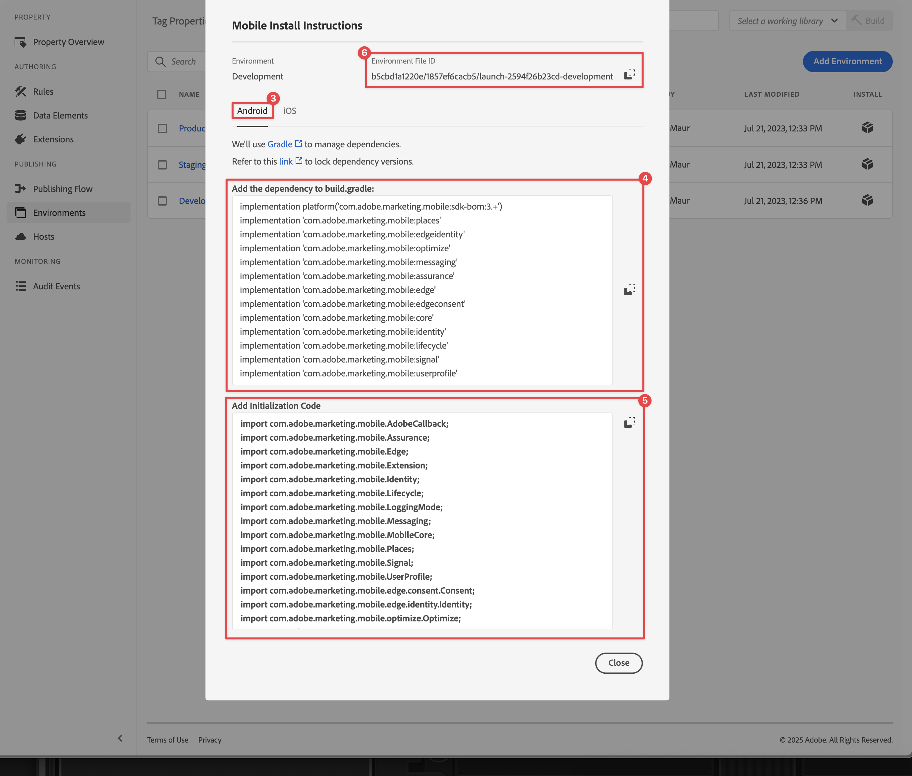

# 設定標籤屬性

了解如何在[!UICONTROL 資料收集]介面中設定標記屬性。

Adobe Experience Platform中的標籤是新一代Adobe標籤管理功能。 標籤可讓客戶透過簡單的方式部署及管理必要的分析、行銷及廣告標籤功能，以便支援相關客戶體驗。 在產品檔案中進一步瞭解[標籤](https://experienceleague.adobe.com/zh-hant/docs/experience-platform/tags/home)。

## 先決條件

若要完成課程，您必須擁有建立標籤屬性的許可權。 此外，對於標籤有基本的瞭解也會很有幫助。

>[!NOTE]
>
> Platform Launch （使用者端）現在是[標籤](https://experienceleague.adobe.com/zh-hant/docs/experience-platform/tags/home)

## 學習目標

在本課程中，您將會：

* 安裝並設定行動標籤擴充功能。
* 產生SDK安裝指示。

## 初始設定

1. 在資料收集介面中建立新的行動標籤屬性：
   1. 在左側導覽中選取&#x200B;**[!UICONTROL 標籤]**。
   1. 選取&#x200B;**[!UICONTROL 新屬性]**
      {zoomable="yes"}。
   1. 對於&#x200B;**[!UICONTROL 名稱]**，請輸入`Luma Mobile App Tutorial`。
   1. 針對&#x200B;**[!UICONTROL 平台]**，選取&#x200B;**[!UICONTROL 行動裝置]**。
   1. 選取&#x200B;**[!UICONTROL 儲存]**。

      {zoomable="yes"}

      >[!NOTE]
      >
      > 邊緣式Mobile SDK實作的預設同意設定（例如您在本課程中正在執行的設定）來自[!UICONTROL 同意擴充功能]，而非標籤屬性設定中的[!UICONTROL 隱私權]設定。 您可在本課程稍後的章節中新增並設定同意擴充功能。 如需詳細資訊，請參閱[檔案](https://developer.adobe.com/client-sdks/edge/consent-for-edge-network/)。

1. 開啟新屬性。
1. 建立程式庫：

   1. 前往左側導覽中的&#x200B;**[!UICONTROL 發佈流程]**。
   1. 選取&#x200B;**[!UICONTROL 新增資料庫]**。

      {zoomable="yes"}

   1. 對於&#x200B;**[!UICONTROL 名稱]**，請輸入`Initial Build`。
   1. 針對&#x200B;**[!UICONTROL 環境]**，選取&#x200B;**[!UICONTROL 開發（開發）]**。
   1. 選取 **[!UICONTROL 新增所有變更的資源]**。
   1. 選取&#x200B;**[!UICONTROL 儲存並建置到開發]**。

      {zoomable="yes"}

   1. 最後，從&#x200B;**[!UICONTROL 選取工作程式庫]**&#x200B;功能表中選取&#x200B;**[!UICONTROL 初始組建]**&#x200B;作為工作程式庫。
      {zoomable="yes"}
1. 檢查擴充功能：

   1. 請確定已選取&#x200B;**[!UICONTROL 初始組建]**&#x200B;作為預設程式庫。

   1. 在左側邊欄中選取&#x200B;**[!UICONTROL 擴充功能]**。

   1. 選取「**[!UICONTROL 已安裝]**」標籤。

      應預先安裝[!UICONTROL 行動核心]和[!UICONTROL 設定檔]擴充功能。

      已安裝{zoomable="yes"}

## 擴充功能組態

1. 確定您位於行動應用程式屬性內的&#x200B;**[!UICONTROL 擴充功能]**&#x200B;中。

1. 選取&#x200B;**[!UICONTROL 目錄]**。

   {zoomable="yes"}

1. 使用 **[!UICONTROL 搜尋]**&#x200B;欄位尋找&#x200B;**身分**&#x200B;延伸模組。

   1. 搜尋`Identity`。

   2. 選取&#x200B;**[!UICONTROL 身分識別]**&#x200B;延伸模組。

   3. 選取&#x200B;**[!UICONTROL 安裝]**。

      {zoomable="yes"}

   此擴充功能不需要任何進一步的設定。

1. 使用 **[!UICONTROL 搜尋]**&#x200B;欄位來尋找並安裝&#x200B;**AEP Assurance**&#x200B;擴充功能。

   此擴充功能不需要任何進一步的設定。

1. 使用 **[!UICONTROL 搜尋]**&#x200B;欄位來尋找並安裝&#x200B;**同意**&#x200B;延伸模組。 在設定畫面中：

   1. 選取&#x200B;**[!UICONTROL 擱置中]**。 在本教學課程中，您進一步在應用程式中管理同意。 在[檔案](https://developer.adobe.com/client-sdks/documentation/consent-for-edge-network/)中進一步瞭解同意延伸。
   1. 選取&#x200B;**[!UICONTROL 儲存至資料庫]**。

      {zoomable="yes"}

1. 使用 **[!UICONTROL 搜尋]**&#x200B;欄位來尋找並安裝&#x200B;**Adobe Experience Platform Edge Network**&#x200B;擴充功能。

   1. 在&#x200B;**[!UICONTROL 資料串流]**&#x200B;中，選取您在&#x200B;**[!UICONTROL 前一個步驟]**&#x200B;中為每個環境建立的[資料串流](create-datastream.md)，例如&#x200B;**[!DNL Luma Mobile App]**。

   1. 如果尚未填入，請在&#x200B;**[!UICONTROL 網域設定]**&#x200B;中指定&#x200B;**[!UICONTROL Edge Network網域]**。 Edge Network網域是您組織的名稱，後面接著`data.adobedc.net`，例如`techmarketingdemos.data.adobedc.net`。

   1. 從&#x200B;**[!UICONTROL 儲存至程式庫]**&#x200B;功能表，選取&#x200B;**[!UICONTROL 儲存至程式庫並建置]**。

      {zoomable="yes"}

您的程式庫是針對新的擴充功能和設定所建置。 ●初始組建&#x200B;**[!UICONTROL 按鈕中的]**&#x200B;表示組建成功。

## 產生SDK安裝指示

標籤會提供指示和程式碼片段，讓您在應用程式中安裝Adobe Experience Platform Mobile SDK。

>[!BEGINTABS]

>[!TAB iOS]

1. 從左側邊欄選取&#x200B;**[!UICONTROL 環境]**。

1. 選取&#x200B;**[!UICONTROL 開發]**&#x200B;安裝圖示。

   {zoomable="yes"}

1. 在&#x200B;**[!UICONTROL 行動安裝指示]**&#x200B;對話方塊中，選取&#x200B;**[!UICONTROL iOS]**&#x200B;索引標籤。

1. 您可以複製指示，以使用CocoaPods設定您的專案。 CocoaPods可用來管理SDK版本和下載。 若要深入瞭解，請檢閱[CocoaPods檔案](https://cocoapods.org/)。

   [安裝指示](https://developer.adobe.com/client-sdks/documentation/getting-started/get-the-sdk/)提供您實作的良好起點。

   在本教學課程的其餘部分中，您&#x200B;**不是**&#x200B;使用CocoaPods指示。 您改用原生Swift Package Manager (SPM)型設定。

1. 選取&#x200B;**[!UICONTROL 新增初始化程式碼]**&#x200B;下方的&#x200B;**[!UICONTROL Swift]**&#x200B;索引標籤。 此程式碼區塊說明如何匯入必要的SDK並在啟動時註冊擴充功能。 [安裝SDK](install-sdks.md)會更詳細地說明此匯入和註冊。

1. 複製 **[!UICONTROL 環境檔案ID]**，並視需要將其儲存在適當位置。 此唯一ID會指向您的開發環境。 每個環境（生產、測試、開發）都有各自的唯一ID值。

   {zoomable="yes"}

>[!TAB Android]

1. 從左側邊欄選取&#x200B;**[!UICONTROL 環境]**。
1. 選取&#x200B;**[!UICONTROL 開發]**&#x200B;安裝圖示。

   {zoomable="yes"}

1. 在&#x200B;**[!UICONTROL 行動安裝指示]**&#x200B;對話方塊中，選取&#x200B;**[!UICONTROL Android]**&#x200B;索引標籤。
1. 您可以複製使用Gradle設定專案的指示。 Gradle可用來管理SDK版本和下載專案。 若要深入瞭解，請檢閱[Gradle檔案](https://gradle.org/)

   [安裝指示](https://developer.adobe.com/client-sdks/documentation/getting-started/get-the-sdk/)提供您實作的良好起點。

1. 此程式碼區塊說明如何匯入必要的SDK並在啟動時註冊擴充功能。 [安裝SDK](install-sdks.md)會更詳細地說明此匯入和註冊。

1. 複製 **[!UICONTROL 環境檔案ID]**，並視需要將其儲存在適當位置。 此唯一ID會指向您的開發環境。 每個環境（生產、測試、開發）都有各自的唯一ID值。

   {zoomable="yes"}

>[!ENDTABS]

>[!NOTE]
>
>應將安裝指示視為起點，而非最終檔案。 您可以在官方[檔案](https://developer.adobe.com/client-sdks/home/)中找到最新的SDK版本和程式碼範例。

## 行動標籤架構

如果您熟悉Tags的網頁版本（前身為Launch），瞭解行動裝置上的差異很重要。

* 在Web上，標籤屬性會呈現到JavaScript中，然後（通常）託管在雲端中。 該JavaScript檔案會在網站中直接參照。

* 在行動標籤屬性中，規則和設定會轉譯為雲端託管的JSON檔案。 JSON檔案會由行動應用程式中的行動核心擴充功能下載和讀取。 擴充功能是不同的SDK，可共同運作。 如果您將擴充功能新增至標籤屬性，也必須更新應用程式。 如果您變更擴充功能設定或建立規則，當您發佈更新的標籤庫時，應用程式會反映這些變更。 這種靈活性可讓您修改設定(例如Adobe Analytics報表套裝ID)。 您甚至可以變更應用程式的行為（使用資料元素和規則，如同您於稍後課程中所見），而不需變更應用程式中的程式碼並重新提交至應用程式商店。

>[!SUCCESS]
>
>您現在擁有行動標籤屬性，可在本教學課程的其餘部分使用。
>
>感謝您花時間學習Adobe Experience Platform Mobile SDK。 如果您有疑問、想分享一般意見或有關於未來內容的建議，請在這篇[Experience League社群討論貼文](https://experienceleaguecommunities.adobe.com/t5/adobe-experience-platform-data/tutorial-discussion-implement-adobe-experience-cloud-in-mobile/td-p/443796)上分享

下一步： **[安裝SDK](install-sdks.md)**
