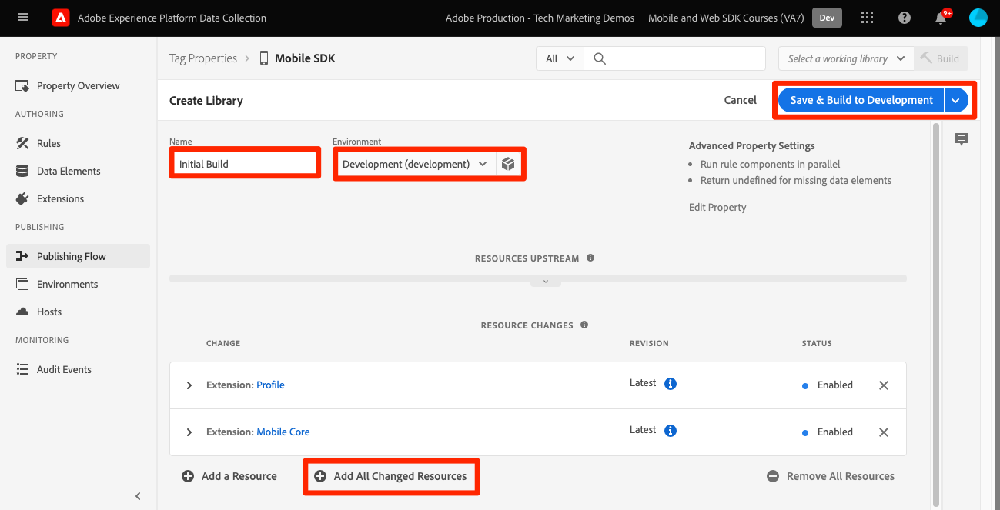

# 設定標籤屬性

瞭解如何在中設定標籤屬性 [!UICONTROL 資料彙集] 介面。

Adobe Experience Platform 標記是新一代 Adobe 標記管理功能。標記可讓客戶透過簡單的方式部署及管理所有必要的分析、行銷及廣告標記功能，以強化相關客戶體驗。進一步瞭解 [標籤](https://experienceleague.adobe.com/docs/experience-platform/tags/home.html) 產品檔案內。

## 先決條件

若要完成課程，您必須有建立標籤屬性的許可權。 對於標籤有基本的瞭解也會很有幫助。

>[!NOTE]
>
> platform launch（使用者端）現在為 [標籤](https://experienceleague.adobe.com/docs/experience-platform/tags/home.html?lang=zh-Hant)

## 學習目標

在本課程中，您將會：

* 安裝並設定行動標籤擴充功能。
* 產生SDK安裝指示。

## 初始設定

1. 建立新的行動標籤屬性：
   1. 在 [資料收集介面](https://experience.adobe.com/data-collection/){target="_blank"}，選取 **[!UICONTROL 標籤]** 在左側導覽列中
   1. 選取 **[!UICONTROL 新增屬性]**

      .
   1. 對於 **[!UICONTROL 名稱]**，輸入 `Mobile SDK Course`.
   1. 對於 **[!UICONTROL Platform]**，選取 **[!UICONTROL 行動]**.
   1. 選取「**[!UICONTROL 儲存]**」。

      

      >[!NOTE]
      >
      > 邊緣型行動sdk實作（例如您在本教學課程中執行的實作）的預設同意設定來自 [!UICONTROL 同意擴充功能] 而非 [!UICONTROL 隱私權] 標籤屬性設定中的設定。 您稍後將在本課程中新增並設定同意擴充功能。 如需詳細資訊，請參閱 [說明檔案](https://developer.adobe.com/client-sdks/documentation/privacy-and-gdpr/).

1. 開啟新屬性
1. 建立程式庫:

   1. 前往 **[!UICONTROL 發佈流程]** 左側導覽列中。
   1. 選取 **[!UICONTROL 新增程式庫]**.

      

   1. 對於 **[!UICONTROL 名稱]**，輸入 `Initial Build`.
   1. 對於 **[!UICONTROL 環境]**，選取 **[!UICONTROL 開發]**.
   1. 選取  **[!UICONTROL 新增所有變更的資源]**.
   1. 選取 **[!UICONTROL 儲存並建置到開發環境]**.

      

   1. 最後，請將其設定為您的 **[!UICONTROL 工作程式庫]**.
      
1. 選取 **[!UICONTROL 擴充功能]**.

   行動核心和設定檔擴充功能應已預先安裝。

1. 選取 **[!UICONTROL 目錄]**.

   

1. 使用 [!UICONTROL 搜尋] 功能，以尋找並安裝下列擴充功能。 這些擴充功能都不需要任何設定：
   * 身分
   * AEP保證

## 擴充功能組態

1. 安裝 **同意** 副檔名。

   在本教學課程中，請選取 **[!UICONTROL 擱置中]**. 進一步瞭解「同意」擴充功能，請參見 [說明檔案](https://developer.adobe.com/client-sdks/documentation/consent-for-edge-network/).

   

1. 安裝 **Adobe Experience Platform邊緣網路** 副檔名。

   在 **[!UICONTROL Edge設定]** 下拉式清單，選取您在中建立的資料流 [上一步](create-datastream.md).

1. 選取 **[!UICONTROL 儲存至程式庫並建置]**.

   

## 產生SDK安裝指示

1. 選取 **[!UICONTROL 環境]**.

1. 選取 **[!UICONTROL 開發]** 安裝圖示。

   

1. 選取 **[!UICONTROL iOS]**.

1. 選取 **[!UICONTROL Swift]**.

   

1. 安裝指示提供您實作的良好起點。

   您可以找到其他資訊 [此處](https://developer.adobe.com/client-sdks/documentation/getting-started/get-the-sdk/).

   * **[!UICONTROL 環境檔案ID]**：此唯一ID會指向您的開發環境，請記下此值。 生產/測試/開發都具有不同的ID值。
   * **[!UICONTROL Podfile]**：CocoaPods可用來管理SDK版本和下載。 若要進一步瞭解，請檢閱 [檔案](https://cocoapods.org/).
   * **[!UICONTROL 初始化程式碼]**：此程式碼區塊顯示如何匯入必要的SDK並在啟動時註冊擴充功能。

>[!NOTE]
>應將安裝指示視為起點，而非最終檔案。 您可以在官方網站找到最新的SDK版本和程式碼範例 [檔案](https://developer.adobe.com/client-sdks/documentation/).

## 行動標籤架構

如果您熟悉標籤（前身為Launch）的網頁版本，瞭解行動裝置上的差異很重要。

在Web上，標籤屬性會轉譯為JavaScript，然後（通常）在雲端中託管。 該JS檔案會直接在網站中參照。

在行動標籤屬性中，規則和設定會演算為雲端託管的JSON檔案。 JSON檔案會由行動應用程式中的行動核心擴充功能下載和讀取。 擴充功能是不同的SDK，可共同運作。 如果您將擴充功能新增至標籤屬性，也必須更新應用程式。 如果您變更擴充功能設定或建立規則，當您發佈更新的標籤庫後，這些變更會反映在應用程式中。

下一步： **[安裝SDK](install-sdks.md)**

>[!NOTE]
>
>感謝您投入時間學習Adobe Experience Platform Mobile SDK。 若您有任何疑問、想分享一般意見或對未來內容有任何建議，請在此分享這些內容 [Experience League社群討論貼文](https://experienceleaguecommunities.adobe.com/t5/adobe-experience-platform-launch/tutorial-discussion-implement-adobe-experience-cloud-in-mobile/td-p/443796)