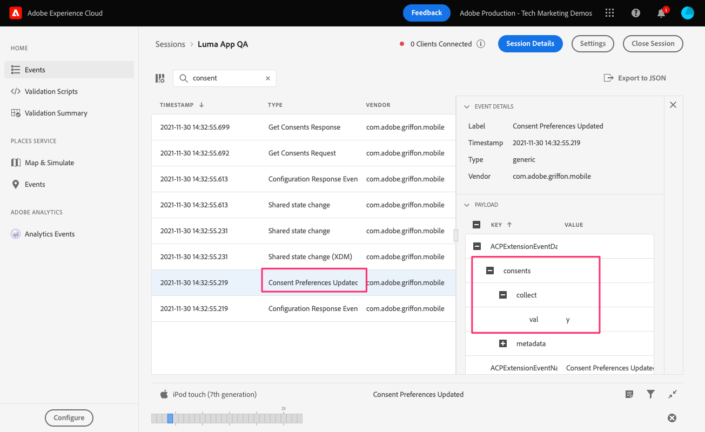

# 同意

了解如何在行動應用程式中實作同意。

使用Adobe Experience Platform Mobile SDK和Edge Network擴充功能時，Adobe Experience Platform同意行動擴充功能會啟用從行動應用程式收集同意偏好設定。 深入了解 [同意擴充功能](https://aep-sdks.gitbook.io/docs/foundation-extensions/consent-for-edge-network)，在檔案中。

## 先決條件

* 已安裝並設定SDK，成功建立並執行應用程式。

## 學習目標

在本課程中，您將：

* 提示使用者同意。
* 根據使用者回應更新擴充功能。
* 了解如何取得目前的同意狀態。

## 要求同意

如果您從頭開始遵循本教學課程，您將記得在 **[!UICONTROL 預設同意層級]** 改為「待定」。 若要開始收集資料，您必須取得使用者的同意。 在本教學課程中，只要在實際應用程式中發出警報並詢問您希望諮詢所在地區同意的最佳實務，即可取得同意。

1. 您只想詢問使用者一次。 要管理這一點，一個簡單的方法就是 `UserDefaults`.
1. 導覽至 `Home.swift`。
1. 將下列程式碼新增至 `viewDidLoad()`.

   ```swift
   let defaults = UserDefaults.standard
   let consentKey = "askForConsentYet"
   let hidePopUp = defaults.bool(forKey: consentKey)
   ```

1. 如果使用者以前沒有看到警報，請顯示警報並根據其回應更新同意。 將下列程式碼新增至 `viewDidLoad()`.

   ```swift
   if(hidePopUp == false){
       //Consent Alert
       let alert = UIAlertController(title: "Allow Data Collection?", message: "Selecting Yes will begin data collection", preferredStyle: .alert)
       alert.addAction(UIAlertAction(title: "Yes", style: .default, handler: { action in
           //Update Consent -> "yes"
           let collectConsent = ["collect": ["val": "y"]]
           let currentConsents = ["consents": collectConsent]
           Consent.update(with: currentConsents)
           defaults.set(true, forKey: consentKey)
       }))
       alert.addAction(UIAlertAction(title: "No", style: .cancel, handler: { action in
           //Update Consent -> "no"
           let collectConsent = ["collect": ["val": "n"]]
           let currentConsents = ["consents": collectConsent]
           Consent.update(with: currentConsents)
           defaults.set(true, forKey: consentKey)
       }))
       self.present(alert, animated: true)
   }
   ```


## 取得目前的同意狀態

「同意」行動擴充功能會根據目前的同意值自動隱藏/附加/允許追蹤。 您也可以自行存取目前的同意狀態：

1. 導覽至 `Home.swift`。
1. 將下列程式碼新增至 `viewDidLoad()`.

```swift
Consent.getConsents{ consents, error in
    guard error == nil, let consents = consents else { return }
    guard let jsonData = try? JSONSerialization.data(withJSONObject: consents, options: .prettyPrinted) else { return }
    guard let jsonStr = String(data: jsonData, encoding: .utf8) else { return }
    print("Consent getConsents: ",jsonStr)
}
```

在上述範例中，您只需將同意狀態列印至主控台即可。 在實際情境中，您可以使用它來修改要向使用者顯示的功能表或選項。

## 驗證並保證

1. 檢閱 [保證](assurance.md) 教訓。
1. 安裝應用程式。
1. 使用確保產生的URL啟動應用程式。
1. 如果您正確新增上述程式碼，系統會提示您提供同意。 選擇 **是**.
   
1. 您應會看到 **[!UICONTROL 已更新同意偏好設定]** 事件（在保證UI中）。
   

下一個： **[收集生命週期資料](lifecycle-data.md)**

>[!NOTE]
>
>感謝您花時間學習Adobe Experience Platform Mobile SDK。 如果您有任何疑問、想要分享一般意見，或對未來內容有任何建議，請就此分享 [Experience League社群討論貼文](https://experienceleaguecommunities.adobe.com/t5/adobe-experience-platform-launch/tutorial-discussion-implement-adobe-experience-cloud-in-mobile/td-p/443796)