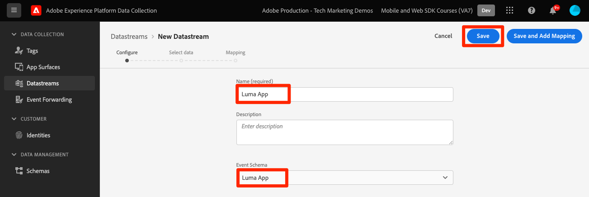
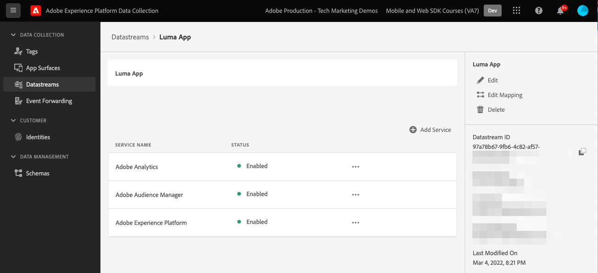

# 建立資料流

了解如何在Experience Platform中建立資料流。

資料流是平台邊緣網路上的伺服器端配置。  資料流可確保將傳入Platform Edge Network的資料適當地路由至Adobe Experience Cloud應用程式和服務。 如需詳細資訊，請參閱 [檔案](https://experienceleague.adobe.com/docs/experience-platform/edge/fundamentals/datastreams.html) 或 [影片](https://experienceleague.adobe.com/docs/platform-learn/data-collection/edge-network/configure-datastreams.html).

## 先決條件

若要建立資料流，您的組織必須在資料收集介面(先前稱為 [!UICONTROL Launch])，而且您必須擁有 [!UICONTROL Experience Platform] > [!UICONTROL 資料收集] > **[!UICONTROL 管理資料流]** 和 **[!UICONTROL 檢視資料流]**.

## 學習目標

在本課程中，您將：

* 了解何時使用資料流。
* 建立資料流。
* 設定資料流。

## 建立資料流

可在 [!UICONTROL 資料收集] 介面使用 [!UICONTROL 資料流] 配置工具。 若要建立資料流：

1. 請確定您位在正確的Platform沙箱中。
1. 選擇 **[!UICONTROL 新資料流]**.

   

1. 提供名稱，例如 `Luma App`.
1. 選取您在上一課中建立的架構。
1. 選取「**[!UICONTROL 儲存]**」。

   

## 新增服務

接下來，您可以將Experience Cloud服務連線至資料流。 當Platform Mobile SDK傳送資料至邊緣網路時，資料流會將資料傳送至下列服務：

1. 新增 **[!UICONTROL Adobe Analytics]** 和提供報表套裝。

1. 啟用 **[!UICONTROL Adobe Audience Manager]** （可選）。

1. 啟用 **[!UICONTROL Adobe Experience Platform]** 並提供 **[!UICONTROL 資料集]** （可選）。
   * 如果您尚未建立資料集，請依照指示操作 [此處](platform.md).

1. 最終設定應如下所示。
   

>[!NOTE]
>
>啟用貴組織所使用的每項服務，可確保行動應用程式中收集的資料可隨處使用。 如需資料流設定的詳細資訊，請檢閱此檔案 [此處](https://experienceleague.adobe.com/docs/experience-platform/edge/fundamentals/datastreams.html#adobe-experience-platform-settings).

在您自己的網站上實作Platform Mobile SDK時，您應建立三個資料流，以對應至您的三個標籤環境（開發、預備和生產）。 如果您使用Platform Mobile SDK搭配Adobe Real-time Customer Data Platform或Adobe Journey Optimizer等以平台為基礎的應用程式，請務必在適當的Platform沙箱中建立這些資料流。

下一個： **[設定標籤](configure-tags.md)**

>[!NOTE]
>
>感謝您花時間學習Adobe Experience Platform Mobile SDK。 如果您有任何疑問、想要分享一般意見，或對未來內容有任何建議，請就此分享 [Experience League社群討論貼文](https://experienceleaguecommunities.adobe.com/t5/adobe-experience-platform-launch/tutorial-discussion-implement-adobe-experience-cloud-in-mobile/td-p/443796)
