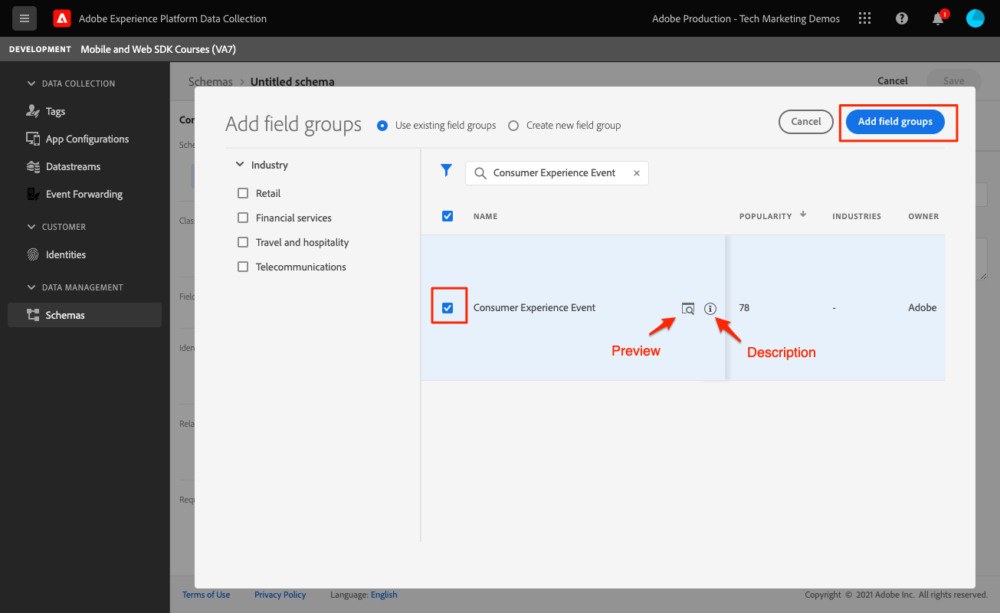
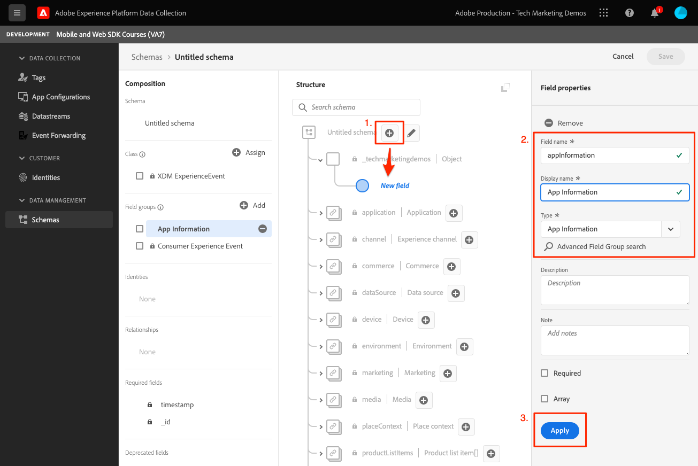

# 建立 XDM 結構描述

了解如何為行動應用程式事件建立XDM結構。

標準化和互操作性是Adobe Experience Platform背後的重要概念。 由Adobe推動的Experience Data Model(XDM)，旨在標準化客戶體驗資料並定義客戶體驗管理的結構。

## 什麼是XDM結構？

XDM是公開記錄的規格，旨在改善數位體驗的強大功能。 它提供允許任何應用程式與Platform服務通訊的通用結構和定義。 遵循XDM標準，所有客戶體驗資料皆可整合至通用表示法中，以更快速、更整合的方式提供深入分析。 您可以從客戶動作中獲得寶貴的深入分析、透過區段定義客戶受眾，以及為個人化目的表達客戶屬性。

Experience Platform 會使用結構，以一致且可重複使用的方式說明資料結構。藉由定義跨系統的一致資料，將可輕易保留意義，而發揮資料應有的價值。

在將資料擷取至Platform之前，必須先建立結構以說明資料的結構，並對每個欄位中可包含的資料類型提供限制。 結構由基類和零個或多個結構欄位組組成。

如需結構構成模型的詳細資訊，包括設計原則和最佳實務，請參閱 [綱要構成基本知識](https://experienceleague.adobe.com/docs/experience-platform/xdm/schema/composition.html?lang=zh-Hant) 或課程 [使用XDM建立客戶體驗資料模型](https://experienceleague.adobe.com/?recommended=ExperiencePlatform-D-1-2021.1.xdm).

>[!TIP]
>
>如果您熟悉Analytics解決方案設計參考(SDR)，您可以將結構視為更強大的SDR。

## 先決條件

若要完成本課程，您必須擁有建立Experience Platform架構的權限。

## 學習目標

在本課程中，您將：

* 在資料收集介面中建立結構
* 將標準欄位群組新增至結構
* 建立自訂欄位群組並新增至結構

## 導覽至結構

1. 登入 Adobe Experience Cloud.

1. 開啟應用程式切換器，然後選取 **[!UICONTROL 資料收集]**

   

1. 請確定您位於本教學課程所使用的Experience Platform沙箱中。

   >[!NOTE]
   >
   > 本教學課程中，以平台為基礎的應用程式（例如Real-time CDP）的客戶應使用開發沙箱。 其他客戶則會使用預設的生產沙箱。

1. 選擇 **[!UICONTROL 結構]** 在 **[!UICONTROL 資料管理]**.

   

您現在位於主要結構頁面，並會顯示任何現有結構的清單。 您也可以看到與結構的核心建置區塊對應的標籤：

* **欄位群組** 是可重複使用的元件，定義一個或多個欄位以捕獲特定資料，如個人詳細資訊、酒店首選項或地址。
* **類別** 定義結構所包含資料的行為方面。 例如： `XDM ExperienceEvent` 擷取時間序列、事件資料，並 `XDM Individual Profile` 擷取個人的屬性資料。
* **資料類型** 在類或欄位組中，以與基本常值欄位相同的方式用作引用欄位類型。

以上說明為高階概述。 如需詳細資訊，請參閱 [架構建置區塊](https://experienceleague.adobe.com/docs/platform-learn/tutorials/schemas/schema-building-blocks.html?lang=zh-Hant) 視訊或讀取 [結構構成基本概念](https://experienceleague.adobe.com/docs/experience-platform/xdm/schema/composition.html?lang=en) 在產品檔案中。

在本教學課程中，您會使用「消費者體驗事件」欄位群組，並建立自訂群組來示範程式。

>[!NOTE]
>
>Adobe會持續新增更多標準欄位群組，且應盡可能使用，因為Experience Platform服務會隱含地了解這些欄位，並在跨Platform元件使用時提供更一致性。 使用標準欄位群組可提供實實在在的好處，例如在Analytics中自動對應，以及在Platform中使用AI功能。

## Luma應用程式架構

在真實情境中，架構設計程式可能如下所示：

* 收集業務需求。
* 尋找預先建置的欄位群組，以盡可能滿足更多需求。
* 為任何間隙建立自訂欄位群組。

為了學習，您將使用預先建置和自訂欄位群組。

* **消費者體驗事件**:預先建置的欄位組有許多共同欄位。
* **應用程式資訊**:設計來模擬TrackState/TrackAction Analytics概念的自訂欄位群組。

<!--Later in the tutorial, you can [update the schema](lifecycle-data.md) to include the **[!UICONTROL AEP Mobile Lifecycle Details]** field group.-->

## 建立方案

1. 選擇 **[!UICONTROL 建立結構]** 若要開啟「選項」下拉式功能表，請選取 **[!UICONTROL XDM ExperienceEvent]**.

   

1. 搜尋 `Consumer Experience Event`.

1. 您可以先預覽欄位和/或先閱讀說明以取得詳細資訊，再選取。

1. 選取核取方塊，然後 **[!UICONTROL 新增欄位群組]**.

   

   系統會將您帶回主架構構成畫面，您可在其中看到所有可用欄位。

1. 透過選取 **[!UICONTROL 無標題結構]** 從左上角，然後提供 **[!UICONTROL 顯示名稱]** &amp; **[!UICONTROL 說明]**，例如 `Luma Tutorial Mobile` 和 `"Luma App" schema for Adobe Tutorial`

1. 選取「**[!UICONTROL 儲存]**」。

   

>[!NOTE]
>
>請記住，您不必使用群組中的所有欄位。 如果此功能有幫助，您可以將結構視為空的資料層。 在您的應用程式中，您會在適當時間填入相關值。
>
>此 `Consumer Experience Event` 具有名為 `Web information`，說明頁面檢視和連結點按次數等事件。 撰寫時，此功能與行動應用程式沒有同等優勢，因此您將自行建立。

## 建立自訂資料類型

首先，您可以建立描述這兩個事件的自訂資料類型：

* 畫面檢視
* 應用程式互動

1. 選取 **[!UICONTROL 資料類型]** ，然後選取 **[!UICONTROL 建立資料類型]**.

   

1. 給它一個 **[!UICONTROL 顯示名稱]** 和 **[!UICONTROL 說明]**，例如 `App Information` 和 `Custom data type describing "Screen Views" & "App Actions"`

   

   >[!TIP]
   >
   > 一律使用可讀、描述性 [!UICONTROL 顯示名稱] 對於自訂欄位，因為此作法可讓行銷人員在欄位於下游服務（例如區段產生器）時更容易存取。

1. 若要新增欄位，請選取(+)按鈕。

   此欄位是應用程式互動的容器物件。 給它一個駝峰 **[!UICONTROL 欄位名稱]** `appInteraction`, **[!UICONTROL 顯示名稱]** `App Interaction`，和 **[!UICONTROL type]** `Object`.

1. 選擇 **[!UICONTROL 套用]**.

   

1. 若要測量動作發生的頻率，請選取 `appInteraction` 您建立的物件。

1. 給它一個駝峰 **[!UICONTROL 欄位名稱]** `appAction`, **[!UICONTROL 顯示名稱]** of `App Action` 和 **[!UICONTROL type]** `Measure`.

   此步驟等同於Adobe Analytics中的成功事件。

1. 選擇 **[!UICONTROL 套用]**.

   

1. 選取旁邊的(+)按鈕，新增說明互動類型的欄位 `appInteraction` 物件。

1. 給它一個 **[!UICONTROL 欄位名稱]** `name`, **[!UICONTROL 顯示名稱]** of `Name` 和 **[!UICONTROL type]** `String`.

   此步驟等同於Adobe Analytics中的維度。

   

1. 捲動至右側邊欄底部並選取 **[!UICONTROL 套用]**.

1. 按照相同的模式建立 `appStateDetails` 包含稱為的度量欄位的對象 `screenView` 和兩個字串 `screenName` 和 `screenType`.

1. 選取「**[!UICONTROL 儲存]**」。

   

## 新增自訂欄位群組

現在使用您的自訂資料類型新增自訂欄位群組：

1. 開啟您在本課程先前建立的架構。

1. 選擇 **[!UICONTROL 新增]** 下一頁 **[!UICONTROL 欄位群組]**.

   

1. 這次，您需選取 **[!UICONTROL 建立新欄位組]** 頂端附近的選項按鈕，然後提供名稱和說明，例如 `App Interactions` 和 `Fields for app interactions`.

   

1. 從主合成畫面中，將欄位新增至結構的根。

1. 選取架構名稱旁的(+)。

1. 在右側邊欄中，提供 **[!UICONTROL 欄位名稱]** of `appInformation`，的顯示名稱 `App Information`.

1. 選擇 `App Information` 從 **[!UICONTROL 類型]** 下拉式清單，您在上一個練習中建立的資料類型。

1. 選擇 **[!UICONTROL 套用]**.

   

>[!NOTE]
>
>自訂欄位群組一律放在您的Experience Cloud組織識別碼下。
>
>`_techmarketingdemos` 已取代為您組織的唯一值。

您現在有一個結構可用於教學課程的其餘部分。

下一個： **[建立 [!UICONTROL 資料流]](create-datastream.md)**

>[!NOTE]
>
>感謝您花時間學習Adobe Experience Platform Mobile SDK。 如果您有任何疑問、想要分享一般意見，或對未來內容有任何建議，請就此分享 [Experience League社群討論貼文](https://experienceleaguecommunities.adobe.com/t5/adobe-experience-platform-launch/tutorial-discussion-implement-adobe-experience-cloud-in-mobile/td-p/443796)