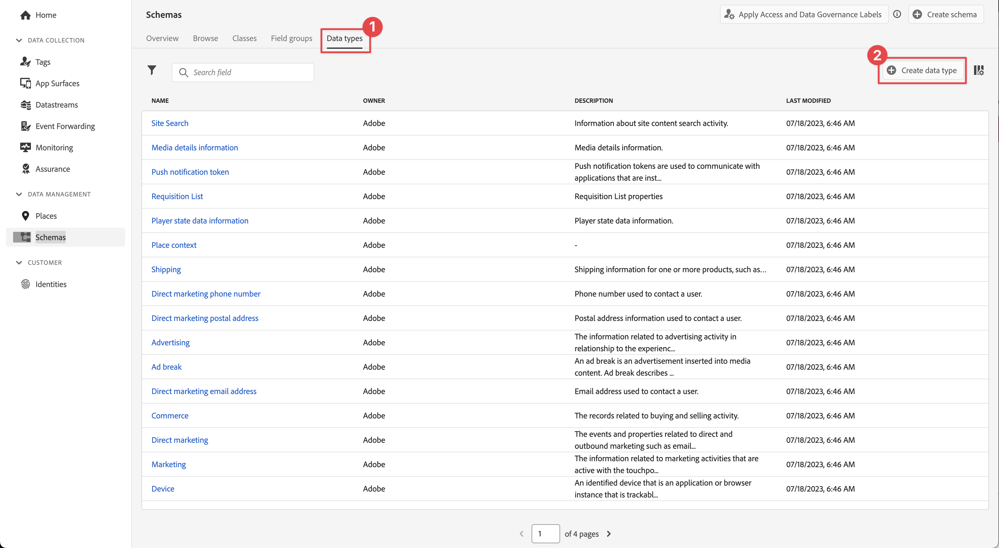

# 建立 XDM 結構描述

瞭解如何為行動應用程式事件建立XDM結構描述。

標準化和互通性是Adobe Experience Platform背後的重要概念。 體驗資料模型(XDM)由Adobe驅動，致力於標準化客戶體驗資料並定義客戶體驗管理的結構。

## 什麼是XDM結構描述？

XDM是公開記錄的規格，旨在改善數位體驗的效能。 它提供通用結構和定義，可讓任何應用程式與Platform服務通訊。 只要遵循XDM標準，所有客戶體驗資料都可整合到共同表現中，以更快、更整合的方式提供深入分析。 您可以從客戶動作中獲得寶貴的見解、透過區段定義客戶對象，以及使用客戶屬性進行個人化。

Experience Platform 會使用結構，以一致且可重複使用的方式說明資料結構。藉由定義跨系統的一致資料，將更容易保留意義，進而從資料中獲得價值。

在將資料擷取到Platform之前，必須組成結構描述資料的結構並對可包含在每個欄位中的資料型別提供限制。 結構描述包含一個基底類別和零個或多個結構描述欄位群組。

如需結構描述組合模型的詳細資訊，包括設計原則和最佳實務，請參閱 [結構描述組合的基本面](https://experienceleague.adobe.com/docs/experience-platform/xdm/schema/composition.html?lang=zh-Hant) 或課程 [使用XDM為您的客戶體驗資料建立模型](https://experienceleague.adobe.com/?recommended=ExperiencePlatform-D-1-2021.1.xdm).

>[!TIP]
>
>如果您熟悉Analytics解決方案設計參考(SDR)，您可以將結構描述視為更強大的SDR。 另請參閱 [建立和維護解決方案設計參考(SDR)檔案](https://experienceleague.adobe.com/docs/analytics-learn/tutorials/implementation/implementation-basics/creating-and-maintaining-an-sdr.html?lang=zh-Hant) 以取得詳細資訊。

## 先決條件

若要完成課程，您必須有建立Experience Platform結構描述的許可權。

## 學習目標

在本課程中，您將會：

* 在資料收集介面中建立結構
* 將標準欄位群組新增到結構描述
* 建立自訂欄位群組並新增至結構描述

## 導覽至結構描述

1. 登入 Adobe Experience Cloud。

1. 確定您是在本教學課程使用的Experience Platform沙箱中。

1. 開啟應用程式切換器   （右上方），

1. 選取 **[!UICONTROL 資料彙集]** 功能表中。

   

   >[!NOTE]
   >
   > 使用Real-Time CDP等平台型應用程式的客戶，應使用開發沙箱進行本教學課程。 其他客戶則使用預設的生產沙箱。

1. 選取 **[!UICONTROL 方案]** 在 **[!UICONTROL 資料管理]** 在左側邊欄中。

   

此時您會進入主要方案頁面，並顯示任何現有方案的清單。 您也可以看到與結構描述核心建置區塊相對應的標籤：

* **欄位群組** 是可重複使用的元件，定義一或多個欄位以擷取特定資料，例如個人詳細資料、飯店偏好設定或地址。
* **類別** 定義結構描述包含之資料的行為層面。 例如： `XDM ExperienceEvent` 擷取時間序列、事件資料和 `XDM Individual Profile` 擷取有關個人的屬性資料。
* **資料型別** 在類別或欄位群組中作為參考欄位型別使用，其方式與基本常值欄位相同。

以上說明為高階概述。 如需詳細資訊，請參閱 [結構描述建置區塊](https://experienceleague.adobe.com/docs/platform-learn/tutorials/schemas/schema-building-blocks.html?lang=zh-Hant) 視訊或讀取 [結構描述組合基本概念](https://experienceleague.adobe.com/docs/experience-platform/xdm/schema/composition.html?lang=zh-Hant) 產品檔案內。

在本教學課程中，您會使用取用者體驗事件欄位群組，並建立自訂群組來示範此程式。

>[!NOTE]
>
>Adobe會持續新增更多標準欄位群組，且應儘可能使用，因為Experience Platform服務可隱含瞭解這些欄位，且在Platform元件間使用時，可提供更一致的一致性。 使用標準欄位群組可提供實際好處，例如在Platform中的Analytics和AI功能中自動對應。

## Luma應用程式結構描述架構

在真實世界情況中，結構描述設計流程可能如下所示：

* 收集業務需求。
* 尋找預先建立的欄位群組，以儘可能滿足需求。
* 建立任何間隙的自訂欄位群組。

出於學習目的，您會使用預先建立和自訂欄位群組。

* **消費者體驗事件**：預先建立的欄位群組，其中包含許多通用欄位。
* **應用程式資訊**：設計用來模擬TrackState/TrackAction Analytics概念的自訂欄位群組。

<!--Later in the tutorial, you can [update the schema](lifecycle-data.md) to include the **[!UICONTROL AEP Mobile Lifecycle Details]** field group.-->

## 建立結構描述

1. 選取 **[!UICONTROL 建立結構描述]**.

1. 在 **[!UICONTROL 選取類別]** 的步驟 **[!UICONTROL 建立結構描述]** 精靈，選取 **[!UICONTROL 體驗事件]** 底下 **[!UICONTROL 選取此結構描述的基底類別]**.

1. 選取&#x200B;**[!UICONTROL 「下一步」]**。

   

1. 在 **[!UICONTROL 名稱和評論]** 的步驟 **[!UICONTROL 建立結構描述]** 精靈，輸入 **[!UICONTROL 結構描述顯示名稱]**，例如 `Luma Mobile Event Schema` 和 [!UICONTROL 說明]，例如 `Schema for Luma mobile app experience events`.

   >[!NOTE]
   >
   >如果您正在閱讀此教學課程，且已將多位人員放在單一沙箱中，或您使用共用帳戶，請考慮在命名慣例中附加或附加身分識別。 例如，不使用 `Luma Mobile App Event Schema`，使用 `Luma Mobile App Event Schema - Joe Smith`. 另請參閱以下說明： [概觀](overview.md).

1. 選取 **[!UICONTROL 完成]** 完成精靈。

   

1. 選取  **新增** 旁邊 **[!UICONTROL 欄位群組]**.

   

1. 搜尋 `Consumer Experience Event`.

1. 選取  在選取欄位群組之前，預覽欄位和/或閱讀更多詳細資訊的說明。

1. 選取 **消費者體驗事件**.

1. 選取&#x200B;**[!UICONTROL 「新增欄位群組」]**。

   

   系統會將您帶回主要結構描述構成畫面，讓您在其中檢視所有可用欄位。

1. 選取「**[!UICONTROL 儲存]**」。

>[!NOTE]
>
>請記住，您不需要使用群組中的所有欄位。 您也可以移除欄位，讓綱要保持簡潔明瞭，容易理解。 如果這很實用，您可以將結構描述想成是空的資料層。 您可在應用程式中的適當時間填入相關值。

此 [!UICONTROL 消費者體驗事件] 欄位群組有一個資料型別，稱為 [!UICONTROL 網頁資訊]，會說明頁面檢視和連結點按次數等事件。 在撰寫本文時，行動應用程式尚未與這項功能對等，因此您將建立您自己的應用程式。

## 建立自訂資料型別

首先，請建立自訂資料型別，說明兩個事件：

* 畫面檢視
* 應用程式互動

1. 選取 **[!UICONTROL 資料型別]** 標籤。

1. 選取 **[!UICONTROL 建立資料型別]**.

   

1. 提供 **[!UICONTROL 顯示名稱]** 和 **[!UICONTROL 說明]**，例如 `App Information` 和 `Custom data type describing "Screen Views" & "App Actions"`

   

   >[!TIP]
   >
   > 一律使用可讀、描述性的 [!UICONTROL 顯示名稱] 對於您的自訂欄位，當欄位出現在下游服務（例如區段產生器）時，此做法可讓行銷人員更容易存取這些欄位。

1. 若要新增欄位，請選取  按鈕。

1. 此欄位是用於應用程式互動的容器物件，因此請提供駝峰式大小寫 **[!UICONTROL 欄位名稱]** `appInteraction`， **[!UICONTROL 顯示名稱]** `App Interaction`，並選取 `Object` 從 **[!UICONTROL 型別]** 清單。

1. 選取&#x200B;**[!UICONTROL 「套用」]**。

   

1. 若要測量動作發生的頻率，請選取  按鈕旁的 **[!UICONTROL appInteraction]** 您建立的物件。

1. 以駝峰式大小寫表示 **[!UICONTROL 欄位名稱]** `appAction`， **[!UICONTROL 顯示名稱]** 之 `App Action` 和 **[!UICONTROL 型別]** `Measure`.

   此步驟等同於Adobe Analytics中的成功事件。

1. 選取&#x200B;**[!UICONTROL 「套用」]**。

   

1. 選取「 」，新增描述互動型別的欄位  按鈕旁的 **[!UICONTROL appInteraction]** 物件。

1. 將其授予 **[!UICONTROL 欄位名稱]** `name`， **[!UICONTROL 顯示名稱]** 之 `Name` 和 **[!UICONTROL 型別]** `String`.

   此步驟等同於Adobe Analytics中的維度。

   

1. 捲動至右側邊欄底部，然後選取「 」 **[!UICONTROL 套用]**.

1. 若要建立 `appStateDetails` 包含 **[!UICONTROL 測量]** 已呼叫的欄位 `screenView` 和兩個 **[!UICONTROL 字串]** 已呼叫的欄位 `screenName` 和 `screenType`，請依照建立 **[!UICONTROL appInteraction]** 物件。

1. 選取「**[!UICONTROL 儲存]**」。

   

## 新增自訂欄位群組

現在請使用您的自訂資料型別新增自訂欄位群組：

1. 開啟您在本課程中先前建立的結構描述。

1. 選取  **[!UICONTROL 新增]** 旁邊 **[!UICONTROL 欄位群組]**.

   

1. 選取&#x200B;**[!UICONTROL 建立新欄位群組]**。

1. 提供 **[!UICONTROL 顯示名稱]** 和 **[!UICONTROL 說明]**&#x200B;例如， `App Interactions` 和 `Fields for app interactions`.

1. 選取&#x200B;**「新增欄位群組」**。

   

1. 從主要構成畫面中，選取**[!UICONTROL 應用程式互動**].

1. 藉由選取「 」將欄位新增至結構描述的根  結構描述名稱旁的按鈕。

1. 在右邊欄中，提供 **[!UICONTROL 欄位名稱]** 之 `appInformation`， a **[!UICONTROL 顯示名稱]** 之 `App Information`，和 **[!UICONTROL 型別]** 之 `App Information`.

1. 選取 **[!UICONTROL 應用程式互動]** 從 **[!UICONTROL 欄位群組]** 下拉式清單，將欄位指派給新欄位群組。

1. 選取&#x200B;**[!UICONTROL 「套用」]**。

1. 選取「**[!UICONTROL 儲存]**」。

   

>[!NOTE]
>
>自訂欄位群組一律放置在您的Experience Cloud組織識別碼下。

>[!SUCCESS]
>
>您現在已具備要用於本教學課程其餘部分的結構。
>
>感謝您花時間學習Adobe Experience Platform Mobile SDK。 如果您有疑問、想要分享一般意見或有關於未來內容的建議，請在此分享這些內容 [Experience League社群討論貼文](https://experienceleaguecommunities.adobe.com/t5/adobe-experience-platform-data/tutorial-discussion-implement-adobe-experience-cloud-in-mobile/td-p/443796).

下一步： **[建立 [!UICONTROL 資料流]](create-datastream.md)**
