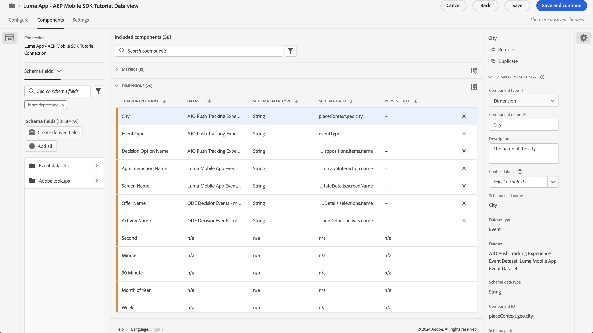

# 使用Customer Journey Analytics報告和分析

瞭解如何透過Customer Journey Analytics報告及分析您的行動應用程式互動。

您在前面的課程中收集並傳送至PlatformEdge Network的行動應用程式事件資料，會轉送至您資料流中設定的服務。 如果您已按照[將資料傳送至Experience Platform](platform.md)課程進行，該資料現在會儲存在Experience Platform資料集中，可供Customer Journey Analytics用於報表和分析。

與Adobe Analytics相反，Customer Journey Analytics *使用來自Experience Platform中建立的資料集的*&#x200B;資料。 資料不會使用Adobe Experience Platform Mobile SDK直接傳送至Customer Journey Analytics，而是會傳送至資料集。 接著會在Customer Journey Analytics中設定連線，以選取您將在報表和分析專案中使用的資料集。

本教學課程中的課程著重於報告和分析從Luma教學課程應用程式擷取的資料。 Customer Journey Analytics的其中一項獨特功能，是將來自多個來源（CRM、銷售點、忠誠度應用程式、客服中心）和管道（網路、行動裝置、離線）的資料合併，以蒐集客戶歷程的深入見解。 該功能不在本課程的討論範圍內。 如需詳細資訊，請參閱[Customer Journey Analytics概觀](https://experienceleague.adobe.com/en/docs/analytics-platform/using/cja-overview/cja-overview)。

## 先決條件

必須布建您的組織並授與Customer Journey Analytics的許可權。 您必須擁有管理員存取權才能進行Customer Journey Analytics。

## 學習目標

在本課程中，您將會：

- 建立連線，從您要用於Customer Journey Analytics的Experience Platform定義資料集。
- 建立資料檢視，從資料集中準備資料以用於報告和分析
- 建立專案以建立報表和視覺效果，以便分析行動應用程式中的資料。

該順序是有意為之。 連線使用資料集，資料檢視使用連線。

## 建立連線

Customer Journey Analytics中的連線會定義您要用於報表和分析的Experience Platform資料集（以及這些資料集中的資料）。

1. 使用右上角的「應用程式」功能表瀏覽至Customer Journey Analytics介面。

1. 從上方功能表列選取&#x200B;**[!UICONTROL 連線]**。

1. 請確定您選取連線介面中的&#x200B;**[!UICONTROL 清單]**&#x200B;索引標籤。 您會看到現有連線的清單。

1. 選取&#x200B;**[!UICONTROL 建立新連線]**。

1. 在&#x200B;**[!UICONTROL 連線]** > **[!UICONTROL 未命名的連線]**&#x200B;畫面中，在&#x200B;**[!UICONTROL 連線設定]**&#x200B;中

   1. 輸入&#x200B;**[!UICONTROL 連線名稱]**，例如`Luma App - AEP Mobile SDK Tutorial Connection`。
   2. 輸入&#x200B;**[!UICONTROL 連線描述]**，例如`Connection for the Luma app used in the AEP Mobile SDK tutorial`。

      在&#x200B;**[!UICONTROL 資料設定]**&#x200B;中：

   3. 選取您用來收集行動應用程式資料的沙箱，例如&#x200B;**[!UICONTROL 行動和Web SDK課程]**。
   4. 從&#x200B;**[!UICONTROL 每日事件平均數量]**&#x200B;中選取&#x200B;**[!UICONTROL 小於100萬]**。

   5. 選取&#x200B;**[!UICONTROL 新增資料集]**，以從您要用於Customer Journey Analytics的Experience Platform中選取資料集。

      

   6. 在&#x200B;**[!UICONTROL 新增資料集]**&#x200B;精靈中，**[!UICONTROL 選取資料集]**&#x200B;步驟，

      1. 選取下列資料集：

         - **[!UICONTROL Luma行動應用程式事件資料集]**，您在Experience Platform課程中的[建立資料集](platform.md#create-a-dataset)區段中所建立的資料集。
         - **[!UICONTROL ODE DecisionEvents - *沙箱名稱*] decisioning**
         - **[!UICONTROL AJO推播追蹤事件資料集]**

      1. 選取&#x200B;**[!UICONTROL 下一步]**。

         

   7. 在&#x200B;**[!UICONTROL 新增資料集]**&#x200B;精靈&#x200B;**[!UICONTROL 資料集設定]**&#x200B;步驟中，您必須定義每個事件資料集的詳細資料。
      1. 請參閱下表以瞭解正確的設定：

         | 資料集 | 人員ID ① | 時間戳記 ② | 資料來源型別③ | 匯入所有新的資料來④ | 回填所有現有資料⑤ |
         |---|---|---|---|---|---|
         | Luma行動應用程式事件資料集 | identityMap | 時間戳記 | 行動應用程式資料 | 啟用 | 啟用 |
         | ODE DecisionEvents - *沙箱名稱* decisioning | identityMap | 時間戳記 | 行動應用程式資料 | 啟用 | 啟用 |
         | AJO推播追蹤體驗事件資料集 | identityMap | 時間戳記 | 行動應用程式資料 | 啟用 | 啟用 |

      1. 選取&#x200B;**[!UICONTROL 新增資料集]**。

         

1. 返回&#x200B;**[!UICONTROL 連線]** > **[!UICONTROL Luma應用程式 — AEP Mobile SDK教學課程連線]**，選取「儲存」**[!UICONTROL 以儲存您的連線。]**

   

您現在已定義連線，且Customer Journey Analytics會將資料集中的資料新增至其內部資料庫。 這項資料收集作業可能需要一點時間，視資料量而定。 若是教學課程應用程式，資料預計要過幾個小時才會出現在Customer Journey Analytics中。

若要檢視連線的狀態：

1. 在Customer Journey Analytics的主介面中選取&#x200B;**[!UICONTROL 連線]**。
1. 選取連線的名稱，例如&#x200B;**[!UICONTROL Luma應用程式 — AEP Mobile SDK教學課程連線]**。

在&#x200B;**[!UICONTROL 連線]** > **[!UICONTROL Luma應用程式 — AEP Mobile SDK教學課程連線]**&#x200B;中，您會看到：

1. 新增的記錄總數、略過的記錄數和刪除的記錄數的相關資訊。 請確定您選取&#x200B;**[!UICONTROL 所有資料集]**，並選取適當的時段來檢視連線的詳細資料。 您可以使用開啟對話方塊以選取時段。
1. 新增記錄、略過記錄、刪除記錄等專案的個別資料集資訊。

   

## 建立資料檢視

將記錄從資料集新增到Customer Journey Analytics後，您可以建立資料檢視，以定義您要報告的資料元件。

資料檢視是Customer Journey Analytics專屬的容器，可讓您決定如何詮釋來自連線的資料。 您可以從您在「連線」中定義為Analysis Workspace中元件（維度、量度）的任何資料集，設定標準和結構欄位。

Customer Journey Analytics中的資料檢視提供極大的彈性，可正確設定和定義來自您連線的資料。 在本教學課程中，您僅能使用報告和分析所需的功能。 如需詳細資訊，請參閱[資料檢視](https://experienceleague.adobe.com/en/docs/analytics-platform/using/cja-dataviews/data-views)。

若要建立資料檢視：

1. 使用右上角的「應用程式」功能表瀏覽至Customer Journey Analytics介面。

1. 從上方功能表列選取&#x200B;**[!UICONTROL 資料檢視]**。
1. 選取&#x200B;**[!UICONTROL 建立新資料檢視]**。
1. 在&#x200B;**[!UICONTROL 資料檢視>]**&#x200B;中，確定已選取&#x200B;**[!UICONTROL 設定]**&#x200B;索引標籤。

   1. 從「設定連線」下拉式清單中選取您的連線，例如&#x200B;**[!UICONTROL Luma應用程式 — AEP Mobile SDK教學課程連線]**。
   1. 輸入資料檢視的名稱，例如： `Luma App - AEP Mobile SDK Tutorial Data view`。
   1. 選取&#x200B;**[!UICONTROL 儲存並繼續]**。

      

1. 在&#x200B;**[!UICONTROL Luma應用程式 — AEP Mobile SDK教學課程資料檢視]**&#x200B;的&#x200B;**[!UICONTROL 元件]**&#x200B;標籤中，您可以定義在報告行動應用程式時要使用的量度和維度。 根據預設，已為您的資料檢視設定許多標準量度和維度（共同稱為元件）。 但您的資料檢視需要更多元件。  若要從您先前定義的結構描述或現成的結構描述新增結構描述欄位（請參閱[建立結構描述](create-schema.md)課程），以作為元件（維度或量度）：

   1. 尋找結構欄位：

      - 使用 ***[!UICONTROL 搜尋結構描述欄位]***&#x200B;搜尋欄位來搜尋元件。 例如，`productListAdd`，或

        

      - 向下捲動至 **[!UICONTROL 事件資料集]** 內的結構描述欄位。  例如， **[!UICONTROL 事件資料集]**   **[!UICONTROL 商務]**   **[!UICONTROL productListAdds]** 

        

   1. 從[結構描述欄位]窗格拖曳特定結構描述欄位，並將其拖放到[!UICONTROL 包含的元件]窗格中的&#x200B;**[!UICONTROL METRICS]**&#x200B;或&#x200B;**[!UICONTROL DIMENSION]**&#x200B;清單上。

      

   1. 您可以配置元件的設定。 選取元件並在右窗格中設定設定。  例如，您可以使用右窗格中的&#x200B;**[!UICONTROL 元件設定]** > **[!UICONTROL 元件名稱]**&#x200B;欄位，將&#x200B;**[!UICONTROL commerce.productListAdds]**&#x200B;重新命名為`Product Add To Lists`。

      

      或設定&#x200B;**[!UICONTROL 包含排除值]**。

      

   1. 現在您已瞭解如何將欄位新增至資料檢視並設定結果元件，請使用下表列出要新增為量度或維度的結構描述欄位。 使用下表中的&#x200B;**結構描述路徑**&#x200B;資料行值來搜尋或周遊至特定結構描述欄位。 新增量度和維度後，請檢查資料表中的&#x200B;**元件設定**&#x200B;資料行值，確定元件是否需要特定設定，例如元件名稱&#x200B;**[!UICONTROL 或定義**&#x200B;[!UICONTROL &#x200B;包含排除值&#x200B;]&#x200B;**。]**

      **個量度**

      | 元件名稱 | 資料集 | 結構描述資料型別 | 結構描述路徑 | 元件設定 |
      |---|---|---|---|---|
      | 關閉 | AJO推播追蹤體驗事件資料集、Luma行動應用程式事件資料集 | 整數 | _experience.decisioning. propositionEventType.sisis | 元件名稱： `Dismiss` |
      | 取消訂閱 | AJO推播追蹤體驗事件資料集、Luma行動應用程式事件資料集 | 整數 | _experience.decisioning. propositionEventType.unsubscribe | 元件名稱： `Unsubscribe` |
      | 觸發 | AJO推播追蹤體驗事件資料集、Luma行動應用程式事件資料集 | 整數 | _experience.decisioning. propositionEventType.trigger | 元件名稱： `Trigger` |
      | 顯示 | AJO推播追蹤體驗事件資料集、Luma行動應用程式事件資料集 | 整數 | _experience.decisioning. propositionEventType.display | 元件名稱： `Display` |
      | 傳送 | AJO推播追蹤體驗事件資料集、Luma行動應用程式事件資料集 | 整數 | _experience.decisioning. propositionEventType.send | 元件名稱： `Send` |
      | 互動 | AJO推播追蹤體驗事件資料集、Luma行動應用程式事件資料集 | 整數 | _experience.decisioning. propositionEventType.interact | 元件名稱： `Interact` |
      | 位置事件 | AJO推播追蹤體驗事件資料集、Luma行動應用程式事件資料集、ODE DecisionEvents — 行動與web-sdk-courses decisioning | 字串 | 事件類型 | 元件名稱： `Location Events`   |
      | 產品檢視 | Luma行動應用程式事件資料集 | 雙精度 | commerce.productViews.value | 元件名稱： `Product Views` |
      | 產品新增至清單 | Luma行動應用程式事件資料集 | 雙精度 | commerce.productListAdds.value | 元件名稱： `Product Add To Lists` |
      | 購買次數 | Luma行動應用程式事件資料集 | 雙精度 | commerce.purchases.value | 元件名稱： `Purchases` |
      | 儲存供日後使用次數 | Luma行動應用程式事件資料集 | 雙精度 | commerce.saveForLaters.value | 元件名稱： `Save For Laters` |
      | 應用程式互動 | Luma行動應用程式事件資料集 | 雙精度 | _techmarketingdemos.appInformation. appinteraction.appAction.value | 元件名稱： `App Interactions` |
      | 熒幕檢視 | Luma行動應用程式事件資料集 | 雙精度 | _techmarketingdemos.appInformation. appStateDetails.screenView.value | 元件名稱： `Screen Views` |

      {style="table-layout:auto"}

      >[!NOTE]
      >
      >請注意，位置事件量度的結構描述欄位如何使用&#x200B;**[!UICONTROL 包含排除值]**&#x200B;來計算包含`location`的事件型別。

      從上表新增所有結構描述欄位做為量度元件後，**[!UICONTROL METRICS]**&#x200B;的資料檢視設定應該符合下文：

      

      **DIMENSION**

      | 元件名稱 | 資料集 | 結構描述資料型別 | 結構描述路徑 | 元件設定 |
      |---|---|---|---|---|
      | 城市 | AJO推播追蹤體驗事件資料集、Luma行動應用程式事件資料集 | 字串 | placeContext.geo.city | 元件名稱： `City` |
      | 事件型別 | AJO推播追蹤體驗事件資料集、Luma行動應用程式事件資料集、ODE DecisionEvents — 行動與web-sdk-courses decisioning | 字串 | eventType | 元件名稱： `Event Types` |
      | 決定選項名稱 | AJO推播追蹤體驗事件資料集、Luma行動應用程式事件資料集、ODE DecisionEvents — 行動與web-sdk-courses decisioning | 字串 | _experience.decisioning. 建議.items.name | 元件名稱： `Decision Option Name` |
      | 應用程式互動名稱 | Luma行動應用程式事件資料集 | 字串 | _techmarketingdemos.appInformation. appInteraction.name | 元件名稱： `App Interaction Name` |
      | 畫面名稱 | Luma行動應用程式事件資料集 | 字串 | _techmarketingdemos.appInformation. appStateDetails.screename | 元件名稱： `Screen Name` |
      | 活動名稱 | ODE DecisionEvents — 行動與web-sdk-courses決策 | 字串 | _experience.decisioning. propositionDetails.activity.name | 元件名稱： `Activity Name` |
      | 優惠方案名稱 | ODE DecisionEvents — 行動與web-sdk-courses決策 | 字串 | _experience.decisioning. propositionDetails.selections.name | 元件名稱： `Offer Name` |

      {style="table-layout:auto"}

      從上表新增所有結構描述欄位做為維度元件後，**[!UICONTROL DIMENSION]**&#x200B;的資料檢視設定應該符合下文：

      

   1. 選取&#x200B;**[!UICONTROL 儲存並繼續]**。

1. **[!UICONTROL Luma應用程式 — AEP Mobile SDK教學課程資料檢視]**&#x200B;的&#x200B;**[!UICONTROL 設定]**&#x200B;索引標籤可讓您設定篩選器和工作階段設定。 在本教學課程中，您不需要進行額外設定。

   - 選取&#x200B;**[!UICONTROL 儲存並完成]**。

您已經定義了資料檢視，並已準備好開始建立您的報告和視覺效果。

## 建立專案

Workspace專案用於Customer Journey Analytics，以建立報表和視覺效果。 建立完整報表和吸引人的視覺效果有許多可能性，但這不在本教學課程的討論範圍內。 如需詳細資訊，請參閱[Workspace概觀](https://experienceleague.adobe.com/en/docs/customer-journey-analytics-learn/tutorials/analysis-workspace/workspace-projects/analysis-workspace-overview)和[建立新專案](https://experienceleague.adobe.com/en/docs/customer-journey-analytics-learn/tutorials/analysis-workspace/workspace-projects/build-a-new-project)。

在本課程的這個區段中，您會建立一個專案，在其中顯示報表和視覺效果：

- 應用程式使用情形：使用畫面和應用程式互動上的資訊。
- Commerce：使用商業事件（例如產品檢視）新增到購物車並購買。
- 選件：使用應用程式中顯示的選件事件。
- 商店造訪次數：使用應用程式中的（模擬）地理圍欄事件。

若要建立專案：

1. 使用右上角的「應用程式」功能表瀏覽至Customer Journey Analytics介面。

1. 從上方功能表列選取&#x200B;**[!UICONTROL Workspace]**。

1. 選取&#x200B;**[!UICONTROL 建立專案]**。

   1. 從快顯對話方塊中選取&#x200B;**[!UICONTROL 空白Workspace專案]**。

   1. 選取「**[!UICONTROL 建立]**」。

      

1. 您會看到&#x200B;**[!UICONTROL 新專案]**&#x200B;介面。 您可以在此介面建立報表和視覺效果。

1. 選取專案名稱（**[!UICONTROL 新專案]**），並為專案提供您自己的名稱。 例如 `Luma App - AEP Mobile SDK Tutorial Project`。
   

1. 若要儲存專案，請選取&#x200B;**[!UICONTROL 專案]** > **[!UICONTROL 儲存]**。
   

1. 在&#x200B;**[!UICONTROL 儲存]**&#x200B;對話方塊中，忽略所有其他欄位並選取&#x200B;**[!UICONTROL 儲存]**。
   

>[!IMPORTANT]
>
>   請記得定期儲存專案，否則您的變更會遺失。 您可以使用&#x200B;**[!UICONTROL ctrl + s]** (Windows)或&#x200B;**[!UICONTROL ⌘ (cmd) + s]** (macOS)快速儲存專案。

您現在已經設定好專案。 預設會提供自由表格。 在新增元件之前，請確定您的自由面板使用正確的資料檢視和時段。

1. 從下拉式清單中選取您的資料檢視。 例如，**[!UICONTROL Luma App - AEP Mobile SDK教學課程資料檢視]**。 如果您在清單中看不到您的資料檢視，請選取下拉式清單底部的&#x200B;**[!UICONTROL 全部顯示]**。
   

1. 若要定義面板的適當時段，請選取預設預設集&#x200B;**[!UICONTROL 本月]**，輸入自訂的開始和結束日期，或使用&#x200B;**[!UICONTROL 預設集]** （如&#x200B;**[!UICONTROL 最近6個整月]**），然後選取&#x200B;**[!UICONTROL 套用]**。
   

### 應用程式使用情形

現在，您已準備好報告應用程式的使用方式。 您已在應用程式中新增必要的程式碼，以註冊應用程式互動以及在應用程式中使用的畫面（請參閱[追蹤事件](events.md)課程），而您現在想要針對此資料製作報表。

#### 熒幕名稱

若要針對應用程式中檢視的畫面製作報表：

1. 將您的&#x200B;**[!UICONTROL 自由格式]**&#x200B;面板重新命名為`App Usage`。

1. 將您的&#x200B;**[!UICONTROL 自由格式表格]**&#x200B;重新命名為`Screen Names`。

1. 選取&#x200B;**[!UICONTROL METRICS]**&#x200B;清單下的&#x200B;**[!UICONTROL 顯示全部]**。

1. 將&#x200B;**[!UICONTROL 熒幕檢視]**&#x200B;元件拖放到&#x200B;[!UICONTROL _將&#x200B;**量度**&#x200B;拖放到這裡（或任何其他元件_）]。
   
您的自由表格現在會顯示所選時段的每日畫面檢視。 不過，您想要針對應用程式中使用的每個不同熒幕，顯示其熒幕檢視次數。

1. 若要顯示&#x200B;**[!UICONTROL DIMENSION]**&#x200B;元件清單，請選取以從元件邊欄移除 **[!UICONTROL 量度]**&#x200B;篩選器。
   

1. 選取&#x200B;**[!UICONTROL DIMENSION]**&#x200B;清單下的&#x200B;**[!UICONTROL 顯示全部]**。

1. 將&#x200B;**[!UICONTROL 熒幕名稱]**&#x200B;元件拖放到&#x200B;**[!UICONTROL Day]**&#x200B;標頭上。 作業顯示 **[!UICONTROL Replace]**，以表示維度已取代。
   

報表中的第一個自由表格已完成。

>[!NOTE]
>
>請先儲存您的專案，然後再繼續。

#### 應用程式互動

接下來，您將建立自由表格，以報告使用者與應用程式的互動方式。

1. 選取並從快顯視窗新增自由表格。
   

1. 將&#x200B;**[!UICONTROL 自由格式表格(2)]**&#x200B;重新命名為`App Interactions`。

1. 將&#x200B;**[!UICONTROL 應用程式互動]**&#x200B;量度拖放到&#x200B;[!UICONTROL _將&#x200B;**量度**&#x200B;拖放到這裡（或任何其他元件_）]。

1. 將&#x200B;**[!UICONTROL 應用程式互動名稱]**&#x200B;維度拖放到&#x200B;**[!UICONTROL Day]**&#x200B;標頭上以取代此維度。

您的第二個報表現已準備就緒，會顯示應用程式互動。

資訊有限，主要因為您僅在登入畫面上實作`MobileSDK.shared.sendAppInteractionEvent(actionName: "<actionName>")` API呼叫。 如果您將此API呼叫新增至應用程式的更多畫面，此報表將提供更多資訊。

>[!NOTE]
>
>請先儲存您的專案，然後再繼續。

### Commerce

您現在想要在另一個面板中報告應用程式中發生的商務事件。

#### Commerce事件

1. 在目前的[!UICONTROL 應用程式使用狀況]面板之外選取以建立新面板。
   

1. 請確定您選取適當的時段。

1. 選取 **[!UICONTROL 自由表格]**&#x200B;以建立新的自由表格。
   

1. 將&#x200B;**[!UICONTROL 面板]**&#x200B;重新命名為`Commerce`。

1. 將&#x200B;**[!UICONTROL 自由格式表格]**&#x200B;重新命名為`Commerce Events`。

1. 將&#x200B;**[!UICONTROL 產品檢視]**&#x200B;量度拖放到&#x200B;[!UICONTROL _將&#x200B;**量度**&#x200B;拖放到這裡（或任何其他元件_）]。

1. 將&#x200B;**[!UICONTROL 產品新增至清單]**&#x200B;量度拖放至&#x200B;**[!UICONTROL 產品檢視]**&#x200B;欄的右側，以將此欄插入自由格式表格中。 確定插入資料行時顯示&#x200B;**[!UICONTROL +新增]** （藍色）。
   

1. 重複上一步驟，將&#x200B;**[!UICONTROL 儲存供日後使用]**&#x200B;量度和&#x200B;**[!UICONTROL 購買]**&#x200B;量度新增至自由表格。

1. 將&#x200B;**[!UICONTROL Month]**&#x200B;維度拖放到&#x200B;**[!UICONTROL Day]**&#x200B;維度上，以將報表從每日變更為每月。

您的Commerce事件報表已完成。

>[!NOTE]
>
>請先儲存您的專案，然後再繼續。

#### 流失

接下來，您將為商業漏斗建立流失視覺效果，顯示有多少檢視過這些產品的使用者會將這些產品新增至購物車，以及從購物車顯示有多少使用者儲存這些產品以供日後使用。

1. 在&#x200B;**[!UICONTROL Commerce]**&#x200B;面板中選取「」，然後從快顯視窗中選取「」（代表「流失」視覺效果）。

1. 從&#x200B;[!UICONTROL *新增接觸點*]&#x200B;下拉式清單中選取&#x200B;**[!UICONTROL 產品檢視]**。
   
或者，您可以將&#x200B;**[!UICONTROL 產品檢視]**&#x200B;維度拖放到&#x200B;**[!UICONTROL 流失]**&#x200B;視覺效果中的&#x200B;**[!UICONTROL 所有人員]**&#x200B;維度下方。

1. 對&#x200B;**[!UICONTROL 產品新增至清單]**&#x200B;和&#x200B;**[!UICONTROL 購買]**&#x200B;維度重複上述步驟。

您的流失視覺效果報告已完成。

>[!NOTE]
>
>請先儲存您的專案，然後再繼續。

### 優惠

您想要報告向應用程式使用者顯示的優惠方案數量與優惠方案。

#### 每月概覽

1. 在目前的Commerce面板外選取，以建立新面板。

1. 將&#x200B;**[!UICONTROL 面板]**&#x200B;重新命名為`Offers`。

1. 請確定您選取適當的期間。

1. 選取自由表格，以建立新的自由表格。

1. 將&#x200B;**[!UICONTROL 自由格式表格]**&#x200B;重新命名為`Monthly Overview`。

1. 將&#x200B;**[!UICONTROL 顯示]**&#x200B;量度拖放到&#x200B;[!UICONTROL _將&#x200B;**量度**&#x200B;拖放到這裡（或任何其他元件_）]。

1. 將&#x200B;**[!UICONTROL Month]**&#x200B;維度拖放至&#x200B;**[!UICONTROL Day]**&#x200B;欄以取代維度。

您優惠方案的每月概觀已完成。

>[!NOTE]
>
>請先儲存您的專案，然後再繼續。

#### 優惠方案給人員

您也想要有報表，顯示哪些優惠方案以給予應用程式使用者的數字顯示。

1. 選取「**[!UICONTROL 選件]**」面板中的「」，並從快顯視窗中選取「」，以新增自由表格。

1. 將&#x200B;**[!UICONTROL 自由格式表格(2)]**&#x200B;重新命名為`People`。

1. 將&#x200B;**[!UICONTROL 人員]**&#x200B;量度拖放到&#x200B;[!UICONTROL _將&#x200B;**量度**&#x200B;拖放到這裡（或任何其他元件_）]。

1. 將&#x200B;**[!UICONTROL 活動名稱]**&#x200B;拖放到&#x200B;**[!UICONTROL 天]**&#x200B;欄以取代維度。

1. 以滑鼠右鍵按一下該列，識別您在[使用決定管理建立及顯示優惠](journey-optimizer-offers.md)課程中定義的一或多個優惠決定。 例如，**[!UICONTROL Luma — 行動應用程式決定]**。

1. 從內容功能表中選取&#x200B;**[!UICONTROL 劃分]** > **[!UICONTROL Dimension]** > **[!UICONTROL 選件名稱]**。 此選取範圍會將「活動名稱」維度劃分為「選件名稱」。
   

您的優惠方案至人員報表已完成。

>[!NOTE]
>
>請先儲存您的專案，然後再繼續。

### 商店造訪

最後，您要報告商店造訪次數。

1. 在目前選件面板之外選取，以建立新面板。

1. 將&#x200B;**[!UICONTROL 面板]**&#x200B;重新命名為`Store Visits`。

1. 請確定您選取適當的期間。

1. 選取自由表格，以建立新的自由表格。

1. 將&#x200B;**[!UICONTROL 自由格式表格]**&#x200B;重新命名為`Store Entries / Exits Across Cities`。

1. 將&#x200B;**[!UICONTROL 位置事件]**&#x200B;量度拖放到&#x200B;[!UICONTROL _將&#x200B;**量度**&#x200B;拖放到這裡（或任何其他元件_）]。 報表現在會顯示應用程式中發生之所有位置事件的每日概觀。 請記得您如何特別設定此維度作為[資料檢視](#create-a-data-view)的一部分。

1. 將&#x200B;**[!UICONTROL City]**&#x200B;維度拖放到&#x200B;**[!UICONTROL Day]**&#x200B;欄標題上以取代維度。 報表現在會顯示位置事件的城市。

1. 若要移除沒有與其關聯之城市的地理位置事件，請選取，然後從&#x200B;**[!UICONTROL 搜尋]**&#x200B;快顯視窗中，關閉&#x200B;**[!UICONTROL 包含「無值」]**，然後選取&#x200B;**[!UICONTROL 套用]**。

   

   此動作會從報表中移除&#x200B;**[!UICONTROL 沒有值]**&#x200B;列。

1. 選取表格中的所有列，按一下滑鼠右鍵，然後從內容功能表選取劃分>Dimension>事件型別。

您的商店瀏覽報告已完成。 您現在有報告顯示使用者進入和離開您的商店位置附近（如同您在[地點](places.md)課程中定義這些位置一樣）。

請注意，如果您確實想要回報實體造訪您商店的人，則可以使用信標。 但願您已擷取地理位置資料報表的概念。

## 後續步驟

您現在應該對如何使用Customer Journey Analytics來報告和視覺化您的行動應用程式使用情形、互動等有了基本的瞭解。

>[!SUCCESS]
>
>
>感謝您花時間學習Adobe Experience Platform Mobile SDK。 如果您有疑問、想分享一般意見或有關於未來內容的建議，請在這篇[Experience League社群討論貼文](https://experienceleaguecommunities.adobe.com/t5/adobe-experience-platform-data/tutorial-discussion-implement-adobe-experience-cloud-in-mobile/td-p/443796)上分享。

下一步： **[結論和後續步驟](conclusion.md)**
