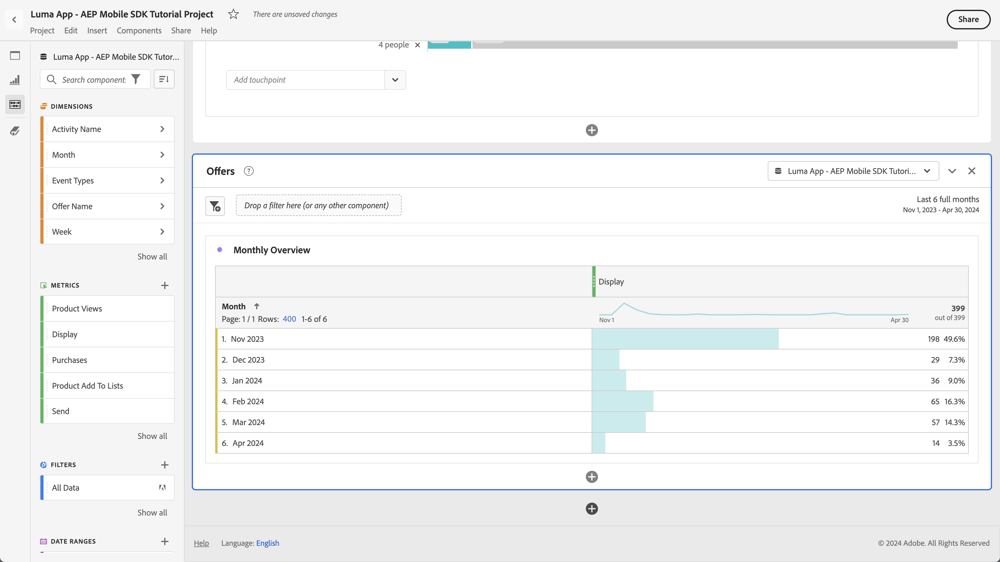

# 使用Customer Journey Analytics報告和分析

瞭解如何透過Customer Journey Analytics報告及分析您的行動應用程式互動。

您在前面的課程中收集並傳送至PlatformEdge Network的行動應用程式事件資料，會轉送至您資料流中設定的服務。 如果您已遵循 [傳送資料給Experience Platform](platform.md) 課程，該資料現在會以資料集的形式儲存在Experience Platform的資料湖中。 這些資料可供Customer Journey Analytics用於報表和分析。

與Adobe Analytics相反，Customer Journey Analytics是具有以下功能的應用程式： *使用* 來自您在Experience Platform中建立的資料集的資料，以及您的應用程式正在將資料傳送到哪些資料集。 使用Adobe Experience Platform Mobile SDK時，資料不會直接傳送至Customer Journey Analytics。 Customer Journey Analytics會改用Experience Platform資料集中的資料。

本教學課程中的課程著重於報告和分析從Luma教學課程應用程式擷取的資料。 Customer Journey Analytics的獨特功能之一，是結合來自多個來源（CRM、銷售點、忠誠度應用程式、客服中心）和管道（網路、行動裝置、離線）的資料，以提供客戶歷程的深入分析。 該功能不在本課程的討論範圍內。 另請參閱 [Customer Journey Analytics概觀](https://experienceleague.adobe.com/en/docs/analytics-platform/using/cja-overview/cja-overview) 以取得詳細資訊。

## 先決條件

必須布建您的組織並授與Customer Journey Analytics的許可權。 您必須擁有Customer Journey Analytics的管理存取權。

## 學習目標

在本課程中，您將會：

- 建立連線，從您要用於Customer Journey Analytics的Experience Platform定義資料集。
- 建立資料檢視，從資料集中準備資料以用於報告和分析
- 建立專案以建立報表和視覺效果，以便分析行動應用程式中的資料。

此訂單是特意的。 在Customer Journey Analytics中，Analysis Workspace中的報表取決於資料檢視。 而且資料檢視取決於連線。

## 建立連線

Customer Journey Analytics中的連線會定義您要用於報表和分析的Experience Platform資料集（以及這些資料集中的資料）。

1. 使用應用程式導覽至Customer Journey Analytics介面  功能表右上方。

1. 選取 **[!UICONTROL 連線]** 從頂端功能表列。

1. 請務必選取 **[!UICONTROL 清單]** 索引標籤進行識別。 您會看到現有連線的清單。

1. 選取 **[!UICONTROL 建立新連線]**.

1. 在 **[!UICONTROL 連線]** > **[!UICONTROL 未命名的連線]** 畫面，在 **[!UICONTROL 連線設定]**

   1. 輸入 **[!UICONTROL 連線名稱]**，例如 `Luma App - AEP Mobile SDK Tutorial Connection`.
   2. 輸入 **[!UICONTROL 連線說明]**，例如 `Connection for the Luma app used in the AEP Mobile SDK tutorial`.

      在 **[!UICONTROL 資料設定]**：

   3. 選取您用來收集行動應用程式資料的沙箱，例如 **[!UICONTROL 行動裝置和Web SDK課程]**.
   4. 選取 **[!UICONTROL 少於100萬]** 從 **[!UICONTROL 每日事件平均數量]**.

   5. 選取 **[!UICONTROL 新增資料集]** 以從Experience Platform中選取您要用於Customer Journey Analytics的資料集。

      

   6. 在 **[!UICONTROL 新增資料集]** 精靈， **[!UICONTROL 選取資料集]** 步驟，

      1. 選取下列資料集：

         - **[!UICONTROL Luma行動應用程式事件資料集]**，也就是您建立為其中一部分的資料集 [建立資料集](platform.md#create-a-dataset) 區段建立關聯Experience Platform。
         - **[!UICONTROL ODE DecisionEvents - *沙箱名稱*] 決策**
         - **[!UICONTROL AJO推播追蹤事件資料集]**

      1. 選取 **[!UICONTROL 下一個]**.

         

   7. 在 **[!UICONTROL 新增資料集]** 精靈， **[!UICONTROL 資料集設定]** 步驟，您必須定義每個事件資料集的詳細資訊。
      1. 請參閱下表以瞭解正確的設定：

         | 資料集 | 人員ID ① | 時間戳記 ② | 資料來源型別③ | 匯入所有新的資料來④ | 回填所有現有資料⑤ |
         |---|---|---|---|---|---|
         | Luma行動應用程式事件資料集 | identityMap | 時間戳記 | 行動應用程式資料 | 啟用 | 啟用 |
         | ODE DecisionEvents - *沙箱名稱* 決策 | identityMap | 時間戳記 | 行動應用程式資料 | 啟用 | 啟用 |
         | AJO推播追蹤體驗事件資料集 | identityMap | 時間戳記 | 行動應用程式資料 | 啟用 | 啟用 |

         

      1. 選取 **[!UICONTROL 新增資料集]**.

1. 返回 **[!UICONTROL 連線]** > **[!UICONTROL Luma應用程式 — AEP Mobile SDK教學課程連線]**，選取 **[!UICONTROL 儲存]** 以儲存您的連線。

   

您現在已定義連線，且Customer Journey Analytics會將資料集中的資料新增至其內部資料庫。 這項資料收集作業可能需要一點時間，視資料量而定。 若是教學課程應用程式，資料預計要過幾個小時才會出現在Customer Journey Analytics中。

若要檢視連線的狀態：

1. 選取 **[!UICONTROL 連線]** 在Customer Journey Analytics的主要介面中。
1. 選取連線的名稱，例如 **[!UICONTROL Luma應用程式 — AEP Mobile SDK教學課程連線]**.

在 **[!UICONTROL 連線]** > **[!UICONTROL Luma應用程式 — AEP Mobile SDK教學課程連線]**，您會看到：

1. 新增的記錄總數、略過的記錄數和刪除的記錄數的相關資訊。 請務必選取 **[!UICONTROL 所有資料集]** 並選取適當的時段，以檢視連線的詳細資訊。 您可以使用  以開啟對話方塊來選取時段。
1. 新增記錄、略過記錄、刪除記錄等專案的個別資料集資訊。

   

## 建立資料檢視

將記錄從資料集新增到Customer Journey Analytics後，您可以建立資料檢視，以定義您要報告的資料元件。

資料檢視是Customer Journey Analytics專屬的容器，可讓您決定如何詮釋來自連線的資料。 您可以從您在連線中定義的任何資料集，將標準和結構欄位設定為Analysis Workspace中的元件（維度、量度）。

Customer Journey Analytics中的資料檢視提供極大的彈性，可正確設定和定義來自您連線的資料。 在本教學課程中，您僅能使用報告和分析所需的功能。 另請參閱 [資料檢視](https://experienceleague.adobe.com/en/docs/analytics-platform/using/cja-dataviews/data-views) 以取得詳細資訊。

若要建立資料檢視：

1. 使用應用程式導覽至Customer Journey Analytics介面  功能表右上方。

1. 選取 **[!UICONTROL 資料檢視]** 從頂端功能表列。
1. 選取 **[!UICONTROL 建立新的資料檢視]**.
1. 在 **[!UICONTROL 資料檢視>]**，確認 **[!UICONTROL 設定]** 標籤已選取。

   1. 從「設定連線」下拉式清單中選取您的連線，例如 **[!UICONTROL Luma應用程式 — AEP Mobile SDK教學課程連線]**.
   1. 輸入資料檢視的「名稱」，例如： `Luma App - AEP Mobile SDK Tutorial Data view`.
   1. 選取 **[!UICONTROL 儲存並繼續]**.

      

1. 在 **[!UICONTROL 元件]** 的標籤 **[!UICONTROL Luma應用程式 — AEP Mobile SDK教學課程資料檢視]**，您可定義在行動應用程式上製作報表時所使用的量度和維度。 根據預設，已為您的資料檢視設定許多標準量度和維度（共同稱為元件）。 但您的資料檢視需要更多元件。  若要新增結構欄位，請從您先前定義的結構描述或現成可用的結構描述(請參閱 [建立結構描述](create-schema.md) 課程)，作為元件（維度或量度）：

   1. 尋找結構欄位：

      - 使用搜尋元件  ***[!UICONTROL 搜尋結構描述欄位]*** 搜尋欄位。 例如， `productListAdd`，或

        

      - 向下捲動至中的結構欄位  **[!UICONTROL 事件資料集]** .  例如，  **[!UICONTROL 事件資料集]**   **[!UICONTROL 商務]**   **[!UICONTROL productListAdds]** 

        

   1. 從「結構描述」欄位窗格中拖曳特定結構描述欄位，並將其放置在 **[!UICONTROL 量度]** 或 **[!UICONTROL Dimension]** 中的清單 [!UICONTROL 包含的元件] 窗格。

      

   1. 您可以配置元件的設定。 選取元件並在右窗格中設定設定。  例如，您可以重新命名 **[!UICONTROL commerce.productListAdds]** 至 `Product Add To Lists` 使用 **[!UICONTROL 元件設定]** > **[!UICONTROL 元件名稱]** 欄位。

      

      或設定 **[!UICONTROL 包含排除值]**.

      

   1. 現在您已瞭解如何將欄位新增至資料檢視並設定結果元件，請使用下表列出要新增為量度或維度的結構描述欄位。 使用 **結構描述路徑** 欄值，用來搜尋或周遊至特定結構描述欄位。 拖放後，檢查 **元件設定** 表格中的欄值元件是否需要特定設定，例如修改元件的 **[!UICONTROL 元件名稱]** 或定義 **[!UICONTROL 包含排除值]**.

      

      **量度**

      | 元件名稱 | 資料集 | 結構描述資料型別 | 結構描述路徑 | 元件設定 |
      |---|---|---|---|---|
      | 關閉 | AJO推播追蹤體驗事件資料集、Luma行動應用程式事件資料集 | 整數 | _experience.decisioning. propositionEventType.discisse | 元件名稱： `Dismiss` |
      | 取消訂閱 | AJO推播追蹤體驗事件資料集、Luma行動應用程式事件資料集 | 整數 | _experience.decisioning. propositionEventType.unsubscribe | 元件名稱： `Unsubscribe` |
      | 觸發 | AJO推播追蹤體驗事件資料集、Luma行動應用程式事件資料集 | 整數 | _experience.decisioning. propositionEventType.trigger | 元件名稱： `Trigger` |
      | 顯示 | AJO推播追蹤體驗事件資料集、Luma行動應用程式事件資料集 | 整數 | _experience.decisioning. propositionEventType.display | 元件名稱： `Display` |
      | 傳送 | AJO推播追蹤體驗事件資料集、Luma行動應用程式事件資料集 | 整數 | _experience.decisioning. propositionEventType.send | 元件名稱： `Send` |
      | 互動 | AJO推播追蹤體驗事件資料集、Luma行動應用程式事件資料集 | 整數 | _experience.decisioning. propositionEventType.interact | 元件名稱： `Interact` |
      | 位置事件 | AJO推播追蹤體驗事件資料集、Luma行動應用程式事件資料集、ODE DecisionEvents — 行動與web-sdk-courses決策 | 字串 | 事件類型 | 元件名稱： `Location Events`   |
      | 產品檢視 | Luma行動應用程式事件資料集 | 雙精度 | commerce.productViews.value | 元件名稱： `Product Views` |
      | 產品新增至清單 | Luma行動應用程式事件資料集 | 雙精度 | commerce.productListAdds.value | 元件名稱： `Product Add To Lists` |
      | 購買次數 | Luma行動應用程式事件資料集 | 雙精度 | commerce.purchases.value | 元件名稱： `Purchases` |
      | 儲存供日後使用次數 | Luma行動應用程式事件資料集 | 雙精度 | commerce.saveForLaters.value | 元件名稱： `Save For Laters` |
      | 應用程式互動 | Luma行動應用程式事件資料集 | 雙精度 | _techmarketingdemos.appInformation. appinteraction.appAction.value | 元件名稱： `App Interactions` |
      | 熒幕檢視 | Luma行動應用程式事件資料集 | 雙精度 | _techmarketingdemos.appInformation. appstateDetails.screenView.value | 元件名稱： `Screen Views` |

      {style="table-layout:auto"}

      請注意「位置事件」量度的結構欄位如何使用 **[!UICONTROL 包含排除值]** 以計算包含下列專案的事件型別： `location`.

      從上表新增所有結構欄位作為量度元件後，您的資料檢視設定為 **[!UICONTROL 量度]** 應如下所示：

      

      **Dimension**

      | 元件名稱 | 資料集 | 結構描述資料型別 | 結構描述路徑 | 元件設定 |
      |---|---|---|---|---|
      | 城市 | AJO推播追蹤體驗事件資料集、Luma行動應用程式事件資料集 | 字串 | placeContext.geo.city | 元件名稱： `City` |
      | 事件型別 | AJO推播追蹤體驗事件資料集、Luma行動應用程式事件資料集、ODE DecisionEvents — 行動與web-sdk-courses決策 | 字串 | eventType | 元件名稱： `Event Types` |
      | 決定選項名稱 | AJO推播追蹤體驗事件資料集、Luma行動應用程式事件資料集、ODE DecisionEvents — 行動與web-sdk-courses決策 | 字串 | _experience.decisioning. propositions.items.name | 元件名稱： `Decision Option Name` |
      | 應用程式互動名稱 | Luma行動應用程式事件資料集 | 字串 | _techmarketingdemos.appInformation. appInteraction.name | 元件名稱： `App Interaction Name` |
      | 畫面名稱 | Luma行動應用程式事件資料集 | 字串 | _techmarketingdemos.appInformation. appStateDetails.screenName | 元件名稱： `Screen Name` |
      | 活動名稱 | ODE DecisionEvents — 行動與web-sdk-courses決策 | 字串 | _experience.decisioning. propositionDetails.activity.name | 元件名稱： `Activity Name` |
      | 優惠方案名稱 | ODE DecisionEvents — 行動與web-sdk-courses決策 | 字串 | _experience.decisioning. propositionDetails.selections.name | 元件名稱： `Offer Name` |

      {style="table-layout:auto"}

      從上表新增所有結構欄位作為維度元件後，您的資料檢視設定為 **[!UICONTROL Dimension]** 應如下所示：

      

   1. 選取 **[!UICONTROL 儲存並繼續]**.

1. 此 **[!UICONTROL 設定]** 的標籤 **[!UICONTROL Luma應用程式 — AEP Mobile SDK教學課程資料檢視]** 可讓您設定篩選器和工作階段設定。 在本教學課程中，您不需要進行額外設定。

   - 選取 **[!UICONTROL 儲存並完成]**.

您已經定義了資料檢視，並已準備好開始建立您的報告和視覺效果。

## 建立專案

您可以使用Customer Journey Analytics中的工作區專案來建置您的報告和視覺效果。 建立完整報表和吸引人的視覺效果有許多可能性，但所有這些可能性不在本教學課程的討論範圍內。 另請參閱 [Workspace概述](https://experienceleague.adobe.com/en/docs/customer-journey-analytics-learn/tutorials/analysis-workspace/workspace-projects/analysis-workspace-overview) 和 [建立新專案](https://experienceleague.adobe.com/en/docs/customer-journey-analytics-learn/tutorials/analysis-workspace/workspace-projects/build-a-new-project) 以取得詳細資訊。

在本課程的這個區段中，您會建立一個專案，在其中顯示報表和視覺效果：

- 應用程式使用情形：使用畫面和應用程式互動上的資訊。
- Commerce：使用商業事件（例如產品檢視）新增到購物車並購買。
- 選件：使用應用程式中顯示的選件事件。
- 商店造訪次數：使用應用程式中的（模擬）地理圍欄事件。

若要建立專案：

1. 使用應用程式導覽至Customer Journey Analytics介面  功能表右上方。

1. 選取 **[!UICONTROL 工作區]** 從頂端功能表列。

1. 選取 **[!UICONTROL 建立專案]**.

   1. 選取 **[!UICONTROL 空白工作區專案]** 從快顯對話方塊開啟。

      

   1. 選取「**[!UICONTROL 建立]**」。

1. 您將會看到 **[!UICONTROL 新專案]** 介面。 您可以在此介面建立報表和視覺效果。

1. 選取專案名稱(**[!UICONTROL 新專案]**)並提供您自己的專案名稱。 例如 `Luma App - AEP Mobile SDK Tutorial Project`。
   

1. 若要儲存專案，請選取 **[!UICONTROL 專案]** > **[!UICONTROL 儲存]**.
   

1. 在 **[!UICONTROL 儲存]** 對話方塊，忽略所有其他欄位並選取 **[!UICONTROL 儲存]**.
   

>[!IMPORTANT]
>
>   請記得定期儲存專案，否則您的變更會遺失。 您可使用以下快速儲存專案 **[!UICONTROL ctrl + s]** (Windows)或 **[!UICONTROL ⌘ (cmd) + s]** (macOS)。

您現在已經設定好專案。 您在主畫布上已經有包含自由表格的自由面板。 您很快就會新增元件至此表格，但您必須先確保您的自由面板使用正確的資料檢視和正確的時間段。

1. 從下拉式清單中選取您的資料檢視。 例如， **[!UICONTROL Luma應用程式 — AEP Mobile SDK教學課程資料檢視]**. 如果在清單中看不到您的資料檢視，請選取 **[!UICONTROL 顯示全部]** 位於下拉式清單底部。
   

1. 若要定義面板的適當時段，請選取預設值 **[!UICONTROL 本月]** 和在快顯面板中定義開始和結束日期。 或使用 **[!UICONTROL 預設集]**，按一下 **[!UICONTROL 過去6個月]** 並選取 **[!UICONTROL 套用]**.
   

### 應用程式使用情形

您想要回報應用程式的使用方式。 您已在應用程式中新增必要的程式碼，以註冊應用程式互動以及在應用程式中使用的畫面(請參閱 [追蹤事件](events.md) 課程)，您現在想要針對此資料製作報表。

#### 熒幕名稱

您首先想報告在應用程式中檢視了哪些畫面。

1. 重新命名您的 **[!UICONTROL 自由格式]** 面板至 `App Usage`.

1. 重新命名您的 **[!UICONTROL 自由表格]** 至 `Screen Names`.

1. 選取 **[!UICONTROL 顯示全部]** 在 **[!UICONTROL 量度]** 清單。

1. 拖放 **[!UICONTROL 熒幕檢視]** 元件於 [!UICONTROL _放置&#x200B;**量度**此處（或任何其他元件）_)].
   
您的自由表格現在會顯示所選時段內幾天的畫面檢視。 不過，您想要針對應用程式中使用的不同畫面顯示畫面檢視。

1. 若要顯示 **[!UICONTROL Dimension]** 元件清單，選取  以移除  **[!UICONTROL 量度]** 從「元件」邊欄中篩選。
   

1. 選取 **[!UICONTROL 顯示全部]** 在 **[!UICONTROL Dimension]** 清單。

1. 拖放 **[!UICONTROL 畫面名稱]** 上的元件 **[!UICONTROL 日]** 標頭。 作業顯示  **[!UICONTROL 取代]** 指示尺寸的取代。
   

您的第一個報表已準備就緒；會在應用程式中顯示您在應用程式中定義的各種熒幕名稱的熒幕檢視。

別忘了儲存專案！

#### 應用程式互動

您也要報告使用者與應用程式的互動情形。

1. 選取  並從快顯視窗中  以新增自由表格。
   

1. 重新命名 **[!UICONTROL 自由表格(2)]** 至 `App Interactions`.

1. 拖放 **[!UICONTROL 應用程式互動]** 量度於 [!UICONTROL _放置&#x200B;**量度**此處（或任何其他元件）_)].

1. 拖放 **[!UICONTROL 應用程式互動名稱]** 上的維度 **[!UICONTROL 日]** 標題來取代此維度。

您的第二個報表現已準備就緒，會顯示應用程式互動。

資訊受限，主要因為您已實施 `MobileSDK.shared.sendAppInteractionEvent(actionName: "<actionName>")` API呼叫只會顯示在登入畫面上。 如果您將此API呼叫新增至應用程式的更多畫面，此報表將提供更多資訊。

別忘了儲存專案！

### Commerce

您現在想要在另一個面板中報告應用程式中發生的商務事件。

#### Commerce事件

1. 選取  在目前之外 [!UICONTROL 應用程式使用情形] 面板，以建立新面板。
   

1. 請確定您選取適當的時段。

1. 選取  **[!UICONTROL 自由表格]** 建立新的自由表格。
   

1. 重新命名 **[!UICONTROL 面板]** 至 `Commerce`.

1. 重新命名 **[!UICONTROL 自由表格]** 至 `Commerce Events`.

1. 拖放 **[!UICONTROL 產品檢視]** 量度開啟至 [!UICONTROL _放置&#x200B;**量度**此處（或任何其他元件）_)].

1. 拖放 **[!UICONTROL 產品新增至清單]** 量度右側 **[!UICONTROL 產品檢視]** 欄，以在自由格式表格中插入此欄。 確定 **[!UICONTROL +新增]** （藍色的）會在插入欄時顯示。
   

1. 重複上一步驟以新增 **[!UICONTROL 儲存供日後使用]** 量度與 **[!UICONTROL 購買]** 量度至自由表格。

1. 拖放 **[!UICONTROL 月]** 維度在 **[!UICONTROL 日]** 維度將報表從每日變更為每月。

您的 **[!UICONTROL Commerce事件]** 報告現已準備就緒，顯示使用者如何檢視產品、將產品新增至其願望清單、儲存產品以供稍後使用，甚至購買您的產品。

別忘了儲存專案！

#### 流失

根據上一個報告，您想要將商業漏斗中的流失視覺化：有多少檢視過產品的使用者也確實將產品新增至購物車。 還有有多少使用者在購物車中新增產品，也儲存了這些產品以供日後使用。 等等。

1. 選取  在 **[!UICONTROL 商務]** 面板，並從快顯視窗中選取  （代表「流失」視覺效果）。

1. 選取 **[!UICONTROL 產品檢視]** 從 [!UICONTROL *新增接觸點*] 下拉式清單。
   
或者，您可以拖放 **[!UICONTROL 產品檢視]** 以下的維度 **[!UICONTROL 所有人員]** 中的維度 **[!UICONTROL 流失]** 視覺效果。

1. 對重複上述步驟 **[!UICONTROL 產品新增至清單]** 和 **[!UICONTROL 購買]** 維度。 您的 **[!UICONTROL 流失]** 視覺效果現在會顯示產品的轉換漏斗的視覺化表示法。
   

別忘了儲存專案！

### 優惠

您想要報告向應用程式使用者顯示的優惠方案數量與優惠方案。

#### 每月概覽

1. 選取  在目前的Commerce面板之外，建立新面板。

1. 重新命名 **[!UICONTROL 面板]** 至 `Offers`.

1. 請確定您選取適當的期間。

1. 選取  自由表格，建立新的自由表格。

1. 重新命名 **[!UICONTROL 自由表格]** 至 `Monthly Overview`.

1. 拖放 **[!UICONTROL 顯示]** 量度開啟至 [!UICONTROL _放置&#x200B;**量度**此處（或任何其他元件）_)].

1. 拖放 **[!UICONTROL 月]** 上的維度 **[!UICONTROL 日]** 欄以取代維度。

您現在有一個報表，顯示應用程式中向使用者顯示的每月優惠方案。

別忘了儲存專案！

#### 優惠方案給人員

您也想要有報表，顯示哪些優惠方案以給予應用程式使用者的數字顯示。

1. 選取  在 **[!UICONTROL 選件]** 面板和 從快顯視窗新增自由表格。

1. 重新命名 **[!UICONTROL 自由表格(2)]** 至 `People`.

1. 拖放 **[!UICONTROL 人員]** 量度開啟至 [!UICONTROL _放置&#x200B;**量度**此處（或任何其他元件）_)].

1. 拖放 **[!UICONTROL 活動名稱]** 於 **[!UICONTROL 日]** 欄以取代維度。

1. 以滑鼠右鍵按一下該列，識別您在 [使用決定管理建立及顯示優惠方案](journey-optimizer-offers.md) 課程。 例如， **[!UICONTROL Luma — 行動應用程式決策]**.

1. 從內容功能表中，選取 **[!UICONTROL 劃分]** > **[!UICONTROL Dimension]** > **[!UICONTROL 選件名稱]**. 此選取範圍會將「活動名稱」維度劃分為「選件名稱」。
   

您現在有一個報表，向您應用程式的使用者顯示所選期間內針對此優惠決定顯示的個別優惠。

別忘了儲存專案！

### 商店造訪

最後，您要報告商店造訪次數。

1. 選取  在目前選件面板之外，建立新面板。

1. 重新命名 **[!UICONTROL 面板]** 至 `Store Visits`.

1. 請確定您選取適當的期間。

1. 選取  自由表格，建立新的自由表格。

1. 重新命名 **[!UICONTROL 自由表格]** 至 `Store Entries / Exits Across Cities`.

1. 拖放 **[!UICONTROL 位置事件]** 量度開啟至 [!UICONTROL _放置&#x200B;**量度**此處（或任何其他元件）_)]. 報表現在會顯示應用程式中發生之所有位置事件的每日概觀。 請記得您如何明確將此維度設定為 [資料檢視](#create-a-data-view).

1. 拖放 **[!UICONTROL 城市]** 上的維度 **[!UICONTROL 日]** 欄標題來取代維度。 報表現在會顯示位置事件的城市。

1. 若要移除沒有城市關聯的地理位置事件，請選取「 」 ，以及中的 **[!UICONTROL 搜尋]** 快顯視窗，關閉 **[!UICONTROL 包含「無值」]**，然後選取 **[!UICONTROL 套用]**.

   

   此動作會移除 **[!UICONTROL 沒有值]** 中的列。

1. 選取表格中的所有列，按一下滑鼠右鍵，然後從內容功能表選取劃分>Dimension>事件型別。

您現在有一個報告，顯示使用者進入和離開商店位置附近(如同您在 [地點](places.md) 課程)。

請注意，如果您確實想要回報實體造訪您商店的人，則可以使用信標。 但願您已擷取地理位置資料報表的概念。

## 後續步驟

您現在應該對如何使用Customer Journey Analytics來報告和視覺化您的行動應用程式使用情形、互動等有了基本的瞭解。

>[!SUCCESS]
>
>
>感謝您花時間學習Adobe Experience Platform Mobile SDK。 如果您有疑問、想要分享一般意見或有關於未來內容的建議，請在此分享這些內容 [Experience League社群討論貼文](https://experienceleaguecommunities.adobe.com/t5/adobe-experience-platform-data/tutorial-discussion-implement-adobe-experience-cloud-in-mobile/td-p/443796).

下一步： **[結論和後續步驟](conclusion.md)**
