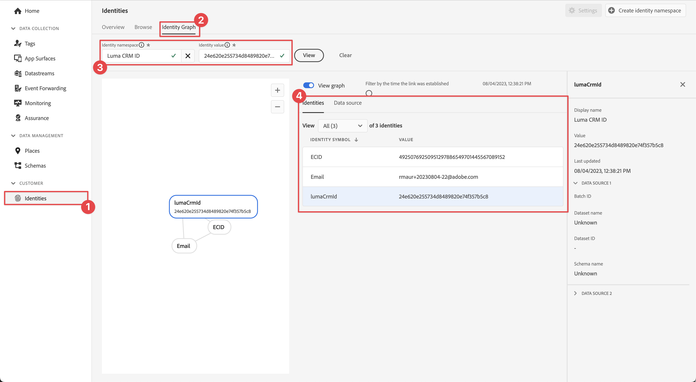

# 收集身分資料

瞭解如何在行動應用程式中收集身分資料。

Adobe Experience Platform Identity Service可協助您更清楚瞭解客戶及其行為。 此服務可跨裝置和系統橋接身分，並讓您即時提供具影響力的個人數位體驗。 身分欄位和名稱空間是將不同資料來源連線在一起，以建立360度即時客戶個人檔案的膠水。

在檔案中進一步瞭解[身分識別擴充功能](https://developer.adobe.com/client-sdks/documentation/identity-for-edge-network/)和[身分識別服務](https://experienceleague.adobe.com/zh-hant/docs/experience-platform/identity/home)。

## 先決條件

* 成功建立並執行應用程式，且已安裝並設定SDK。

## 學習目標

在本課程中，您將會：

* 設定自訂身分名稱空間。
* 更新身分。
* 驗證身分圖表。
* 取得ECID和其他身分。


## 設定自訂身分名稱空間

身分識別名稱空間是[身分識別服務](https://experienceleague.adobe.com/zh-hant/docs/experience-platform/identity/home)的元件，做為身分識別相關內容的指標。 例如，他們將`name@email.com`的值做為電子郵件地址，或將`443522`做為數值CRM ID。

>[!NOTE]
>
>行動SDK會在安裝應用程式時，在其專屬的名稱空間中產生一個唯一身分識別，名為Experience Cloud ID (ECID)。 此ECID會儲存在行動裝置的永久性記憶體中，並隨著每次點選而傳送。 ECID會在使用者解除安裝應用程式，或使用者將Mobile SDK全域隱私權狀態設定為選擇退出時移除。 在範例Luma應用程式中，您應該移除並重新安裝應用程式，以建立具有自己唯一ECID的新設定檔。


若要建立新的身分名稱空間：

1. 在資料收集介面中，從左側欄導覽選取&#x200B;**[!UICONTROL 身分]**。
1. 選取&#x200B;**[!UICONTROL 建立身分識別命名空間]**。
1. 提供&#x200B;**[!UICONTROL 的]**&#x200B;顯示名稱`Luma CRM ID`和&#x200B;**[!UICONTROL 的]**&#x200B;身分識別符號`lumaCRMId`值。
1. 選取&#x200B;**[!UICONTROL 跨裝置識別碼]**。
1. 選取「**[!UICONTROL 建立]**」。

   {zoomable="yes"}


## 更新身分

您想要在使用者登入應用程式時更新標準身分（電子郵件）和自訂身分(Luma CRM ID)。

>[!BEGINTABS]

>[!TAB iOS]

1. 導覽至Xcode專案導覽器中的&#x200B;**[!DNL Luma]** > **[!DNL Luma]** > **[!DNL Utils]** > **[!UICONTROL MobileSDK]**，並尋找`func updateIdentities(emailAddress: String, crmId: String)`函式實作。 將下列程式碼新增至函式。

   ```swift
   // Set up identity map, add identities to map and update identities
   let identityMap: IdentityMap = IdentityMap()
   
   let emailIdentity = IdentityItem(id: emailAddress, authenticatedState: AuthenticatedState.authenticated)
   let crmIdentity = IdentityItem(id: crmId, authenticatedState: AuthenticatedState.authenticated)
   identityMap.add(item:emailIdentity, withNamespace: "Email")
   identityMap.add(item: crmIdentity, withNamespace: "lumaCRMId")
   
   Identity.updateIdentities(with: identityMap)
   ```

   此程式碼：

   1. 建立空的`IdentityMap`物件。

      ```swift
      let identityMap: IdentityMap = IdentityMap()
      ```

   1. 設定電子郵件與CRM ID的`IdentityItem`物件。

      ```swift
      let emailIdentity = IdentityItem(id: emailAddress, authenticatedState: AuthenticatedState.authenticated)
      let crmIdentity = IdentityItem(id: crmId, authenticatedState: AuthenticatedState.authenticated)
      ```

   1. 將這`IdentityItem`個物件新增至`IdentityMap`物件。

      ```swift
      identityMap.add(item:emailIdentity, withNamespace: "Email")
      identityMap.add(item: crmIdentity, withNamespace: "lumaCRMId")
      ```

   1. 將`IdentityItem`物件當作`Identity.updateIdentities` API呼叫的一部分傳送至Edge Network。

      ```swift
      Identity.updateIdentities(with: identityMap) 
      ```

1. 導覽至Xcode專案導覽器中的&#x200B;**[!DNL Luma]** > **[!DNL Luma]** > **[!DNL Views]** > **[!DNL General]** > **[!UICONTROL 登入工作表]**，並尋找在選取&#x200B;**[!UICONTROL 登入]**&#x200B;按鈕時要執行的程式碼。 新增下列程式碼：

   ```swift
   // Update identities
   MobileSDK.shared.updateIdentities(emailAddress: currentEmailId, crmId: currentCRMId)                             
   ```


>[!TAB Android]

1. 導覽至Android Studio導覽器中的&#x200B;**[!UICONTROL Android]**  > **[!DNL app]** > **[!DNL kotlin+java]** > **[!DNL com.adobe.luma.tutorial.android]** > **[!UICONTROL 模型]** > **[!UICONTROL MobileSDK]**，並尋找`fun updateIdentities(emailAddress: String, crmId: String) `函式實作。 將下列程式碼新增至函式。

   ```kotlin
   // Set up identity map, add identities to map and update identities
   val identityMap = IdentityMap()
   
   val emailIdentity = IdentityItem(emailAddress, AuthenticatedState.AUTHENTICATED, true)
   val crmIdentity = IdentityItem(crmId, AuthenticatedState.AUTHENTICATED, true)
   identityMap.addItem(emailIdentity, "Email")
   identityMap.addItem(crmIdentity, "lumaCRMId")
   
   Identity.updateIdentities(identityMap)
   ```

   此程式碼：

   1. 建立空的`IdentityMap`物件。

      ```kotlin
      val identityMap = IdentityMap()
      ```

   1. 設定電子郵件與CRM ID的`IdentityItem`物件。

      ```kotlin
      val emailIdentity = IdentityItem(emailAddress, AuthenticatedState.AUTHENTICATED, true)
      val crmIdentity = IdentityItem(crmId, AuthenticatedState.AUTHENTICATED, true)
      ```

   1. 將這`IdentityItem`個物件新增至`IdentityMap`物件。

      ```kotlin
      identityMap.addItem(emailIdentity, "Email")
      identityMap.addItem(crmIdentity, "lumaCRMId")
      ```

   1. 將`IdentityItem`物件當作`Identity.updateIdentities` API呼叫的一部分傳送至Edge Network。

      ```kotlin
      Identity.updateIdentities(identityMap)
      ```

1. 導覽至Android Studio導覽器中的&#x200B;**[!UICONTROL Android]**  > **[!DNL app]** > **[!DNL kotlin+java]** > **[!DNL com.adobe.luma.tutorial.android]** > **[!UICONTROL 檢視]** > **[!UICONTROL LoginSheet.kt]**，並尋找在選取&#x200B;**[!UICONTROL Login]**&#x200B;按鈕時要執行的程式碼。 新增下列程式碼：

   ```kotlin
   // Update identities
   MobileSDK.shared.updateIdentities(
      MobileSDK.shared.currentEmailId.value,
      MobileSDK.shared.currentCRMId.value
   )                             
   ```


>[!ENDTABS]


>[!NOTE]
>
>您可以在單一`updateIdentities`呼叫中傳送多個身分。 您也可以修改先前傳送的身分。


## 移除身分

您可以使用[`Identity.removeIdentity`](https://developer.adobe.com/client-sdks/documentation/identity-for-edge-network/api-reference/#removeidentity) API從儲存的使用者端身分對應移除身分識別。 身分擴充功能會停止將識別碼傳送至Edge Network。 使用此API不會從伺服器端身分識別圖形中移除識別碼。 請參閱[檢視身分圖](https://experienceleague.adobe.com/zh-hant/docs/platform-learn/tutorials/identities/view-identity-graphs)，以取得身分圖的詳細資訊。


>[!BEGINTABS]

>[!TAB iOS]

1. 導覽至Xcode專案導覽器中的&#x200B;**[!DNL Luma]** > **[!DNL Luma]** > **[!DNL Utils]** > **[!UICONTROL MobileSDK]**，並將下列程式碼新增至`func removeIdentities(emailAddress: String, crmId: String)`函式：

   ```swift
   // Remove identities and reset email and CRM Id to their defaults
   Identity.removeIdentity(item: IdentityItem(id: emailAddress), withNamespace: "Email")
   Identity.removeIdentity(item: IdentityItem(id: crmId), withNamespace: "lumaCRMId")
   currentEmailId = "testUser@gmail.com"
   currentCRMId = "b642b4217b34b1e8d3bd915fc65c4452"
   ```

1. 導覽至Xcode專案導覽器中的&#x200B;**[!DNL Luma]** > **[!DNL Luma]** > **[!DNL Views]** > **[!DNL General]** > **[!UICONTROL 登入工作表]**，並尋找在選取&#x200B;**[!UICONTROL 登出]**&#x200B;按鈕時要執行的程式碼。 新增下列程式碼：

   ```swift
   // Remove identities
   MobileSDK.shared.removeIdentities(emailAddress: currentEmailId, crmId: currentCRMId)                  
   ```

>[!TAB Android]

1. 導覽至Android Studio導覽器中的&#x200B;**[!UICONTROL Android]**  > **[!DNL app]** > **[!DNL kotlin+java]** > **[!DNL com.adobe.luma.tutorial.android]** > **[!UICONTROL 模型]** > **[!UICONTROL MobileSDK]**，並將下列程式碼新增至`fun removeIdentities(emailAddress: String, crmId: String)`函式：

   ```kotlin
   // Remove identities and reset email and CRM Id to their defaults
   Identity.removeIdentity(IdentityItem(emailAddress), "Email")
   Identity.removeIdentity(IdentityItem(crmId), "lumaCRMId")
   currentEmailId.value = "testUser@gmail.com"
   currentCRMId.value = "112ca06ed53d3db37e4cea49cc45b71e"
   ```

1.導覽至Android Studio導覽器中的&#x200B;**[!DNL app]** > **[!DNL kotlin+java]** > **[!DNL com.adobe.luma.tutorial.android]** > **[!UICONTROL 檢視]** > **[!UICONTROL LoginSheet.kt]**，並尋找在選取&#x200B;**[!UICONTROL 登出]**&#x200B;按鈕時要執行的程式碼。 新增下列程式碼：

```kotlin
// Remove identities
MobileSDK.shared.removeIdentities(
   MobileSDK.shared.currentEmailId.value,
   MobileSDK.shared.currentCRMId.value
)              
```


>[!ENDTABS]

## 使用保證進行驗證

1. 檢閱[設定指示](assurance.md#connecting-to-a-session)區段，將您的模擬器或裝置連線到Assurance。
1. 在Luma應用程式中
   1. 選取「**[!UICONTROL 首頁]**」標籤，並將Assurance圖示向左移動。
   1. 從右上角選取圖示。

>[!BEGINTABS]

>[!TAB iOS]


>[!TAB Android]


>[!ENDTABS]

1. 提供電子郵件地址和CRM ID，或
1. 選取&#x200B;**[!UICONTROL A |]** (iOS)或&#x200B;**[!UICONTROL 產生隨機電子郵件]** (Android)以隨機產生&#x200B;**[!UICONTROL 電子郵件]**&#x200B;和&#x200B;**[!UICONTROL CRM ID]**。
1. 選取&#x200B;**[!UICONTROL 登入]**。

>[!BEGINTABS]

>[!TAB iOS]


>[!TAB Android]


>[!ENDTABS]

返回Assurance：

1. 從&#x200B;**[!UICONTROL com.adobe.griffon.mobile]**&#x200B;廠商檢查&#x200B;**[!UICONTROL Edge身分更新身分]**&#x200B;事件的Assurance Web介面。
1. 選取事件並檢閱&#x200B;**[!UICONTROL ACPExtensionEventData]**&#x200B;物件中的資料。 您應該會看到已更新的身分識別。
   {zoomable="yes"}

## 使用身分圖表進行驗證

完成[Experience Platform課程](platform.md)中的步驟後，您就可以在Experience Platform身分圖表檢視器中確認身分擷取：

1. 在資料收集UI中選取&#x200B;**[!UICONTROL 身分]**。
1. 從頂端列選取&#x200B;**[!UICONTROL 身分圖表]**。
1. 輸入`Luma CRM ID`作為&#x200B;**[!UICONTROL 身分識別名稱空間]**，並輸入您的CRM ID （例如`24e620e255734d8489820e74f357b5c8`）作為&#x200B;**[!UICONTROL 身分識別值]**。
1. 您會看到列出的&#x200B;**[!UICONTROL 身分]**。

   {zoomable="yes"}

>[!INFO]
>
>應用程式中沒有可重設ECID的程式碼。 您只能透過解除安裝與重新安裝應用程式來重設ECID （並有效建立具有新ECID的新設定檔）。 若要實作識別碼的重設，請參閱[`Identity.resetIdentities`](https://developer.adobe.com/client-sdks/documentation/mobile-core/identity/api-reference/#resetidentities)與[`MobileCore.resetIdentities`](https://developer.adobe.com/client-sdks/documentation/mobile-core/api-reference/#resetidentities) API呼叫。 請注意，當您使用推播通知識別碼（請參閱[傳送推播通知](journey-optimizer-push.md)）時，該識別碼會成為裝置上的另一個「粘性」設定檔識別碼。


>[!SUCCESS]
>
>您現在已設定應用程式，以在Edge Network和（設定後）Adobe Experience Platform中更新身分識別。
>
>感謝您花時間學習Adobe Experience Platform Mobile SDK。 如果您有疑問、想分享一般意見或有關於未來內容的建議，請在這篇[Experience League社群討論貼文](https://experienceleaguecommunities.adobe.com/t5/adobe-experience-platform-data/tutorial-discussion-implement-adobe-experience-cloud-in-mobile/td-p/443796)上分享

下一步： **[收集設定檔資料](profile.md)**
