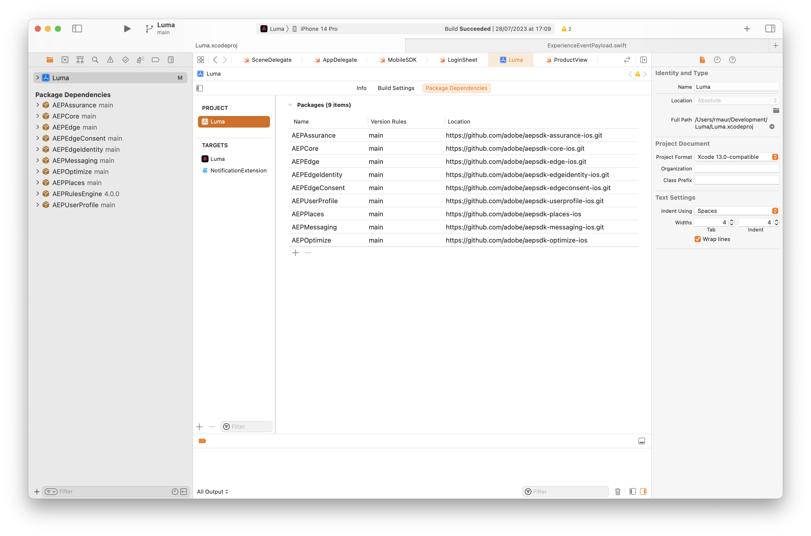

# 安裝 Adobe Experience Platform Mobile SDK {#tutorial_install_mobile_sdks}

>[!CONTEXTUALHELP]
>
>id="platform_mobile_sdk_tutorial_install"
>title="安裝 Adobe Experience Platform Mobile SDK"
>abstract="了解如何在行動應用程式中實作 Adobe Experience Platform Mobile SDK。"

了解如何在行動應用程式中實作 Adobe Experience Platform Mobile SDK。

## 先決條件

* 已成功使用[上一課](configure-tags.md)中所述的擴充功能建置標籤程式庫。
* 來自[行動安裝指示](configure-tags.md#generate-sdk-install-instructions)的開發環境檔案識別碼。
* 已下載空的[範例應用程式](https://github.com/Adobe-Marketing-Cloud/Luma-iOS-Mobile-App){target="_blank"}。
* 使用[Xcode](https://developer.apple.com/xcode/){target="_blank"}的體驗。

## 學習目標

在本課程中，您將會：

* 使用Swift封裝管理程式，將必要的SDK新增至您的專案。
* 註冊擴充功能。

>[!NOTE]
>
>在行動應用程式實作中，「擴充功能」和「SDK」這兩個辭彙幾乎可以互換。

## Swift封裝管理程式

您可以使用Xcode的原生Swift封裝管理員，新增個別封裝，而不使用CocoaPods和Pod檔案(如[產生SDK安裝指示](./configure-tags.md#generate-sdk-install-instructions)中所述)。 Xcode專案已經為您新增了所有套件相依性。 Xcode **[!UICONTROL 封裝相依性]**&#x200B;畫面應該如下所示：

{zoomable="yes"}


在Xcode中，您可以使用&#x200B;**[!UICONTROL 檔案]** > **[!UICONTROL 新增封裝……]**&#x200B;來新增封裝。 下表提供您用來新增套件的URL連結。 這些連結也會將您導向每個特定套件的詳細資訊。

| 套件 | 說明 |
|---|---|
| [AEP核心](https://github.com/adobe/aepsdk-core-ios) | `AEPCore`、`AEPServices`和`AEPIdentity`擴充功能代表Adobe Experience Platform SDK的基礎，每個使用SDK的應用程式都必須包含這些擴充功能。 這些模組包含所有SDK擴充功能所需的一組通用功能與服務。<br/><ul><li>`AEPCore`包含事件中樞的實作。 事件中心是在應用程式和SDK之間傳送事件的機制。 事件中心也用於在擴充功能之間共用資料。</li><li>`AEPServices`提供平台支援所需的數個可重複使用的實作，包括網路、磁碟存取和資料庫管理。</li><li>`AEPIdentity`實作與Adobe Experience Platform Identity服務的整合。</li><li>`AEPSignal`代表Adobe Experience Platform SDK Signal擴充功能，可讓行銷人員傳送「訊號」至其應用程式，以將資料傳送至外部目的地或開啟URL。</li><li>`AEPLifecycle`代表Adobe Experience Platform SDK生命週期擴充功能，可協助收集應用程式生命週期量度，例如應用程式安裝或升級資訊、應用程式啟動和工作階段資訊、裝置資訊，以及應用程式開發人員提供的任何其他內容資料。</li></ul> |
| [AEP Edge](https://github.com/adobe/aepsdk-edge-ios) | Adobe Experience PlatformEdge Network行動擴充功能(`AEPEdge`)可讓您從行動應用程式傳送資料至Adobe Edge Network。 此擴充功能可讓您以更強大的方式實施Adobe Experience Cloud功能、透過單一網路呼叫提供多個Adobe解決方案，並同時將此資訊轉送至Adobe Experience Platform。<br/>Edge Network行動擴充功能是Adobe Experience Platform SDK的擴充功能，且需要`AEPCore`和`AEPServices`擴充功能才能處理事件，並需要`AEPEdgeIdentity`擴充功能才能擷取身分（例如ECID）。 |
| [AEP Edge身分](https://github.com/adobe/aepsdk-edgeidentity-ios) | AEP Edge Identity行動擴充功能(`AEPEdgeIdentity`)可在使用Adobe Experience Platform SDK和Edge Network擴充功能時，從行動應用程式處理使用者身分資料。 |
| [AEP Edge同意](https://github.com/adobe/aepsdk-edgeconsent-ios) | AEP同意收集行動擴充功能(`AEPConsent`)可在使用Adobe Experience Platform SDK和Edge Network擴充功能時，從行動應用程式收集同意偏好設定。 |
| [AEP使用者設定檔](https://github.com/adobe/aepsdk-userprofile-ios) | Adobe Experience Platform使用者設定檔行動擴充功能(`AEPUserProfile`)是管理Adobe Experience Platform SDK使用者設定檔的擴充功能。 |
| [AEP地點](https://github.com/adobe/aepsdk-places-ios) | AEP Places擴充功能(`AEPPlaces`)可讓您追蹤AdobePlaces介面和Adobe資料收集標籤規則中定義的地理位置事件。 |
| [AEP訊息](https://github.com/adobe/aepsdk-messaging-ios) | AEP Messaging擴充功能(`AEPMessaging`)可讓您將推播通知權杖和推播通知點進意見傳送至Adobe Experience Platform。 |
| [AEP最佳化](https://github.com/adobe/aepsdk-optimize-ios) | AEP最佳化擴充功能(`AEPOptimize`)提供API，以便使用Adobe Target或Adobe Journey OptimizerOffer decisioning在Adobe Experience Platform Mobile SDK中啟用即時個人化工作流程。 它需要`AEPCore`和`AEPEdge`擴充功能，才能將個人化查詢事件傳送至Experience Edge網路。 |
| [AEP Assurance](https://github.com/adobe/aepsdk-assurance-ios) | Assurance （也稱為專案Griffon）是全新創新的擴充功能(`AEPAssurance`)，可協助您檢查、證明、模擬及驗證如何在行動應用程式中收集資料或提供體驗。 此擴充功能可讓您的應用程式使用Assurance。 |


## 匯入擴充功能

在Xcode中，導覽至&#x200B;**[!DNL Luma]** > **[!DNL Luma]** > **[!UICONTROL AppDelegate]**，並確定下列匯入為此來源檔案的一部分。

```swift
// import AEP MobileSDK libraries
import AEPCore
import AEPServices
import AEPIdentity
import AEPSignal
import AEPLifecycle
import AEPEdge
import AEPEdgeIdentity
import AEPEdgeConsent
import AEPUserProfile
import AEPPlaces
import AEPMessaging
import AEPOptimize
import AEPAssurance
```

對&#x200B;**[!DNL Luma]** > **[!DNL Luma]** > **[!DNL Utils]** > **[!UICONTROL MobileSDK]**&#x200B;執行相同操作。

## 更新AppDelegate

導覽至Xcode專案導覽器中的&#x200B;**[!DNL Luma]** > **[!DNL Luma]** > **AppDelegate**。

1. 將`environmentFileId`的`@AppStorage`值`YOUR_ENVIRONMENT_ID_GOES_HERE`取代為您從[產生SDK安裝指示](configure-tags.md#generate-sdk-install-instructions)中的標籤擷取的開發環境檔案識別碼值。

   ```swift
   @AppStorage("environmentFileId") private var environmentFileId = "YOUR_ENVIRONMENT_ID_GOES_HERE"
   ```

1. 將下列程式碼新增至`application(_, didFinishLaunchingWithOptions)`函式。

   ```swift
   // Define extensions
   let extensions = [
       AEPIdentity.Identity.self,
       Lifecycle.self,
       Signal.self,
       Edge.self,
       AEPEdgeIdentity.Identity.self,
       Consent.self,
       UserProfile.self,
       Places.self,
       Messaging.self,
       Optimize.self,
       Assurance.self
   ]
   
   // Register extensions
   MobileCore.registerExtensions(extensions, {
       // Use the environment file id assigned to this application via Adobe Experience Platform Data Collection
       Logger.aepMobileSDK.info("Luma - using mobile config: \(self.environmentFileId)")
       MobileCore.configureWith(appId: self.environmentFileId)
   
       // set this to false or comment it when deploying to TestFlight (default is false),
       // set this to true when testing on your device.
       MobileCore.updateConfigurationWith(configDict: ["messaging.useSandbox": true])
       if appState != .background {
           // only start lifecycle if the application is not in the background
           MobileCore.lifecycleStart(additionalContextData: nil)
       }
   
       // assume unknown, adapt to your needs.
       MobileCore.setPrivacyStatus(.unknown)
   })
   ```

上述程式碼會執行下列動作：

1. 註冊必要的副檔名。
1. 設定MobileCore和其他擴充功能以使用標籤屬性設定。
1. 啟用偵錯記錄。 如需詳細資訊和選項，請參閱[Adobe Experience Platform Mobile SDK檔案](https://developer.adobe.com/client-sdks/documentation/getting-started/enable-debug-logging/)。
1. 開始生命週期監視。 如需詳細資訊，請參閱教學課程中的[生命週期](lifecycle-data.md)步驟。
1. 將預設同意設定為未知。 如需詳細資訊，請參閱教學課程中的[同意](consent.md)步驟。

>[!IMPORTANT]
>
>請確定您根據您正在建置的標籤環境（開發、測試或生產） `environmentFileId`，使用`appId`更新`MobileCore.configureWith(appId: self.environmentFileId)`。
>

>[!SUCCESS]
>
>您現在已安裝必要的套件，並更新專案，以正確註冊您要在教學課程的其餘部分使用的必要Adobe Experience Platform Mobile SDK擴充功能。
>
>感謝您花時間學習Adobe Experience Platform Mobile SDK。 如果您有疑問、想分享一般意見或有關於未來內容的建議，請在這篇[Experience League社群討論貼文](https://experienceleaguecommunities.adobe.com/t5/adobe-experience-platform-data/tutorial-discussion-implement-adobe-experience-cloud-in-mobile/td-p/443796)上分享

下一步： **[設定Assurance](assurance.md)**
