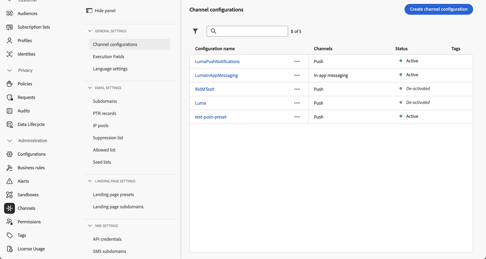
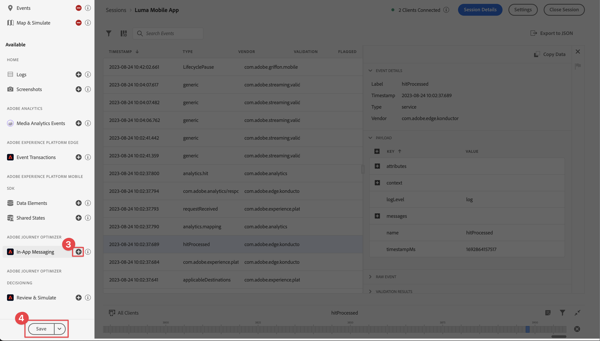

# 建立和傳送應用程式內訊息

瞭解如何使用Experience Platform Mobile SDK和Journey Optimizer為行動應用程式建立應用程式內訊息。

Journey Optimizer可讓您建立行銷活動，以傳送應用程式內訊息給目標對象。 Journey Optimizer中的行銷活動是用來透過各種管道，將一次性內容傳送給特定對象。 透過行銷活動，可同時執行動作（立即執行或根據指定排程執行）。 使用歷程時(請參閱[Journey Optimizer推播通知](journey-optimizer-push.md)課程)，動作會依序執行。


在使用Journey Optimizer傳送應用程式內訊息之前，您必須確保有適當的設定和整合。 若要瞭解Journey Optimizer中的應用程式內傳訊資料流程，請參閱[檔案](https://experienceleague.adobe.com/docs/journey-optimizer/using/in-app/inapp-configuration.html?lang=zh-Hant)。

>[!NOTE]
>
>本課程為選修課程，僅適用於想要傳送應用程式內訊息的Journey Optimizer使用者。


## 先決條件

* 成功建立並執行應用程式，且已安裝並設定SDK。
* 為Adobe Experience Platform設定應用程式。
* 如[此處](https://experienceleague.adobe.com/docs/journey-optimizer/using/push/push-config/push-configuration.html?lang=zh-Hant)所述，存取Journey Optimizer和足夠的許可權。 此外，您需要足夠的許可權才能使用下列Journey Optimizer功能。
   * 管理行銷活動。
* 實體iOS裝置或模擬器以進行測試。


## 學習目標

在本課程中，您將學習

* 在AJO中建立應用程式表面。
* 安裝並設定Journey Optimizer標籤擴充功能。
* 更新您的應用程式以註冊Journey Optimizer標籤擴充功能。
* 驗證Assurance中的設定。
* 在Journey Optimizer中定義您自己的促銷活動和應用程式內訊息體驗。
* 從應用程式內傳送您自己的應用程式內訊息。

## 設定

>[!TIP]
>
>如果您已將環境設定為[Journey Optimizer推播訊息](journey-optimizer-push.md)課程的一部分，則您可能已執行此設定區段中的某些步驟。


### 在Journey Optimizer中建立管道設定

若要開始，您必須建立通道設定，才能從Journey Optimizer傳送應用程式訊息通知。

1. 在Journey Optimizer介面中，開啟&#x200B;**[!UICONTROL 頻道]** > **[!UICONTROL 一般設定]** > **[!UICONTROL 頻道設定]**&#x200B;功能表，然後選取&#x200B;**[!UICONTROL 建立頻道設定]**。

   

1. 輸入設定的名稱和說明（選擇性）。

   >[!NOTE]
   >
   > 名稱必須以字母(A-Z)開頭。 它只能包含英數字元。 您也可以使用底線 `_`、點 `.` 和連字號 `-` 字元。


1. 若要將自訂或核心資料使用標籤指派給組態，您可以選取&#x200B;**[!UICONTROL 管理存取權]**。 [進一步瞭解物件層級存取控制(OLAC)](https://experienceleague.adobe.com/zh-hant/docs/journey-optimizer/using/access-control/object-based-access)。

1. 選取&#x200B;**應用程式內傳訊**&#x200B;頻道。

1. 選取&#x200B;**[!UICONTROL 行銷動作]**，以使用此設定將同意原則與訊息相關聯。 系統會運用與行銷動作相關的所有同意政策，以尊重客戶的偏好設定。 [進一步瞭解行銷動作](https://experienceleague.adobe.com/zh-hant/docs/journey-optimizer/using/privacy/consent/consent#surface-marketing-actions)。

1. 選取您要定義設定的平台。 這可讓您為每個平台指定目標應用程式，並確保跨多個平台的一致內容傳送。

   >[!NOTE]
   >
   >對於iOS和Android平台，傳送完全以應用程式ID為基礎。 如果兩個應用程式共用相同的應用程式ID，則無論在&#x200B;**[!UICONTROL 頻道設定]**&#x200B;中選取的平台為何，都會將內容傳送給兩者。

1. 選取&#x200B;**[!UICONTROL 提交]**&#x200B;以儲存您的變更。

   

### 更新資料流設定

為確保將從您的行動應用程式傳送至Edge Network的資料轉送至Journey Optimizer，請更新您的Experience Edge設定。


1. 在資料收集UI中，選取&#x200B;**[!UICONTROL 資料串流]**，然後選取您的資料串流，例如&#x200B;**[!DNL Luma Mobile App]**。
1. 選取&#x200B;**[!UICONTROL Experience Platform]**&#x200B;的，並從內容功能表選取 **[!UICONTROL 編輯]**。
1. 在&#x200B;**[!UICONTROL 資料串流]** >  > **[!UICONTROL Adobe Experience Platform]**&#x200B;畫面中，確定已選取&#x200B;**[!UICONTROL Adobe Journey Optimizer]**。 如需詳細資訊，請參閱[Adobe Experience Platform設定](https://experienceleague.adobe.com/docs/experience-platform/datastreams/configure.html?lang=zh-Hant#aep)。
1. 若要儲存您的資料流組態，請選取&#x200B;**[!UICONTROL 儲存]**。


   


### 安裝Journey Optimizer標籤擴充功能

若要讓應用程式與Journey Optimizer搭配使用，您必須更新標籤屬性。

1. 導覽至&#x200B;**[!UICONTROL 標籤]** > **[!UICONTROL 擴充功能]** > **[!UICONTROL 目錄]**。
1. 開啟您的屬性，例如&#x200B;**[!DNL Luma Mobile App Tutorial]**。
1. 選取&#x200B;**[!UICONTROL 目錄]**。
1. 搜尋&#x200B;**[!UICONTROL Adobe Journey Optimizer]**&#x200B;擴充功能。
1. 安裝擴充功能。

當&#x200B;*僅*&#x200B;在您的應用程式中使用應用程式內訊息時，在&#x200B;**[!UICONTROL 安裝擴充功能]**&#x200B;或&#x200B;**[!UICONTROL 設定擴充功能]**&#x200B;中，您不需要設定任何專案。 不過，如果您已按照教學課程中的[推播通知](journey-optimizer-push.md)課程進行，您會看到針對&#x200B;**[!UICONTROL 開發]**&#x200B;環境，已從&#x200B;**[!UICONTROL 事件資料集]**&#x200B;清單中選取&#x200B;**[!UICONTROL AJO推播追蹤體驗事件資料集]**&#x200B;資料集。


### 在應用程式中實作Journey Optimizer

如先前課程所述，安裝行動標籤擴充功能僅會提供設定。 接下來，您必須安裝並註冊傳訊SDK。 如果未清除這些步驟，請檢閱[安裝SDK](install-sdks.md)區段。

>[!NOTE]
>
>如果您已完成[安裝SDK](install-sdks.md)區段，則表示已安裝SDK，您可以略過此步驟。
>

1. 在Xcode中，請確定已將[AEP訊息](https://github.com/adobe/aepsdk-messaging-ios)新增至套件相依性中的套件清單中。 請參閱[Swift封裝管理員](install-sdks.md#swift-package-manager)。
1. 導覽至Xcode專案導覽器中的&#x200B;**[!DNL Luma]** > **[!DNL Luma]** > **[!UICONTROL AppDelegate]**。
1. 請確定`AEPMessaging`是匯入清單的一部分。

   `import AEPMessaging`

1. 請確定`Messaging.self`是您註冊的擴充功能陣列的一部分。

   ```swift
   let extensions = [
       AEPIdentity.Identity.self,
       Lifecycle.self,
       Signal.self,
       Edge.self,
       AEPEdgeIdentity.Identity.self,
       Consent.self,
       UserProfile.self,
       Places.self,
       Messaging.self,
       Optimize.self,
       Assurance.self
   ]
   ```


## 使用Assurance驗證設定

1. 檢閱[設定指示](assurance.md#connecting-to-a-session)區段，將您的模擬器或裝置連線到Assurance。
1. 在Assurance UI中，選取&#x200B;**[!UICONTROL 設定]**。
   
1. 選取&#x200B;**[!UICONTROL 應用程式內傳訊]**&#x200B;旁的按鈕。
1. 選取「**[!UICONTROL 儲存]**」。
   
1. 從左側導覽中選取&#x200B;**[!UICONTROL 應用程式內傳訊]**。
1. 選取&#x200B;**[!UICONTROL 驗證]**&#x200B;標籤。 確認您沒有收到任何錯誤。

   


## 建立您自己的應用程式內訊息

若要建立您自己的應用程式內訊息，您必須在Journey Optimizer中定義行銷活動，以根據發生的事件觸發應用程式內訊息。 這些事件可以是：

* 資料傳送至Adobe Experience Platform，
* 核心追蹤事件，例如動作，或透過行動核心通用API的PII資料狀態或集合，
* 應用程式生命週期事件，例如，啟動、安裝、升級、關閉或當機。
* 地理位置事件，例如進入或退出地標。

在本教學課程中，您將會使用Mobile Core一般API和獨立於擴充功能的API （請參閱[Mobile Core generic API](https://developer.adobe.com/client-sdks/documentation/mobile-core/#mobile-core-generic-apis)），以方便使用者畫面、動作和PII資料的事件追蹤。 這些API產生的事件會發佈至SDK事件中樞，並可由擴充功能使用。 SDK事件中樞提供與所有Mobile Platform SDK擴充功能繫結的核心資料結構，並維護註冊的擴充功能和內部模組清單、註冊的事件接聽程式清單以及共用狀態資料庫。

SDK事件中心會發佈和接收來自已註冊擴充功能的事件資料，以簡化與Adobe和協力廠商解決方案的整合。 例如，安裝「最佳化」擴充功能時，事件中樞會處理所有請求以及與Journey Optimizer — 決定管理優惠引擎的互動。

1. 在Journey Optimizer UI中，從左側邊欄選取&#x200B;**[!UICONTROL 促銷活動]**。
1. 選取&#x200B;**[!UICONTROL 建立行銷活動]**。
1. 在&#x200B;**[!UICONTROL 建立行銷活動]**&#x200B;畫面中：
   1. 選取&#x200B;**[!UICONTROL 應用程式內訊息]**，並從&#x200B;**[!UICONTROL 應用程式表面]**&#x200B;清單中選取應用程式表面，例如&#x200B;**[!DNL Luma Mobile App]**。
   1. 選取&#x200B;**[!UICONTROL 建立]**

      
1. 在促銷活動定義畫面的&#x200B;**[!UICONTROL 屬性]**&#x200B;中，輸入促銷活動的&#x200B;**[!UICONTROL 名稱]**，例如`Luma - In-App Messaging Campaign`，以及&#x200B;**[!UICONTROL 描述]**，例如`In-app messaging campaign for Luma app`。
   
1. 向下捲動至&#x200B;**[!UICONTROL 動作]**，然後選取&#x200B;**[!UICONTROL 編輯內容]**。
1. 在&#x200B;**[!UICONTROL 應用程式內訊息]**&#x200B;畫面中：
   1. 選取&#x200B;**[!UICONTROL 模型]**&#x200B;作為&#x200B;**[!UICONTROL 訊息配置]**。
   2. 輸入&#x200B;**[!UICONTROL 媒體URL]**&#x200B;的`https://luma.enablementadobe.com/content/dam/luma/en/logos/Luma_Logo.png`。
   3. 輸入&#x200B;**[!UICONTROL Header]**，例如`Welcome to this Luma In-App Message`，並輸入&#x200B;**[!UICONTROL Body]**，例如`Triggered by pushing that button in the app...`。
   4. 輸入&#x200B;**[!UICONTROL 解除]**&#x200B;作為&#x200B;**[!UICONTROL 按鈕#1文字（主要）]**。
   5. 請注意預覽的更新方式。
   6. 選取&#x200B;**[!UICONTROL 檢閱以啟動]**。

      
1. 在&#x200B;**[!UICONTROL 檢閱以啟動（Luma — 應用程式內傳訊行銷活動）]**&#x200B;畫面中，選取&#x200B;**[!UICONTROL 排程]**&#x200B;圖磚中的。
   
1. 返回&#x200B;**[!DNL Luma - In-App Messaging Campaign]**&#x200B;畫面，選取 **[!UICONTROL 編輯觸發程式]**。
1. 在&#x200B;**[!UICONTROL 應用程式內訊息觸發程式]**&#x200B;對話方塊中，您可以設定觸發應用程式內訊息之追蹤動作的詳細資料：
   1. 若要移除&#x200B;**[!UICONTROL 應用程式啟動事件]**，請選取 。
   1. 重複使用 **[!UICONTROL 新增條件]**&#x200B;來建置&#x200B;**[!UICONTROL 若是]**&#x200B;則顯示訊息的下列邏輯。
   1. 按一下&#x200B;**[!UICONTROL 「完成」]**。

      

   您已定義追蹤動作，其中&#x200B;**[!UICONTROL 動作]**&#x200B;等於`in-app`，而含有動作的&#x200B;**[!UICONTROL 內容資料]**&#x200B;是`"showMessage" : "true"`的索引鍵值組。

1. 返回&#x200B;**[!DNL Luma - In-App Messaging Campaign]**&#x200B;畫面，選取&#x200B;**[!UICONTROL 檢閱以啟動]**。
1. 在&#x200B;**[!UICONTROL 檢閱以啟動（Luma — 應用程式內傳訊行銷活動）]**&#x200B;畫面中，選取&#x200B;**[!UICONTROL 啟動]**。
1. 您在&#x200B;**[!UICONTROL 行銷活動]**&#x200B;清單中看到狀態為&#x200B;**[!UICONTROL 即時]**&#x200B;的&#x200B;**[!DNL Luma - In-App Messaging Campaign]**。
   


## 觸發應用程式內訊息

您已具備傳送應用程式內訊息的所有要素。 剩下的是如何在應用程式中觸發此應用程式內訊息。

1. 前往Xcode專案導覽器中的&#x200B;**[!DNL Luma]** > **[!DNL Luma]** > **[!DNL Utils]** > **[!UICONTROL MobileSDK]**。 尋找`func sendTrackAction(action: String, data: [String: Any]?)`函式，並新增下列程式碼，此程式碼會根據引數`action`和`data`呼叫[`MobileCore.track`](https://developer.adobe.com/client-sdks/documentation/mobile-core/api-reference/#trackaction)函式。


   ```swift
   // Send trackAction event
   MobileCore.track(action: action, data: data)
   ```

1. 前往Xcode專案導覽器中的&#x200B;**[!DNL Luma]** > **[!DNL Luma]** > **[!DNL Views]** > **[!DNL General]** > **[!UICONTROL ConfigView]**。 尋找應用程式內訊息按鈕的程式碼，並新增下列程式碼：

   ```swift
   // Setting parameters and calling function to send in-app message
   Task {
       MobileSDK.shared.sendTrackAction(action: "in-app", data: ["showMessage": "true"])
   }
   ```

## 使用您的應用程式進行驗證

1. 使用，在模擬器中或在Xcode的實體裝置上重建並執行應用程式。

1. 前往&#x200B;**[!UICONTROL 設定]**&#x200B;標籤。

1. 點選&#x200B;**[!UICONTROL 應用程式內訊息]**。 您會在應用程式中看到應用程式內訊息。

   


## 驗證Assurance中的實作

您可以在Assurance UI中驗證應用程式內訊息。

1. 檢閱[設定指示](assurance.md#connecting-to-a-session)區段，將您的模擬器或裝置連線到Assurance。
1. 選取&#x200B;**[!UICONTROL 應用程式內傳訊]**。
1. 選取&#x200B;**[!UICONTROL 事件清單]**。
1. 選取&#x200B;**[!UICONTROL 顯示訊息]**&#x200B;專案。
1. 檢查原始事件，特別是`html`，其中包含應用程式內訊息的完整版面配置和內容。
   


## 後續步驟

您現在應該擁有所有相關和適用的所有工具，以便開始新增應用程式內訊息。 例如，根據您在應用程式中追蹤的特定互動來促銷產品。

>[!SUCCESS]
>
>您已啟用應用程式以供應用程式內傳訊使用，並針對Experience Platform Mobile SDK使用Journey Optimizer和Journey Optimizer擴充功能新增應用程式內傳訊行銷活動。
>
>感謝您花時間學習Adobe Experience Platform Mobile SDK。 如果您有任何疑問、想分享一般意見或有關於未來內容的建議，請在這篇[Experience League社群討論貼文](https://experienceleaguecommunities.adobe.com/t5/adobe-experience-platform-data/tutorial-discussion-implement-adobe-experience-cloud-in-mobile/td-p/443796)上分享。

下一個： **[建立和顯示優惠方案](journey-optimizer-offers.md)**
