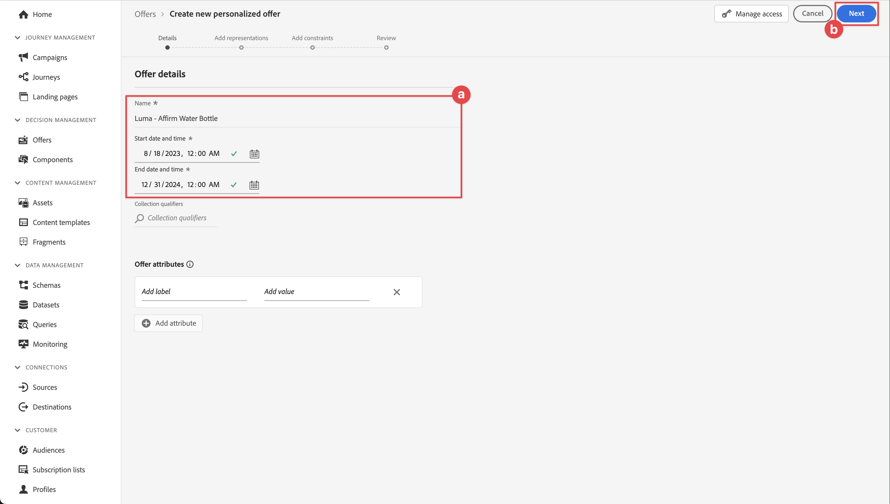

# 使用決定管理建立及顯示優惠方案

瞭解如何透過Experience Platform Mobile SDK在行動應用程式中顯示Journey Optimizer決定管理所提供的選件。

Journey Optimizer決策管理可協助您在適當的時間為所有接觸點的客戶提供最佳優惠和體驗。 設計完成後，透過個人化優惠目標定位對象。

{zoomable="yes"}

決策管理透過集中行銷優惠資料庫和決定引擎輕鬆實現個人化，該決策引擎將規則和限制套用於Adobe Experience Platform建立的豐富即時設定檔。 因此，它可讓您在適當的時間傳送適當的優惠方案給客戶。 如需詳細資訊，請參閱[關於決定管理](https://experienceleague.adobe.com/zh-hant/docs/journey-optimizer/using/decisioning/offer-decisioning/get-started-decision/starting-offer-decisioning)。


>[!NOTE]
>
>本課程為選修課程，僅適用於希望使用決策管理功能在行動應用程式中顯示優惠方案的Journey Optimizer使用者。


## 先決條件

* 成功建立並執行應用程式，且已安裝並設定SDK。
* 為Adobe Experience Platform設定應用程式。
* 存取Journey Optimizer — 決策管理，並具有[管理優惠和決策的適當許可權](https://experienceleague.adobe.com/en/docs/journey-optimizer/using/access-control/high-low-permissions)。


## 學習目標

在本課程中，您將學習

* 更新Edge的決策管理設定。
* 使用Offer Decisioning和Target擴充功能更新您的標籤屬性。
* 更新您的結構描述以擷取主張事件。
* 驗證Assurance中的設定。
* 根據Journey Optimizer中的優惠建立優惠決定 — 決定管理。
* 更新您的應用程式以註冊Optimizer擴充功能。
* 在您的應用程式中實施來自Decision Management的優惠。


## 設定

>[!TIP]
>
>如果您已經在[使用Target設定A/B測試](target.md)課程中設定環境，您可能已經執行此設定區段中的某些步驟。

### 更新資料流設定

為確保將從您的行動應用程式傳送到Platform Edge Network的資料轉送到Journey Optimizer — 決策管理，請更新您的資料流。

1. 在資料收集UI中，選取&#x200B;**[!UICONTROL 資料串流]**，然後選取您的資料串流，例如&#x200B;**[!DNL Luma Mobile App]**。
1. 選取的&#x200B;**[!UICONTROL 更多]**，並從內容功能表選取 **[!UICONTROL 編輯]**。
1. 在&#x200B;**[!UICONTROL 資料串流]** >  > **[!UICONTROL Adobe Experience Platform]**&#x200B;畫面中，確定已選取&#x200B;**[!UICONTROL Offer Decisioning]**、**[!UICONTROL Edge分段]**&#x200B;和&#x200B;**[!UICONTROL Adobe Journey Optimizer]**。 如果您進行Target課程，請同時選取&#x200B;**[!UICONTROL Personalization目的地]**。 如需詳細資訊，請參閱[Adobe Experience Platform設定](https://experienceleague.adobe.com/en/docs/experience-platform/datastreams/configure)。
1. 若要儲存資料流設定，請選取「**[!UICONTROL 儲存]**」。

   {zoomable="yes"}


### 安裝Offer Decisioning和Target標籤擴充功能

1. 導覽至&#x200B;**[!UICONTROL 標籤]**&#x200B;並尋找您的行動標籤屬性並開啟屬性。
1. 選取&#x200B;**[!UICONTROL 延伸模組]**。
1. 選取&#x200B;**[!UICONTROL 目錄]**。
1. 搜尋&#x200B;**[!UICONTROL Offer Decisioning和Target]**&#x200B;擴充功能。
1. 安裝擴充功能。 此擴充功能不需要額外設定。

   {zoomable="yes"}


### 更新您的結構描述

1. 導覽至資料收集介面，然後從左側邊欄選取&#x200B;**[!UICONTROL 結構描述]**。
1. 從頂端列選取&#x200B;**[!UICONTROL 瀏覽]**。
1. 選取要開啟的結構描述。
1. 在結構描述編輯器中，選取欄位群組旁的 **[!UICONTROL 新增]**。
1. 在&#x200B;**[!UICONTROL 新增欄位群組]**&#x200B;對話方塊中，搜尋`proposition`，選取&#x200B;**[!UICONTROL 體驗事件 — 主張互動]**&#x200B;並選取&#x200B;**[!UICONTROL 新增欄位群組]**。 此欄位群組會收集與優惠相關的體驗事件資料，例如呈現哪個優惠，做為哪些收集、決定和其他引數的一部分（請參閱本課程後面部分的）？ 但此選件有什麼改變？ 是否會顯示、互動、解除等？
   {zoomable="yes"}
1. 選取&#x200B;**[!UICONTROL 儲存]**&#x200B;以儲存對結構描述的變更。


## 驗證Assurance中的設定

若要驗證Assurance中的設定：

1. 前往Assurance UI。
1. 在左側邊欄中選取「**[!UICONTROL 設定]**」，然後選取「」底下的「**[!UICONTROL 驗證設定]**」旁的「**[!UICONTROL 新增]**」。
1. 選取「**[!UICONTROL 儲存]**」。
1. 在左側邊欄中選取&#x200B;**[!UICONTROL 驗證設定]**。 您的應用程式中的資料流設定和SDK設定均已驗證。
   {zoomable="yes"}


## 建立位置

在實際建立優惠方案之前，您必須先定義這些優惠方案在行動應用程式中的放置方式與位置。 在「決定管理」中，您可以為此定義版位，並定義支援JSON裝載之行動管道的版位：

1. 在Journey Optimizer UI中，從左側邊欄的中選取&#x200B;**[!UICONTROL 元件]** **[!UICONTROL 元件]**。

1. 從頂端列選取&#x200B;**[!UICONTROL 位置]**。

1. 如果未列出名為&#x200B;**[!UICONTROL 行動JSON]**、**[!UICONTROL 行動]**&#x200B;作為&#x200B;**[!UICONTROL 頻道型別]**&#x200B;和&#x200B;**[!UICONTROL JSON]**&#x200B;作為&#x200B;**[!UICONTROL 內容型別]**&#x200B;的版位，您必須建立版位。 否則，請繼續[建立優惠方案](#create-offers)。

若要建立行動JSON位置：

1. 選取建立位置。

   1. 在&#x200B;**[!UICONTROL 詳細資料]**&#x200B;區段中，輸入`Mobile JSON`作為&#x200B;**[!UICONTROL 名稱]**，從&#x200B;**[!UICONTROL 頻道型別]**&#x200B;選取&#x200B;**[!UICONTROL 行動裝置]**&#x200B;並從&#x200B;**[!UICONTROL 內容型別]**&#x200B;選取&#x200B;**[!UICONTROL JSON]**。
   1. 選取&#x200B;**[!UICONTROL 儲存]**&#x200B;以儲存位置。

   {zoomable="yes"}


## 建立優惠

1. 在Journey Optimizer UI中，從左側邊欄的中選取&#x200B;**[!UICONTROL 優惠]** **[!UICONTROL 優惠]**。
1. 在&#x200B;**[!UICONTROL 選件]**&#x200B;畫面中，選取&#x200B;**[!UICONTROL 瀏覽]**&#x200B;以檢視選件清單。
1. 選取&#x200B;**[!UICONTROL 建立選件]**。
1. 在&#x200B;**[!UICONTROL 新優惠]**&#x200B;對話方塊中，選取&#x200B;**[!UICONTROL 個人化優惠]**，然後按一下&#x200B;**[!UICONTROL 下一步]**。
1. 在&#x200B;**[!UICONTROL 建立新的個人化優惠方案]**&#x200B;的&#x200B;**[!UICONTROL 詳細資料]**&#x200B;步驟中：
   1. 輸入選件的&#x200B;**[!UICONTROL 名稱]**，例如`Luma - Juno Jacket`，然後輸入&#x200B;**[!UICONTROL 開始日期和時間]**&#x200B;以及&#x200B;**[!UICONTROL 結束日期和時間]**。 決策引擎只會選取這些日期內的優惠方案。
   1. 選取&#x200B;**[!UICONTROL 下一步]**。
      {zoomable="yes"}

1. 在&#x200B;**[!UICONTROL 建立新的個人化優惠方案]**&#x200B;的&#x200B;**[!UICONTROL 新增代表]**&#x200B;步驟中：
   1. 從清單中選取&#x200B;**[!UICONTROL 行動裝置]** **[!UICONTROL 行動裝置]**，並從&#x200B;**[!UICONTROL 位置]**&#x200B;清單中選取&#x200B;**[!UICONTROL 行動裝置JSON]**。
   1. 選取&#x200B;**[!UICONTROL 內容]**&#x200B;的&#x200B;**[!UICONTROL 自訂]**。
   1. 選取&#x200B;**[!UICONTROL 新增內容]**。 在&#x200B;**[!UICONTROL 新增個人化]**&#x200B;對話方塊中：
      1. 如果[!UICONTROL 模式]選擇器可用，請確定它設定為&#x200B;**[!UICONTROL JSON]**。
      1. 輸入下列JSON：

         ```json
         { 
             "title": "Juno Jacket",
             "text": "On colder-than-comfortable mornings, you'll love warming up in the Juno All-Ways Performance Jacket, designed to compete with wind and chill. Built-in Cocona&trade; technology aids evaporation, while a special zip placket and stand-up collar keep your neck protected.", 
             "image": "https://luma.enablementadobe.com/content/dam/luma/en/products/women/tops/jackets/wj06-purple_main.jpg" 
         }  
         ```

      1. 選取「**[!UICONTROL 儲存]**」。
         {zoomable="yes"}
   1. 選取&#x200B;**[!UICONTROL 下一步]**。
      {zoomable="yes"}

1. 在&#x200B;**[!UICONTROL 建立新的個人化優惠方案]**&#x200B;的&#x200B;**[!UICONTROL 新增限制]**&#x200B;步驟中：
   1. 將&#x200B;**[!UICONTROL 優先順序]**&#x200B;設定為`10`。
   1. 將&#x200B;**[!UICONTROL 包含上限]**&#x200B;切換為關閉。
   1. 選取&#x200B;**[!UICONTROL 下一步]**。
      {zoomable="yes"}

1. 在&#x200B;**[!UICONTROL 建立新的個人化]**&#x200B;優惠的&#x200B;**[!UICONTROL 檢閱]**&#x200B;步驟中：
   1. 檢閱選件，然後選取&#x200B;**[!UICONTROL 完成]**。
   1. 在&#x200B;**[!UICONTROL 儲存選件]**&#x200B;對話方塊中，選取&#x200B;**[!UICONTROL 儲存並核准]**。

1. 重複步驟3至8，再建立四個具有不同名稱和內容的選件。 所有其他設定值（例如開始日期和時間或優先順序）與您建立的第一個選件類似。 您可以快速建立重複和編輯選件。

   1. 在Journey Optimizer UI中，從左側邊欄選取 **[!UICONTROL 選件]**，然後從頂端列選取「選件」。
   1. 選取您建立之優惠方案的列。
   1. 在右窗格中，選取 **[!UICONTROL 更多動作]**，然後從內容功能表選取 **[!UICONTROL 複製]**。

      使用下表來定義其他四個選件。

      | 產品建議名稱 | JSON中的選件內容 |
      |---|---|
      | Luma - Affirm Water Bottle | `{ "title": "Affirm Water Bottle", "text": "You'll stay hydrated with ease with the Affirm Water Bottle by your side or in hand. Measurements on the outside help you keep track of how much you're drinking, while the screw-top lid prevents spills. A metal carabiner clip allows you to attach it to the outside of a backpack or bag for easy access.", "image": "https://luma.enablementadobe.com/content/dam/luma/en/products/gear/fitness-equipment/ug06-lb-0.jpg" }` |
      | Luma - Desiree健身T恤 | `{ "title": "Desiree Fitness Tee", "text": "When you're too far to turn back, thank yourself for choosing the Desiree Fitness Tee. Its ultra-lightweight, ultra-breathable fabric wicks sweat away from your body and helps keeps you cool for the distance.", "image": "https://luma.enablementadobe.com/content/dam/luma/en/products/women/tops/tees/ws05-yellow_main.jpg" }` |
      | Luma - Adrienne Trek Jacket | `{ "title": "Adrienne Trek Jacket", "text": "You're ready for a cross-country jog or a coffee on the patio in the Adrienne Trek Jacket. Its style is unique with stand collar and drawstrings, and it fits like a jacket should.", "image": "https://luma.enablementadobe.com/content/dam/luma/en/products/women/tops/jackets/wj08-gray_main.jpg" }` |
      | Luma - Aero每日健身運動鞋 | `{ "title": "Aero Daily Fitness Tee", "text": "Need an everyday action tee that helps keep you dry? The Aero Daily Fitness Tee is made of 100% polyester wicking knit that funnels moisture away from your skin. Don't be fooled by its classic style; this tee hides premium performance technology beneath its unassuming look.", "image": "https://luma.enablementadobe.com/content/dam/luma/en/products/men/tops/tees/ms01-black_main.jpg" }` |

      {style="table-layout:fixed"}

1. 最後一步您必須建立遞補優惠，如果客戶不符合其他優惠方案的資格，就會傳送此優惠方案給客戶。
   1. 選取&#x200B;**[!UICONTROL 建立選件]**。
   1. 在&#x200B;**[!UICONTROL 新優惠]**&#x200B;對話方塊中，選取&#x200B;**[!UICONTROL 個人化優惠]**&#x200B;並選取&#x200B;**[!UICONTROL 下一步]**。
   1. 在&#x200B;**[!UICONTROL 建立新的遞補優惠]**&#x200B;的&#x200B;**[!UICONTROL 詳細資料]**&#x200B;步驟中，輸入優惠的&#x200B;**[!UICONTROL 名稱]**，例如`Luma - Fallback Offer`，然後選取&#x200B;**[!UICONTROL 下一步]**。

   1. 在&#x200B;**[!UICONTROL 建立新的遞補優惠]**&#x200B;的&#x200B;**[!UICONTROL 新增代表]**&#x200B;步驟中：
      1. 從清單中選取&#x200B;**[!UICONTROL 行動裝置]** **[!UICONTROL 行動裝置]**，並從&#x200B;**[!UICONTROL 位置]**&#x200B;清單中選取&#x200B;**[!UICONTROL 行動裝置JSON]**。
      1. 選取&#x200B;**[!UICONTROL 內容]**&#x200B;的&#x200B;**[!UICONTROL 自訂]**。
      1. 選取&#x200B;**[!UICONTROL 新增內容]**。
      1. 在&#x200B;**[!UICONTROL 新增個人化]**&#x200B;對話方塊中，輸入下列JSON並選取&#x200B;**[!UICONTROL 儲存]**：

         ```json
         {  
            "title": "Luma",
            "text": "Your store for sports wear and equipment.", 
            "image": "https://luma.enablementadobe.com/content/dam/luma/en/logos/Luma_Logo.png" 
         }  
         ```

      1. 選取&#x200B;**[!UICONTROL 下一步]**。


1. 在&#x200B;**[!UICONTROL 建立新遞補]**&#x200B;選件的&#x200B;**[!UICONTROL 檢閱]**&#x200B;步驟中：
   1. 檢閱選件，然後選取&#x200B;**[!UICONTROL 完成]**。
   1. 在&#x200B;**[!UICONTROL 儲存選件]**&#x200B;對話方塊中，選取&#x200B;**[!UICONTROL 儲存並核准]**。

您現在應該擁有下列優惠方案清單：
{zoomable="yes"}


## 建立集合

若要向行動應用程式使用者呈現優惠方案，您必須定義優惠方案集合，其中包含您建立的一或多個優惠方案。

1. 在Journey Optimizer UI中，從左側邊欄選取&#x200B;**[!UICONTROL 選件]**。
1. 從頂端列選取&#x200B;**[!UICONTROL 集合]**。
1. 選取 **[!UICONTROL 建立集合]**。
1. 在&#x200B;**[!UICONTROL 新增集合]**&#x200B;對話方塊中，輸入集合的&#x200B;**[!UICONTROL 名稱]**，例如`Luma - Mobile App Collection`，選取&#x200B;**[!UICONTROL 建立靜態集合]**，然後按一下&#x200B;**[!UICONTROL 下一步]**。
1. 在&#x200B;**[!DNL Luma - Mobile App Collection]**&#x200B;中，選取您要包含在集合中的優惠方案。 在本教學課程中，請挑選您建立的五個選件。 您可以使用搜尋欄位輕鬆篩選清單，例如輸入&#x200B;**[!DNL Luma]**。
1. 選取「**[!UICONTROL 儲存]**」。

   {zoomable="yes"}


## 建立決定

最後一個步驟是定義決定，此決定是一或多個決定範圍與您的遞補優惠的組合。

決定範圍是特定位置(例如電子郵件中的HTML或行動應用程式中的JSON)與一個或多個評估標準的組合。

評估准則為

* 優惠收藏，
* 適用性規則：例如，優惠方案僅適用於特定對象，
* 排名方法：如果有多個優惠方案可供挑選，您要使用哪個方法來為其排名（例如依優惠方案優先順序、使用公式或AI模型）。

如果您想要瞭解位置、規則、排名、優惠、代表、集合、決定等如何相互互動及相互關聯，請參閱[建立和管理優惠的重要步驟](https://experienceleague.adobe.com/en/docs/journey-optimizer/using/decisioning/offer-decisioning/get-started-decision/key-steps)。 本課程僅著重於使用決定的輸出，而非在Journey Optimizer中定義決定的彈性 — 決定管理。

1. 在Journey Optimizer UI中，從左側邊欄選取&#x200B;**[!UICONTROL 選件]**。
1. 從頂端列選取&#x200B;**[!UICONTROL 決定]**。
1. 選取 **[!UICONTROL 建立決定]**。
1. 在&#x200B;**[!UICONTROL 建立新優惠決定]**&#x200B;的&#x200B;**[!UICONTROL 詳細資料]**&#x200B;步驟中：
   1. 輸入決策的&#x200B;**[!UICONTROL 名稱]**，例如`Luma - Mobile App Decision`，輸入&#x200B;**[!UICONTROL 開始日期和時間]**&#x200B;和&#x200B;**[!UICONTROL 結束日期和時間]**。
   1. 選取&#x200B;**[!UICONTROL 下一步]**。

1. 在&#x200B;**[!UICONTROL 建立新優惠決定]**&#x200B;的&#x200B;**[!UICONTROL 新增決定範圍]**&#x200B;步驟中：
   1. 從&#x200B;**[!UICONTROL 位置]**&#x200B;清單中選取&#x200B;**[!UICONTROL 行動JSON]**。
   1. 在&#x200B;**[!UICONTROL 評估准則]**&#x200B;圖磚中，選取 **[!UICONTROL 新增]**。
      1. 在&#x200B;**[!UICONTROL 新增優惠收藏]**&#x200B;對話方塊中，選取您的優惠收藏。 例如 **[!DNL Luma - Mobile App Collection]**。
      1. 選取&#x200B;**[!UICONTROL 新增]**。

         {zoomable="yes"}

   1. 確定已針對&#x200B;**[!UICONTROL 資格]**&#x200B;選取&#x200B;**[!UICONTROL 無]**，且已選取&#x200B;**[!UICONTROL 優惠方案優先順序]**&#x200B;作為&#x200B;**[!UICONTROL 排名方法]**。
   1. 選取&#x200B;**[!UICONTROL 下一步]**。

      {zoomable="yes"}

1. 在&#x200B;**[!UICONTROL 建立新優惠決定]**&#x200B;的&#x200B;**[!UICONTROL 新增遞補優惠]**&#x200B;步驟中：
   1. 選取您的遞補優惠，例如&#x200B;**[!DNL Luma - Fallback offer]**。
   1. 選取&#x200B;**[!UICONTROL 下一步]**。
1. 在&#x200B;**[!UICONTROL 建立新優惠決定]**&#x200B;的&#x200B;**[!UICONTROL 摘要]**&#x200B;步驟中：
   1. 選取「**[!UICONTROL 完成]**」。
   1. 在&#x200B;**[!UICONTROL 儲存優惠決定]**&#x200B;對話方塊中，選取&#x200B;**[!UICONTROL 儲存並啟用]**。
   1. 在&#x200B;**[!UICONTROL 決定]**&#x200B;標籤中，您會看到狀態為&#x200B;**[!UICONTROL 即時]**&#x200B;的決定。

您的優惠決定（包含一組優惠）現在已可供使用。 若要在應用程式中使用決定，您必須在程式碼中參考決定範圍。

1. 在Journey Optimizer UI中，選取&#x200B;**[!UICONTROL 選件]**。
1. 從頂端列選取&#x200B;**[!UICONTROL 決定]**。
1. 選取您的決定，例如&#x200B;**[!DNL Luma - Mobile App Decision]**。
1. 在&#x200B;**[!UICONTROL 決定範圍]**&#x200B;圖磚中，選取 **[!UICONTROL 複製]**。
1. 從內容功能表，選取&#x200B;**[!UICONTROL 決定範圍]**。

   {zoomable="yes"}

1. 使用任何文字編輯器貼上決定範圍以供稍後使用。 決定範圍具有下列JSON格式。

   ```json
   {
       "xdm:activityId":"xcore:offer-activity:xxxxxxxxxxxxxxx",
       "xdm:placementId":"xcore:offer-placement:xxxxxxxxxxxxxxx"
   }
   ```

## 在您的應用程式中實作選件

如先前課程所述，安裝行動標籤擴充功能僅會提供設定。 接下來，您必須安裝並註冊最佳化SDK。 如果未清除這些步驟，請檢閱[安裝SDK](install-sdks.md)區段。

>[!NOTE]
>
>如果您已完成[安裝SDK](install-sdks.md)區段，則表示已安裝SDK，您可以略過此步驟。
>

>[!BEGINTABS]

>[!TAB iOS]

1. 在Xcode中，確定已將[AEP Optimize](https://github.com/adobe/aepsdk-messaging-ios)新增至封裝相依性中的封裝清單。 請參閱[Swift封裝管理員](install-sdks.md#swift-package-manager)。
1. 導覽至Xcode專案導覽器中的&#x200B;**[!DNL Luma]** > **[!DNL Luma]** > **[!UICONTROL AppDelegate]**。
1. 請確定`AEPOptimize`是匯入清單的一部分。

   ```swift
   import AEPOptimize
   ```

1. 請確定`Optimize.self`是您註冊的擴充功能陣列的一部分。

   ```swift
   let extensions = [
       AEPIdentity.Identity.self,
       Lifecycle.self,
       Signal.self,
       Edge.self,
       AEPEdgeIdentity.Identity.self,
       Consent.self,
       UserProfile.self,
       Places.self,
       Messaging.self,
       Optimize.self,
       Assurance.self
   ]
   ```

1. 導覽至Xcode專案導覽器中的&#x200B;**[!DNL Luma]** > **[!DNL Luma]** > **[!DNL Model]** > **[!DNL Data]** > **[!UICONTROL 決定]**。 使用您從Journey Optimizer介面複製的決定範圍詳細資料更新`activityId`和`placementId`值。

1. 導覽至Xcode專案導覽器中的&#x200B;**[!DNL Luma]** > **[!DNL Luma]** > **[!DNL Utils]** > **[!UICONTROL MobileSDK]**。 尋找`func updatePropositionOD(ecid: String, activityId: String, placementId: String, itemCount: Int) async`函式。 新增下列程式碼：

   ```swift
   // set up the XDM dictionary, define decision scope and call update proposition API
   Task {
      let ecid = ["ECID" : ["id" : ecid, "primary" : true] as [String : Any]]
      let identityMap = ["identityMap" : ecid]
      let xdmData = ["xdm" : identityMap]
      let decisionScope = DecisionScope(activityId: activityId, placementId: placementId, itemCount: UInt(itemCount))
      Optimize.clearCachedPropositions()
      Optimize.updatePropositions(for: [decisionScope], withXdm: xdmData) { data, error in
            if let error = error {
               Logger.aepMobileSDK.error("MobileSDK - updatePropositionsAT: Error updating propositions: \(error.localizedDescription)")
            }
      }
   }
   ```

   此函式：

   * 設定XDM字典`xdmData`，包含ECID以識別您必須提供選件的設定檔。
   * 定義`decisionScope`，此物件是以您在Journey Optimizer — 決定管理介面中定義的決定為基礎，並使用從[建立決定](#create-a-decision)複製的決定範圍來定義。  Luma應用程式使用組態檔(`decisions.json`)，它會根據下列JSON格式擷取範圍引數：

     ```json
     "scopes": [
         {
             "name": "name of the scope",
             "activityId": "xcore:offer-activity:xxxxxxxxxxxxxxx",
             "placementId": "xcore:offer-placement:xxxxxxxxxxxxxxx",
             "itemCount": 2
         }
     ]
     ```

     不過，您可以使用任何型別的實作，以確保Optimize API取得適當的引數（`activityId`、`placementId`和`itemCount`），為您的實作建構有效的[`DecisionScope`](https://developer.adobe.com/client-sdks/documentation/adobe-journey-optimizer-decisioning/api-reference/#decisionscope)物件。 <br/>如需詳細資訊： `decisions.json`檔案中的其他索引鍵值供未來使用，與本課程和教學課程目前不相關或無法使用。

   * 呼叫兩個API： [`Optimize.clearCachePropositions`](https://developer.adobe.com/client-sdks/edge/adobe-journey-optimizer-decisioning/api-reference/#clearpropositions)和[`Optimize.updatePropositions`](https://developer.adobe.com/client-sdks/edge/adobe-journey-optimizer-decisioning/api-reference/#updatepropositionswithcompletionhandler)。  這些函式會清除任何快取的主張，並更新此設定檔的主張。

1. 導覽至Xcode專案導覽器中的&#x200B;**[!DNL Luma]** > **[!DNL Luma]** > **[!DNL Views]** > **[!UICONTROL Personalization]** > **[!UICONTROL EdgeOffersView]**。 尋找`func onPropositionsUpdateOD(activityId: String, placementId: String, itemCount: Int) async`函式並檢查此函式的程式碼。 此函式最重要的部分是[`Optimize.onPropositionsUpdate`](https://developer.adobe.com/client-sdks/documentation/adobe-journey-optimizer-decisioning/api-reference/#onpropositionsupdate) API呼叫，該呼叫會

   * 根據決定範圍(您已在Journey Optimizer — 決定管理中定義)擷取目前設定檔的主張，
   * 從主張中擷取優惠方案，
   * 會取消包裝選件的內容，以便其在應用程式中正確顯示，並且
   * 觸發優惠方案上的`displayed()`動作，將事件傳回Edge Network，通知優惠方案顯示。

1. 還是在&#x200B;**[!DNL EdgeOffersView]**&#x200B;中，將下列程式碼新增到`.onFirstAppear`修飾元。 此程式碼可確保用於更新優惠方案的回呼只會註冊一次。

   ```swift
   // Invoke callback for offer updates
   Task {
       await self.onPropositionsUpdateOD(activityId: decision.activityId, placementId: decision.placementId, itemCount: decision.itemCount)
   }
   ```

1. 仍然在&#x200B;**[!UICONTROL EdgeOffersView]**&#x200B;中，將下列程式碼新增至`.task`修飾元。 此程式碼會在重新整理檢視時更新選件。

   ```swift
   // Clear and update offers
   await self.updatePropositionsOD(ecid: currentEcid, activityId: decision.activityId, placementId: decision.placementId, itemCount: decision.itemCount)
   ```

>[!TAB Android]


1. 在Android Studio中，確定[aepsdk-optimize-android](https://github.com/adobe/aepsdk-optimize-android)是&#x200B;**[!UICONTROL Android:app]** ChevronDown **[!UICONTROL >]** Gradle指令碼build.gradle.kts （模組&#x200B;**[!UICONTROL ）]**&#x200B;的相依性的一部分。 請參閱[Gradle](install-sdks.md#gradle)。
1. 在Android Studio導覽器中，導覽至&#x200B;**[!UICONTROL Android]**  > **[!DNL app]** > **[!DNL kotlin+java]** > **[!UICONTROL com.adobe.luma.tutorial.android]** > **[!UICONTROL MainActivity]**。
1. 請確定`Optimize`是匯入清單的一部分。

   ```kotlin
   import com.adobe.marketing.mobile.optimize.Optimize
   ```

1. 請確定`Optimize.EXTENSION`是您註冊的擴充功能陣列的一部分。

   ```kotlin
   val extensions = listOf(
      Identity.EXTENSION,
      Lifecycle.EXTENSION,
      Signal.EXTENSION,
      Edge.EXTENSION,
      Consent.EXTENSION,
      UserProfile.EXTENSION,
      Places.EXTENSION,
      Messaging.EXTENSION,
      Optimize.EXTENSION,
      Assurance.EXTENSION
   )
   ```

1. 在Xcode專案導覽器中導覽至&#x200B;**[!UICONTROL Android]**  > **[!DNL app]** > **[!DNL assets]** > **[!DNL data]** > **[!UICONTROL decisions.json]**。 使用您從Journey Optimizer介面複製的決定範圍詳細資料更新`activityId`和`placementId`值。

1. 在Android Studio導覽器中導覽至&#x200B;**[!UICONTROL Android]**  > **[!DNL app]** > **[!DNL kotlin+java]** > **[!DNL com.adobe.luma.tutorial.android]** > **[!UICONTROL 模型]** > **[!UICONTROL MobileSDK]**。 尋找`suspend fun updatePropositionsOD(ecid: String,        activityId: String, placementId: String, itemCount: Int) `函式。 新增下列程式碼：

   ```kotlin
   // set up the XDM dictionary, define decision scope and call update proposition API
   withContext(Dispatchers.IO) {
      val ecidMap = mapOf("ECID" to mapOf("id" to ecid, "primary" to true))
      val identityMap = mapOf("identityMap" to ecidMap)
      val xdmData = mapOf("xdm" to identityMap)
      val decisionScope = DecisionScope(activityId, placementId, itemCount)
      Optimize.clearCachedPropositions()
      Optimize.updatePropositions(listOf(decisionScope), xdmData, null, object :
            AdobeCallbackWithOptimizeError<MutableMap<DecisionScope?, OptimizeProposition?>?> {
            override fun fail(optimizeError: AEPOptimizeError?) {
               val responseError = optimizeError
               Log.i("MobileSDK", "updatePropositionsOD error: ${responseError}")
            }
            override fun call(propositionsMap: MutableMap<DecisionScope?, OptimizeProposition?>?) {
               val responseMap = propositionsMap
               Log.i("MobileSDK", "updatePropositionsOD call: ${responseMap}")
            }
      })
   }
   ```

   此函式：

   * 設定XDM字典`xdmData`，包含ECID以識別您必須提供選件的設定檔。
   * 定義`decisionScope`，此物件是以您在Journey Optimizer — 決定管理介面中定義的決定為基礎，並使用從[建立決定](#create-a-decision)複製的決定範圍來定義。  Luma應用程式使用組態檔(`decisions.json`)，它會根據下列JSON格式擷取範圍引數：

     ```json
     "scopes": [
         {
             "name": "name of the scope",
             "activityId": "xcore:offer-activity:xxxxxxxxxxxxxxx",
             "placementId": "xcore:offer-placement:xxxxxxxxxxxxxxx",
             "itemCount": 2
         }
     ]
     ```

     不過，您可以使用任何型別的實作，以確保Optimize API取得適當的引數（`activityId`、`placementId`和`itemCount`），為您的實作建構有效的[`DecisionScope`](https://developer.adobe.com/client-sdks/documentation/adobe-journey-optimizer-decisioning/api-reference/#decisionscope)物件。 <br/>如需詳細資訊： `decisions.json`檔案中的其他索引鍵值供未來使用，與本課程和教學課程目前不相關或無法使用。

   * 呼叫兩個API： [`Optimize.clearCachePropositions`](https://developer.adobe.com/client-sdks/edge/adobe-journey-optimizer-decisioning/api-reference/#clearpropositions)和[`Optimize.updatePropositions`](https://developer.adobe.com/client-sdks/edge/adobe-journey-optimizer-decisioning/api-reference/#updatepropositionswithcompletionhandler)。  這些函式會清除任何快取的主張，並更新此設定檔的主張。

1. 在Xcode專案導覽器中導覽至&#x200B;**[!UICONTROL Android]**  > **[!DNL app]** > **[!DNL kotlin+java]** > **[!DNL com.adobe.luma.tutorial.android]** > **[!UICONTROL 檢視]** > **[!UICONTROL EdgeOffers.kt]**。 尋找`suspend fun onPropositionsUpdateOD(ecid: String, activityId: String, placementId: String, itemCount: Int)`函式並檢查此函式的程式碼。 此函式最重要的部分是[`Optimize.onPropositionsUpdate`](https://developer.adobe.com/client-sdks/documentation/adobe-journey-optimizer-decisioning/api-reference/#onpropositionsupdate) API呼叫，該呼叫會

   * 根據決定範圍(您已在Journey Optimizer — 決定管理中定義)擷取目前設定檔的主張，
   * 從主張中擷取優惠方案，
   * 會取消包裝選件的內容，以便其在應用程式中正確顯示，並且
   * 傳回選件。

1. 仍在&#x200B;**[!DNL EdgeOffers.kt]**&#x200B;中，新增`LaunchedEffect`函式以確保在啟動Personalization索引標籤時重新整理選件。

   ```kotlin
   // recompose the view when the number of received offers changes
   LaunchedEffect(offersOD.count()) {
       updatePropositionsOD(
           currentEcid,
           decision.activityId,
           decision.placementId,
           decision.itemCount
       )
       offersOD =
           onPropositionsUpdateOD(decision.activityId, decision.placementId, decision.itemCount)
   }
   ```

>[!ENDTABS]

## 使用應用程式進行驗證

>[!BEGINTABS]

>[!TAB iOS]

1. 使用，在模擬器中或在Xcode的實體裝置上重建並執行應用程式。

1. 前往 **[!DNL Personalization]** 標籤。

1. 捲動至頂端，您會看到在&#x200B;**[!DNL DECISION LUMA - MOBILE APP DECISION]**&#x200B;圖磚中定義的集合中，顯示兩個隨機選件。

   

   優惠是隨機的，因為您已為所有優惠提供相同的優先順序，而決策的排名是根據優先順序。


>[!TAB Android]

1. 使用，在模擬器中或在Android Studio的實體裝置上重建並執行應用程式。

1. 前往 **[!DNL Personalization]** 標籤。

1. 捲動至頂端，您會看到上方方塊中顯示的兩個隨機選件，來自您在&#x200B;**[!DNL DECISION LUMA - MOBILE APP DECISION]**&#x200B;圖磚中定義的集合。

   

   優惠是隨機的，因為您已為所有優惠提供相同的優先順序，而決策的排名是根據優先順序。

>[!ENDTABS]

## 驗證Assurance中的實作

若要驗證Assurance中的優惠方案實作：

1. 檢閱[設定指示](assurance.md#connecting-to-a-session)區段，將您的模擬器或裝置連線到Assurance。
1. 在左側邊欄中選取「**[!UICONTROL 設定]**」，並選取「」底下的「**[!UICONTROL 檢閱和模擬]**」旁的「**[!UICONTROL 新增]**」。
1. 選取「**[!UICONTROL 儲存]**」。
1. 在左側邊欄中選取&#x200B;**[!UICONTROL 檢閱和模擬]**。 資料串流設定皆已驗證，而且您的應用程式中還有SDK設定。
1. 在頂端列選取&#x200B;**[!UICONTROL 要求]**。 您看到您的&#x200B;**[!UICONTROL 選件]**要求。
   {zoomable="yes"}

1. 您可以探索&#x200B;**[!UICONTROL 模擬]**&#x200B;和&#x200B;**[!UICONTROL 事件清單]**&#x200B;標籤，以進一步瞭解功能，並檢查您的Journey Optimizer決定管理設定。

## 後續步驟

您現在應該擁有所有工具，可以開始將更多功能新增到您的Journey Optimizer — 決定管理實作。 例如：

* 套用不同引數至您的選件（例如，優先順序、上限）
* 收集應用程式中的設定檔屬性（請參閱[設定檔](profile.md)），並使用這些設定檔屬性來建立對象。 然後使用這些對象作為您決定中適用性規則的一部分。
* 合併多個決定範圍。

>[!SUCCESS]
>
>您已啟用應用程式，以便針對Experience Platform Mobile SDK使用Offer Decisioning和Target擴充功能來顯示選件。
>
>感謝您花時間學習Adobe Experience Platform Mobile SDK。 如果您有任何疑問、想分享一般意見或有關於未來內容的建議，請在這篇[Experience League社群討論貼文](https://experienceleaguecommunities.adobe.com/t5/adobe-experience-platform-data/tutorial-discussion-implement-adobe-experience-cloud-in-mobile/td-p/443796)上分享。

下一步： **[執行A/B測試](target.md)**
