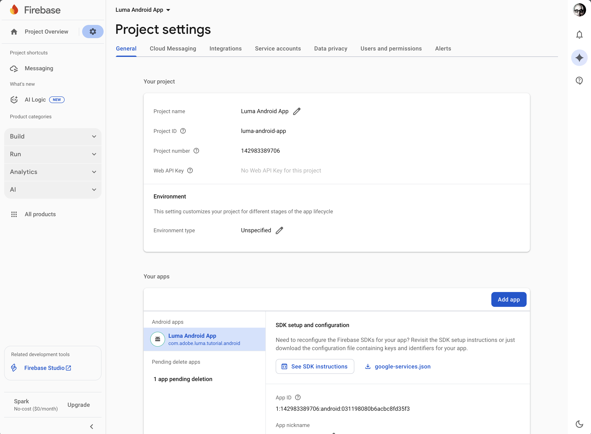
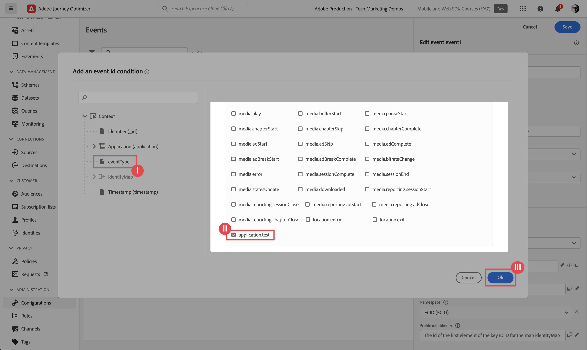
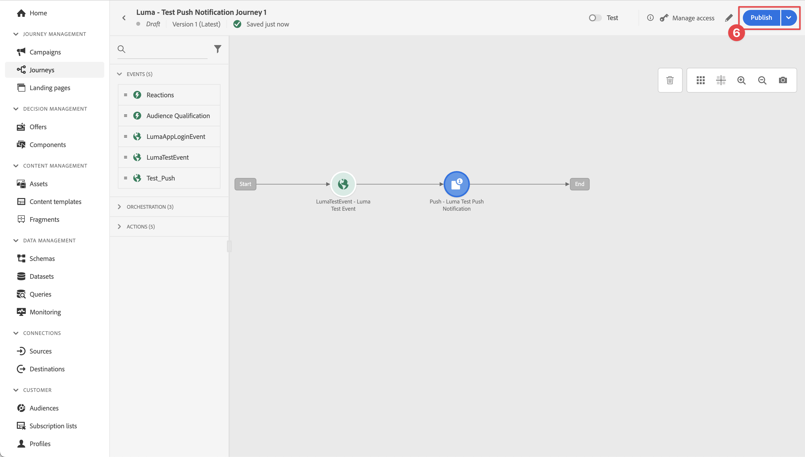

# 建立和傳送推播通知

瞭解如何使用Experience Platform Mobile SDK和Journey Optimizer為行動應用程式建立推播通知。

Journey Optimizer可讓您建立歷程，並傳送訊息給目標對象。 在使用Journey Optimizer傳送推播通知之前，您必須確保有適當的設定和整合。 若要瞭解Journey Optimizer中的推播通知資料流程，請參閱[檔案](https://experienceleague.adobe.com/en/docs/journey-optimizer/using/channels/push/push-config/push-gs)。

{zoomable="yes"}

>[!NOTE]
>
>本課程為選修課程，僅適用於想要傳送推播通知的Journey Optimizer使用者。


## 先決條件

* 成功建立並執行應用程式，且已安裝並設定SDK。
* 為Adobe Experience Platform設定應用程式。
* 存取Journey Optimizer和[足夠的許可權](https://experienceleague.adobe.com/en/docs/journey-optimizer/using/channels/push/push-config/push-configuration)。 此外，您需要足夠的許可權才能使用下列Journey Optimizer功能。
   * 建立推播認證。
   * 建立推播通道設定。
   * 建立歷程。
   * 建立訊息。
   * 建立訊息預設集。
* 針對iOS，為&#x200B;**付費Apple開發人員帳戶**，其存取許可權足以建立憑證、識別碼和金鑰。
* Android的Google開發人員帳戶，具有建立憑證和金鑰的足夠存取權。
* 實體iOS或Android裝置或模擬器以進行測試。

## 學習目標

在本課程中，您將學習

* 向Apple推播通知服務(APN)註冊應用程式ID。
* 在Journey Optimizer中建立管道設定。
* 更新您的結構描述以包含推送訊息欄位。
* 安裝及設定Journey Optimizer標籤擴充功能。
* 更新您的應用程式以註冊Journey Optimizer標籤擴充功能。
* 驗證Assurance中的設定。
* 從Assurance傳送測試訊息
* 在Journey Optimizer中定義您自己的推播通知事件、歷程和體驗。
* 從應用程式內傳送您自己的推播通知。


## 設定

>[!TIP]
>
>如果您已經在[Journey Optimizer應用程式內傳訊](journey-optimizer-inapp.md)課程中設定環境，您可能已經執行此設定區段中的某些步驟。

### 建立推播認證

針對推播通知，您必須先註冊推播通知的應用程式。

>[!BEGINTABS]

>[!TAB iOS]

下列步驟並非特定於Adobe Experience Cloud，而是旨在引導您完成APN設定。

1. 在Apple開發人員入口網站中，瀏覽至&#x200B;**[!UICONTROL 金鑰]**。
1. 若要建立金鑰，請選取&#x200B;**[!UICONTROL +]**。

   {zoomable="yes"}

1. 提供&#x200B;**[!UICONTROL 金鑰名稱]**。
1. 選取&#x200B;**[!UICONTROL Apple推播通知服務] (APN)**，然後選取&#x200B;**[!UICONTROL 設定]**。
   1. 在&#x200B;**[!UICONTROL 設定索引鍵]**&#x200B;畫面中，從&#x200B;**[!UICONTROL 環境]**&#x200B;下拉式選單中選取&#x200B;**[!UICONTROL 沙箱與生產]**。
   1. 選取「**[!UICONTROL 儲存]**」。
1. 選取&#x200B;**[!UICONTROL 繼續]**。

   {zoomable="yes"}

1. 檢閱組態並選取&#x200B;**[!UICONTROL 註冊]**。
1. 下載`.p8`私密金鑰。 當您設定Journey Optimizer推送認證時，它將在下一個練習中使用。
1. 記下&#x200B;**[!UICONTROL 金鑰識別碼]**。 當您設定Journey Optimizer推送認證時，它將在下一個練習中使用。
1. 記下&#x200B;**[!UICONTROL 團隊識別碼]**。 當您設定Journey Optimizer推送認證時，它將在下一個練習中使用。 團隊ID可在畫面右上角找到，位於您的登入名稱旁。
   {zoomable="yes"}

其他檔案可在[此處](https://help.apple.com/developer-account/#/devcdfbb56a3)找到。

>[!TAB Android]

下列步驟並非特定於Adobe Experience Cloud，而是設計用來引導您完成Firebase設定。

1. 存取Firebase主控台。
1. 選取&#x200B;**[!UICONTROL 建立Firebase專案]**。
   1. 輸入&#x200B;**[!UICONTROL 專案名稱]**。
   1. 在&#x200B;**[!UICONTROL 建立專案]**&#x200B;中選取&#x200B;**[!UICONTROL 繼續]** - **[!UICONTROL 讓我們以您專案的名稱]**&#x200B;開始。 例如, `Luma Android App.`
   1. 停用Firebase中的&#x200B;**[!UICONTROL Gemini]**，並在&#x200B;**[!UICONTROL 建立專案]**&#x200B;中選取&#x200B;**[!UICONTROL 繼續]** - **[!UICONTROL 您的Firebase專案的AI協助]**。
   1. 停用此專案的&#x200B;**[!UICONTROL Google Analytics]**，並選取&#x200B;**[!UICONTROL 為您的Firebase專案建立專案]** - **[!UICONTROL Google Analytics]**&#x200B;中的&#x200B;**[!UICONTROL 繼續]**。
   1. 選取&#x200B;**[!UICONTROL 建立專案]**。
   1. 專案準備就緒後，選取&#x200B;**[!UICONTROL 繼續]**。

1. 返回Firebase主控台，確定您的專案已選取在頂端。 例如，**[!UICONTROL Luma Android App]**。

   {zoomable="yes"}

1. 選取 > **[!UICONTROL 專案設定]**。

1. 在&#x200B;**[!UICONTROL 專案設定]**&#x200B;中，選取&#x200B;**[!UICONTROL 新增應用程式]**。
   1. 在&#x200B;**[!UICONTROL 將Firebase新增至您的應用程式]**&#x200B;中，選取&#x200B;**[!UICONTROL Android]**&#x200B;作為平台。
   1. 在&#x200B;**[!UICONTROL 將Firebase新增至您的Android應用程式中：]**
      1. 在步驟1，**[!UICONTROL 註冊應用程式]**：
         1. 輸入Android套件名稱，類似於應用程式識別碼。 例如 `com.adobe.luma.tutorial.android`。
         1. 輸入選用的&#x200B;**[!UICONTROL 應用程式暱稱]**。
         1. 選取&#x200B;**[!UICONTROL 註冊應用程式]**。
      1. 在步驟2中，**[!UICONTROL 下載然後新增設定檔]**。
         1. 選取 **[!UICONTROL 下載google-services.json]**。 當您建置您自己的Android應用程式版本時，您應該將範例Android Studio專案中目前的`google-services.json`檔案取代為此新應用程式設定產生的檔案版本。
已在範例應用程式中注意其他步驟。

   您的畫面應如下所示：

   {zoomable="yes"}

1. 在&#x200B;**[!UICONTROL 專案設定]**&#x200B;中，選取&#x200B;**[!UICONTROL 服務帳戶]**。
1. 選取&#x200B;**[!UICONTROL 產生新的私密金鑰]**。 已產生`luma-android-app-firebase-adminsdk-xxxx-xxxxxxxx.json`檔案。 將此檔案儲存在安全的地方，因為您稍後需要檔案。

如需詳細資訊，請參閱[Firebase開發人員檔案](https://firebase.google.com/docs)。

>[!ENDTABS]

### 在資料收集中新增應用程式推送認證

接下來，您需要新增行動應用程式推送認證，以授權Adobe代表您傳送推送通知。 您可以在Data Collection或Journey Optimizer中新增推送認證。 在本教學課程中，將會使用資料收集介面。 然後，推送認證會連結至Journey Optimizer中的管道設定。

1. 在資料收集中，選取&#x200B;**[!UICONTROL 應用程式表面]**。
1. 選取&#x200B;**[!UICONTROL 建立應用程式表面]**。
1. 在&#x200B;**[!UICONTROL 建立應用程式表面]**&#x200B;介面中：
   1. 輸入&#x200B;**[!UICONTROL 名稱]**。
   1. 若要傳送Apple iOS的推播通知，請選取&#x200B;**[!UICONTROL iOS]**。
      1. 輸入您的&#x200B;**[!UICONTROL 應用程式識別碼]**，例如`com.adobe.luma.tutorial.swiftui`。
      1. 選取沙箱（選用）。
      1. 啟用&#x200B;**[!UICONTROL 推送認證]**。
      1. 將儲存的`.p8`私密金鑰檔案拖放到&#x200B;**[!UICONTROL 拖放您的檔案]**。
      1. 輸入&#x200B;**[!UICONTROL 金鑰識別碼]**。
      1. 輸入&#x200B;**[!UICONTROL 團隊識別碼]**。
   1. 若要傳送Android的推播通知，請選取&#x200B;**[!UICONTROL Android]**。
      1. 輸入您的&#x200B;**[!UICONTROL 應用程式識別碼]**，例如`com.adobe.luma.tutorial.android`。
      1. 選取沙箱（選用）。
      1. 啟用&#x200B;**[!UICONTROL 推送認證]**。
      1. 將儲存的`luma-android-app-firebase-adminsdk-xxxx-xxxxxxxx.json`檔案拖放到&#x200B;**[!UICONTROL 拖放您的檔案]**。

   {zoomable="yes"}

1. 選取&#x200B;**[!UICONTROL 「儲存」]**。如果所有資訊皆正確，表示您已建立推送認證以與管道設定建立關聯。


### 在Journey Optimizer中建立推送的管道設定

建立推送認證設定後，您必須建立設定，才能從Journey Optimizer傳送推送通知。

1. 在Journey Optimizer介面中，開啟&#x200B;**[!UICONTROL 頻道]** > **[!UICONTROL 一般設定]** > **[!UICONTROL 頻道設定]**&#x200B;功能表，然後選取&#x200B;**[!UICONTROL 建立頻道設定]**。

   {zoomable="yes"}

1. 輸入設定的名稱和說明（選擇性）。

   >[!NOTE]
   >
   > 名稱必須以字母(A-Z)開頭。 它只能包含英數字元。 您也可以使用底線 `_`、點 `.` 和連字號 `-` 字元。


1. 若要將自訂或核心資料使用標籤指派給組態，您可以選取&#x200B;**[!UICONTROL 管理存取權]**。 [進一步瞭解物件層級存取控制(OLAC)](https://experienceleague.adobe.com/en/docs/journey-optimizer/using/access-control/object-based-access)。

1. 選取&#x200B;**推播**&#x200B;頻道。


1. 選取&#x200B;**[!UICONTROL 行銷動作]**，以使用此設定來關聯同意原則與訊息。 所有與行銷動作相關的同意政策都會被用來尊重客戶的偏好設定。 [進一步瞭解行銷動作](https://experienceleague.adobe.com/en/docs/journey-optimizer/using/privacy/consent/consent#surface-marketing-actions)。

1. 選擇您的&#x200B;**[!UICONTROL 平台]**。 您可以針對頻道設定同時設定&#x200B;**[!UICONTROL iOS]**&#x200B;和&#x200B;**[!UICONTROL Android]**。

1. 選取您先前用來定義推送認證的適當&#x200B;**[!UICONTROL 應用程式ID]**。 例如，適用於iOS的&#x200B;**[!UICONTROL com.adobe.luma.tutorial.swiftui]**&#x200B;和適用於Android的&#x200B;**[!UICONTROL com.adobe.luma.tutorial.android]**。 綠色的表示有效的推播認證與通道設定相關聯。


   {zoomable="yes"}

1. 選取&#x200B;**[!UICONTROL 提交]**&#x200B;以儲存您的變更。


### 更新資料流設定

為確保將從您的行動應用程式傳送至Edge Network的資料轉送至Journey Optimizer，請更新您的Experience Edge設定。

1. 在資料收集UI中，選取&#x200B;**[!UICONTROL 資料串流]**，然後選取您的資料串流，例如&#x200B;**[!DNL Luma Mobile App]**。
1. 選取的&#x200B;**[!UICONTROL 更多]**，並從內容功能表選取 **[!UICONTROL 編輯]**。
1. 在&#x200B;**[!UICONTROL 資料串流]** >  > **[!UICONTROL Adobe Experience Platform]**&#x200B;畫面中：

   1. 如果尚未選取，請從&#x200B;**[!UICONTROL 設定檔資料集]**&#x200B;中選取&#x200B;**[!UICONTROL AJO推播設定檔資料集]**。 使用`MobileCore.setPushIdentifier` API呼叫時需要此設定檔資料集（請參閱[註冊裝置權杖以取得推播通知](#register-device-token-for-push-notifications)）。 此選擇也可確保推送通知的唯一識別碼（亦即推送識別碼）會儲存為使用者設定檔的一部分。

   1. 已選取&#x200B;**[!UICONTROL Adobe Journey Optimizer]**。 如需詳細資訊，請參閱[Adobe Experience Platform設定](https://experienceleague.adobe.com/en/docs/experience-platform/datastreams/configure)。

   1. 若要儲存您的資料流組態，請選取&#x200B;**[!UICONTROL 儲存]**。

   {zoomable="yes"}


### 安裝Journey Optimizer標籤擴充功能

若要讓應用程式與Journey Optimizer搭配使用，您必須更新標籤屬性。

1. 導覽至&#x200B;**[!UICONTROL 標籤]** > **[!UICONTROL 擴充功能]** > **[!UICONTROL 目錄]**，
1. 開啟您的屬性，例如&#x200B;**[!DNL Luma Mobile App Tutorial]**。
1. 選取&#x200B;**[!UICONTROL 目錄]**。
1. 搜尋&#x200B;**[!UICONTROL Adobe Journey Optimizer]**&#x200B;擴充功能。
1. 安裝擴充功能。
1. 在&#x200B;**[!UICONTROL 安裝擴充功能]**&#x200B;對話方塊中
   1. 選取環境，例如&#x200B;**[!UICONTROL 開發]**。
   1. 從&#x200B;**[!UICONTROL 事件資料集]**&#x200B;清單中選取&#x200B;**[!UICONTROL AJO推播追蹤體驗事件資料集]**&#x200B;資料集。
   1. 選取&#x200B;**[!UICONTROL 儲存至程式庫並建置]**。
      {zoomable="yes"}

>[!NOTE]
>
>如果您沒有看到&#x200B;**[!UICONTROL AJO推播追蹤體驗事件資料集]**&#x200B;選項，請聯絡客戶服務。
>

## 使用Assurance驗證設定

1. 檢閱[設定指示](assurance.md#connecting-to-a-session)區段，將您的模擬器或裝置連線到Assurance。
1. 在Assurance UI中，選取&#x200B;**[!UICONTROL 設定]**。
   {zoomable="yes"}
1. 選取旁的&#x200B;**[!UICONTROL 加號]**。
1. 選取「**[!UICONTROL 儲存]**」。
   {zoomable="yes"}
1. 從左側導覽中選取&#x200B;**[!UICONTROL 推播偵錯]**。
1. 選取「**[!UICONTROL 驗證安裝程式]**」標籤。
1. 從&#x200B;**[!UICONTROL 使用者端]**&#x200B;清單中選取您的裝置。
1. 確認您沒有收到任何錯誤。
   {zoomable="yes"}
1. 選取&#x200B;**[!UICONTROL 傳送測試推播]**&#x200B;索引標籤。
1. （選擇性）變更&#x200B;**[!UICONTROL Title]**&#x200B;和&#x200B;**[!UICONTROL Body]**&#x200B;的預設詳細資料，並確保您提供應用程式預期的所有引數，例如&#x200B;**[!UICONTROL 進階]** > **[!UICONTROL 通知頻道]** (Android的必要專案，例如`LUMA_CHANNEL_ID`)。
1. 選取 **[!UICONTROL 傳送測試推播通知]**。
1. 檢查&#x200B;**[!UICONTROL 測試結果]**。

   {zoomable="yes"}
1. 您應該會看到測試推播通知出現在應用程式中。

>[!BEGINTABS]

>[!TAB iOS]


>[!TAB Android]


>[!ENDTABS]

## 簽署

>[!IMPORTANT]
>
>需要簽署iOS應用程式才能在iOS上傳送推播通知，**需要付費的Apple開發人員帳戶**。 您不需要簽署Android應用程式即可傳送推播通知。


若要更新應用程式的簽署：

1. 前往Xcode中的應用程式。
1. 在專案導覽器中選取&#x200B;**[!DNL Luma]**。
1. 選取&#x200B;**[!DNL Luma]**&#x200B;目標。
1. 選取「**簽署與功能**」標籤。
1. 設定&#x200B;**[!UICONTROL 自動管理簽署]**、**[!UICONTROL 團隊]**&#x200B;和&#x200B;**[!UICONTROL 套件組合識別碼]**，或使用您特定的Apple開發佈建詳細資料。

   >[!IMPORTANT]
   >
   >請確定您使用&#x200B;_唯一_&#x200B;組合識別碼並取代`com.adobe.luma.tutorial.swiftui`組合識別碼，因為每個組合識別碼必須是唯一的。 一般而言，您會使用反向DNS格式作為套件組合ID字串，例如`com.organization.brand.uniqueidentifier`。 例如，此教學課程的完成版本使用`com.adobe.luma.tutorial.swiftui`。


   {zoomable="yes"}


## 將推播通知功能新增至您的應用程式

>[!IMPORTANT]
>
>若要在iOS應用程式中實作與測試推播通知，您必須擁有&#x200B;**付費** Apple開發人員帳戶。

>[!BEGINTABS]

>[!TAB iOS]

1. 在Xcode中，從&#x200B;**[!DNL Luma]** TARGETS **[!UICONTROL 清單中選取]**，選取&#x200B;**[!UICONTROL 簽署與功能]**&#x200B;標籤，選取&#x200B;**[!UICONTROL +功能]**&#x200B;按鈕，然後選取&#x200B;**[!UICONTROL 推播通知]**。 此選取範圍可讓您的應用程式接收推播通知。

1. 接下來，您必須將通知擴充功能新增至應用程式。 返回&#x200B;**[!DNL General]**&#x200B;標籤，並選取&#x200B;**[!UICONTROL TARGETS]**&#x200B;區段底部的&#x200B;**[!UICONTROL +]**&#x200B;圖示。

1. 系統會提示您為新目標選取範本。 選取&#x200B;**[!UICONTROL 通知服務延伸模組]**，然後選取&#x200B;**[!UICONTROL 下一步]**。

1. 在下一個視窗中，使用`NotificationExtension`作為擴充功能的名稱，然後按一下&#x200B;**[!UICONTROL 完成]**&#x200B;按鈕。

現在，您應該會在應用程式中新增推播通知擴充功能，類似於下列畫面。

{zoomable="yes"}

>[!TAB Android]

Android Studio專案已設定為推送通知。 您不需要執行額外的步驟，即可啟用Android版本的Luma應用程式以使用推播通知。 如需詳細資訊，請參閱[關於通知](https://developer.android.com/develop/ui/views/notifications)。

Android推播通知需要您在應用程式中及傳送推播通知時，定義通知通道id。 Android Luma應用程式中使用的管道通知ID為`LUMA_CHANNEL ID`。

>[!ENDTABS]


## 在應用程式中實作Journey Optimizer

如先前課程所述，安裝行動標籤擴充功能僅會提供設定。 接下來，您必須安裝並註冊傳訊SDK。 如果未清除這些步驟，請檢閱[安裝SDK](install-sdks.md)區段。

>[!NOTE]
>
>如果您已完成[安裝SDK](install-sdks.md)區段，則表示已安裝SDK，您可以略過此步驟。
>

>[!BEGINTABS]

>[!TAB iOS]

1. 在Xcode中，請確定已將[AEP訊息](https://github.com/adobe/aepsdk-messaging-ios)新增至套件相依性中的套件清單中。 請參閱[Swift封裝管理員](install-sdks.md#swift-package-manager)。
1. 導覽至Xcode專案導覽器中的&#x200B;**[!DNL Luma]** > **[!DNL Luma]** > **[!UICONTROL AppDelegate]**。
1. 請確定`AEPMessaging`是匯入清單的一部分。

   `import AEPMessaging`

1. 請確定`Messaging.self`是您註冊的擴充功能陣列的一部分。

   ```swift
   let extensions = [
       AEPIdentity.Identity.self,
       Lifecycle.self,
       Signal.self,
       Edge.self,
       AEPEdgeIdentity.Identity.self,
       Consent.self,
       UserProfile.self,
       Places.self,
       Messaging.self,
       Optimize.self,
       Assurance.self
   ]
   ```

>[!TAB Android]

1. 在Android Studio中，確定[aepsdk-messing-android](https://github.com/adobe/aepsdk-messaging-android)是&#x200B;**[!UICONTROL Android:app]** ChevronDown **** Gradle指令碼build.gradle.kts （模組&#x200B;**[!UICONTROL ）]**&#x200B;的相依性的一部分。 請參閱[Gradle](install-sdks.md#gradle)。
1. 在Android Studio專案導覽器中，導覽至&#x200B;**[!UICONTROL Android]**  > **[!DNL app]** > **[!DNL kotlin+java]** > **[!UICONTROL com.adobe.luma.tutorial.android]** > **[!UICONTROL LumaApplication]**。
1. 請確定`com.adobe.marketing.mobile.Messaging`是匯入清單的一部分。

   `import import com.adobe.marketing.mobile.Messaging`

1. 請確定`Messaging.EXTENSION`是您註冊的擴充功能陣列的一部分。

   ```kotlin
   val extensions = listOf(
       Identity.EXTENSION,
       Lifecycle.EXTENSION,
       Signal.EXTENSION,
       Edge.EXTENSION,
       Consent.EXTENSION,
       UserProfile.EXTENSION,
       Places.EXTENSION,
       Messaging.EXTENSION,
       Optimize.EXTENSION,
       Assurance.EXTENSION
   )
   ```

>[!ENDTABS]


## 註冊推播通知的裝置代號

您必須註冊裝置代號才能使用推播通知。

>[!BEGINTABS]

>[!TAB iOS]

1. 導覽至Xcode專案導覽器中的&#x200B;**[!DNL Luma]** > **[!DNL Luma]** > **[!UICONTROL AppDelegate]**。
1. 將[`MobileCore.setPushIdentifier`](https://developer.adobe.com/client-sdks/documentation/mobile-core/api-reference/#setpushidentifier) API新增至`func application(_ application: UIApplication, didRegisterForRemoteNotificationsWithDeviceToken deviceToken: Data)`函式。

   ```swift
   // Send push token to Mobile SDK
   MobileCore.setPushIdentifier(deviceToken)
   ```

   此函式擷取安裝應用程式的裝置所獨有的裝置代號。 然後使用您已設定的設定來設定推播通知傳送的代號，該設定依賴Apple的推播通知服務(APN)。

>[!TAB Android]

1. 在Android Studio專案導覽器中，導覽至&#x200B;**[!UICONTROL Android]**  > **[!DNL app]** > **[!DNL kotlin+java]** > **[!UICONTROL com.adobe.luma.tutorial.android]** > **[!UICONTROL LumaApplication]**。
1. 將[`MobileCore.setPushIdentifier`](https://developer.adobe.com/client-sdks/documentation/mobile-core/api-reference/#setpushidentifier) API新增至`override fun onCreate()`中`class LumaAplication : Application`的`FirebaseMessaging.getInstance().token.addOnCompleteListener`函式。

   ```kotlin
   // Send push token to Mobile SDK
   MobileCore.setPushIdentifier(token)
   ```

   此函式擷取安裝應用程式的裝置所獨有的裝置代號。 然後，使用您已設定的且依賴Firebase雲端通訊(FCM)的設定，設定推播通知傳送的代號。

>[!ENDTABS]

>[!IMPORTANT]
>
>**僅適用於iOS**： `MobileCore.updateConfigurationWith(configDict: ["messaging.useSandbox": true])`會判斷推播通知是使用APNs沙箱或生產伺服器來傳送推播通知。 在模擬器或裝置上測試您的應用程式時，請確定`messaging.useSandbox`設為`true`以便您接收推播通知。 使用Apple的Testflight部署應用程式以進行生產測試時，請確定您將`messaging.useSandbox`設為`false`，否則您的生產應用程式將無法接收推播通知。<br/><br/>
>>Firebase Cloud Messaging (FCM) **不**&#x200B;支援推播通知的沙箱概念。


## 建立您自己的推播通知

若要建立自己的推播通知，您必須在Journey Optimizer中定義觸發歷程的事件，負責傳送推播通知。

### 更新您的結構描述

您即將定義新的事件型別，目前無法當作結構描述中定義之事件清單的一部分使用。 您稍後在觸發推播通知時會使用此事件型別。

1. 在Journey Optimizer UI中，從左側邊欄選取&#x200B;**[!UICONTROL 結構描述]**。
1. 在索引標籤列中選取&#x200B;**[!UICONTROL 瀏覽]**。
1. 選取您的結構描述，例如&#x200B;**[!DNL Luma Mobile App Event Schema]**&#x200B;以開啟它。
1. 在架構編輯器中：
   1. 選取&#x200B;**[!UICONTROL eventType]**&#x200B;欄位。
   1. 在&#x200B;**[!UICONTROL 欄位屬性]**&#x200B;窗格中，向下捲動以檢視事件型別的可能值清單。 選取&#x200B;**[!UICONTROL 新增列]**，並將`application.test`新增為&#x200B;**[!UICONTROL VALUE]**，並將`[!UICONTROL Test event for push notification]`新增為`DISPLAY NAME`。
   1. 選取&#x200B;**[!UICONTROL 「套用」]**。
   1. 選取「**[!UICONTROL 儲存]**」。

      {zoomable="yes"}

### 定義事件

Journey Optimizer中的事件可讓您觸發傳送訊息的歷程，例如推播通知。 如需詳細資訊，請參閱[關於事件](https://experienceleague.adobe.com/en/docs/journey-optimizer/using/configure-journeys/events-journeys/about-events)。

1. 在Journey Optimizer UI中，從左側邊欄選取&#x200B;**[!UICONTROL 組態]**。

1. 在&#x200B;**[!UICONTROL 儀表板]**&#x200B;畫面中，選取&#x200B;**[!UICONTROL 事件]**&#x200B;方塊中的&#x200B;**[!UICONTROL 管理]**&#x200B;按鈕。

1. 在&#x200B;**[!UICONTROL 事件]**&#x200B;畫面中，選取&#x200B;**[!UICONTROL 建立事件]**。

1. 在&#x200B;**[!UICONTROL 編輯事件event1]**&#x200B;窗格中：

   1. 輸入`LumaTestEvent`作為事件的&#x200B;**[!UICONTROL Name]**。
   1. 提供&#x200B;**[!UICONTROL 描述]**，例如`Test event to trigger push notifications in Luma app`。

   1. 選取您先前在[從](create-schema.md)結構描述&#x200B;**[!UICONTROL 清單建立XDM結構描述]**&#x200B;中建立的行動應用程式體驗事件結構描述，例如&#x200B;**[!DNL Luma Mobile App Event Schema v.1]**。
   1. 選取清單旁的&#x200B;**[!UICONTROL 編輯]**。

      {zoomable="yes"}

      在&#x200B;**[!UICONTROL 欄位]**&#x200B;對話方塊中，確定已選取下列欄位(在永遠選取的預設欄位之上（**[!UICONTROL _id]**、**[!UICONTROL id]**&#x200B;和&#x200B;**[!UICONTROL timestamp]**）。 您可以使用下拉式清單在&#x200B;**[!UICONTROL 已選取]**、**[!UICONTROL 全部]**&#x200B;與&#x200B;**[!UICONTROL 主要]**&#x200B;之間切換，或使用欄位。

      * **[!UICONTROL 識別的應用程式（識別碼）]**，
      * **[!UICONTROL 事件型別(eventType)]**，
      * **[!UICONTROL 主要（主要）]**。

      {zoomable="yes"}

      然後選取&#x200B;**[!UICONTROL 確定]**。

   1. 選取欄位旁的&#x200B;**[!UICONTROL 編輯]**。

      1. 在&#x200B;**[!UICONTROL 新增事件識別碼條件]**&#x200B;對話方塊中，將&#x200B;**[!UICONTROL 事件型別(eventType)]**&#x200B;拖放到&#x200B;**[!UICONTROL 將元素拖放到這裡]**。
      1. 在彈出視窗中，捲動到底部並選取&#x200B;**[!UICONTROL application.test]** （這是您先前新增至事件型別清單的事件型別，作為[更新您的結構描述](#update-your-schema)的一部分）。 然後向上捲動到頂端並選取&#x200B;**[!UICONTROL 確定]**。
      1. 選取&#x200B;**[!UICONTROL 確定]**以儲存條件。
         {zoomable="yes"}

   1. 從&#x200B;**[!UICONTROL 名稱空間]**&#x200B;清單中選取&#x200B;**[!UICONTROL ECID (ECID)]**。 **[!UICONTROL 設定檔識別碼]**&#x200B;欄位自動填入對應identityMap **[!UICONTROL 之索引鍵ECID的第一個專案識別碼]**。
   1. 選取「**[!UICONTROL 儲存]**」。
      {zoomable="yes"}

您剛才已根據您先前在本教學課程中建立的行動應用程式體驗事件結構描述建立事件設定。 此事件設定將會使用您的特定事件型別(`application.test`)篩選傳入的體驗事件，因此只有從該行動應用程式起始的特定型別事件，才會觸發您在下一個步驟中建立的歷程。 在真實情境中，您可能會想要從外部服務傳送推播通知。 不過，適用相同的概念：從外部應用程式傳送體驗事件至Experience Platform，其中包含您可在事件觸發歷程之前用來套用條件的特定欄位。

### 建立歷程

您的下一個步驟是建立歷程，在收到適當事件時觸發推播通知的傳送。

1. 在Journey Optimizer UI中，從左側邊欄選取&#x200B;**[!UICONTROL 歷程]**。
1. 選取&#x200B;**[!UICONTROL 建立歷程]**。
1. 在&#x200B;**[!UICONTROL 歷程屬性]**&#x200B;面板中：

   1. 輸入歷程的&#x200B;**[!UICONTROL 名稱]**，例如`Luma - Test Push Notification Journey`。
   1. 輸入歷程的&#x200B;**[!UICONTROL 描述]**，例如`Journey for test push notifications in Luma mobile app`。
   1. 請確定已選取&#x200B;**[!UICONTROL 允許重新進入]**，並將&#x200B;**[!UICONTROL 重新進入等待期間]**&#x200B;設定為&#x200B;**[!UICONTROL 30]** **[!UICONTROL 秒]**。
   1. 選取&#x200B;**[!UICONTROL 確定]**。
      {zoomable="yes"}

1. 回到歷程畫布，從&#x200B;**[!UICONTROL EVENTS]**，將 **[!DNL LumaTestEvent]**&#x200B;拖放到畫布上，其中顯示&#x200B;**[!UICONTROL 選取進入事件或讀取對象活動]**。

   * 在&#x200B;**[!UICONTROL 事件： LumaTestEvent]**&#x200B;面板中，輸入&#x200B;**[!UICONTROL 標籤]**，例如`Luma Test Event`。

1. 從&#x200B;**[!UICONTROL ACTIONS]**&#x200B;下拉式清單中，將 **[!UICONTROL 推播]**&#x200B;拖放到顯示於您新增&#x200B;**[!DNL LumaTestEvent]**&#x200B;上。 在&#x200B;**[!UICONTROL 動作：推播]**&#x200B;窗格中：

   1. 提供&#x200B;**[!UICONTROL 標籤]**，例如`Luma Test Push Notification`，提供&#x200B;**[!UICONTROL 描述]**，例如`Test push notification for Luma mobile app`，從&#x200B;**[!UICONTROL 類別]**&#x200B;清單中選取&#x200B;**[!UICONTROL 異動]**，並從&#x200B;**[!DNL Luma]**&#x200B;推播表面&#x200B;**[!UICONTROL 中選取]**。
   1. 選取 **[!UICONTROL 編輯內容]**&#x200B;以開始編輯實際的推播通知。

      {zoomable="yes"}

      在&#x200B;**[!UICONTROL 推播通知]**&#x200B;編輯器中：

      1. 輸入&#x200B;**[!UICONTROL 標題]**，例如`Luma Test Push Notification`，並輸入&#x200B;**[!UICONTROL 內文]**，例如`Test push notification for Luma mobile app`。
      1. 您可以選擇在&#x200B;**[!UICONTROL 新增媒體]**&#x200B;中輸入影像(.png或.jpg)的連結。 如果這樣做，影像會成為推播通知的一部分。 請注意，如果您確實需要，行動應用程式中的影像必須妥善處理。
      1. 若要儲存並離開編輯器，請選取。

         {zoomable="yes"}

   1. 若要儲存並完成推播通知定義，請選取&#x200B;**[!UICONTROL 確定]**。

1. 您的歷程應如下所示。 選取&#x200B;**[!UICONTROL 發佈]**以發佈並啟用您的歷程。
   {zoomable="yes"}


## 觸發推播通知

您已具備傳送推播通知的所有要素。 剩下的問題是如何觸發此推播通知。 實質上，與您之前看到的一樣：只要傳送具有適當有效負載的體驗事件（如[事件](events.md)）即可。

此時，您即將傳送的體驗事件未建構為建構簡單的XDM字典。 您即將使用代表推播通知裝載的`struct`。 定義專用資料型別是在應用程式中實作建構體驗事件裝載的替代方式。

請注意，僅供說明用途，您會從應用程式內傳送推播通知。 較典型的案例是您從其他應用程式或服務傳送體驗事件（觸發推播通知歷程）。

>[!BEGINTABS]

>[!TAB iOS]

1. 導覽至Xcode專案導覽器中的&#x200B;**[!DNL Luma]** > **[!DNL Luma]** > **[!UICONTROL 模型]** > **[!UICONTROL XDM]** > **[!UICONTROL TestPushPayload]**，並檢查程式碼。

   ```swift
   import Foundation
   
   // MARK: - TestPush
   struct TestPushPayload: Codable {
      let application: Application
      let eventType: String
   }
   
   // MARK: - Application
   struct Application: Codable {
      let id: String
   }
   ```

   程式碼可呈現您要傳送以觸發測試推播通知歷程的下列簡單裝載。

   ```json
   {
      "eventType": string,
      "application" : [
          "id": string
      ]
   }
   ```

1. 導覽至Xcode專案導覽器中的&#x200B;**[!DNL Luma]** > **[!DNL Luma]** > **[!DNL Utils]** > **[!UICONTROL MobileSDK]**，並將下列程式碼新增至`func sendTestPushEvent(applicationId: String, eventType: String)`：

   ```swift
   // Create payload and send experience event
   Task {
       let testPushPayload = TestPushPayload(
           application: Application(
               id: applicationId
           ),
           eventType: eventType
       )
       // send the final experience event
       await sendExperienceEvent(
           xdm: testPushPayload.asDictionary() ?? [:]
       )
   }
   ```

   此程式碼會使用提供給函式（`testPushPayload`和`applicationId`）的引數建立`eventType`執行個體，然後在將裝載轉換至字典時呼叫`sendExperienceEvent`。 此程式碼也會根據`await`和`async`，使用Swift的並行模式，將呼叫Adobe Experience Platform SDK的非同步方面列入考量。

1. 導覽至Xcode專案導覽器中的&#x200B;**[!DNL Luma]** > **[!DNL Luma]** > **[!DNL Views]** > **[!DNL General]** > **[!UICONTROL ConfigView]**。 在推播通知按鈕定義中，新增下列程式碼，以傳送測試推播通知體驗事件裝載，以便在點選按鈕時觸發您的歷程。

   ```swift
   // Setting parameters and calling function to send push notification
   Task {
       let eventType = testPushEventType
       let applicationId = Bundle.main.bundleIdentifier ?? "No bundle id found"
       await MobileSDK.shared.sendTestPushEvent(applicationId: applicationId, eventType: eventType)
   }
   ```

>[!TAB Android]

1. 在Android Studio導覽器中導覽至&#x200B;**[!UICONTROL Android]**  > **[!DNL app]** > **[!DNL kotlin+java]** > **[!UICONTROL com.adobe.luma.tutorial.android]** > **[!UICONTROL xdm]** > **[!UICONTROL TestPushPayload.kt]**，並檢查程式碼。

   ```kotlin
   import com.google.gson.annotations.SerializedName
   
   data class TestPushPayload(
      @SerializedName("application") val application: Application,
      @SerializedName("eventType") val eventType: String
   ) {
      fun asMap(): Map<String, Any> {
         return mapOf(
               "application" to application.asMap(),
               "eventType" to eventType
         )
      }
   }
   
   data class Application(
      @SerializedName("id") val id: String
   ) {
      fun asMap(): Map<String, Any> {
         return mapOf(
               "id" to id
         )
      }
   }
   ```

   程式碼可呈現您要傳送以觸發測試推播通知歷程的下列簡單裝載。

   ```json
   {
      "eventType": string,
      "application" : [
          "id": string
      ]
   }
   ```

1. 導覽至Android Studio導覽器中的&#x200B;**[!UICONTROL Android]**  > **[!DNL app]** > **[!DNL kotlin+java]** > **[!DNL com.adobe.luma.tutorial.android]** > **[!UICONTROL 模型]** > **[!UICONTROL MobileSDK]**，並將下列程式碼新增至`func sendTestPushEvent(applicationId: String, eventType: String)`：

   ```kotlin
   // Create payload and send experience event
   val testPushPayload = TestPushPayload(
      Application(applicationId),
      eventType
   )
   sendExperienceEvent(testPushPayload.asMap())
   ```

   此程式碼會使用提供給函式（`testPushPayload`和`applicationId`）的引數建立`eventType`執行個體，然後在將裝載轉換為對應時呼叫`sendExperienceEvent`。

1. 在Android Studio導覽器中，導覽至&#x200B;**[!UICONTROL Android]**  > **[!DNL app]** > **[!DNL kotlin+java]** > **[!DNL com.adobe.luma.android.tutorial]** > **[!DNL views]** > **[!UICONTROL ConfigView.kt]**。 在推播通知按鈕定義中，新增下列程式碼，以傳送測試推播通知體驗事件裝載，以便在點選按鈕時觸發您的歷程。

   ```kotlin
   // Setting parameters and calling function to send push notification
   val eventType = testPushEventType
   val applicationId = context.packageName
   scope.launch {
         MobileSDK.shared.sendTestPushEvent(
            applicationId,
            eventType
         )
   }
   ```


>[!ENDTABS]

## 使用您的應用程式進行驗證

若要驗證推播通知事件和歷程：

>[!BEGINTABS]

>[!TAB iOS]

1. 使用，在模擬器中或在Xcode的實體裝置上重建並執行應用程式。

1. 前往&#x200B;**[!UICONTROL 設定]**&#x200B;標籤。

1. 點選&#x200B;**[!UICONTROL 推播通知]**。


   您會看到推播通知出現在應用程式頂端。

   

>[!TAB Android]

1. 使用，在模擬器中或在Android Studio的實體裝置上重建並執行應用程式。

1. 前往&#x200B;**[!UICONTROL 設定]**&#x200B;標籤。

1. 點選&#x200B;**[!UICONTROL 推播通知]**。

   您會看到推播通知出現在應用程式頂端。

   

>[!ENDTABS]

如何在應用程式本身中處理和顯示推播通知，不在本節的主題之內。 每個平台都會實作處理，並以特定方式顯示通知。 如需詳細資訊，請參閱：

* 針對iOS： [使用者通知](https://developer.apple.com/documentation/usernotifications)
* 適用於Android： [雲端訊息](https://firebase.google.com/docs/cloud-messaging)

## 後續步驟

您現在應該擁有在應用程式中處理推播通知的所有工具。 例如，您可以在Journey Optimizer中建立歷程，在應用程式的使用者登入時傳送歡迎推播通知。 或使用者在應用程式中購買產品時的確認推播通知。 或輸入地點的地理柵欄（如您在[地點](places.md)課程中所見）。

>[!SUCCESS]
>
>您現在已針對Experience Platform Mobile SDK使用Journey Optimizer和Journey Optimizer擴充功能，為推播通知啟用應用程式。
>
>感謝您花時間學習Adobe Experience Platform Mobile SDK。 如果您有任何疑問、想分享一般意見或有關於未來內容的建議，請在這篇[Experience League社群討論貼文](https://experienceleaguecommunities.adobe.com/t5/adobe-experience-platform-data/tutorial-discussion-implement-adobe-experience-cloud-in-mobile/td-p/443796)上分享。

下一步： **[建立並傳送應用程式內訊息](journey-optimizer-inapp.md)**
