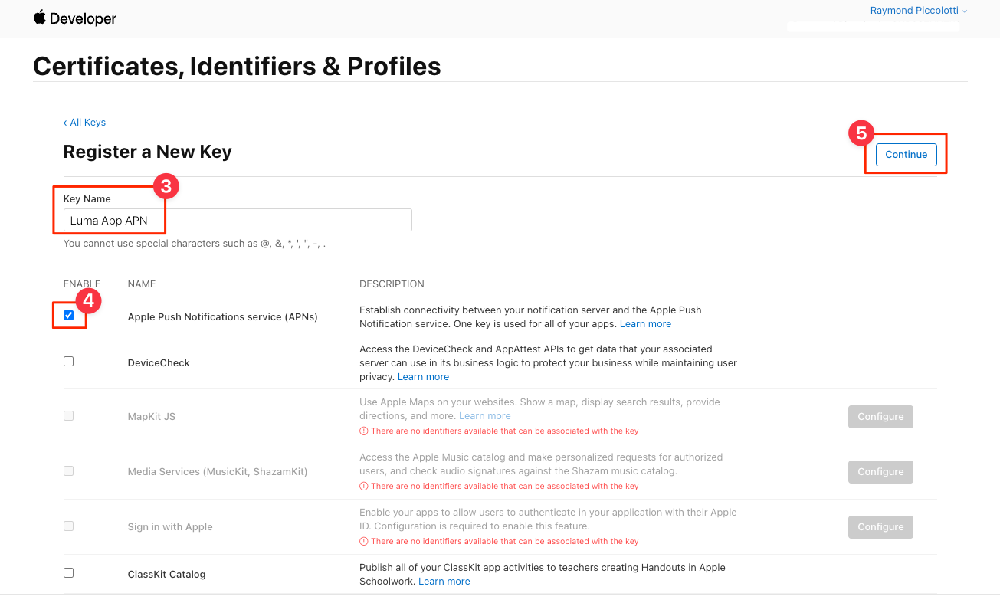

# Adobe Journey Optimizer推播訊息

了解如何使用Platform Mobile SDK和Adobe Journey Optimizer為行動應用程式建立推送訊息。

Journey Optimizer可讓您建立歷程，並傳送訊息給目標對象。 在使用Journey Optimizer傳送推播通知前，您必須確定已有正確的設定和整合。 若要了解Adobe Journey Optimizer中的推播通知資料流程，請參閱 [檔案](https://experienceleague.adobe.com/docs/journey-optimizer/using/configuration/configuration-message/push-config/push-gs.html).

>[!NOTE]
>
>本課程為選用課程，僅適用於想要傳送推送訊息的Adobe Journey Optimizer使用者。


## 先決條件

* 已安裝並設定SDK，成功建立並執行應用程式。
* 存取Adobe Journey Optimizer及如所述的足夠權限 [此處](https://experienceleague.adobe.com/docs/journey-optimizer/using/configuration/configuration-message/push-config/push-configuration.html?lang=en). 此外，您也需要足夠的權限才能使用下列Adobe Journey Optimizer功能。
   * 建立應用程式曲面。
   * 建立歷程
   * 建立訊息.
   * 建立訊息預設集.
* 具有足夠存取權以建立憑證、識別碼和金鑰的付費Apple開發人員帳戶。
* 用於測試的物理iOS設備。

## 學習目標

在本課程中，您將：

* 向Apple推播通知服務(APN)註冊應用程式ID。
* 建立 **[!UICONTROL App Surface]** 在AJO。
* 更新您的 **[!UICONTROL 綱要]** 包含推送訊息欄位。
* 安裝和設定 **[!UICONTROL Adobe Journey Optimizer]** 標籤擴充功能。
* 更新您的應用程式以包含AJO標籤擴充功能。
* 驗證「保證」中的設定。
* 傳送測試訊息。


## 向APN註冊應用ID

下列步驟不特定於Adobe Experience Cloud，旨在引導您完成APN配置。

### 建立 `.p8` 私密金鑰

1. 在Apple開發人員入口網站中，導覽至 **[!UICONTROL 金鑰]**.
1. 選取+圖示以建立金鑰。
   

1. 提供 **[!UICONTROL 密鑰名稱]**.
1. 選取 **[!UICONTROL APN]** 核取方塊。
1. 選擇 **[!UICONTROL 繼續]**.
   
1. 查看配置並選擇 **[!UICONTROL 註冊]**.
1. 下載 `.p8` 私密金鑰。 它用於「應用程式表面」設定。
1. 請注意 **[!UICONTROL 索引鍵ID]**. 它用於「應用程式表面」設定。

其他檔案可以是 [此處找到](https://help.apple.com/developer-account/#/devcdfbb56a3).

### 擷取您的Apple開發人員團隊ID

1. 在Apple開發人員入口網站中，導覽至 **[!UICONTROL 會籍]**.
1. 您的 **[!UICONTROL 團隊ID]** 會列在您的其他會籍資訊旁。 它用於「應用程式表面」設定。

## 在資料收集中新增您的應用程式推送憑證

1. 從 [資料收集介面](https://experience.adobe.com/data-collection/)，請選取左側面板中的「應用程式曲面」標籤。
1. 選擇 **[!UICONTROL 建立應用程式曲面]** 來建立設定。
   
1. 輸入 **[!UICONTROL 名稱]** 例如 `Luma App Tutorial`  .
1. 在行動應用程式設定中，選取 **[!UICONTROL AppleiOS]**.
1. 在「應用程式ID(iOS套件ID)」欄位中輸入行動應用程式套件ID。 如果您與Luma應用程式一起追蹤，則值為 `com.adobe.luma.tutorial`.
1. 開啟 **[!UICONTROL 推送憑證]** 按鈕添加憑據。
1. 拖放 `.p8` **Apple推播通知驗證金鑰** 檔案。
1. 提供金鑰ID，此為在建立 `p8` 驗證金鑰。 您可以在 **憑證、識別碼和設定檔** 頁面。
1. 提供團隊ID。 這是字串值，可在 **會籍** 標籤。
1. 選取「**[!UICONTROL 儲存]**」。
   

## 安裝Adobe Journey Optimizer標籤擴充功能

1. 導覽至 [!UICONTROL 標籤] > [!UICONTROL 擴充功能] > [!UICONTROL 目錄]，並尋找 **[!UICONTROL Adobe Journey Optimizer]** 擴充功能。
1. 安裝擴充功能。
   
1. 選擇 `CJM Push Tracking Experience Event Dataset` Adobe Experience Platform資料集。
   
1. 選擇 **[!UICONTROL 儲存至程式庫並建置]**.

>[!NOTE]
>如果您沒有看見「CJM推播追蹤體驗事件資料集」作為選項，請聯絡客戶服務。

## 在應用程式中實作Adobe Journey Optimizer

如先前的課程所述，安裝行動標籤擴充功能僅提供設定。 接下來，您必須安裝並註冊傳訊SDK。 如果這些步驟不清楚，請查看 [安裝SDK](install-sdks.md) 區段。

>[!NOTE]
>
>如果您已完成 [安裝SDK](install-sdks.md) 小節中，表示已安裝SDK，您可跳至步驟#7。

1. 開啟 `Podfile` 並新增下列行並儲存檔案。

   `pod 'AEPMessaging', '~>1'`
1. 開啟您的終端機，並導覽至包含您的 `Podfile`.
1. 執行命令以安裝SDK `pod install`.
   
1. 開啟XCode並導覽至 `AppDelegate.swift`.
1. 將下列項目新增至匯入清單。

   `import AEPMessaging`
1. 新增 `Messaging.self` 到要註冊的擴展陣列。
1. 將下列函式新增至檔案。

   ```swift
   func application(_: UIApplication, didRegisterForRemoteNotificationsWithDeviceToken deviceToken: Data) {
       MobileCore.setPushIdentifier(deviceToken)
   }
   ```

   此函式會擷取應用程式所安裝裝置所獨有的裝置代號，並傳送至Adobe/Apple以進行推送訊息傳送。

## 透過傳送測試推送訊息來驗證

1. 檢閱 [安裝指示](assurance.md) 區段。
1. 在您的實體裝置上安裝應用程式。
1. 使用「保證」產生的URL啟動應用程式。
1. 將應用程式傳送至背景。
1. 在保證UI中，選取 **[!UICONTROL 設定]**.
   
1. 選取 **[!UICONTROL +]** 按鈕 **[!UICONTROL 推送偵錯]**.
1. 選取「**[!UICONTROL 儲存]**」。
   
1. 選擇 **[!UICONTROL 推送偵錯]** 從左側導覽。
1. 從 **[!UICONTROL 用戶端清單]**.
1. 確認您未收到任何錯誤。
   
1. 向下捲動並選取 **[!UICONTROL 傳送測試推播通知]**.
1. 確認您未收到和錯誤，且裝置上已收到訊息。
   

下一個： **[結論和後續步驟](conclusion.md)**

>[!NOTE]
>
>感謝您花時間學習Adobe Experience Platform Mobile SDK。 如果您有任何疑問、想要分享一般意見，或對未來內容有任何建議，請就此分享 [Experience League社群討論貼文](https://experienceleaguecommunities.adobe.com/t5/adobe-experience-platform-launch/tutorial-discussion-implement-adobe-experience-cloud-in-mobile/td-p/443796)