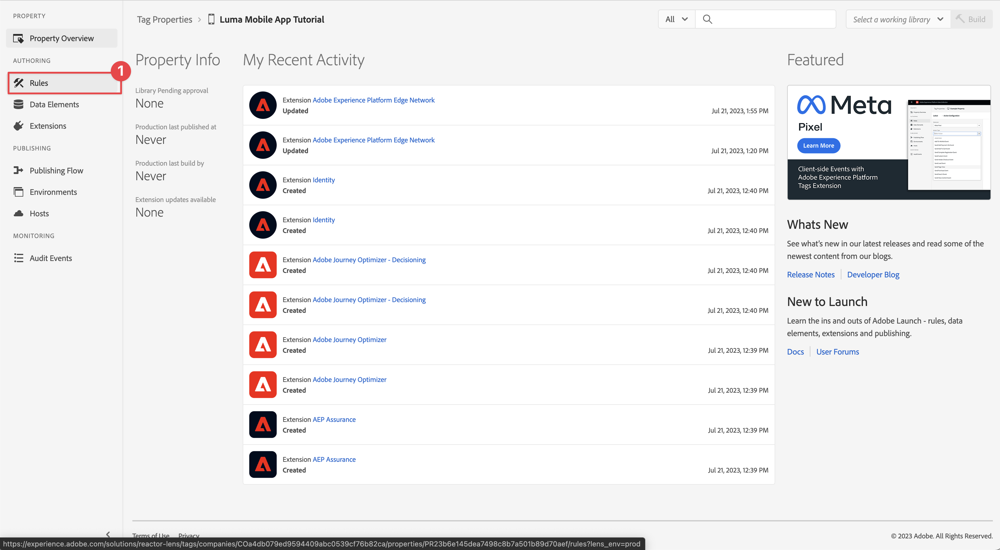

# 收集生命週期資料

瞭解如何在行動應用程式中收集生命週期資料。

Adobe Experience Platform Mobile SDK生命週期擴充功能可讓您從行動應用程式中收集生命週期資料。 Adobe Experience Platform Edge Network擴充功能會將此生命週期資料傳送至Platform Edge Network，再根據您的資料流設定轉送至其他應用程式和服務。 在產品檔案中進一步瞭解[生命週期延伸](https://developer.adobe.com/client-sdks/documentation/lifecycle-for-edge-network/)。


## 先決條件

* 成功建立並執行應用程式，且已安裝並設定SDK。 在本課程中，您已啟動生命週期監視。 請參閱[安裝SDK — 更新AppDelegate](install-sdks.md#update-appdelegate)以進行檢閱。
* 已依照[上一課程](install-sdks.md)中的說明註冊Assurance擴充功能。

## 學習目標

在本課程中，您將會：

<!--
* Add lifecycle field group to the schema.
* -->
* 當應用程式在前景和背景之間移動時，透過正確啟動/暫停來啟用精確的生命週期量度。
* 從應用程式傳送資料至Platform Edge Network。
* 在Assurance中驗證。

<!--
## Add lifecycle field group to schema

The Consumer Experience Event field group you added in the [previous lesson](create-schema.md) already contains the lifecycle fields, so you can skip this step. If you don't use Consumer Experience Event field group in your own app, you can add the lifecycle fields by doing the following:

1. Navigate to the schema interface as described in the [previous lesson](create-schema.md).
1. Open the **Luma Mobile App Event Schema** schema and select **[!UICONTROL Add]** next to Field groups.
    {zoomable="yes"}
1. In the search bar, enter "lifecycle".
1. Select the checkbox next to **[!UICONTROL AEP Mobile Lifecycle Details]**.
1. Select **[!UICONTROL Add field groups]**.
    {zoomable="yes"}
1. Select **[!UICONTROL Save]**.
    {zoomable="yes"}
-->

## 實作變更

現在，您可以更新專案以註冊生命週期事件。

>[!BEGINTABS]

>[!TAB iOS]

1. 在Xcode專案導覽器中導覽至&#x200B;**[!DNL Luma]** > **[!DNL Luma]** > **[!UICONTROL SceneDelegate]**。

1. 啟動時，如果您的應用程式正從背景狀態繼續，iOS可能會呼叫您的`sceneWillEnterForeground:`委派方法，而此方法正是您想要觸發生命週期開始事件的位置。 將此程式碼新增至`func sceneWillEnterForeground(_ scene: UIScene)`：

   ```swift
   // When in foreground start lifecycle data collection
   MobileCore.lifecycleStart(additionalContextData: nil)
   ```

1. 當應用程式進入背景時，您想要暫停來自應用程式`sceneDidEnterBackground:`委派方法的生命週期資料集合。 將此程式碼新增至`func sceneDidEnterBackground(_ scene: UIScene)`：

   ```swift
   // When in background pause lifecycle data collection
   MobileCore.lifecyclePause()
   ```

>[!TAB Android]

1. 在Android Studio導覽器中，導覽至&#x200B;**[!UICONTROL 應用程式]** > **[!UICONTROL kotlin+java]** > **[!UICONTROL com.adobe.luma.tutorial.android]** > **[!UICONTROL LumaApplication]**。

1. 啟動時，如果您的應用程式從背景狀態繼續，Android可能會呼叫您的覆寫`fun onActivityResumed function`，而此函式是您想要觸發生命週期開始事件的位置。 將此程式碼新增至`override fun onActivityResumed(activity: Activity)`：

   ```kotlin
   // When in foreground start lifecycle data collection
   MobileCore.lifecycleStart(null)
   ```

1. 當應用程式進入背景時，您想要暫停應用程式`override fun onActivityPaused`函式的生命週期資料集合。 將此程式碼新增至`override fun onActivityPaused(activity: Activity)`：

   ```swift
   // When in background pause lifecycle data collection
   MobileCore.lifecyclePause()
   ```

>[!ENDTABS]


## 使用保證進行驗證

1. 檢閱[設定指示](assurance.md#connecting-to-a-session)區段，將您的模擬器或裝置連線到Assurance。
1. 將應用程式傳送至背景。 在Assurance UI中檢查&#x200B;**[!UICONTROL LifecyclePause]**&#x200B;事件。
1. 將應用程式移至前景。 在Assurance UI中檢查&#x200B;**[!UICONTROL LifecycleResume]**&#x200B;事件。
   {zoomable="yes"}


## 將資料轉送至Platform Edge Network

上個練習會將前景和背景事件傳送至Adobe Experience Platform Mobile SDK。 若要將這些事件轉送至Platform Edge Network：

1. 在Tags屬性中選取&#x200B;**[!UICONTROL 規則]**。
   {zoomable="yes"}
1. 選取&#x200B;**[!UICONTROL 初始組建]**&#x200B;作為要使用的程式庫。
1. 選取&#x200B;**[!UICONTROL 建立新規則]**。
   {zoomable="yes"}
1. 在&#x200B;**[!UICONTROL 建立規則]**&#x200B;畫面中，輸入`Application Status`名稱&#x200B;**[!UICONTROL 的]**。
1. 在底下選取&#x200B;**[!UICONTROL 新增]** **[!UICONTROL 新增]**。
   {zoomable="yes"}
1. 在&#x200B;**[!UICONTROL 事件設定]**&#x200B;步驟中：
   1. 選取&#x200B;**[!UICONTROL 行動核心]**&#x200B;做為&#x200B;**[!UICONTROL 擴充功能]**。
   1. 選取&#x200B;**[!UICONTROL 前景]**&#x200B;做為&#x200B;**[!UICONTROL 事件型別]**。
   1. 選取&#x200B;**[!UICONTROL 保留變更]**。
      {zoomable="yes"}
1. 返回&#x200B;**[!UICONTROL 「建立規則」]**&#x200B;畫面，選取旁的&#x200B;**[!UICONTROL 新增]** **[!UICONTROL 新增]**。
   {zoomable="yes"}
1. 在&#x200B;**[!UICONTROL 事件設定]**&#x200B;步驟中：
   1. 選取&#x200B;**[!UICONTROL 行動核心]**&#x200B;做為&#x200B;**[!UICONTROL 擴充功能]**。
   1. 選取&#x200B;**[!UICONTROL 背景]**&#x200B;做為&#x200B;**[!UICONTROL 事件型別]**。
   1. 選取&#x200B;**[!UICONTROL 保留變更]**。
      {zoomable="yes"}
1. 返回&#x200B;**[!UICONTROL 建立規則]**&#x200B;畫面，選取下的&#x200B;**[!UICONTROL 新增]** **[!UICONTROL 新增]**。

   {zoomable="yes"}

1. 在&#x200B;**[!UICONTROL 動作組態]**&#x200B;步驟中：
   1. 選取&#x200B;**[!UICONTROL Adobe Experience Edge Network]**&#x200B;做為&#x200B;**[!UICONTROL 擴充功能]**。
   1. 選取&#x200B;**[!UICONTROL 將事件轉送至Edge Network]**&#x200B;做為&#x200B;**[!UICONTROL 動作型別]**。
   1. 選取&#x200B;**[!UICONTROL 保留變更]**。
      {zoomable="yes"}
1. 選取&#x200B;**[!UICONTROL 儲存至資料庫]**。
   {zoomable="yes"}
1. 選取&#x200B;**[!UICONTROL 建置]**&#x200B;以重建程式庫。
   {zoomable="yes"}

成功建立屬性後，事件會傳送至Platform Edge Network，而事件會根據您的資料流設定轉送至其他應用程式和服務。

您應該會在Assurance中看到包含XDM資料的&#x200B;**[!UICONTROL 應用程式關閉（背景）]**&#x200B;和&#x200B;**[!UICONTROL 應用程式啟動（前景）]**&#x200B;事件。

{zoomable="yes"}

>[!SUCCESS]
>
>您現在已設定應用程式，將應用程式狀態（前景、背景）事件傳送至Adobe Experience Platform Edge Network，以及您在資料流中定義的所有服務。
>
> 感謝您花時間學習Adobe Experience Platform Mobile SDK。 如果您有疑問、想分享一般意見或有關於未來內容的建議，請在這篇[Experience League社群討論貼文](https://experienceleaguecommunities.adobe.com/t5/adobe-experience-platform-data/tutorial-discussion-implement-adobe-experience-cloud-in-mobile/td-p/443796)上分享

下一個： **[追蹤事件資料](events.md)**
