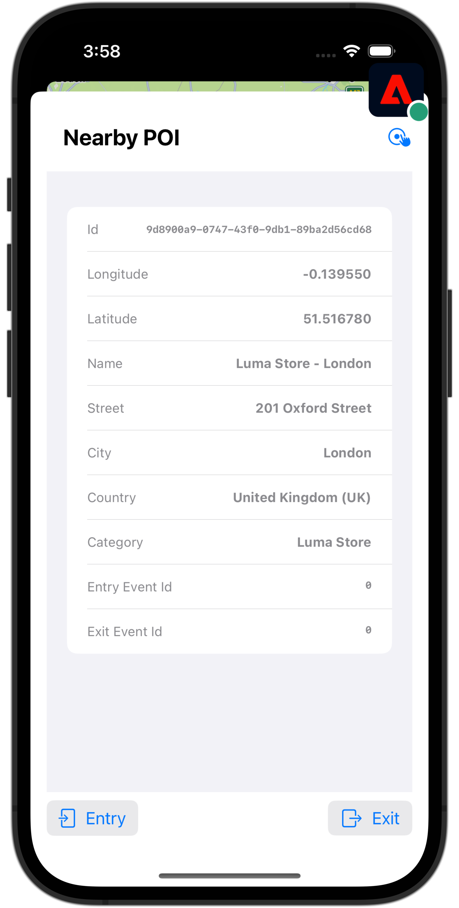

# 使用地標

瞭解如何在應用程式中使用Places地理位置服務。

Adobe Experience Platform Data Collection Places Service是一項地理位置服務，可讓具備位置感知功能的行動應用程式瞭解位置內容。 此服務使用豐富且簡單易用的SDK介面，並隨附彈性的興趣點資料庫(POI)。

## 先決條件

* 所有套件相依性都在Xcode專案中。
* AppDelegate中註冊的擴充功能。
* 已將MobileCore設定為使用您的開發appId。
* 匯入的SDK。
* 已順利建置並執行應用程式，包含上述變更。

## 學習目標

在本課程中，您將學習

* 瞭解如何在Places服務中定義地標。
* 使用Places擴充功能更新您的標籤屬性。
* 更新您的結構描述以擷取地理位置事件。
* 驗證Assurance中的設定。
* 更新您的應用程式以註冊Places擴充功能。
* 從應用程式中的Places服務實作地理位置追蹤。


## 設定

若要讓Places服務在您的應用程式內和Mobile SDK內運作，您必須進行一些設定。

### 定義地標

您可以在Places服務中定義一些地標。

1. 在資料收集UI中，選取&#x200B;**[!UICONTROL 地點]**。
1. 選取。
1. 從內容功能表中選取&#x200B;**[!UICONTROL 管理資料庫]**。
   {zoomable="yes"}
1. 在&#x200B;**[!UICONTROL 管理資料庫]**&#x200B;對話方塊中，選取&#x200B;**[!UICONTROL 新增]**。
1. 在&#x200B;**[!UICONTROL 建立資料庫]**&#x200B;對話方塊中，輸入&#x200B;**[!UICONTROL 名稱]**，例如`Luma`。
1. 選取&#x200B;**[!UICONTROL 確認]**。
   {zoomable="yes"}
1. 若要關閉&#x200B;**[!UICONTROL 管理資料庫]**&#x200B;對話方塊，請選取&#x200B;**[!UICONTROL 關閉]**。
1. 返回&#x200B;**[!UICONTROL POI管理]**，選取&#x200B;**[!UICONTROL 匯入POI]**。
1. 在&#x200B;**[!UICONTROL 匯入地點]**&#x200B;對話方塊中選取&#x200B;**[!UICONTROL 開始]**。
1. 從資料庫清單中選取&#x200B;**[!DNL Luma]**，
1. 選取&#x200B;**[!UICONTROL 下一步]**。
   {zoomable="yes"}
1. 下載[Luma POIs ZIP檔案](assets/luma_pois.csv.zip)並將其解壓縮至您電腦上的位置。
1. 在&#x200B;**[!UICONTROL 匯入地點]**&#x200B;對話方塊中，將擷取的`luma_pois.csv`檔案拖放到&#x200B;**[!UICONTROL 選擇CSV檔案 — 拖放您的檔案]**。 您應該會看到&#x200B;**[!UICONTROL 驗證成功]** - **[!UICONTROL 已成功驗證CSV檔案]**。
1. 選取&#x200B;**[!UICONTROL 開始匯入]**。 您應該會看到&#x200B;**[!UICONTROL 成功]** - **[!UICONTROL 已成功新增6個POI]**。
1. 選取&#x200B;**[!UICONTROL 完成]**。
1. 在&#x200B;**[!UICONTROL POI管理]**&#x200B;中，您應該會看到清單中已新增六個新的Luma存放區。 您可以在清單和地圖檢視之間切換。
   {zoomable="yes"}。


### 安裝Places擴充功能

1. 導覽至&#x200B;**[!UICONTROL 標籤]**&#x200B;並尋找您的行動標籤屬性並開啟屬性。
1. 選取&#x200B;**[!UICONTROL 延伸模組]**。
1. 選取&#x200B;**[!UICONTROL 目錄]**。
1. 搜尋&#x200B;**[!UICONTROL Places]**&#x200B;延伸模組。
1. 安裝擴充功能。

   

1. 在&#x200B;**[!UICONTROL 安裝擴充功能]**&#x200B;對話方塊中：
   1. 從&#x200B;**[!DNL Luma]**&#x200B;選取資料庫&#x200B;**[!UICONTROL 清單中選取]**。
   1. 請確定您已挑選您的工作程式庫，例如&#x200B;**[!UICONTROL 初始組建]**。
   1. 從&#x200B;**[!UICONTROL 儲存至程式庫]**&#x200B;中選取&#x200B;**[!UICONTROL 儲存至程式庫並建置]**。
      {zoomable="yes"}。

1. 已重建您的程式庫。


### 驗證您的結構描述

驗證您的結構描述（如[建立結構描述](create-schema.md)中所定義）是否合併必要的欄位群組和類別，以收集POI和地理位置資料。

1. 導覽至資料收集介面，然後從左側邊欄選取&#x200B;**[!UICONTROL 結構描述]**。
1. 從頂端列選取&#x200B;**[!UICONTROL 瀏覽]**。
1. 選取要開啟的結構描述。
1. 在結構描述編輯器中，選取&#x200B;**[!UICONTROL 消費者體驗事件]**。
1. 您看到&#x200B;**[!UICONTROL placeContext]**&#x200B;物件，其中包含要擷取POI互動與地理位置資料的物件和欄位。
   {zoomable="yes"}。


### 更新您的標籤屬性

Tags的Places擴充功能提供監視地理位置事件的功能，可讓您根據這些事件觸發動作。 您可以使用此功能，將您必須在應用程式中實施的API編碼減至最少。

**資料元素**

您先建立數個資料元素。

1. 前往資料收集UI中的標籤屬性。
1. 從左側邊欄選取&#x200B;**[!UICONTROL 資料元素]**。
1. 選取&#x200B;**[!UICONTROL 新增資料元素]**。
1. 在&#x200B;**[!UICONTROL 建立資料元素]**&#x200B;畫面中，輸入名稱，例如`Name - Entered`。
1. 從&#x200B;**[!UICONTROL 擴充功能]**&#x200B;清單中選取&#x200B;**[!UICONTROL 地標]**。
1. 從&#x200B;**[!UICONTROL 資料元素型別]**&#x200B;清單中選取&#x200B;**[!UICONTROL 名稱]**。
1. 選取&#x200B;**[!UICONTROL TARGET]**&#x200B;底下的&#x200B;**[!UICONTROL 目前POI]**。
1. 選取&#x200B;**[!UICONTROL 儲存至資料庫]**。
   {zoomable="yes"}

1. 使用下表中的資訊重複步驟4至8，以建立其他資料元素。

   | 名稱 | 擴充功能 | 資料元素型別 | TARGET |
   |---|---|---|---|
   | `Name - Exited` | 地點 | 名稱 | 上次退出的POI |
   | `Category - Current` | 地點 | 類別 | 目前POI |
   | `Category - Exited` | 地點 | 類別 | 上次退出的POI |
   | `City - Current` | 地點 | 城市 | 目前POI |
   | `City - Exited` | 地點 | 城市 | 上次退出的POI |

   您應該有以下資料元素清單。

   {zoomable="yes"}

**規則**

接下來，您將定義處理這些資料元素的規則。

1. 在您的標籤屬性中，從左側邊欄選取&#x200B;**[!UICONTROL 規則]**。
1. 選取&#x200B;**[!UICONTROL 新增規則]**。
1. 在&#x200B;**[!UICONTROL 建立規則]**&#x200B;畫面中，輸入規則的名稱，例如`POI - Entry`。
1. 選取底下的&#x200B;**[!UICONTROL 新增]**。
   1. 從&#x200B;**[!UICONTROL 擴充功能]**&#x200B;清單中選取&#x200B;**[!UICONTROL 地標]**，並從&#x200B;**[!UICONTROL 事件型別]**&#x200B;清單中選取&#x200B;**[!UICONTROL 輸入POI]**。
   1. 選取&#x200B;**[!UICONTROL 保留變更]**。
      。
1. 選取底下的&#x200B;**[!UICONTROL 新增]**。
   1. 從&#x200B;**[!UICONTROL 擴充功能]**&#x200B;清單中選取&#x200B;**[!UICONTROL 行動核心]**，從清單中選取&#x200B;**[!UICONTROL 動作型別]**&#x200B;中的&#x200B;**[!UICONTROL 附加資料]**。 此動作會附加裝載資料。
   1. 在&#x200B;**[!UICONTROL JSON裝載]**&#x200B;中，貼上下列裝載：

      ```json
      {
          "xdm": {
              "eventType": "location.entry",
              "placeContext": {
                  "geo": {
                      "city": "{%%City - Current%%}"
                  },
                  "POIinteraction": {
                      "poiDetail": {
                          "name": "{%%Name - Current%%}",
                          "category": "{%%Category - Current%%}"
                      },
                      "poiEntries": {
                          "value": 1
                      }
                  }
              }
          }
      }
      ```

      您也可以選取`{%% ... %%}`資料資料元素預留位置值。 快顯對話方塊可讓您挑選您建立的任何資料元素。

   1. 選取&#x200B;**[!UICONTROL 保留變更]**。
      {zoomable="yes"}

1. 選取動作旁的&#x200B;**[!UICONTROL 新增]**。
   1. 從&#x200B;**[!UICONTROL 擴充功能]**&#x200B;清單中選取&#x200B;**[!UICONTROL Adobe Experience Platform Edge Network]**，然後選取&#x200B;**[!UICONTROL 轉寄事件至Edge Network]**。 此動作可確保將事件和其他裝載資料轉送至Platform Edge Network。
   1. 選取&#x200B;**[!UICONTROL 保留變更]**。

1. 若要儲存規則，請選取&#x200B;**[!UICONTROL 儲存至資料庫]**。

   {zoomable="yes"}

讓我們建立另一個規則

1. 在&#x200B;**[!UICONTROL 建立規則]**&#x200B;畫面中，輸入規則的名稱，例如`POI - Exit`。
1. 選取底下的&#x200B;**[!UICONTROL 新增]**。
   1. 從&#x200B;**[!UICONTROL 擴充功能]**&#x200B;清單中選取&#x200B;**[!UICONTROL 地標]**，並從&#x200B;**[!UICONTROL 事件型別]**&#x200B;清單中選取&#x200B;**[!UICONTROL 結束POI]**。
   1. 選取&#x200B;**[!UICONTROL 保留變更]**。
1. 選取底下的&#x200B;**[!UICONTROL 新增]**。
   1. 從&#x200B;**[!UICONTROL 擴充功能]**&#x200B;清單中選取&#x200B;**[!UICONTROL 行動核心]**，從&#x200B;**[!UICONTROL 動作型別]**&#x200B;清單中選取&#x200B;**[!UICONTROL 附加資料]**。
   1. 在&#x200B;**[!UICONTROL JSON裝載]**&#x200B;中，貼上下列裝載：

      ```json
      {
          "xdm": {
              "eventType": "location.exit",
              "placeContext": {
                  "geo": {
                      "city": "{%%City - Exited%%}"
                  },
                  "POIinteraction": {
                      "poiExits": {
                          "value": 1
                      },
                      "poiDetail": {
                          "name": "{%%Name - Exited%%}",
                          "category": "{%%Category - Exited%%}"
                      }
                  }
              }
          }
      }
      ```

   1. 選取&#x200B;**[!UICONTROL 保留變更]**。

1. 選取動作旁的&#x200B;**[!UICONTROL 新增]**。
   1. 從&#x200B;**[!UICONTROL 擴充功能]**&#x200B;清單中選取&#x200B;**[!UICONTROL Adobe Experience Platform Edge Network]**，然後選取&#x200B;**[!UICONTROL 轉寄事件至Edge Network]**。
   1. 選取&#x200B;**[!UICONTROL 保留變更]**。

1. 若要儲存規則，請選取&#x200B;**[!UICONTROL 儲存至資料庫]**。

   {zoomable="yes"}


若要確保標籤中的所有變更皆已發佈

1. 選取&#x200B;**[!UICONTROL 初始組建]**&#x200B;作為要組建的程式庫。
1. 選取&#x200B;**[!UICONTROL 組建]**。
   {zoomable="yes"}


## 驗證Assurance中的設定

若要驗證Assurance中的設定：

1. 前往Assurance UI。
1. 如果左側邊欄中尚未提供，請在左側邊欄中選取&#x200B;**[!UICONTROL 設定]**，然後選取旁的&#x200B;**[!UICONTROL 新增]**&#x200B;以及&#x200B;**[!UICONTROL PLACES SERVICE]**&#x200B;底下的&#x200B;**[!UICONTROL 地圖和模擬]**。
1. 選取「**[!UICONTROL 儲存]**」。
1. 在左側邊欄中選取&#x200B;**[!UICONTROL 地圖和模擬]**。
1. 將地圖移至其中一個POI的位置。
1. 選取模擬負載POI。 您的POI會使用圓圈和圖釘來識別。
1. 選取您的POI。
1. 從快顯視窗中選取 **[!UICONTROL 模擬進入事件]**。

   {zoomable="yes"}

1. 從左側邊欄選取&#x200B;**[!UICONTROL 事件]**，您應該會看到模擬的事件。

   {zoomable="yes"}


## 在您的應用程式中實作地標

如先前課程所述，安裝行動標籤擴充功能僅會提供設定。 接下來，您必須安裝並註冊Places SDK。 如果未清除這些步驟，請檢閱[安裝SDK](install-sdks.md)區段。

>[!NOTE]
>
>如果您已完成[安裝SDK](install-sdks.md)區段，則Places SDK已經安裝，您可以略過此步驟。
>

>[!IMPORTANT]
>
>在您的應用程式中設定適用於Android的地圖SDK需要您設定帳單，因為使用量會產生費用。 您可以使用唯一的應用程式ID和SHA-1金鑰來限制成本。 如需詳細資訊，請參閱[為Android對應SDK](https://developers.google.com/maps/documentation/android-sdk/overview)。 如果您不想設定帳單或產生成本，請略過本課程。

>[!BEGINTABS]

>[!TAB iOS]

1. 在Xcode中，請確定已將[AEP Places](https://github.com/adobe/aepsdk-places-ios)新增至套件相依性中的套件清單中。 請參閱[Swift封裝管理員](install-sdks.md#swift-package-manager)。
1. 導覽至Xcode專案導覽器中的&#x200B;**[!DNL Luma]** > **[!DNL Luma]** > **[!DNL AppDelegate]**。
1. 請確定`AEPPlaces`是匯入清單的一部分。

   ```swift
   import AEPPlaces
   ```

1. 請確定`Places.self`是您註冊的擴充功能陣列的一部分。

   ```swift
   let extensions = [
       AEPIdentity.Identity.self,
       Lifecycle.self,
       Signal.self,
       Edge.self,
       AEPEdgeIdentity.Identity.self,
       Consent.self,
       UserProfile.self,
       Places.self,
       Messaging.self,
       Optimize.self,
       Assurance.self
   ]
   ```

1. 導覽至Xcode專案導覽器中的&#x200B;**[!DNL Luma]** > **[!DNL Luma]** > **[!DNL Utils]** > **[!UICONTROL MobileSDK]**，並尋找`func processRegionEvent(regionEvent: PlacesRegionEvent, forRegion region: CLRegion) async`函式。 新增下列程式碼：

   ```swift
   // Process geolocation event
   Places.processRegionEvent(regionEvent, forRegion: region)
   ```

   此[`Places.processRegionEvent`](https://developer.adobe.com/client-sdks/documentation/places/api-reference/#processregionevent) API會將地理位置資訊通訊至Places服務。

1. 導覽至Xcode專案導覽器中的&#x200B;**[!DNL Luma]** > **[!DNL Luma]** > **[!DNL Views]** > **[!DNL Location]** > **[!DNL GeofenceSheet]**。

   1. 針對「輸入」按鈕，輸入下列代碼：

      ```swift
      // Simulate geofence entry event
      Task {
          await MobileSDK.shared.processRegionEvent(regionEvent: .entry, forRegion: region)
      }
      ```

   1. 針對「結束」按鈕，輸入下列程式碼：

      ```swift
      // Simulate geofence exit event
      Task {
          await MobileSDK.shared.processRegionEvent(regionEvent: .exit, forRegion: region)
      }
      ```

>[!TAB Android]

1. 在Android Studio中，確定[aepsdk-places-android](https://github.com/adobe/aepsdk-places-android)是&#x200B;**[!UICONTROL Android:app]** ChevronDown **&#x200B;**&#x200B;Gradle指令碼build.gradle.kts （模組&#x200B;**[!UICONTROL ）]**&#x200B;的相依性的一部分。 請參閱[Gradle](install-sdks.md#gradle)。
1. 在Android Studio專案導覽器中，導覽至&#x200B;**[!UICONTROL Android]**  > **[!DNL app]** > **[!DNL kotlin+java]** > **[!UICONTROL com.adobe.luma.tutorial.android]** > **[!UICONTROL LumaApplication]**。
1. 請確定`com.adobe.marketing.mobile.Messaging`是匯入清單的一部分。

   `import import com.adobe.marketing.mobile.Places`

1. 請確定`Places.EXTENSION`是您註冊的擴充功能陣列的一部分。

   ```kotlin
   val extensions = listOf(
       Identity.EXTENSION,
       Lifecycle.EXTENSION,
       Signal.EXTENSION,
       Edge.EXTENSION,
       Consent.EXTENSION,
       UserProfile.EXTENSION,
       Places.EXTENSION,
       Messaging.EXTENSION,
       Optimize.EXTENSION,
       Assurance.EXTENSION
   )
   ```

1. 在Android Studio專案導覽器中，導覽至&#x200B;**[!UICONTROL Android]**  > **[!DNL app]** > **[!DNL kotlin+java]** > **[!UICONTROL com.adobe.luma.tutorial.android]** > **[!UICONTROL 模型]** > **[!UICONTROL MobileSDK]**。 尋找`suspend fun processGeofence(geofence: Geofence?, transitionType: Int)`函式。 新增下列程式碼：

   ```kotlin
   // Process geolocation event
   Places.processGeofence(geofence, transitionType)
   ```

   此[`Places.processRegionEvent`](https://developer.adobe.com/client-sdks/documentation/places/api-reference/#processregionevent) API會將地理位置資訊通訊至Places服務。


1. 在Android Studio專案導覽器中，導覽至&#x200B;**[!UICONTROL Android]**  > **[!DNL app]** > **[!DNL kotlin+java]** > **[!UICONTROL com.adobe.luma.tutorial.android]** > **[!UICONTROL 檢視]** > **[!UICONTROL LocationView.k]**。

   1. 針對「輸入」按鈕，輸入下列代碼：

      ```kotlin
      // Simulate geofence entry event
      coroutineScope.launch {
          MobileSDK.shared.processGeofence(
             region,
             Geofence.GEOFENCE_TRANSITION_ENTER
          )
      }
      ```

   1. 針對「結束」按鈕，輸入下列程式碼：

      ```kotlin
      // Simulate geofence entry event
      coroutineScope.launch {
          MobileSDK.shared.processGeofence(
              region,
              Geofence.GEOFENCE_TRANSITION_EXIT
          )
      }
      ```

>[!ENDTABS]

## 使用您的應用程式進行驗證

若要驗證應用程式中的地理位置功能：

>[!BEGINTABS]

>[!TAB iOS]

1. 在裝置上或在模擬器中開啟您的應用程式。

1. 前往&#x200B;**[!UICONTROL 位置]**&#x200B;標籤。

1. 四處移動（拖曳）地圖，確保藍色中間圓圈位於您的其中一個POI上方，例如倫敦。

1. 點選 ，直到您看到類別和名稱出現在標籤中帶有pin的紅色位置為止。

1. 點選POI的標籤，開啟&#x200B;**[!UICONTROL 附近的POI]**&#x200B;工作表。

   

1. 按下&#x200B;**[!UICONTROL 登入]**&#x200B;或&#x200B;**[!UICONTROL 退出]**&#x200B;按鈕，以模擬應用程式中的地理柵欄登入與地理柵欄退出事件。

   

1. 您應該會在Assurance UI中看到事件。 在Events和Places Service事件中。

>[!TAB Android]

1. 前往&#x200B;**[!UICONTROL 位置]**&#x200B;標籤。

1. 選取&#x200B;**[!UICONTROL 使用和/或模擬地理圍欄]**。

1. 在出現的紅色圓圈內點選某處。

   


1. 按下&#x200B;**[!UICONTROL 登入]**&#x200B;或&#x200B;**[!UICONTROL 退出]**&#x200B;按鈕，以模擬應用程式中的地理柵欄登入與地理柵欄退出事件。

   

1. 您應該會在Assurance UI中看到事件。


>[!ENDTABS]


## 後續步驟

您現在應該有所有的工具，以便開始將更多功能新增至應用程式中的地理位置功能。 當您已將事件轉送至Edge Network，當您為[Experience Platform](platform.md)設定應用程式後，應該會看到應用程式中所使用設定檔中顯示的體驗事件。

在本教學課程的Journey Optimizer區段中，您會看到體驗事件可用來觸發歷程(請參閱[推播通知](journey-optimizer-inapp.md)和[使用Journey Optimizer的應用程式內傳訊](journey-optimizer-push.md))。 例如，當應用程式使用者進入實體商店的地理柵欄時，傳送推播通知給該使用者並進行某些產品促銷的常見範例。

針對您的應用程式實施地理位置功能，可大幅減少程式碼。 您在標籤屬性中定義的Places服務、資料元素和規則提供大部分的功能。 或者，您可以使用[`Edge.sendEvent`](https://developer.adobe.com/client-sdks/documentation/edge-network/api-reference/#sendevent) API （如需詳細資訊，請參閱[事件](events.md)）直接在您的應用程式中實作相同的功能，XDM承載包含填入的`placeContext`物件。

>[!SUCCESS]
>
>您現在已使用Experience Platform Mobile SDK中的Places擴充功能，為地理定位服務啟用應用程式。
>
>感謝您花時間學習Adobe Experience Platform Mobile SDK。 如果您有任何疑問、想分享一般意見或有關於未來內容的建議，請在這篇[Experience League社群討論貼文](https://experienceleaguecommunities.adobe.com/t5/adobe-experience-platform-data/tutorial-discussion-implement-adobe-experience-cloud-in-mobile/td-p/443796?profile.language=zh-Hant)上分享。

下一步： **[將資料對應至Adobe Analytics](analytics.md)**
