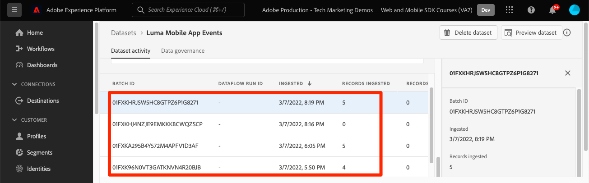

# 將資料傳送至Adobe Experience Platform

了解如何將資料傳送至Adobe Experience Platform。

本選用課程與Real-time Customer Data Platform(Real-Time CDP)、Journey Optimizer和Customer Journey Analytics的所有客戶相關。 Experience Platform是Experience Cloud產品的基礎，是一個開放式系統，可將您的所有資料(Adobe和非Adobe)轉換為強大的客戶設定檔，以便即時更新，並使用AI導向的深入分析來協助您跨每個管道提供正確的體驗。

此 [事件](events.md), [生命週期](lifecycle-data.md)，和 [身分](identity.md) 您在先前的課程中收集並傳送至Platform Edge Network的資料會轉送至您資料流中設定的服務，包括Adobe Experience Platform。

## 先決條件

貴組織必須已布建且已授予Adobe Experience Platform權限。

如果您沒有存取權，您可以 [略過本課程](install-sdks.md).

## 學習目標

在本課程中，您將：

* 建立Experience Platform資料集。
* 驗證資料集中的資料。
* 為「即時客戶個人檔案」啟用您的結構和資料集。
* 在即時客戶個人檔案中驗證資料。
* 驗證身分圖表中的資料。

## 建立資料集

成功擷取至Adobe Experience Platform的所有資料都會以資料集形式保存在資料湖中。 資料集是資料集合的儲存和管理結構，通常是包含方案 (欄) 和欄位 (列) 的表格。 資料集也包含中繼資料，可說明其儲存資料的各個層面。 請參閱 [檔案](https://experienceleague.adobe.com/docs/experience-platform/catalog/datasets/overview.html?lang=zh-Hant) ，以了解詳情。

1. 從右上角的3x3功能表選取Experience Platform介面，即可導覽至介面。
   

1. 選擇 **[!UICONTROL 資料集]** 的上界。

1. **[!UICONTROL 建立資料集]**.
   

1. 選擇 **[!UICONTROL 從結構建立資料集]**.
   

1. 搜尋您的架構並選取。

1. 選取&#x200B;**[!UICONTROL 「下一步」]**。
   

1. 提供 **[!UICONTROL 名稱]**, **[!UICONTROL 說明]**，然後選取 **[!UICONTROL 完成]**.
   

## 更新資料流

建立資料集後，請務必 [更新資料流](create-datastream.md) 新增Adobe Experience Platform。 此更新可確保資料流入Platform。

## 驗證資料集中的資料

現在您已建立資料集並更新資料流以將資料傳送至Experience Platform，傳送至Platform Edge Network的所有XDM資料都會轉送至Platform並置於資料集中。

開啟應用程式，並導覽至您要追蹤事件的畫面。 您也可以觸發生命週期量度。

在Platform介面中開啟資料集。 您應該會看到資料以批次方式送達資料集

您也應該可以看到範例記錄和欄位，使用 **[!UICONTROL 預覽資料集]** 功能：

Platform提供更強大的資料驗證工具 [查詢服務](https://experienceleague.adobe.com/docs/platform-learn/tutorials/queries/explore-data.html?lang=zh-Hant).

## 啟用即時客戶個人檔案

Experience Platform的「即時客戶設定檔」可讓您針對每個個別客戶建立全方位的檢視，其中結合來自多個管道的資料，包括線上、離線、CRM和協力廠商資料。 設定檔可讓您將不同的客戶資料併入統一檢視中，提供每個客戶互動的可操作、時間戳記帳戶。

### 啟用架構

1. 開啟您的結構
1. 啟用 **[!UICONTROL 設定檔]**
1. 選擇 **[!UICONTROL 此結構的資料將在identityMap欄位中包含主要身分。]** 在強制回應視窗中
1. **[!UICONTROL 儲存]** 架構

   

### 啟用資料集

1. 開啟資料集
1. 啟用 **[!UICONTROL 設定檔]**

   

### 驗證設定檔中的資料

開啟應用程式，並導覽至您要追蹤事件的畫面。 登入Luma應用程式並進行購買。

使用「保證」來尋找在identityMap中傳遞的其中一個身分識別（電子郵件、lumaCrmId或ECID）:

>[!TIP]
>
>   的值 `lumaCrmId` is `112ca06ed53d3db37e4cea49cc45b71e`

在Platform介面中，導覽至 **[!UICONTROL 設定檔]** > **[!UICONTROL 瀏覽]**，查詢您剛抓取的身分值，然後開啟設定檔：

在 **[!UICONTROL 詳細資料]** 螢幕上可以看到有關用戶的基本資訊，包括 **[!UICONTROL **&#x200B;連結身分&#x200B;**]**:

在 **[!UICONTROL 事件]**，您可以看到從行動應用程式實作中針對此使用者收集的事件：

在設定檔詳細資訊畫面中，按一下連結以檢視身分圖表或導覽至 **[!UICONTROL 身分]** > **[!UICONTROL 身分圖]** 和查詢身分值。 此視覺效果會顯示在設定檔中連結在一起的所有身分及其來源。 以下範例為身分圖表，由完成本行動SDK教學課程（資料來源2）和 [Web SDK教學課程](https://experienceleague.adobe.com/docs/platform-learn/implement-web-sdk/overview.html?lang=zh-Hant) （資料來源1）:

行銷人員和分析人員可以處理Experience Platform中擷取的資料，包括在Customer Journey Analytics中分析資料，以及在Real-time Customer Data Platform中建立區段。 你開始得不錯！

下一個： **[使用Journey Optimizer推送訊息](journey-optimizer-push.md)**

>[!NOTE]
>
>感謝您花時間學習Adobe Experience Platform Mobile SDK。 如果您有任何疑問、想要分享一般意見，或對未來內容有任何建議，請就此分享 [Experience League社群討論貼文](https://experienceleaguecommunities.adobe.com/t5/adobe-experience-platform-launch/tutorial-discussion-implement-adobe-experience-cloud-in-mobile/td-p/443796)
