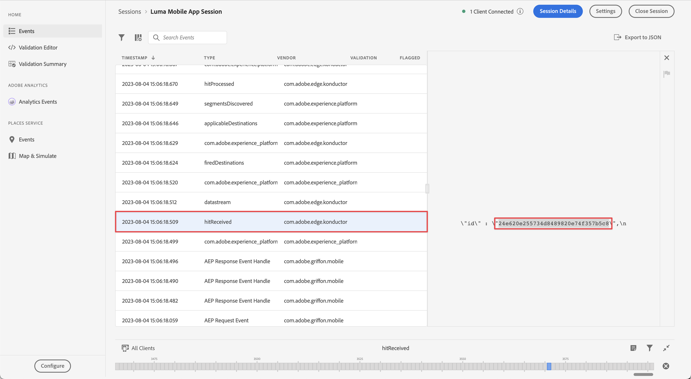

# 傳送資料給Experience Platform

瞭解如何將行動應用程式資料傳送至Adobe Experience Platform。

此選擇性課程與Real-time Customer Data Platform (Real-Time CDP)、Journey Optimizer和Customer Journey Analytics的所有客戶有關。 Experience Platform是Experience Cloud產品的基礎，是開放系統，可將您的所有資料(Adobe和非Adobe)轉換為強大的客戶設定檔。 這些客戶設定檔會即時更新，並使用AI導向的深入分析來協助您跨每個管道提供適當的體驗。

此 [事件](events.md)， [生命週期](lifecycle-data.md)、和 [身分](identity.md) 您在先前的課程中收集並傳送至Platform Edge Network的資料，會轉送至您在資料流中設定的服務，包括Adobe Experience Platform。

## 先決條件

您的組織必須布建並授與Adobe Experience Platform的許可權。

如果您沒有存取權，可以 [略過本課程](install-sdks.md).

## 學習目標

在本課程中，您將會：

* 建立Experience Platform資料集。
* 設定您的資料串流以將資料轉送至Experience Platform。
* 驗證資料集中的資料。
* 為Real-time Customer Profile啟用您的結構描述和資料集。
* 驗證即時客戶個人檔案中的資料。
* 驗證身分圖表中的資料。

## 建立資料集

所有成功內嵌至Adobe Experience Platform的資料都會以資料集的形式保留在資料湖中。 資料集是資料集合（通常是表格）的儲存和管理結構，其中包含結構（欄）和欄位（列）。 資料集也包含中繼資料，可說明其儲存資料的各個層面。 請參閱 [檔案](https://experienceleague.adobe.com/docs/experience-platform/catalog/datasets/overview.html?lang=zh-Hant) 以取得相關資訊。

1. 從應用程式中選取Experience Platform介面，即可導覽至該介面  功能表右上方。

1. 選取 **[!UICONTROL 資料集]** 從左側導覽功能表。

1. 選取  **[!UICONTROL 建立資料集]**.

1. 選取&#x200B;**[!UICONTROL 「從結構建立資料集」]**。
   

1. 搜尋您的結構描述。 例如使用 `Luma Mobile` 在搜尋欄位中。
1. 選取您的結構描述，例如 **[!DNL Luma Mobile App Event Schema]**.

1. 選取&#x200B;**[!UICONTROL 「下一步」]**。
   

1. 提供 **[!UICONTROL 名稱]**，例如 `Luma Mobile App Events Dataset` 和 **[!UICONTROL 說明]**.

1. 選取「**[!UICONTROL 完成]**」。
   

## 新增Adobe Experience Platform資料流服務

若要將您的XDM資料從Edge Network傳送至Adobe Experience Platform，請將Adobe Experience Platform服務新增至您設定的資料流（屬於的一部分） [建立資料串流](create-datastream.md).

>[!IMPORTANT]
>
>您只能在建立事件資料集後啟用Adobe Experience Platform服務。

1. 在資料收集UI中，選取 **[!UICONTROL 資料串流]** 和您的資料流。

1. 然後選取  **[!UICONTROL 新增服務]**.

1. 從[!UICONTROL 「服務」]清單中選取&#x200B;**[!UICONTROL 「Adobe Experience Platform」]**。

1. 透過切換來啟用服務 **[!UICONTROL 已啟用]** 開啟。

1. 選取 **[!UICONTROL 事件資料集]** 例如您先前建立的 **[!DNL Luma Mobile App Event Dataset]**.

1. 選取「**[!UICONTROL 儲存]**」。

   
1. 最終設定看起來應該像這樣。

   

## 驗證資料集中的資料

現在您已建立資料集並更新資料流以將資料傳送至Experience Platform，所有傳送至Platform Edge Network的XDM資料都會轉送至Platform並進入資料集。

開啟應用程式，並導覽至您正在追蹤事件的畫面。 您也可以觸發生命週期量度。

在Platform介面中開啟資料集。 您應該會看到資料批次到達資料集。 資料通常每15分鐘會以微批次的形式送達，因此您可能無法立即看到資料。

您也應該能夠檢視範例記錄和使用 **[!UICONTROL 預覽資料集]** 功能：

驗證資料更強大的工具是Platform [查詢服務](https://experienceleague.adobe.com/docs/platform-learn/tutorials/queries/explore-data.html?lang=zh-Hant).

## 啟用即時客戶個人檔案

Experience Platform的即時客戶設定檔可讓您建立每個個別客戶的整體檢視，該檢視會結合來自多個管道的資料，包括線上、離線、CRM和第三方資料。 設定檔可讓您將不同的客戶資料整合為統一的檢視畫面，針對每個客戶互動提供可採取行動且附有時間戳記的說明。

### 啟用結構

1. 例如，開啟您的結構描述 **[!DNL Luma Mobile App Event Schema]**.
1. 啟用 **[!UICONTROL 個人資料]**.
1. 選取 **[!UICONTROL 此結構描述的資料將在identityMap欄位中包含主要身分。]** 在對話方塊中。
1. **[!UICONTROL 儲存]** 結構描述。

   

### 啟用資料集

1. 例如，開啟您的資料集 **[!DNL Luma Mobile App Event Dataset]**.
1. 啟用 **[!UICONTROL 個人資料]**.

   

### 驗證設定檔中的資料

開啟應用程式，並導覽至您正在追蹤事件的畫面，例如：登入Luma應用程式並進行購買。

使用保證來尋找在identityMap中傳遞的其中一個身分（電子郵件、lumaCrmId或ECID），例如CRM ID。

在平台介面中，

1. 瀏覽至 **[!UICONTROL 設定檔]**，並選取 **[!UICONTROL 瀏覽]** 從頂端列。
1. 指定您剛剛擷取的身分詳細資訊，例如 `Luma CRM ID` 的 **[!UICONTROL 身分名稱空間]** 以及您複製的值 **[!UICONTROL 身分值]**. 然後選取 **[!UICONTROL 檢視]**.
1. 若要檢視詳細資訊，請選取設定檔。

在 **[!UICONTROL 詳細資料]** 熒幕上，您可以看到使用者的基本資訊，包括 **[!UICONTROL **&#x200B;連結的身分&#x200B;**]**：

在 **[!UICONTROL 活動]**，您可以檢視針對此使用者從行動應用程式實施收集的事件：

從設定檔詳細資訊畫面：

1. 若要檢視身分圖表，請按一下連結或導覽至 **[!UICONTROL 身分]**，然後選取 **[!UICONTROL 身分圖表]** 從頂端列。
1. 若要查詢身分值，請指定 `Luma CRM ID` 作為 **[!UICONTROL 身分名稱空間]** 並將複製的值設為 **[!UICONTROL 身分值]**. 然後選取 **[!UICONTROL 檢視]**.

   此視覺效果會顯示設定檔中連結在一起的所有身分及其來源。 以下是身分圖表範例，由完成此Mobile SDK教學課程（資料來源2）和 [Web SDK教學課程](https://experienceleague.adobe.com/docs/platform-learn/implement-web-sdk/overview.html?lang=zh-Hant) （資料來源1）：

   

## 後續步驟

行銷人員和Analytics處理在Experience Platform中擷取的資料的能力更強，包括在Customer Journey Analytics中分析資料以及在Real-time Customer Data Platform中建立區段。 您有一個良好的開端！

>[!SUCCESS]
>
>您現在已設定應用程式，不僅將資料傳送至Edge Network，也傳送至Adobe Experience Platform。 感謝您花時間學習Adobe Experience Platform Mobile SDK。 如果您有疑問、想要分享一般意見或有關於未來內容的建議，請在此分享這些內容 [Experience League社群討論貼文](https://experienceleaguecommunities.adobe.com/t5/adobe-experience-platform-data/tutorial-discussion-implement-adobe-experience-cloud-in-mobile/td-p/443796).

下一步： **[建立和傳送推播通知](journey-optimizer-push.md)**
