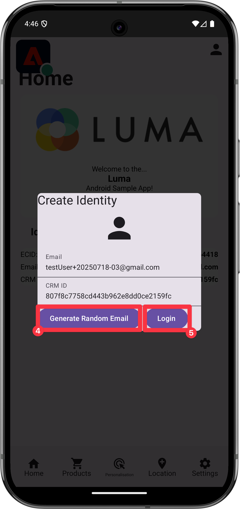

# 收集設定檔資料

瞭解如何在行動應用程式中收集設定檔資料。

您可以使用設定檔擴充功能在使用者端上儲存使用者的相關屬性。 此資訊稍後可用於線上上或離線情況下目標定位和個人化訊息，不必連線至伺服器以獲得最佳效能。

設定檔擴充功能可管理使用者端作業設定檔(CSOP)、提供對API做出反應的方式、更新使用者設定檔屬性，以及將使用者設定檔屬性作為已產生的事件與系統其他部分共用。

其他擴充功能會使用設定檔資料來執行設定檔相關動作。 規則引擎擴充功能即是一例，它會使用設定檔資料，並根據設定檔資料執行規則。 在檔案中進一步瞭解[設定檔擴充功能](https://developer.adobe.com/client-sdks/documentation/profile/)

>[!IMPORTANT]
>
>本課程中所述的設定檔功能與Adobe Experience Platform和平台型應用程式中的即時客戶設定檔功能不同。


## 先決條件

* 成功建立並執行應用程式，且已安裝並設定SDK。

## 學習目標

在本課程中，您將會：

* 設定或更新使用者屬性。
* 擷取使用者屬性。


## 設定和更新使用者屬性

快速知道使用者過去或最近是否曾經購買有助於在應用程式中鎖定目標和個人化。 讓我們在Luma應用程式中設定它。

>[!BEGINTABS]

>[!TAB iOS]

1. 導覽至Xcode專案導覽器中的&#x200B;**[!DNL Luma]** > **[!DNL Luma]** > **[!DNL Utils]** > **[!DNL MobileSDK]**，並尋找`func updateUserAttribute(attributeName: String, attributeValue: String)`函式。 新增下列程式碼：

   ```swift
   // Create a profile map, add attributes to the map and update profile using the map
   var profileMap = [String: Any]()
   profileMap[attributeName] = attributeValue
   UserProfile.updateUserAttributes(attributeDict: profileMap)
   ```

   此程式碼：

   1. 設定名稱為`profileMap`的空白字典。

   1. 使用`attributeName` （例如`isPaidUser`）和`attributeValue` （例如`yes`）將元素新增至字典。

   1. 使用`profileMap`字典做為`attributeDict`[`UserProfile.updateUserAttributes` API呼叫之](https://developer.adobe.com/client-sdks/documentation/profile/api-reference/#updateuserattributes)引數的值。

1. 導覽至Xcode專案導覽器中的&#x200B;**[!DNL Luma]** > **[!DNL Luma]** > **[!DNL Views]** > **[!DNL Products]** > **[!DNL ProductView]**，並尋找對`updateUserAttributes`的呼叫（在購買的程式碼內） 按鈕)。 新增下列程式碼：

   ```swift
   // Update attributes
   MobileSDK.shared.updateUserAttribute(attributeName: "isPaidUser", attributeValue: "yes")
   ```

>[!TAB Android]

1. 導覽至Android Studio導覽器中的&#x200B;**[!UICONTROL Android]**  > **[!DNL app]** > **[!DNL kotlin+java]** > **[!DNL com.adobe.luma.tutorial.android]** > **[!UICONTROL 模型]** > **[!UICONTROL MobileSDK]**，並尋找`func updateUserAttribute(attributeName: String, attributeValue: String)`函式。 新增下列程式碼：

   ```kotlin
   // Create a profile map, add attributes to the map and update profile using the map
   val profileMap = mapOf(attributeName to attributeValue)
   UserProfile.updateUserAttributes(profileMap)
   ```

   此程式碼：

   1. 設定名稱為`profileMap`的空白對應。

   1. 使用`attributeName` （例如`isPaidUser`）和`attributeValue` （例如`yes`）將專案加入對映。

   1. 使用`profileMap`對應作為`attributeDict`[`UserProfile.updateUserAttributes` API呼叫之](https://developer.adobe.com/client-sdks/documentation/profile/api-reference/#updateuserattributes)引數的值。

1. 導覽至&#x200B;**[!UICONTROL Android]**  > **[!DNL app]** > **[!DNL kotlin+java]** > **[!DNL com.adobe.luma.tutorial.android]** > **[!UICONTROL 檢視]** > **[!UICONTROL ProductView.kt]**，並在購買程式碼中找到`updateUserAttributes`的呼叫 按鈕)。 新增下列程式碼：

   ```kotlin
   // Update attributes
   MobileSDK.shared.updateUserAttribute("isPaidUser", "yes")
   ```

>[!ENDTABS]

## 取得使用者屬性

更新使用者的屬性後，其他Adobe SDK即可使用該屬性，但您也可以明確擷取屬性，讓應用程式依您想要的方式運作。

>[!BEGINTABS]

>[!TAB iOS]

1. 導覽至Xcode專案導覽器中的&#x200B;**[!DNL Luma]** > **[!DNL Luma]** > **[!DNL Views]** > **[!DNL General]** > **[!DNL HomeView]**，並尋找`.onAppear`修飾元。 新增下列程式碼：

   ```swift
   // Get attributes
   UserProfile.getUserAttributes(attributeNames: ["isPaidUser"]) { attributes, error in
       if attributes?.count ?? 0 > 0 {
           if attributes?["isPaidUser"] as? String == "yes" {
               showBadgeForUser = true
           }
           else {
               showBadgeForUser = false
           }
       }
   }
   ```

   此程式碼：

   1. 以[`UserProfile.getUserAttributes`屬性名稱呼叫](https://developer.adobe.com/client-sdks/documentation/profile/api-reference/#getuserattributes)`isPaidUser` API做為`attributeNames`陣列中的單一專案。
   1. 然後檢查`isPaidUser`屬性的值，當`yes`時，在 右上角工具列中的圖示。

>[!TAB Android]

1. 導覽至Android Studio專案導覽器中的&#x200B;**[!UICONTROL Android]**  > **[!DNL app]** > **[!DNL kotlin+java]** > **[!DNL com.adobe.luma.tutorial.androi]** > **[!DNL views]** > **[!DNL HomeView.kt]**，並尋找`.onAppear`修飾元。 新增下列程式碼：

   ```kotlin
   // Get attributes
   UserProfile.getUserAttributes(listOf("isPaidUser")) { attributes ->
       showBadgeForUser = attributes?.get("isPaidUser") == "yes"
   }
   ```

   此程式碼：

   1. 以[`UserProfile.getUserAttributes`屬性名稱呼叫](https://developer.adobe.com/client-sdks/documentation/profile/api-reference/#getuserattributes)`isPaidUser` API做為`attributeNames`陣列中的單一專案。
   1. 然後檢查`isPaidUser`屬性的值。 當`yes`時，程式碼會以上的徽章取代人員圖示 右上角工具列中的圖示。

>[!ENDTABS]

如需詳細資訊，請參閱[API參考](https://developer.adobe.com/client-sdks/documentation/profile/api-reference/#getuserattributes)。

## 使用保證進行驗證

1. 檢閱[設定指示](assurance.md#connecting-to-a-session)區段，將您的模擬器或裝置連線到Assurance。
1. 執行應用程式以登入並與產品互動。

>[!BEGINTABS]

>[!TAB iOS]

1. 在索引標籤列中選取&#x200B;**[!UICONTROL 首頁]**。
1. 將Assurance圖示向左移動。
1. 若要開啟「登入」工作表，請選取 按鈕。

   

1. 若要插入隨機電子郵件和客戶ID，請選取 按鈕。
1. 選取&#x200B;**[!UICONTROL 登入]**。

   

1. 在索引標籤列中選取&#x200B;**[!DNL Products]**。
1. 選取一個產品。
1. 選擇 。
1. 選擇 。
1. 選擇 。

   

1. 返回&#x200B;**[!UICONTROL 首頁]**&#x200B;畫面。 您應該會看到徽章已新增 。

   


>[!TAB Android]

1. 在索引標籤列中選取&#x200B;**[!UICONTROL 首頁]**。
1. 將Assurance圖示向左移動。
1. 若要開啟「登入」工作表，請選取 按鈕。

   

1. 若要插入隨機電子郵件和客戶ID，請選取 按鈕。
1. 選取&#x200B;**[!UICONTROL 登入]**。

   

1. 在索引標籤列中選取&#x200B;**[!DNL Products]**。
1. 選取一個產品。
1. 選擇。
1. 選擇 。
1. 選擇 。

   

1. 返回&#x200B;**[!UICONTROL 首頁]**&#x200B;畫面。 您應該會看到人員圖示已更新。

   

>[!ENDTABS]


在Assurance UI中，您應該會看到具有更新&#x200B;**[!UICONTROL 值的]** UserProfileUpdate **[!UICONTROL 和]** getUserAttributes`profileMap`事件。

{zoomable="yes"}

>[!SUCCESS]
>
>您現在已設定應用程式，以在Edge Network和（設定時）Adobe Experience Platform中更新設定檔的屬性。
>
>感謝您花時間學習Adobe Experience Platform Mobile SDK。 如果您有任何疑問、想分享一般意見或有關於未來內容的建議，請在這篇[Experience League社群討論貼文](https://experienceleaguecommunities.adobe.com/t5/adobe-experience-platform-data/tutorial-discussion-implement-adobe-experience-cloud-in-mobile/td-p/443796)上分享。

下一個： **[使用地標](places.md)**
