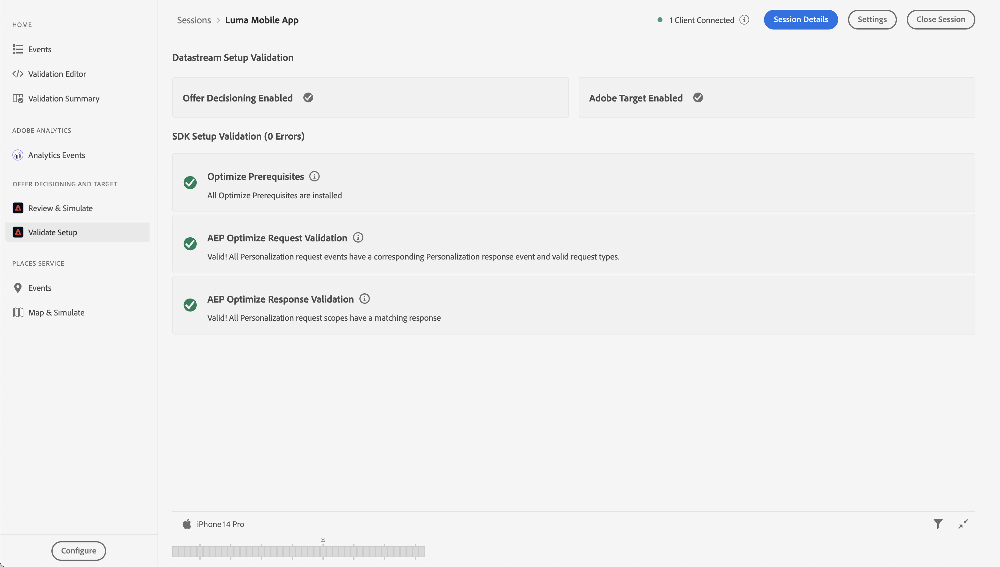

# 使用Adobe Target最佳化及個人化

瞭解如何使用Platform Mobile SDK和Adobe Target將行動應用程式中的體驗最佳化及個人化。

Target提供一切所需工具，讓您量身打造及個人化您的客戶體驗。 Target可協助您在網站和行動網站、應用程式、社群媒體和其他數位頻道上獲得最大收入。 Target可以執行A/B測試、多變數測試、建議產品和內容、鎖定內容、使用AI自動個人化內容等等。 本課程著重於Target的A/B測試功能。 如需詳細資訊，請參閱[A/B測試總覽](https://experienceleague.adobe.com/docs/target/using/activities/abtest/test-ab.html?lang=zh-Hant)。


使用Target執行A/B測試之前，您必須確保有適當的設定和整合。

>[!NOTE]
>
>本課程為選修課程，僅適用於希望執行A/B測試的Adobe Target使用者。


## 先決條件

* 成功建立並執行應用程式，且已安裝並設定SDK。
* 使用許可權、正確設定的角色、工作區和屬性存取Adobe Target，如[此處](https://experienceleague.adobe.com/docs/target/using/administer/manage-users/enterprise/property-channel.html?lang=zh-Hant)所述。


## 學習目標

在本課程中，您將會：

* 更新您的Target整合資料流。
* 使用Journey Optimizer - Decisioning擴充功能更新標籤屬性。
* 更新您的結構描述以擷取主張事件。
* 驗證Assurance中的設定。
* 在Target中建立簡單的A/B測試。
* 更新您的應用程式以註冊Optimizer擴充功能。
* 在您的應用程式中實作A/B測試。
* 驗證Assurance中的實作。


## 設定

>[!TIP]
>
>如果您已經在[Journey Optimizer選件](journey-optimizer-offers.md)課程中設定應用程式，您可能已經執行此設定區段中的某些步驟。

### 更新資料流設定

#### Adobe Target

為確保從您的行動應用程式傳送到Experience PlatformEdge Network的資料能轉送到Adobe Target，您必須更新資料流設定。

1. 在資料收集UI中，選取&#x200B;**[!UICONTROL 資料串流]**，然後選取您的資料串流，例如&#x200B;**[!DNL Luma Mobile App]**。
1. 選取&#x200B;**[!UICONTROL 新增服務]**，並從&#x200B;**[!UICONTROL 服務]**&#x200B;清單中選取&#x200B;**[!UICONTROL Adobe Target]**。
1. 如果您是Target Premium客戶，且想要使用屬性代號，請輸入您要用於這項整合的Target **[!UICONTROL 屬性代號]**&#x200B;值。 Target Standard使用者可略過此步驟。

   您可以在Target UI的&#x200B;**[!UICONTROL 管理]** > **[!UICONTROL 屬性]**&#x200B;中找到您的屬性。 選取以顯示您要使用之屬性的屬性代號。 屬性權杖的格式如`"at_property": "xxxxxxxx-xxxx-xxxxx-xxxx-xxxxxxxxxxxx"`；您只能輸入值`xxxxxxxx-xxxx-xxxxx-xxxx-xxxxxxxxxxxx`。

   您可以選擇指定Target環境ID。 Target會使用環境來組織您的網站和生產前環境，以便輕鬆管理和分隔報表。 預設環境包括生產、測試和開發。 如需詳細資訊，請參閱[環境](https://experienceleague.adobe.com/docs/target/using/administer/environments.html?lang=zh-Hant)和[目標環境識別碼](https://experienceleague.adobe.com/docs/platform-learn/implement-web-sdk/applications-setup/setup-target.html?lang=zh-Hant#target-environment-id)。

   您可以選擇指定Target第三方ID名稱空間，以支援在身分名稱空間上同步設定檔（例如CRM ID）。 如需詳細資訊，請參閱[目標第三方ID名稱空間](https://experienceleague.adobe.com/docs/platform-learn/implement-web-sdk/applications-setup/setup-target.html?lang=zh-Hant#target-third-party-id-namespace)。

1. 選取「**[!UICONTROL 儲存]**」。

   


#### Adobe Journey Optimizer

為確保將從您的行動應用程式傳送到Edge Network的資料轉送到Journey Optimizer — 決策管理，請更新您的資料流設定。

1. 在資料收集UI中，選取&#x200B;**[!UICONTROL 資料串流]**，然後選取您的資料串流，例如&#x200B;**[!DNL Luma Mobile App]**。
1. 選取&#x200B;**[!UICONTROL Experience Platform]**&#x200B;的，並從內容功能表選取 **[!UICONTROL 編輯]**。
1. 在&#x200B;**[!UICONTROL 資料串流]** >  > **[!UICONTROL Adobe Experience Platform]**&#x200B;畫面中，確定已選取&#x200B;**[!UICONTROL Offer decisioning]**、**[!UICONTROL Edge分段]**&#x200B;和&#x200B;**[!UICONTROL Personalization目的地]**。 如果您也學習過Journey Optimizer課程，請選取&#x200B;**[!UICONTROL Adobe Journey Optimizer]**。 如需詳細資訊，請參閱[Adobe Experience Platform設定](https://experienceleague.adobe.com/docs/experience-platform/datastreams/configure.html?lang=zh-Hant#aep)。
1. 若要儲存資料流設定，請選取「**[!UICONTROL 儲存]**」。

   


### 安裝Adobe Journey Optimizer - Decisioning標籤擴充功能

1. 導覽至&#x200B;**[!UICONTROL 標籤]**，尋找您的行動標籤屬性，然後開啟屬性。
1. 選取&#x200B;**[!UICONTROL 延伸模組]**。
1. 選取&#x200B;**[!UICONTROL 目錄]**。
1. 搜尋&#x200B;**[!UICONTROL Adobe Journey Optimizer - Decisioning]**&#x200B;擴充功能。
1. 安裝擴充功能。 此擴充功能不需要額外設定。

   


### 更新您的結構描述

1. 導覽至資料收集介面，然後從左側邊欄選取&#x200B;**[!UICONTROL 結構描述]**。
1. 從頂端列選取&#x200B;**[!UICONTROL 瀏覽]**。
1. 選取要開啟的結構描述。
1. 在結構描述編輯器中，選取&#x200B;**[!UICONTROL 欄位群組]**&#x200B;旁的 **[!UICONTROL 新增]**。
1. 在&#x200B;**[!UICONTROL 新增欄位群組]**&#x200B;對話方塊中，搜尋`proposition`，選取&#x200B;**[!UICONTROL 體驗事件 — 主張互動]**，並選取&#x200B;**[!UICONTROL 新增欄位群組]**。
   
1. 若要儲存對結構描述的變更，請選取&#x200B;**[!UICONTROL 儲存]**。


### 驗證Assurance中的設定

若要驗證Assurance中的設定：

1. 前往Assurance UI。
1. 在左側邊欄中選取「**[!UICONTROL 設定]**」，然後選取「**[!UICONTROL ADOBE JOURNEY OPTIMIZER DECISIONING]**」底下的「**[!UICONTROL 驗證設定]**」旁的「」。
1. 選取「**[!UICONTROL 儲存]**」。
1. 在左側邊欄中選取&#x200B;**[!UICONTROL 驗證設定]**。 資料串流設定都會經過驗證，並且會在您的應用程式中設定SDK。
   

## 建立A/B測試

如簡介所述，您可以在Adobe Target中建立許多型別的活動，並在行動應用程式中實作。 在本課程中，您將實施A/B測試。

1. 在Target UI中，從頂端列選取&#x200B;**[!UICONTROL 活動]**。
1. 從內容功能表選取&#x200B;**[!UICONTROL 建立活動]**&#x200B;和&#x200B;**[!UICONTROL A/B測試]**。
1. 在&#x200B;**[!UICONTROL 建立A/B測試活動]**&#x200B;對話方塊中，選取&#x200B;**[!UICONTROL 行動裝置]**&#x200B;作為&#x200B;**[!UICONTROL 型別]**，從&#x200B;**[!UICONTROL 選擇Workspace]**&#x200B;清單中選取工作區，並從&#x200B;**[!UICONTROL 選擇屬性]**&#x200B;清單中選取您的屬性（如果您是Target Premium客戶並在資料流中指定屬性代號）。
1. 選取「**[!UICONTROL 建立]**」。
   

1. 在&#x200B;**[!UICONTROL 未命名的活動]**&#x200B;畫面中，於&#x200B;**[!UICONTROL 體驗]**&#x200B;步驟：

   1. 在&#x200B;**[!UICONTROL 位置1]**&#x200B;下的&#x200B;**[!UICONTROL 選取位置]**&#x200B;中輸入`luma-mobileapp-abtest`。 此位置名稱（通常稱為mbox）稍後會在應用程式實作中使用。
   1. 選取&#x200B;**[!UICONTROL 預設內容]**&#x200B;旁的，並從內容功能表選取&#x200B;**[!UICONTROL 建立JSON選件]**。
   1. 將下列JSON複製到&#x200B;**[!UICONTROL 請輸入有效的JSON物件]**。

      ```json
      { 
          "title": "Luma Anaolog Watch",
          "text": "Designed to stand up to your active lifestyle, this women's Luma Analog Watch features a tasteful brushed chrome finish and a stainless steel, water-resistant construction for lasting durability.", 
          "image": "https://luma.enablementadobe.com/content/dam/luma/en/products/gear/watches/Luma_Analog_Watch.jpg" 
      }
      ```

   1. 選取&#x200B;**[!UICONTROL +新增體驗]**。

      

   1. 針對體驗B重複步驟b和c，但改用以下JSON：

      ```json
      { 
          "title": "Aim Analog Watch",
          "text": "The flexible, rubberized strap is contoured to conform to the shape of your wrist for a comfortable all-day fit. The face features three illuminated hands, a digital read-out of the current time, and stopwatch functions.", 
          "image": "https://luma.enablementadobe.com/content/dam/luma/en/products/gear/watches/Aim_Watch.jpg" 
      }
      ```

   1. 選取&#x200B;**[!UICONTROL 下一步]**。

      

1. 在&#x200B;**[!DNL Targeting]**&#x200B;步驟中，檢閱A/B測試的設定。 依預設，這兩個選件會平均分配給所有訪客。 選取&#x200B;**[!UICONTROL 「下一步」]**&#x200B;以繼續。

   

1. 在&#x200B;**[!UICONTROL 目標與設定]**&#x200B;步驟中：

   1. 將未命名活動重新命名，例如`Luma Mobile SDK Tutorial - A/B Test Example`。
   1. 輸入A/B測試的&#x200B;**[!UICONTROL 目標]**，例如`A/B Test for Luma mobile app tutorial`。
   1. 選取&#x200B;**[!UICONTROL 轉換]**，**[!UICONTROL 已檢視**&#x200B;[!UICONTROL &#x200B;目標量度&#x200B;]&#x200B;**>**&#x200B;[!UICONTROL &#x200B;我的主要目標&#x200B;]&#x200B;**圖磚中的mbox]**，並輸入您的位置(mbox)名稱，例如`luma-mobileapp-abtest`。
   1. 選取&#x200B;**[!UICONTROL 儲存並關閉]**。

      

1. 返回&#x200B;**[!UICONTROL 所有活動]**&#x200B;畫面：

   1. 在您的活動中選取。
   1. 選取 **[!UICONTROL 啟動]**&#x200B;以啟動您的A/B測試。

   


## 在您的應用程式中實作Target

如先前課程所述，安裝行動標籤擴充功能僅會提供設定。 接下來，您必須安裝並註冊最佳化SDK。 如果未清除這些步驟，請檢閱[安裝SDK](install-sdks.md)區段。

>[!NOTE]
>
>如果您已完成[安裝SDK](install-sdks.md)區段，則表示已安裝SDK，您可以略過此步驟。
>

1. 在Xcode中，確定已將[AEP Optimize](https://github.com/adobe/aepsdk-messaging-ios)新增至封裝相依性中的封裝清單。 請參閱[Swift封裝管理員](install-sdks.md#swift-package-manager)。
1. 導覽至Xcode專案導覽器中的&#x200B;**[!DNL Luma]** > **[!DNL Luma]** > **[!DNL AppDelegate]**。
1. 請確定`AEPOptimize`是匯入清單的一部分。

   `import AEPOptimize`

1. 請確定`Optimize.self`是您註冊的擴充功能陣列的一部分。

   ```swift
   let extensions = [
       AEPIdentity.Identity.self,
       Lifecycle.self,
       Signal.self,
       Edge.self,
       AEPEdgeIdentity.Identity.self,
       Consent.self,
       UserProfile.self,
       Places.self,
       Messaging.self,
       Optimize.self,
       Assurance.self
   ]
   ```

1. 導覽至Xcode專案導覽器中的&#x200B;**[!DNL Luma]** > **[!DNL Luma]** > **[!DNL Utils]** > **[!DNL MobileSDK]**。 尋找` func updatePropositionAT(ecid: String, location: String) async`函式。 新增下列程式碼：

   ```swift
   // set up the XDM dictionary, define decision scope and call update proposition API
   Task {
       let ecid = ["ECID" : ["id" : ecid, "primary" : true] as [String : Any]]
       let identityMap = ["identityMap" : ecid]
       let xdmData = ["xdm" : identityMap]
       let decisionScope = DecisionScope(name: location)
       Optimize.clearCachedPropositions()
       Optimize.updatePropositions(for: [decisionScope], withXdm: xdmData)
   }
   ```

   此函式：

   * 設定XDM字典`xdmData`，包含ECID以識別您必須呈現A/B測試的設定檔，並且
   * 定義`decisionScope`，一個位置陣列，用於呈現A/B測試。

   然後，函式會呼叫兩個API： [`Optimize.clearCachedPropositions`](https://developer.adobe.com/client-sdks/documentation/adobe-journey-optimizer-decisioning/api-reference/#clearpropositions)和[`Optimize.updatePropositions`](https://developer.adobe.com/client-sdks/documentation/adobe-journey-optimizer-decisioning/api-reference/#updatepropositions)。 這些函式會清除任何快取的主張，並更新此設定檔的主張。 此內容中的主張是從Target活動（您的A/B測試）中選取且您在[建立A/B測試](#create-an-ab-test)中定義的體驗（選件）。

1. 導覽至Xcode專案導覽器中的&#x200B;**[!DNL Luma]** > **[!DNL Luma]** > **[!DNL Views]** > **[!DNL Personalization]** > **[!DNL TargetOffersView]**。 尋找`func onPropositionsUpdateAT(location: String) async {`函式並檢查此函式的程式碼。 此函式最重要的部分是[`Optimize.onPropositionsUpdate`](https://developer.adobe.com/client-sdks/documentation/adobe-journey-optimizer-decisioning/api-reference/#onpropositionsupdate) API呼叫，其中：
   * 根據決定範圍（即您在A/B測試中定義的位置）擷取目前設定檔的主張，
   * 從主張中擷取優惠方案，
   * 會取消包裝選件的內容，以便其在應用程式中正確顯示，並且
   * 觸發優惠方案上的`displayed()`動作，該動作會將事件傳送回PlatformEdge Network，通知優惠方案已顯示。

1. 還是在&#x200B;**[!DNL TargetOffersView]**&#x200B;中，將下列程式碼新增到`.onFirstAppear`修飾元。 此程式碼可確保用於更新優惠方案的回撥僅註冊一次。

   ```swift
   // Invoke callback for offer updates
   Task {
       await self.onPropositionsUpdateAT(location: location)
   }
   ```

1. 還是在&#x200B;**[!DNL TargetOffersView]**&#x200B;中，將下列程式碼新增到`.task`修飾元。 此程式碼會在重新整理檢視時更新選件。

   ```swift
   // Clear and update offers
   await self.updatePropositionsAT(ecid: currentEcid, location: location)
   ```

您可以在呼叫[`Optimize.updatePropositions`](https://developer.adobe.com/client-sdks/documentation/adobe-journey-optimizer-decisioning/api-reference/#updatepropositions) API時，將個人化查詢要求中的其他Target引數（例如mbox、設定檔、產品或訂單引數）新增至資料字典，以將其傳送至Experience Edge網路。 請參閱以取得詳細資訊[目標引數](https://developer.adobe.com/client-sdks/documentation/adobe-journey-optimizer-decisioning/#target-parameters)。


## 使用應用程式進行驗證

1. 使用，在模擬器中或在Xcode的實體裝置上重建並執行應用程式。

1. 前往&#x200B;**[!UICONTROL 個人化]**&#x200B;標籤。

1. 向下捲動至底部，您會看到&#x200B;**[!UICONTROL TARGET]**&#x200B;圖磚中顯示的A/B測試中已定義的兩個選件之一。

   


## 驗證Assurance中的實作

驗證Assurance中的A/B測試：

1. 檢閱[設定指示](assurance.md#connecting-to-a-session)區段，將您的模擬器或裝置連線到Assurance。
1. 在左側邊欄中選取「**[!UICONTROL 設定]**」，並選取「**[!UICONTROL ADOBE JOURNEY OPTIMIZER DECISIONING]**」底下的「**[!UICONTROL 檢閱和模擬]**」旁的「」。
1. 選取「**[!UICONTROL 儲存]**」。
1. 在左側邊欄中選取&#x200B;**[!UICONTROL 檢閱和模擬]**。 資料串流設定都會經過驗證，並且會在您的應用程式中設定SDK。
1. 在頂端列選取&#x200B;**[!UICONTROL 要求]**。 您會看到您的&#x200B;**[!DNL Target]**&#x200B;要求。
   

1. 您可以探索&#x200B;**[!UICONTROL 模擬]**&#x200B;和&#x200B;**[!UICONTROL 事件清單]**&#x200B;標籤，進一步瞭解檢查您的Target優惠方案設定的功能。

## 後續步驟

您現在應該有所有的工具，可以開始將更多A/B測試或其他Target活動（例如體驗鎖定目標、多變數測試） （如果相關且可適用）新增至應用程式。 在[GitHub存放庫中，針對Optimize擴充功能](https://github.com/adobe/aepsdk-optimize-ios)提供了更深入的資訊，您也可以在此找到專屬的[教學課程](https://opensource.adobe.com/aepsdk-optimize-ios/#/tutorials/README)連結，瞭解如何追蹤Adobe Target優惠。

>[!SUCCESS]
>
>您已為A/B測試啟用應用程式，並針對Adobe Experience Platform Mobile SDK使用Adobe Target和Adobe Journey Optimizer - Decisioning擴充功能顯示A/B測試的結果。
>
>感謝您花時間學習Adobe Experience Platform Mobile SDK。 如果您有疑問、想分享一般意見或有關於未來內容的建議，請在這篇[Experience League社群討論貼文](https://experienceleaguecommunities.adobe.com/t5/adobe-experience-platform-data/tutorial-discussion-implement-adobe-experience-cloud-in-mobile/td-p/443796)上分享。

下一步： **[結論和後續步驟](conclusion.md)**
