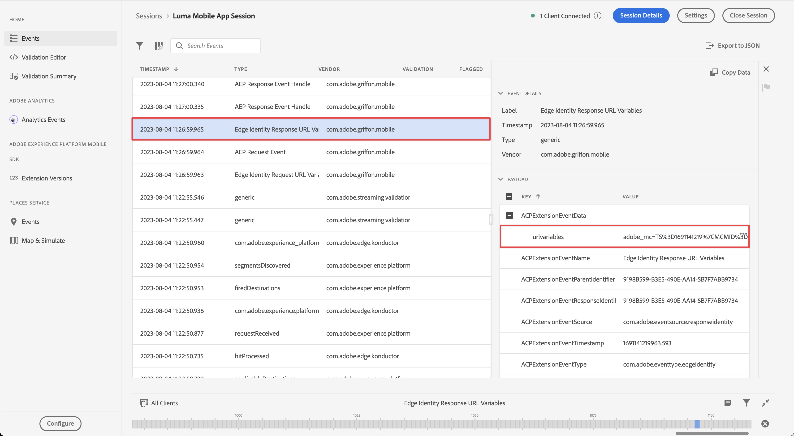

# 處理網頁檢視

瞭解如何在行動應用程式中使用WebViews處理資料收集。

## 先決條件

* 成功建立並執行應用程式，且已安裝並設定SDK。

## 學習目標

在本課程中，您將會：

* 瞭解應用程式中WebViews必須特別考量的原因。
* 瞭解避免追蹤問題所需的程式碼。

## 可能的追蹤問題

從應用程式的原生部分和應用程式內的WebView傳送資料時，會產生個別(Experience Cloud身分識別) ECID。 這些個別的ECID會導致中斷連線的點選，以及膨脹的造訪和訪客資料。 有關ECID的詳細資訊，請參閱[ECID概觀](https://experienceleague.adobe.com/en/docs/experience-platform/identity/features/ecid)。

若要解決中斷連線的點選和膨脹的資料，您必須將使用者的ECID從應用程式的原生部分傳遞至您可能會想要在應用程式中使用的WebView。

WebView中使用的AEP Edge身分擴充功能會收集目前的ECID並將其新增至URL，而非傳送要求給Adobe索取新ID。 實作接著會使用此ECID來要求URL。

## 實作

若要實作Web檢視：

>[!BEGINTABS]

>[!TAB iOS]

導覽至&#x200B;**[!DNL Luma]** > **[!DNL Luma]** > **[!DNL Views]** > **[!DNL Info]** > **[!DNL TermsOfServiceSheet]**，並在`func loadUrl()`類別中找到`final class SwiftUIWebViewModel: ObservableObject`函式。 新增下列呼叫以處理Web檢視：

```swift
// Handle web view
AEPEdgeIdentity.Identity.getUrlVariables {(urlVariables, error) in
    if let error = error {
        print("Error with Webview", error)
        return;
    }
    
    if let urlVariables: String = urlVariables {
        urlString.append("?" + urlVariables)
        guard let url = URL(string: urlString) else {
            return
        }
        DispatchQueue.main.async {
            self.webView.load(URLRequest(url: url))
        }
    }
    Logger.aepMobileSDK.info("Successfully retrieved urlVariables for WebView, final URL: \(urlString)")
}
```

[`AEPEdgeIdentity.Identity.getUrlVariables`](https://developer.adobe.com/client-sdks/documentation/identity-for-edge-network/api-reference/#geturlvariables) API會設定URL的變數，以包含所有相關資訊，例如ECID等。 在此範例中，您使用的是本機檔案，但相同的概念適用於遠端頁面。

您可以在`Identity.getUrlVariables`Edge Network適用的Identity擴充功能API參考指南[中進一步瞭解](https://developer.adobe.com/client-sdks/documentation/identity-for-edge-network/api-reference/#geturlvariables) API。


>[!TAB Android]

導覽至&#x200B;**[!UICONTROL Android]**  > **[!DNL app]** > **[!DNL kotlin+java]** > **[!DNL com.adobe.luma.tutorial.android]** > **[!DNL views]** > **[!DNL WebViewModel]**，並在`fun loadUrl()`中找到`class WebViewModel: ViewModel()`函式。 新增下列呼叫以處理Web檢視：

```kotlin
// Handle web view
Identity.getUrlVariables {
    urlVariables = it
    val baseUrl = getHtmlFileUrl("tou.html")

    val finalUrl = if (urlVariables.isNotEmpty()) {
        "$baseUrl?$urlVariables"
    } else {
        baseUrl
    }

    Handler(Looper.getMainLooper()).post {
        webView.loadUrl(finalUrl)
    }
    MobileSDK.shared.logInfo("TermsOfServiceSheet - loadUrl: Successfully loaded WebView with URL: $finalUrl")
}
```

[`Identity.getUrlVariables`](https://developer.adobe.com/client-sdks/documentation/identity-for-edge-network/api-reference/#geturlvariables) API會設定URL的變數，以包含所有相關資訊，例如ECID等。 在此範例中，您使用的是本機檔案，但相同的概念適用於遠端頁面。

您可以在`Identity.getUrlVariables`Edge Network適用的Identity擴充功能API參考指南[中進一步瞭解](https://developer.adobe.com/client-sdks/documentation/identity-for-edge-network/api-reference/#geturlvariables) API。

>[!ENDTABS]

## 在應用程式中驗證

若要執行程式碼：

1. 檢閱[設定指示](assurance.md#connecting-to-a-session)區段，將您的模擬器或裝置連線到Assurance。
1. 前往應用程式中的&#x200B;**[!UICONTROL 設定]**
1. 點選&#x200B;**[!DNL View...]**&#x200B;按鈕以顯示&#x200B;**[!DNL Terms of Use]**。

>[!BEGINTABS]

>[!TAB iOS]

 

>[!TAB Android]

 

>[!ENDTABS]


## 使用保證進行驗證

1. 在Assurance UI中，尋找&#x200B;**[!UICONTROL com.adobe.griffon.mobile]**&#x200B;廠商的&#x200B;**[!UICONTROL Edge身分識別回應URL變數]**&#x200B;事件。
1. 選取事件並檢閱&#x200B;**[!UICONTROL ACPExtensionEventData]**&#x200B;物件中的&#x200B;**[!UICONTROL urlvariable]**&#x200B;欄位，確認URL中存在下列引數： `adobe_mc`、`mcmid`和`mcorgid`。

   {zoomable="yes"}

   範例`urvariables`欄位如下所示：

   * 原始（含逸出字元）

     ```html
     adobe_mc=TS%3D1636526122%7CMCMID%3D79076670946787530005526183384271520749%7CMCORGID%3D7ABB3E6A5A7491460A495D61%40AdobeOrg
     ```

   * 美化

     ```html
     adobe_mc=TS=1636526122|MCMID=79076670946787530005526183384271520749|MCORGID=7ABB3E6A5A7491460A495D61@AdobeOrg
     ```

很遺憾，對Web工作階段進行偵錯受到限制。 例如，您無法在瀏覽器中使用Adobe Experience Platform Debugger繼續偵錯webview工作階段。

>[!NOTE]
>
>使用`VisitorAPI.js`時，Platform Web SDK （2.11.0或更新版本）支援透過這些URL引數連結訪客。


>[!SUCCESS]
>
>您現在已將應用程式設定為根據Webview中的URL顯示內容，使用與Adobe Experience Platform Mobile SDK已核發的ECID相同的ECID。
>
>感謝您花時間學習Adobe Experience Platform Mobile SDK。 如果您有疑問、想分享一般意見或有關於未來內容的建議，請在這篇[Experience League社群討論貼文](https://experienceleaguecommunities.adobe.com/t5/adobe-experience-platform-data/tutorial-discussion-implement-adobe-experience-cloud-in-mobile/td-p/443796)上分享

下一個： **[身分](identity.md)**
