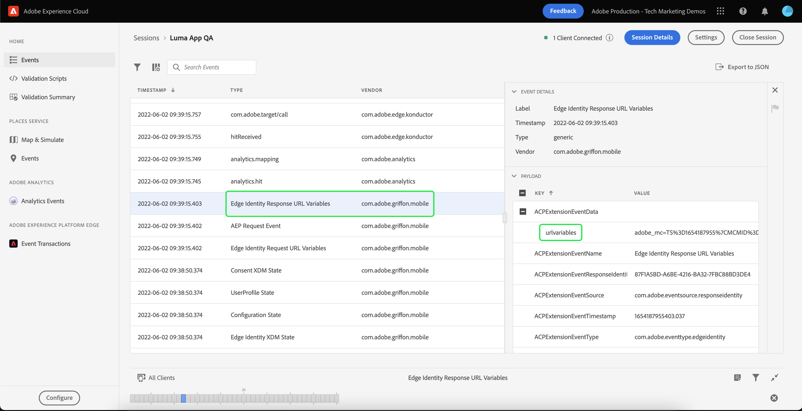

# 處理網頁檢視

瞭解如何在行動應用程式中使用WebViews處理資料收集。

>[!INFO]
>
> 在2023年11月下旬，此教學課程將由使用新範例行動應用程式的新教學課程取代

## 先決條件

* 成功建立並執行應用程式，且已安裝並設定SDK。

## 學習目標

在本課程中，您將會：

* 瞭解為何您必須針對WebViews採取特殊考量。
* 瞭解避免追蹤問題所需的程式碼。

## 可能的追蹤問題

如果您從應用程式的原生部分和WebView傳送資料，每個部分都會產生自己的Experience CloudID (ECID)。 這會導致中斷連線的點選和膨脹的造訪/訪客資料。 有關ECID的更多資訊可在以下連結中找到： [ECID概觀](https://experienceleague.adobe.com/docs/experience-platform/identity/ecid.html?lang=en).

若要解決該不良情況，必須將使用者的ECID從原生部分傳遞至WebView。

WebView中的Experience CloudID服務JavaScript擴充功能會從URL提取ECID，而非傳送要求給Adobe索取新ID。 ID服務會使用此ECID追蹤訪客。

## 實作

在Luma範例應用程式中，找到 `TermsOfService.swift` 檔案(在 `Intro-Login_SignUp` 資料夾)，並找出下列程式碼：

```swift
// Show tou.html
let url = Bundle.main.url(forResource: "tou", withExtension: "html")
let myRequest = URLRequest(url: url!)
self.webView.load(myRequest)
```

這是載入WebView的簡單方法。 在這種情況下，這是本機檔案，但相同的概念適用於遠端頁面。

重新調整Webview程式碼，如下所示：

```swift
let url = Bundle.main.url(forResource: "tou", withExtension: "html")
if var urlString = url?.absoluteString {
    // Adobe Experience Platform - Handle Web View
    AEPEdgeIdentity.Identity.getUrlVariables {(urlVariables, error) in
        if let error = error {
            self.simpleAlert("\(error.localizedDescription)")
            return;
        }

        if let urlVariables: String = urlVariables {
            urlString.append("?" + urlVariables)
        }

        DispatchQueue.main.async {
            self.webView.load(URLRequest(url: URL(string: urlString)!))
        }
        print("Successfully retrieved urlVariables for WebView, final URL: \(urlString)")
    }
} else {
    self.simpleAlert("Failed to create URL for webView")
}
```

您可以進一步瞭解 `Identity.getUrlVariables` 中的API [Edge Network身分擴充功能API參考指南](https://developer.adobe.com/client-sdks/documentation/identity-for-edge-network/api-reference/#geturlvariables).

## 驗證

檢閱 [設定指示](assurance.md) 區段並將您的模擬器或裝置連線到Assurance，載入WebView並尋找 `Edge Identity Response URL Variables` 來自的事件 `com.adobe.griffon.mobile` 廠商。

若要載入WebView，請前往Luma應用程式的主畫面，選取「帳戶」圖示，然後選取頁尾中的「使用條款」。

載入WebView之後，請選取事件並檢閱 `urlvariables` 中的欄位 `ACPExtensionEventData` 物件，確認URL中存在下列引數： `adobe_mc`， `mcmid`、和 `mcorgid`.



範例 `urvariables` 欄位如下所示：

```html
// Original (with escaped characters)
adobe_mc=TS%3D1636526122%7CMCMID%3D79076670946787530005526183384271520749%7CMCORGID%3D7ABB3E6A5A7491460A495D61%40AdobeOrg

// Beautified
adobe_mc=TS=1636526122|MCMID=79076670946787530005526183384271520749|MCORGID=7ABB3E6A5A7491460A495D61@AdobeOrg
```

>[!NOTE]
>
>Platform Web SDK （2.11.0版或更新版本）目前支援透過這些URL引數連結訪客，並且 `VisitorAPI.js`.


下一步： **[身分](identity.md)**

>[!NOTE]
>
>感謝您花時間學習Adobe Experience Platform Mobile SDK。 如果您有疑問、想分享一般意見或有關於未來內容的建議，請分享這些內容 [Experience League社群討論貼文](https://experienceleaguecommunities.adobe.com/t5/adobe-experience-platform-launch/tutorial-discussion-implement-adobe-experience-cloud-in-mobile/td-p/443796)