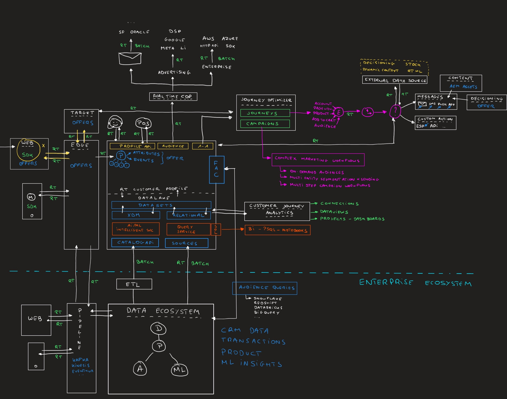

# 概覽 — AEP與應用程式技術實驗室

## 概觀

## AEP與應用程式架構概述

在本影片中，您將會瞭解本教學課程中Adobe Experience Platform和應用程式部分的架構。

>[!VIDEO](https://video.tv.adobe.com/v/3481415?quality=12&learn=on)

下載架構概觀影像如下：

### 快速入門

[開始使用](./modules/getting-started/gettingstarted/getting-started.md){target="_blank"}

在此基本單元中，您將準備所有內容，以便存取和使用示範環境。

### 傳遞與啟用

#### 資料彙集

[1.1基礎 — Adobe Experience Platform資料收集與網頁SDK的設定](./modules/delivery-activation/datacollection/dc1.1/data-ingestion-launch-web-sdk.md)

在本基本單元中，您將瞭解Adobe Experience Platform資料收集和新的Web SDK擴充功能。

[1.2 Foundation — 資料擷取](./modules/delivery-activation/datacollection/dc1.2/data-ingestion.md)

在此基本單元中，您會將來自各種來源的資料擷取至Adobe Experience Platform

[1.3同盟對象構成](./modules/delivery-activation/datacollection/dc1.3/fac.md)

在本單元中，您將瞭解如何設定同盟受眾模型，並使用同盟資料產生受眾。

#### Real-Time CDP B2C

[2.1 Foundation — 即時客戶個人檔案](./modules/delivery-activation/rtcdp-b2c/rtcdpb2c-1/real-time-customer-profile.md)

在此基本單元中，您將利用UI和API探索Adobe Experience Platform中的即時客戶個人檔案。

[2.2智慧型服務](./modules/delivery-activation/rtcdp-b2c/rtcdpb2c-2/intelligent-services.md)

在本單元中，您將瞭解如何設定、設定和使用Adobe Experience Platform Intelligent Services。

[2.3 Real-Time CDP — 建立受眾並採取行動](./modules/delivery-activation/rtcdp-b2c/rtcdpb2c-3/real-time-cdp-build-a-segment-take-action.md)

在本單元中，您將設定對象並將對象啟動至數個目的地，包括Google DV360、Adobe Target和AWS S3。

[2.4 Real-Time CDP： Audience Activation至Microsoft Azure事件中心](./modules/delivery-activation/rtcdp-b2c/rtcdpb2c-4/segment-activation-microsoft-azure-eventhub.md)

在本單元中，您將設定Microsoft Azure EventHub目的地為Adobe Experience Platform Real-time CDP的即時目的地。

[2.5 Real-Time CDP連線：事件轉送](./modules/delivery-activation/rtcdp-b2c/rtcdpb2c-5/aep-data-collection-ssf.md)

在本單元中，您會將資料伺服器端轉送至數個端點，例如Google Cloud Platform Pub/Sub和AWS Kinesis。

[2.6將Apache Kafka的資料串流至Real-Time CDP](./modules/delivery-activation/rtcdp-b2c/rtcdpb2c-6/aep-apache-kafka.md)

在本單元中，您將瞭解如何設定自己的Apache Kafka叢集，並將資料串流至Adobe Experience Platform。

### Adobe Journey Optimizer B2C

[3.1 Adobe Journey Optimizer：協調流程](./modules/delivery-activation/ajo-b2c/ajob2c-1/journey-orchestration-create-account.md)

在此單元中，您將使用Adobe Journey Optimizer來建置觸發式歷程。

[3.2 Adobe Journey Optimizer：外部資料來源和自訂動作](./modules/delivery-activation/ajo-b2c/ajob2c-2/journey-orchestration-external-weather-api-sms.md)

在此單元中，您將使用Adobe Journey Optimizer來線上及離線監聽客戶行為，並透過各種管道以智慧、情境式及即時方式回應。

[3.3 Adobe Journey Optimizer：推送和應用程式內訊息](./modules/delivery-activation/ajo-b2c/ajob2c-3/ajopushinapp.md)

在本模式中，您將使用Adobe Journey Optimizer來設定推播通知和應用程式內訊息。

[3.4 Adobe Journey Optimizer：事件型歷程](./modules/delivery-activation/ajo-b2c/ajob2c-4/journeyoptimizer.md)

在本單元中，您將瞭解Journey Optimizer的所有須知事項，其可幫助公司為其客戶設計和提供連結、情境式和個人化的體驗。

[3.5 Adobe Journey Optimizer：翻譯服務](./modules/delivery-activation/ajo-b2c/ajob2c-5/ajotranslationsvcs.md)

在本單元中，您將瞭解如何設定並使用Adobe Journey Optimizer中的翻譯服務，將您的訊息當地語系化給您的客戶。

[3.6 Adobe Journey Optimizer：內容管理](./modules/delivery-activation/ajo-b2c/ajob2c-6/ajocontent.md)

在本單元中，您將瞭解如何設定及使用Adobe Journey Optimizer中的內容卡和登陸頁面，並將深入探討Adobe Journey Optimizer與GenStudio for Performance Marketing之間的整合。

[3.7 Adobe Journey Optimizer：決策](./modules/delivery-activation/ajo-b2c/ajob2c-7/ajo-decisioning.md)

在本單元中，您將瞭解如何設定及使用Adobe Journey Optimizer中的決策和程式碼型體驗。

[3.8 Adobe Journey Optimizer：行銷活動](./modules/delivery-activation/ajo-b2c/ajob2c-8/ajocampaigns.md)

在本單元中，您將瞭解如何設定及使用Adobe Journey Optimizer中的行銷活動。

### 報告與深入分析

#### Adobe Customer Journey Analytics

[1.1 Customer Journey Analytics：使用Analysis Workspace在Adobe Experience Platform之上建立儀表板](./modules/reporting-insights/cja-b2c/cjab2c-1/customer-journey-analytics-build-a-dashboard.md)

在本單元中，您將透過設定包含全頻道資料的儀表板，取得線上到離線深入分析。

[1.2 Customer Journey Analytics：使用BigQuery Source Connector在Adobe Experience Platform中擷取和分析Google Analytics資料](./modules/reporting-insights/cja-b2c/cjab2c-2/customer-journey-analytics-bigquery-gcp.md)

在本單元中，您將設定自己的Google Cloud Platform執行個體、在Google Cloud Platform中載入示範資料，然後使用BigQuery Source Connector將該資料從Google Cloud Platform擷取到Adobe Experience Platform。

#### 資料蒸餾器

[2.1查詢服務](./modules/reporting-insights/datadistiller/dd-1/query-service.md)

在本單元中，您將學習如何使用Adobe Experience Platform查詢服務。

#### Content Analytics

[3.1 Content Analytics](./modules/reporting-insights/content/module3.1/contentanalytics.md)

在本單元中，您將瞭解如何實作和使用Adobe Content Analytics。

{width="50px" align="left"}

>[!NOTE]
>
>如果您有任何問題，想要分享對未來內容有建議的一般意見回饋，請傳送電子郵件至&#x200B;**techinsiders@adobe.com**，直接連絡技術業內人士。