# 1.1.1 Agent Orchestrator快速入門

## 1.1.1.1在Agent Orchestrator中設定內容

移至[https://experience.adobe.com/#/@experienceplatform/ai-assistant/chat](https://experience.adobe.com/#/@experienceplatform/ai-assistant/chat)。

您應該會看到此訊息。 請確定您隸屬於&#x200B;**Experience Platform International**&#x200B;組織。

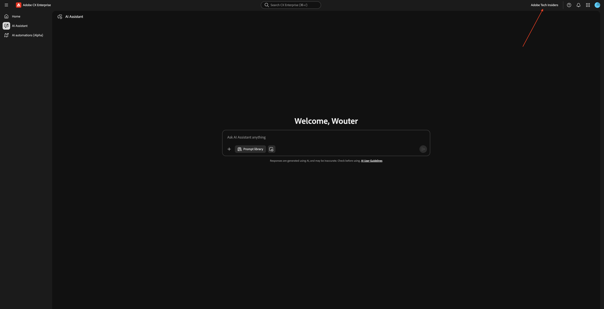

按一下&#x200B;**內容**&#x200B;視窗。


設定內容為：

- **檔案Source**： **Customer Journey Analytics**
- **沙箱**： **加速**
- **資料檢視**： **加速2026 B2C**

按一下&#x200B;**設定內容**。

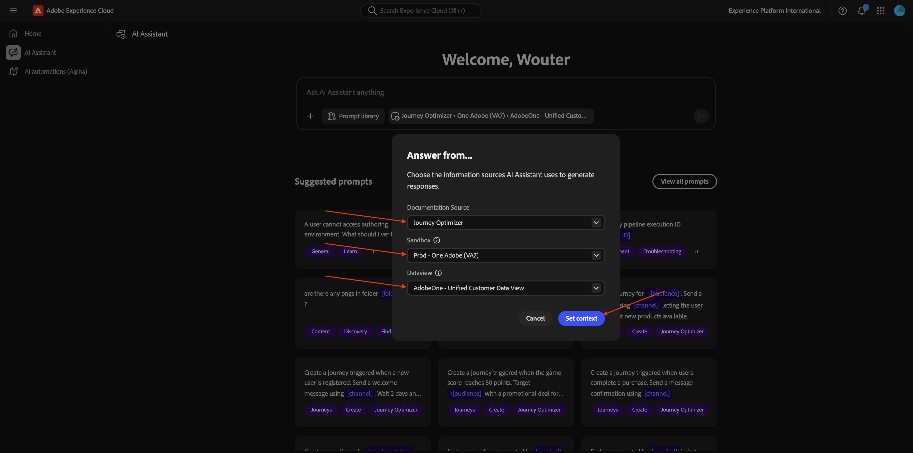

## 1.1.1.2從整體購買趨勢開始，錨定內容並放大光纖

**意圖**

獲得全方位的類別需求脈衝：行動、有線電話、網際網路、電視、光纖，特別是最近60天的應用。 這會設定紐約推出後的季節性、促銷效果及區域差異的基線。

輸入下列&#x200B;**提示**&#x200B;並按一下&#x200B;**傳送**&#x200B;按鈕。

```javascript
Show me purchases by mainCategory over the last 2 months.
```

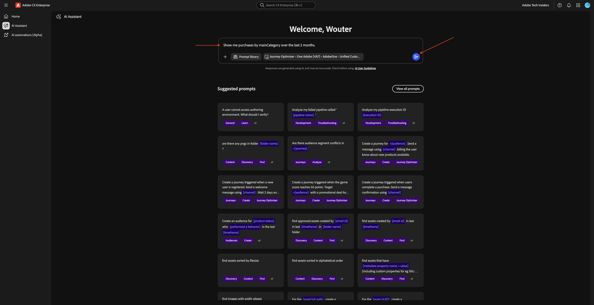

您應該會看到以下內容：

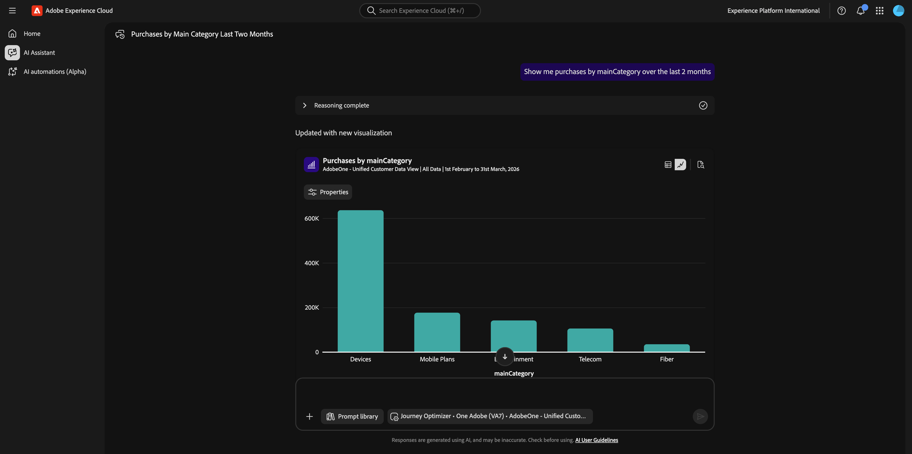

輸入下列&#x200B;**提示**&#x200B;並按一下&#x200B;**傳送**&#x200B;按鈕。

`Show me purchases by mainCategory = Fiber over the last 2 months per week`

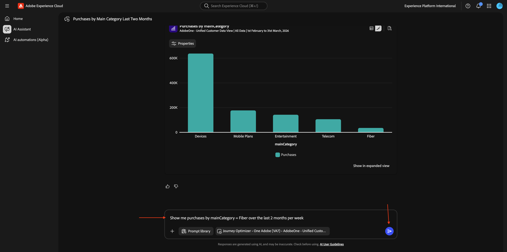

您應該會看到此資訊，深入瞭解光纖特有的趨勢。

**動作**：請注意成長曲線與區域尖峰。

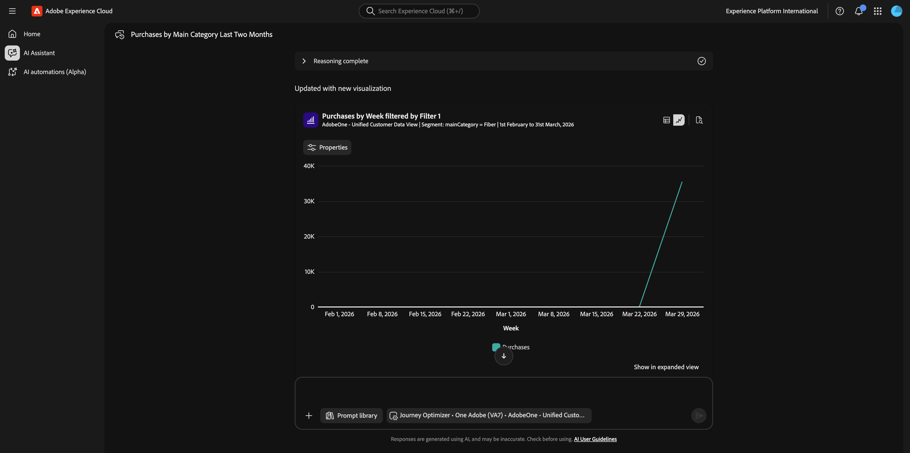

## 1.1.1.3將訂單與內容偏好設定建立關聯

**意圖**

測試內容偏好設定（例如SciFi、Sports、Drama）預測寬頻升級行為的假設 — 尤其是針對高頻寬需求。

輸入下列&#x200B;**提示**&#x200B;並按一下&#x200B;**傳送**&#x200B;按鈕。

```javascript
Show me ordersYTD by preferredGenre for the last 2 months
```

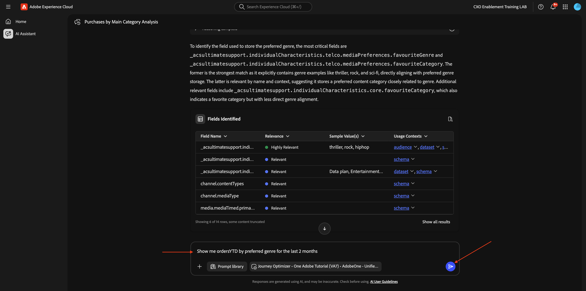

您應該會看到以下內容：

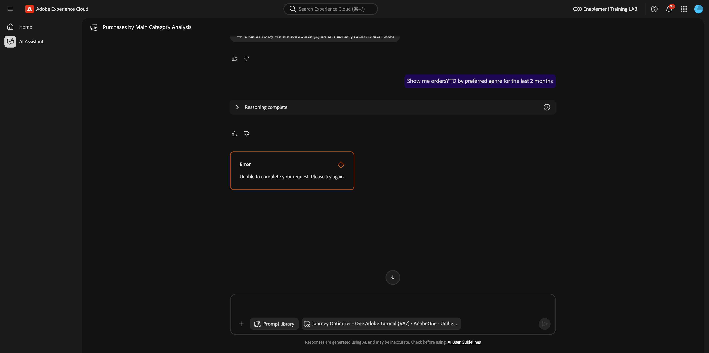

## 1.1.1.4識別現有的Fiber歷程

**意圖**

探索標題中包含「Fiber」的活動或最近結束的歷程，例如「Fiber Upgrade NYC - September」、「Fiber Trial - Streaming Bundle」。

輸入下列&#x200B;**提示**&#x200B;並按一下&#x200B;**傳送**&#x200B;按鈕。

```javascript
What journeys exist? 
```

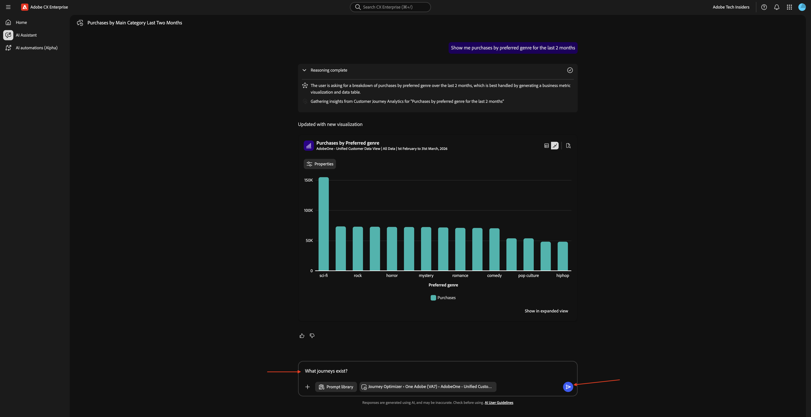

您應該會看到以下內容：

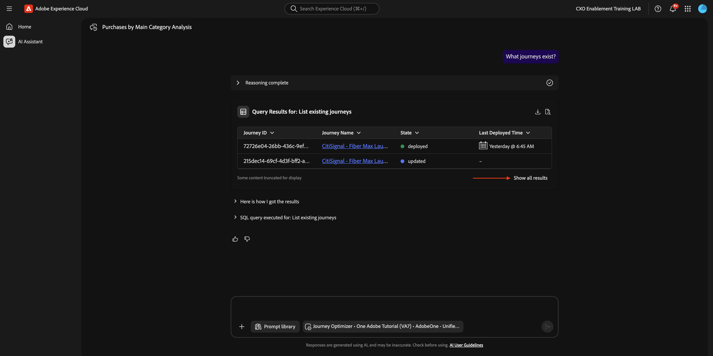

使用Fiber訊息列出作用中或過去的歷程。

動作：將復製作業的高成效歷程加入短清單。

輸入下列&#x200B;**提示**&#x200B;並按一下&#x200B;**傳送**&#x200B;按鈕。

```javascript
Which of these journeys has 'Fiber' in its name?
```

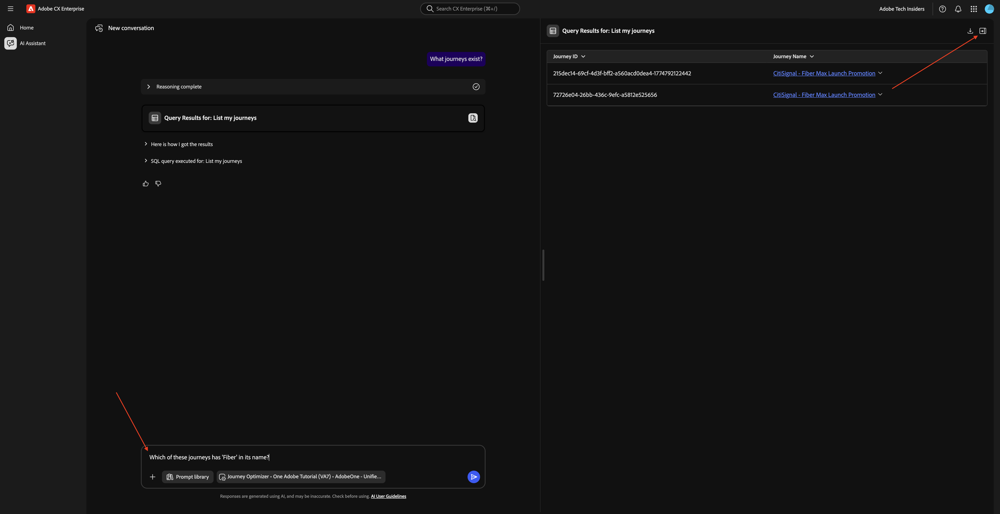

您應該會看到以下內容：

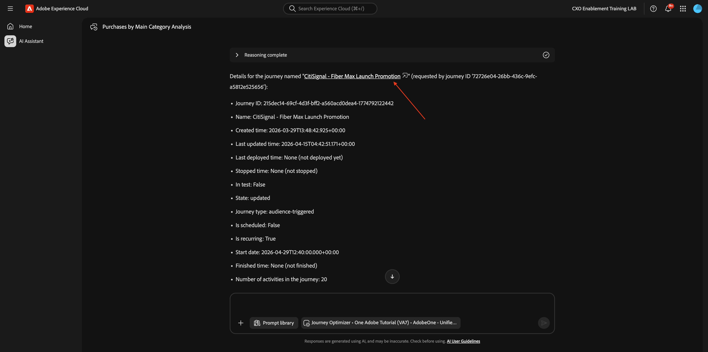

## 1.1.1.5檢查種子

**意圖**：

瞭解「CitiSignal - Fiber Max啟動促銷活動」歷程的種子定義 — 哪些特徵會推動目標定位(例如「SciFi型別偏好」、「4+裝置」、「串流≥300GB/月」)。

輸入下列&#x200B;**提示**，然後輸入&#x200B;**+CitiSignal檔案**&#x200B;以啟用自動完成。 選取歷程&#x200B;**CitiSignal - Fiber Max啟動促銷活動**。

```javascript
What was the initial audience in the journey named 
```

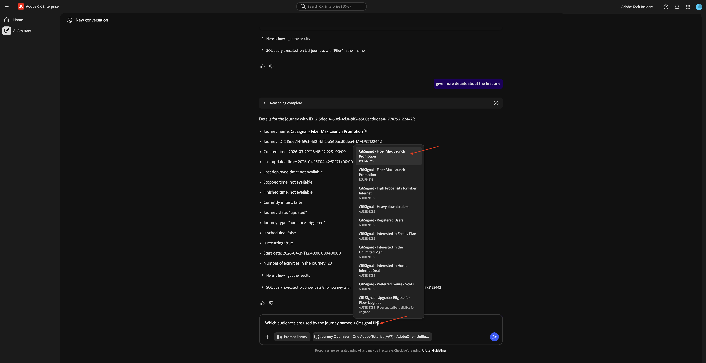

您應該會看到此訊息。 按一下&#x200B;**傳送**&#x200B;按鈕。

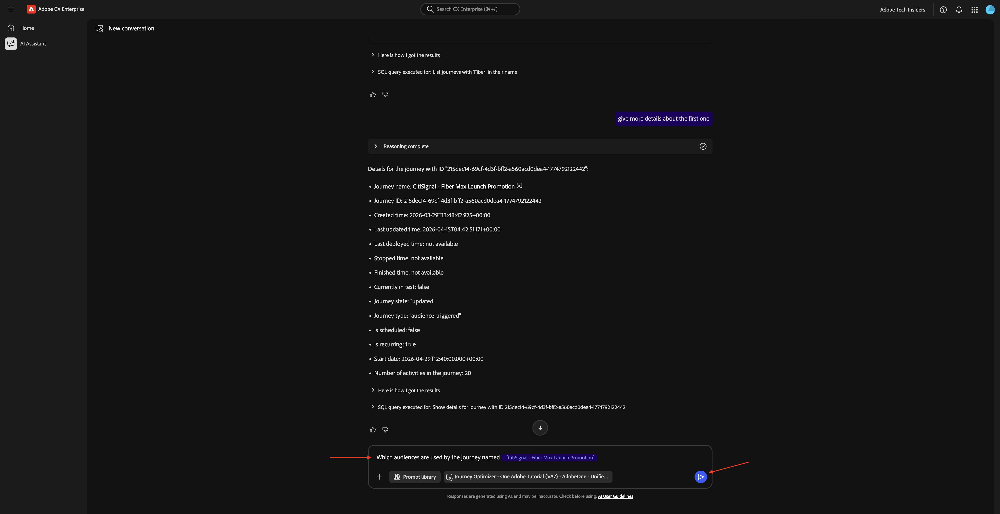

您應該會看到此訊息。


## 1.1.1.6透過流失分析驗證歷程績效

**意圖**

在Customer Journey Analytics中建立逐步式funnel

已傳遞→開啟→按一下→抵達→產品檢視→新增到購物車→結帳→完成訂單

包括光纖相關的SKU檢視作為分支。

輸入下列&#x200B;**提示**&#x200B;並按一下&#x200B;**傳送**&#x200B;按鈕。

```javascript
Create a fall-out report on the "CitiSignal - Fiber Max Launch Promotion" journey
```

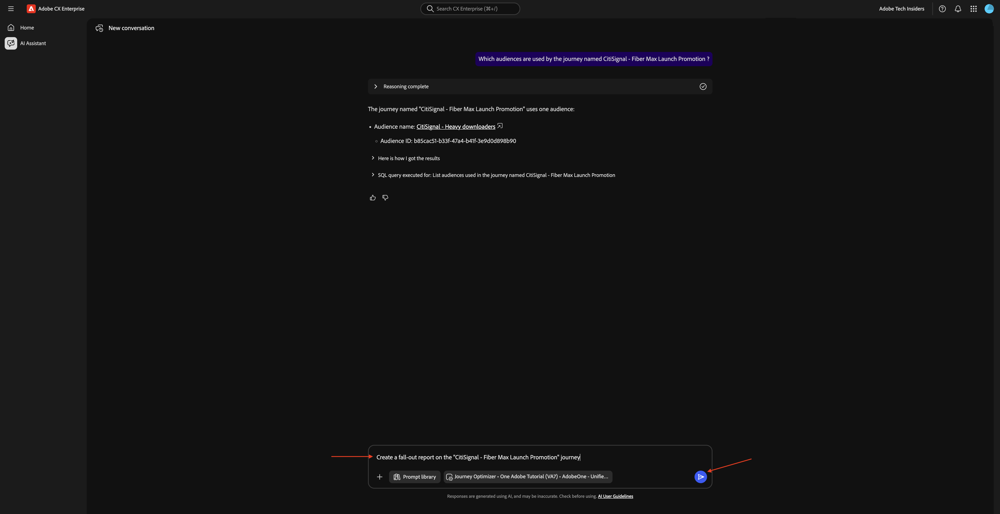

## 1.1.1.7建立新對象

**意圖**

根據上述發現，消費大量資料且偏好科幻或幻想型別的客戶之間存在相關性。 您現在可以在對象中組合這些屬性。

移至[https://experience.adobe.com/#/@experienceplatform/ai-assistant/chat](https://experience.adobe.com/#/@experienceplatform/ai-assistant/chat)。

輸入下列&#x200B;**提示**&#x200B;並按一下&#x200B;**傳送**&#x200B;按鈕。

>[!NOTE]
>
>請確認助理的內容指向沙箱&#x200B;**加速**&#x200B;和資料檢視&#x200B;**加速2026 B2C**

```javascript
Create an audience that combines people with an average download per month of over 2000 GB and a preferred genre of sci-fi or fantasy.
```

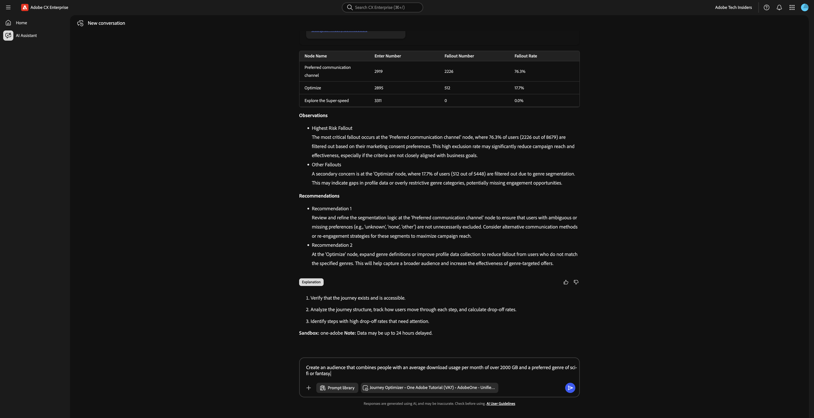

檢閱計畫。 輸入`yes`並按一下&#x200B;**傳送**。

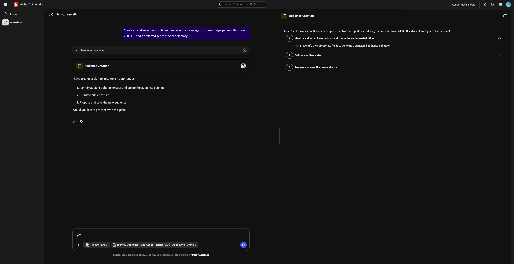

檢閱區段查詢運算式。 輸入`yes`並按一下&#x200B;**傳送**&#x200B;按鈕。

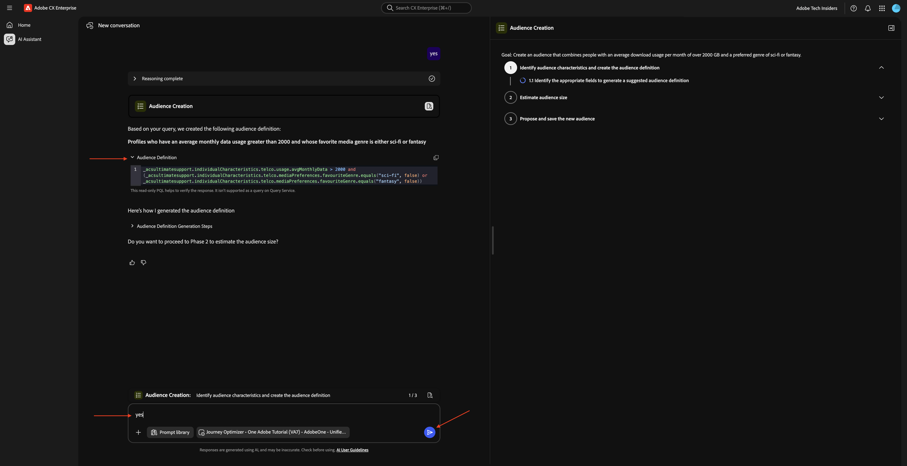

檢閱區段大小估計。 輸入`yes`並按一下&#x200B;**傳送**&#x200B;按鈕。

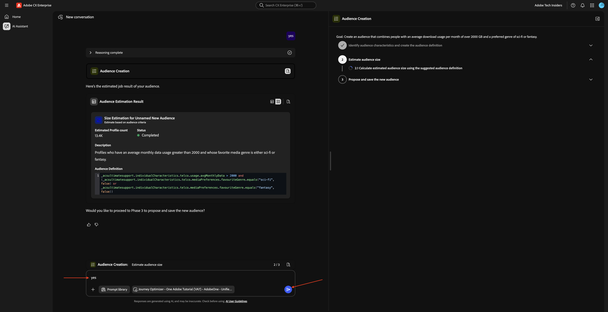

按一下&#x200B;**檢閱**。

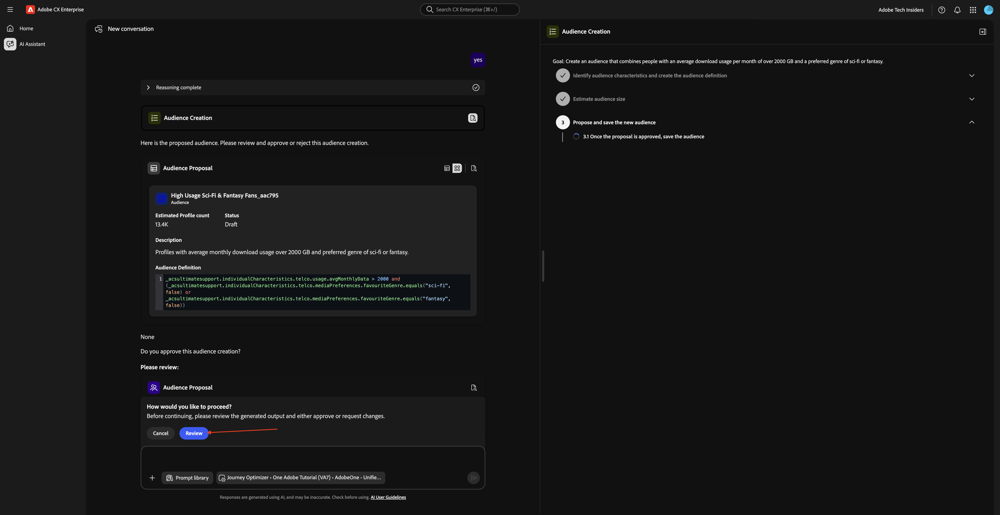

檢閱區段定義。 按一下&#x200B;**建立**。

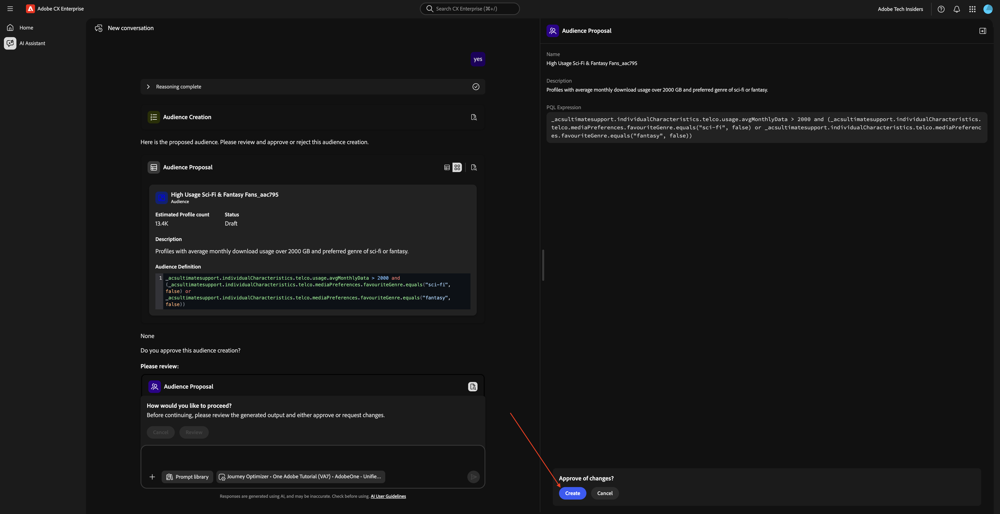

您的對象現已建立。

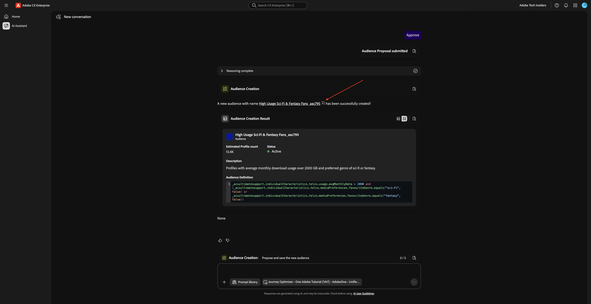

>[!NOTE]
>
>建立新對象時，需要24小時的時間，助理才能使用對象以供進一步使用。

## 1.1.1.8尋找符合高使用率的現有對象，並檢查它們是否在使用中

**意圖**：

找出任何具有「大量下載者」（依每月資料使用量臨界值定義）的受眾。

>[!NOTE]
>
>在您先前建立的新對象中，請記住，對象需要24小時才能供助理進一步使用。 您現在應該改用其他已存在的對象。

移至[https://experience.adobe.com/#/@experienceplatform/ai-assistant/chat](https://experience.adobe.com/#/@experienceplatform/ai-assistant/chat)。

您應該會看到此訊息。 請確定您隸屬於&#x200B;**Experience Platform International**&#x200B;組織。

輸入下列&#x200B;**提示**&#x200B;並按一下&#x200B;**傳送**&#x200B;按鈕。

>[!NOTE]
>
>請確認助理的內容指向沙箱&#x200B;**加速**&#x200B;和資料檢視&#x200B;**加速2026 B2C**

```javascript
Is there an audience that has "heavy downloaders" in the title?
```

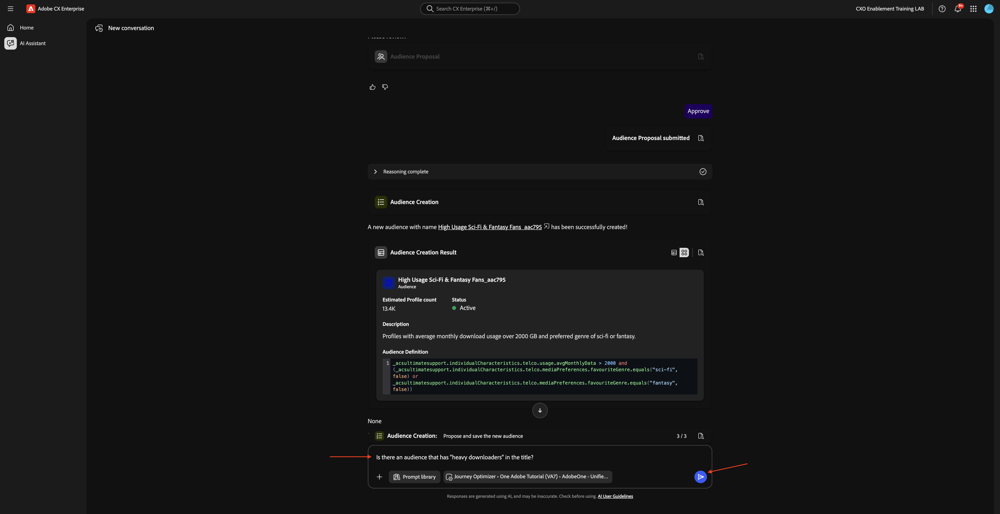

您應該會看到此訊息。

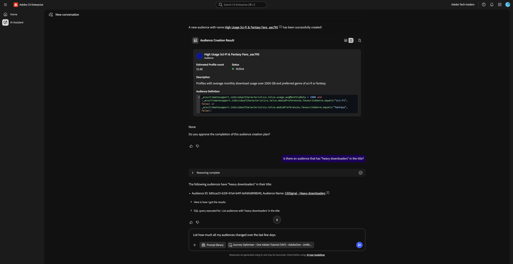

已經有一些針對「大量下載者」的現有受眾。 讓我們看看它們是否已在使用中。

輸入下列&#x200B;**提示**&#x200B;並按一下&#x200B;**傳送**&#x200B;按鈕。

```javascript
Which of the above are used in a journey? 
```

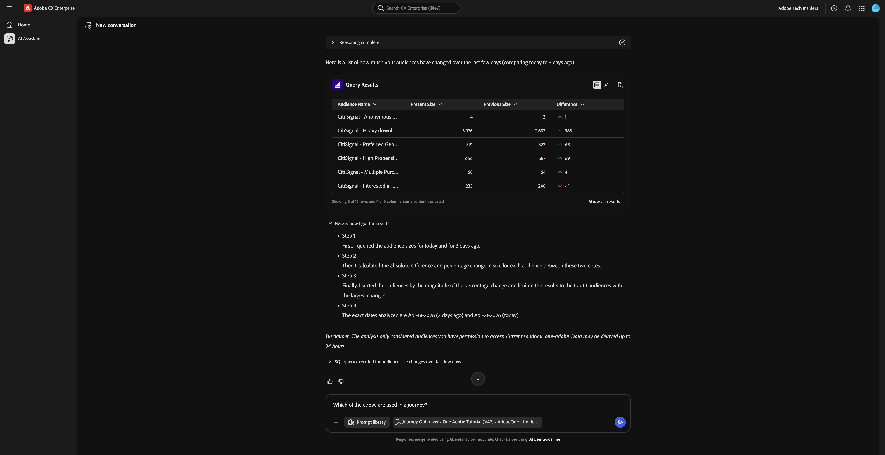

之後，您應該會看到類似以下內容。

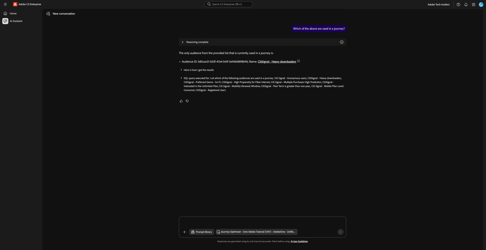

您現在應該確認該歷程是否有效。 輸入下列&#x200B;**提示**&#x200B;並按一下&#x200B;**傳送**&#x200B;按鈕。

```javascript
Which of the above are used in a journey? 
```

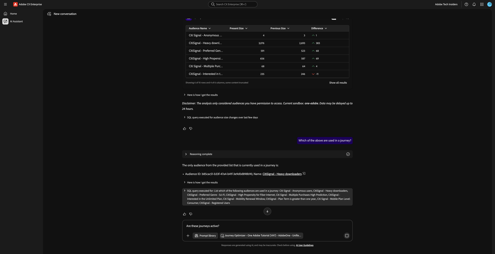

之後，您應該會看到類似以下內容。 該歷程目前未執行。

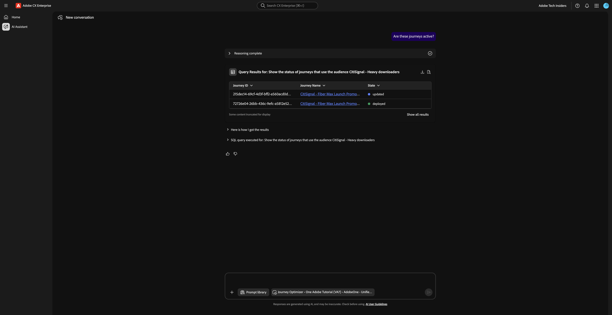

對於即將推出的Fiber Max，您現在應該建立新的歷程。

## 1.1.1.9建立Fiber Max啟動的新歷程

**意圖**：

建立以複合對象為目標的新歷程：

大量下載者∩SciFi偏好設定（kbaa_5207bf對象金鑰）。

移至[https://experience.adobe.com/#/@experienceplatform/ai-assistant/chat](https://experience.adobe.com/#/@experienceplatform/ai-assistant/chat)。

您應該會看到此訊息。 請確定您隸屬於&#x200B;**Experience Platform International**&#x200B;組織。

輸入下列&#x200B;**提示**&#x200B;並按一下&#x200B;**傳送**&#x200B;按鈕。

>[!NOTE]
>
>請確認助理的內容指向沙箱&#x200B;**加速**&#x200B;和資料檢視&#x200B;**加速2026 B2C**

```javascript
Create a  journey towards the audience Heavy Downloaders - Sci-Fi Preference_kbaa_5207bf. The journey is for the rollout of fiber broadband. There will 2 versions of an email  based on  a split of the audience based on who is in the "Eligble for Fiber upgrade" audience.  After 3 days, profiles from both email treatments who have not purchased fibre max will be sent a follow up email. 
```


您應該會看到此訊息。 輸入`yes`並按一下[產生]。

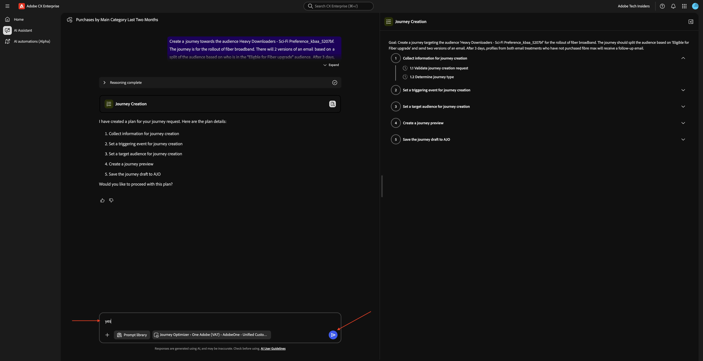

您應該會看到此訊息。 輸入`yes`並按一下[產生]。

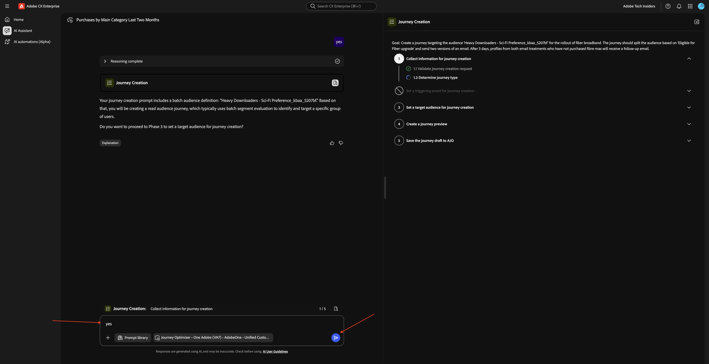

您應該會看到此訊息。 輸入`The first one`並按一下[產生]。

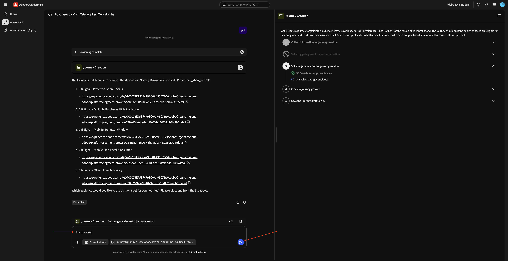

您應該會看到此訊息。 輸入`yes`並按一下[產生]。

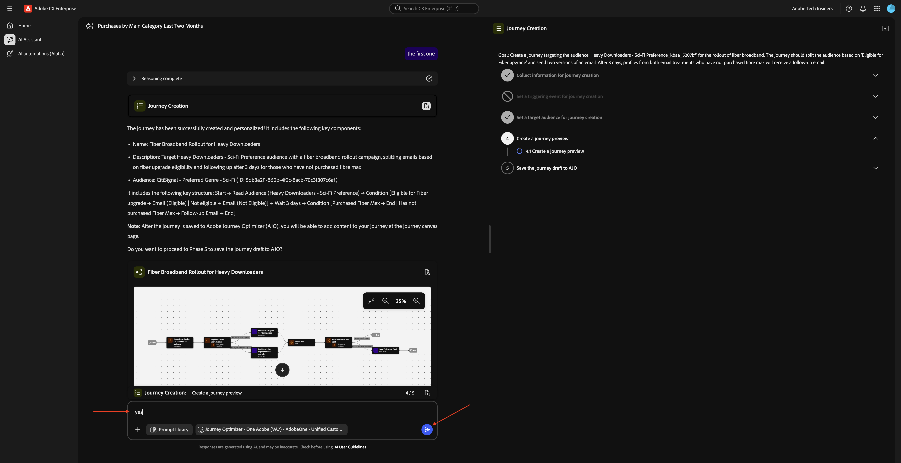

檢閱回應。 輸入`yes`並按一下[產生]。


按一下&#x200B;**檢閱**。

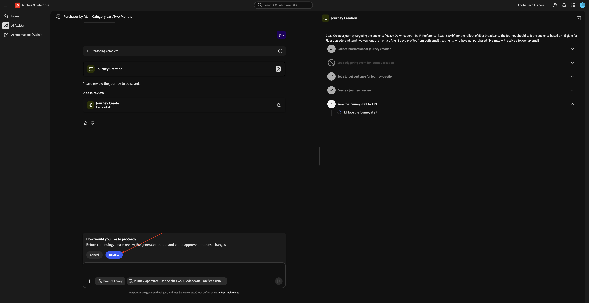

使用您的LDAP更新歷程名稱，使其成為唯一名稱。 按一下&#x200B;**儲存**。

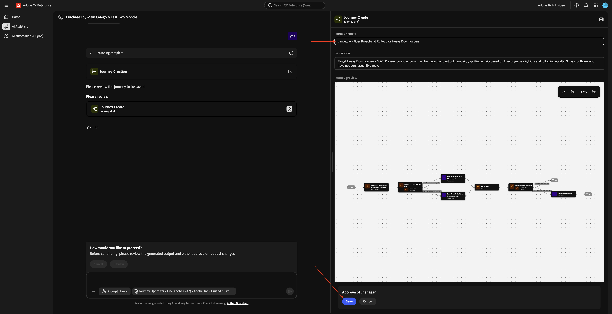

您的歷程現在已建立為草稿模式。

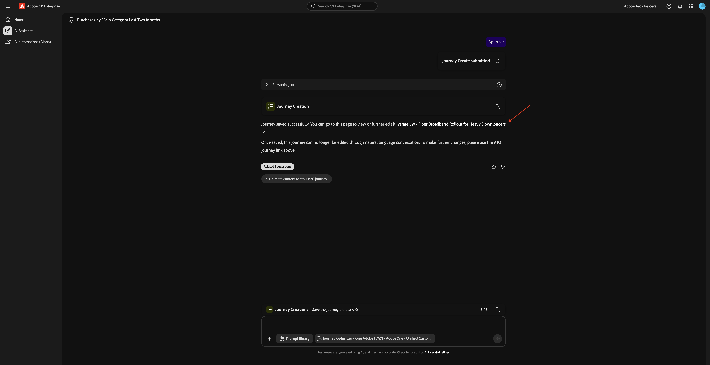

## 1.1.1.10歷程衝突管理

移至[https://experience.adobe.com/#/@experienceplatform/ai-assistant/chat](https://experience.adobe.com/#/@experienceplatform/ai-assistant/chat)。

您應該會看到此訊息。 請確定您隸屬於&#x200B;**Experience Platform International**&#x200B;組織。

輸入下列&#x200B;**提示**&#x200B;並按一下&#x200B;**傳送**&#x200B;按鈕。

>[!NOTE]
>
>請確認助理的內容指向檔案來源&#x200B;**Journey Optimizer**、沙箱&#x200B;**加速**&#x200B;和資料檢視&#x200B;**加速2026 B2C**

```javascript
How can I manage journey conflicts?
```

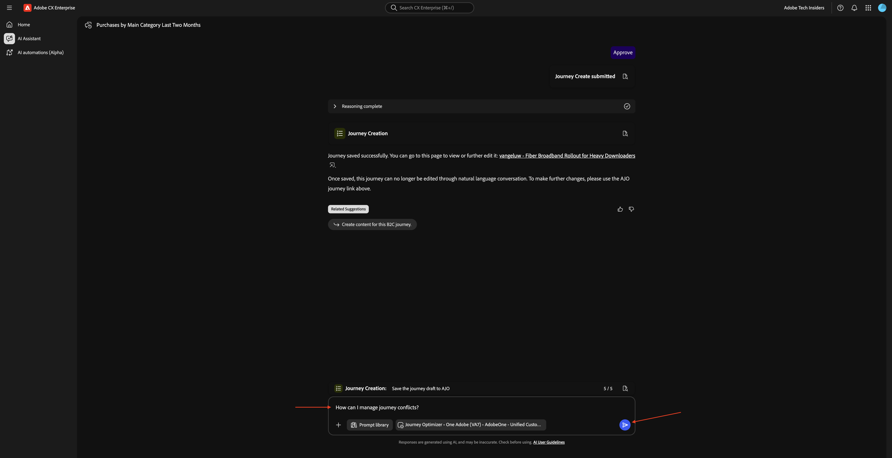

檢閱資訊。

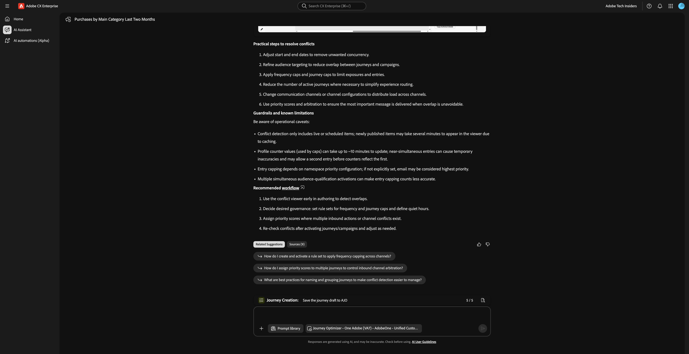

向下捲動並選取&#x200B;**來源**，以找出資訊來自Experience League。

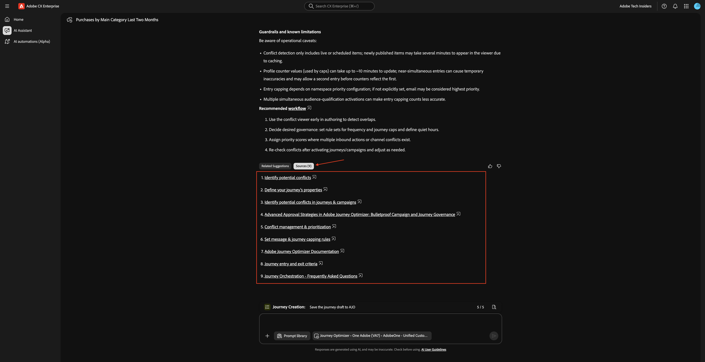

輸入下列&#x200B;**提示**&#x200B;並按一下&#x200B;**傳送**&#x200B;按鈕。

```javascript
List any conflicts for "CitiSignal - Fiber Max Launch Promotion" journey
```

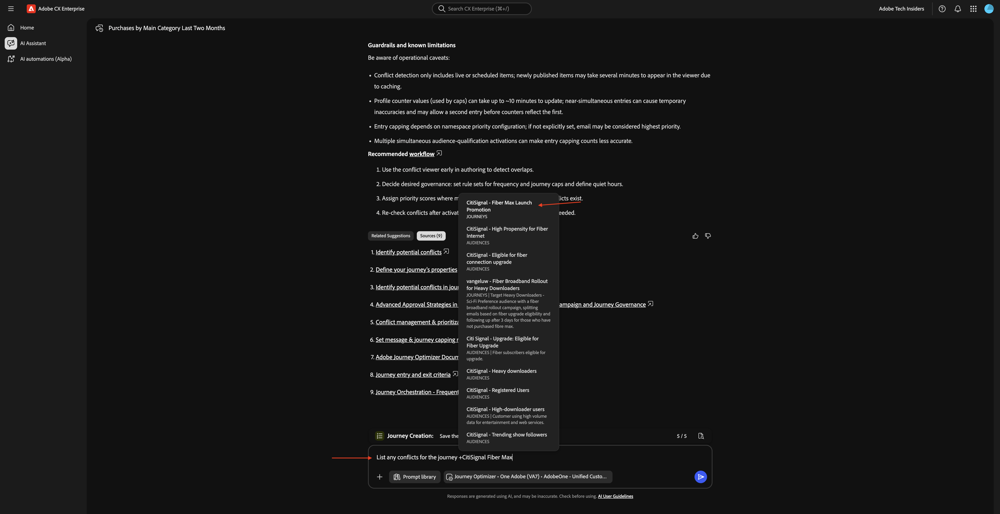

檢閱歷程衝突資訊。

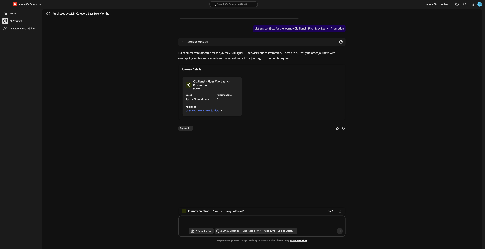

向下捲動以尋找更多歷程衝突詳細資料。


## 1.1.1.11個實驗

移至[https://experience.adobe.com/#/@experienceplatform/ai-assistant/chat](https://experience.adobe.com/#/@experienceplatform/ai-assistant/chat)。

您應該會看到此訊息。 請確定您隸屬於&#x200B;**Experience Platform International**&#x200B;組織。

輸入下列&#x200B;**提示**&#x200B;並按一下&#x200B;**傳送**&#x200B;按鈕。

>[!NOTE]
>
>請確認助理的內容指向沙箱&#x200B;**加速**&#x200B;和資料檢視&#x200B;**加速2026 B2C**

```javascript
How are the experiments performing for the journey named 'CitiSignal - Fiber Max Launch Promotion'?
```

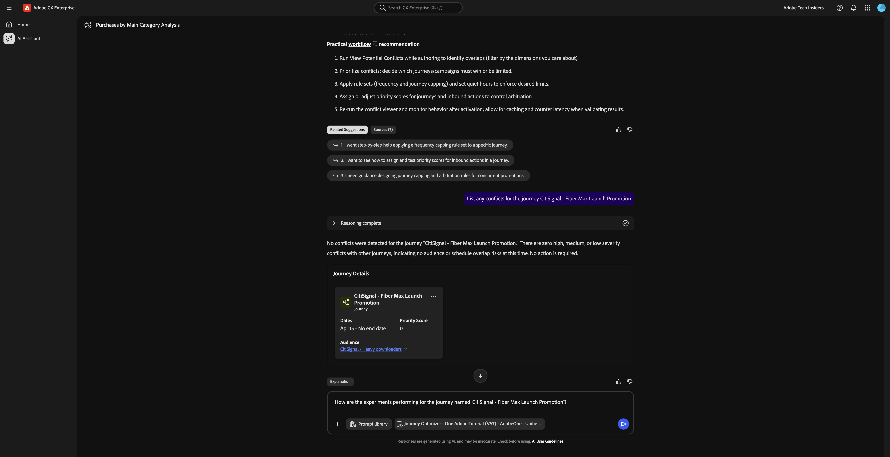

您應該會看到以下內容：


按一下建議以比較每個處理的轉換率，然後按一下&#x200B;**傳送**。

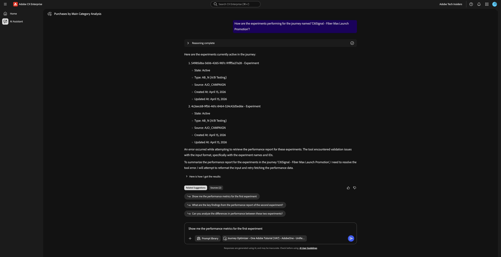

然後您應該會看到如下的詳細比較：

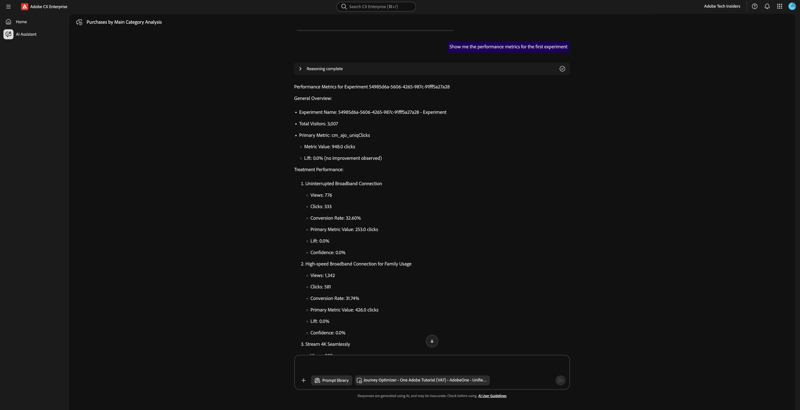

返回[Agent Orchestrator](./agentorchestrator.md){target="_blank"}

[返回所有模組](./../../../overview.md){target="_blank"}