# 1.1.2含ChatGPT的Adobe Marketing Agent

>[!IMPORTANT]
>
>本實驗使用的功能尚未發行。 功能仍在開發中，尚未正式推出。

## 影片

在這段影片中，您將獲得本練習中所有步驟的說明和示範。

>[!VIDEO](https://video.tv.adobe.com/v/3478410?quality=12&learn=on)

## 1.1.2.1在ChatGPT中為Adobe Marketing Agent建立自訂應用程式

>[!NOTE]
>
>在ChatGPT中使用Adobe Marketing Agent需要下列專案：
>- OpenAI的ChatGPT付費版本
>- 使用ChatGPT網頁使用者端

前往https://chatgpt.com/並使用您的帳戶詳細資料登入。 登入後，您應該會看到此訊息。 按一下您的使用者名稱。

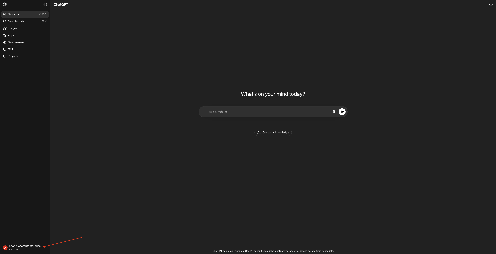

選取&#x200B;**設定**。

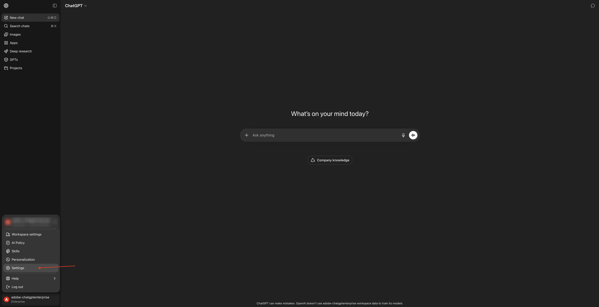

移至&#x200B;**應用程式**，然後選取&#x200B;**進階設定**。

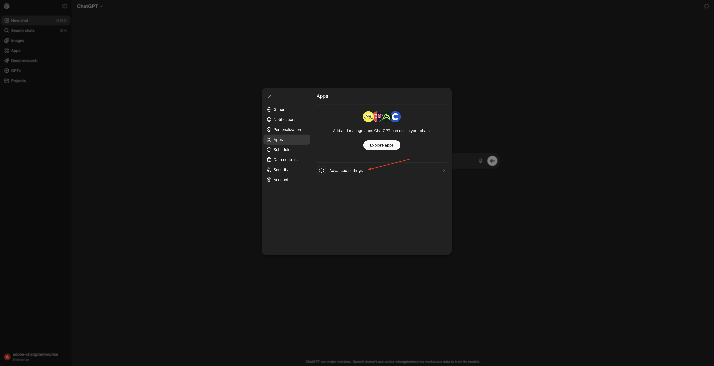

開啟&#x200B;**開發人員模式**，然後按一下&#x200B;**上一步**。

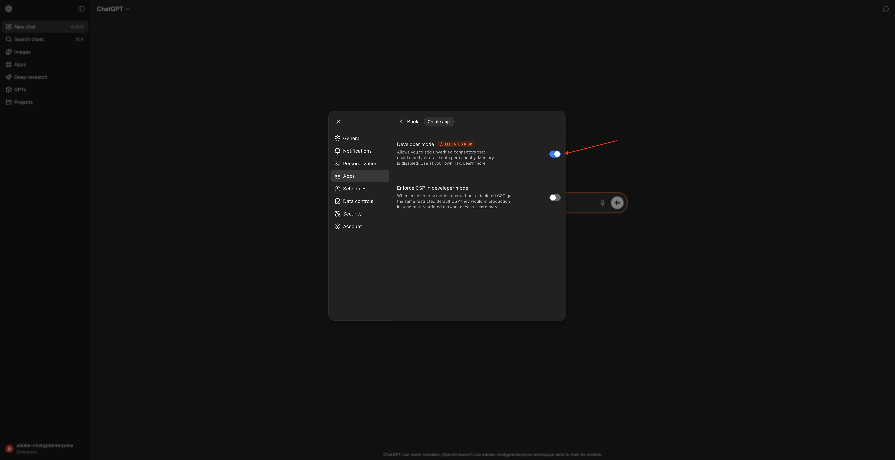

按一下&#x200B;**建立應用程式**。

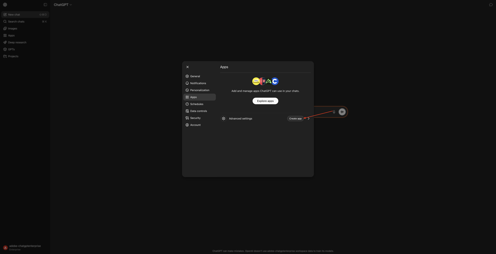

填寫欄位，如下所示：

- **名稱**： `Adobe Marketing Agent`
- **MCP伺服器URL**：請洽詢您的Adobe代表
- **驗證**： `OAuth`

勾選&#x200B;**我瞭解並想要繼續**&#x200B;的核取方塊。

按一下&#x200B;**建立**。

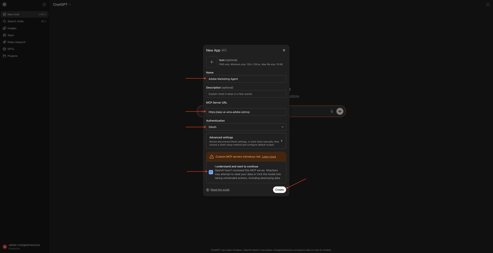

ChatGPT現在將嘗試連線至您的Adobe帳戶。 選取&#x200B;**允許存取**，然後您必須使用您的Adobe帳戶登入。


成功登入後，您應該會看到Adobe Marketing Agent現在已成功連線。

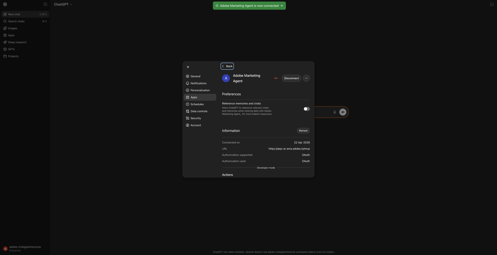

## 1.1.2.2在Adobe Marketing Agent中設定內容

關閉此視窗。

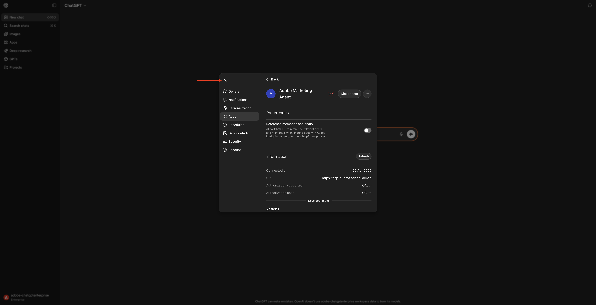

您應該會看到此訊息。 按一下&#x200B;**+**&#x200B;圖示，移至&#x200B;**更多**，然後選取&#x200B;**Adobe Marketing Agent**。

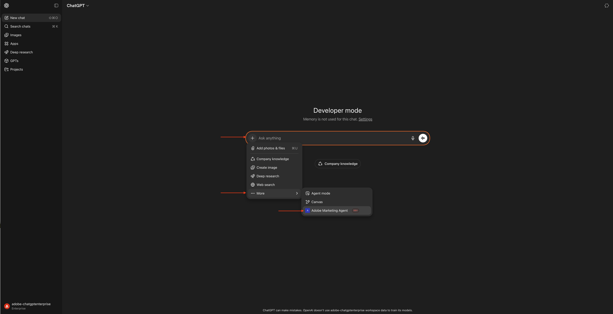

在透過ChatGPT進一步與Adobe Marketing Agent互動之前，需要設定內容。

在本練習中，需要將內容設定為使用：

- **沙箱**： **Prod — 加速(VA7)**

沙箱設定可協助識別在詢問問題時哪個沙箱AI小幫手應該檢視。

- **資料檢視**： **加速2026 B2C**

資料檢視設定可協助識別詢問問題時資料檢視AI助理應該檢視哪個資料檢視。

輸入下列&#x200B;**提示**&#x200B;並按一下&#x200B;**傳送**&#x200B;按鈕。

```javascript
list sandboxes
```

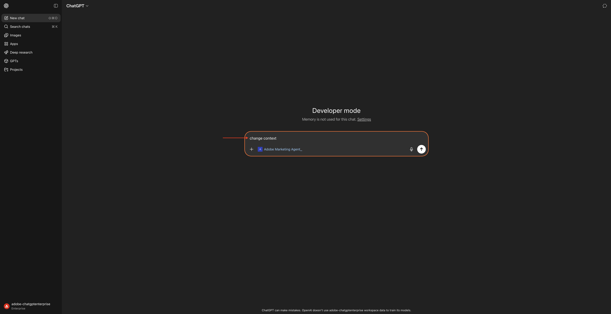

之後，您應該會看到類似的可用沙箱清單。 此範例中的目前沙箱設定為&#x200B;**prod**。

若要將其變更為需要使用的沙箱，請輸入下列&#x200B;**提示**&#x200B;並按一下&#x200B;**傳送**&#x200B;按鈕。

```javascript
switch to sandbox accelerate
```

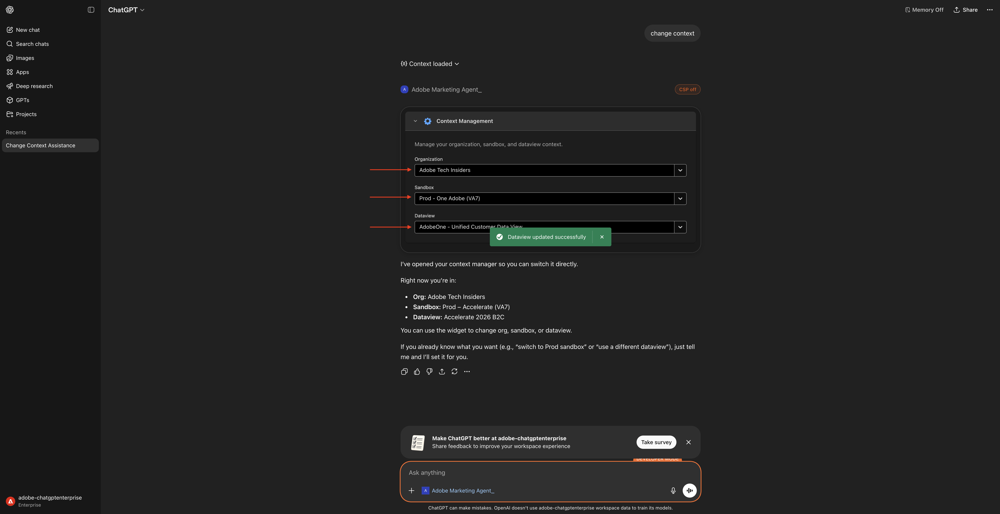

您應該會看到此訊息。 按一下&#x200B;**設定內容**。


您應該會看到此訊息。 輸入下列&#x200B;**提示**&#x200B;並按一下&#x200B;**傳送**&#x200B;按鈕，設定要使用的資料檢視。

```javascript
list dataviews
```


之後，您應該會看到類似的可用沙箱清單。 此範例中的目前沙箱設定為&#x200B;**prod**。

若要將其變更為需要使用的沙箱，請輸入下列&#x200B;**提示**&#x200B;並按一下&#x200B;**傳送**&#x200B;按鈕。

```javascript
switch to Accelerate 2026 B2C
```


您應該會看到此訊息。 按一下&#x200B;**設定內容**。


您應該會看到此訊息。


您的內容現在已正確設定，因此您之後可以開始傳送特定提示。

## 1.1.2.3從整體購買趨勢開始，錨定內容並放大光纖

**意圖**

獲得全方位的類別需求脈衝：行動、有線電話、網際網路、電視、光纖，特別是最近60天的應用。 這會設定紐約推出後的季節性、促銷效果及區域差異的基線。

輸入下列&#x200B;**提示**&#x200B;並按一下&#x200B;**傳送**&#x200B;按鈕。

```javascript
Show me purchases by mainCategory over the last 2 months.
```

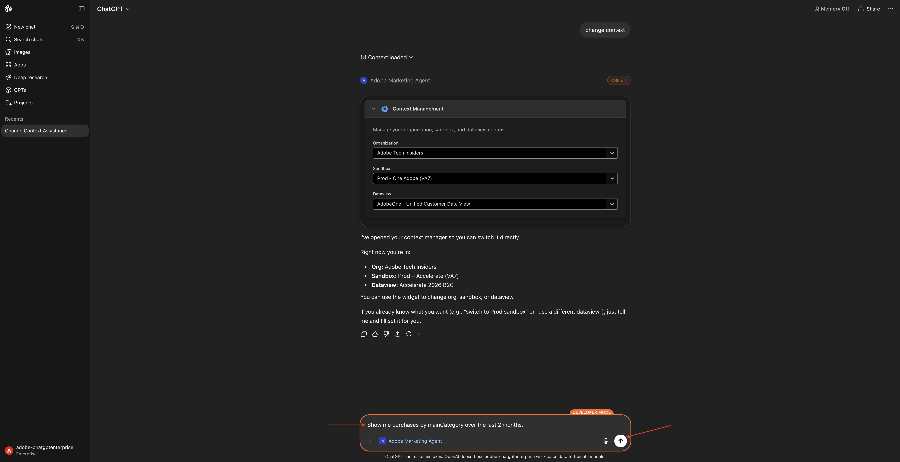

您應該會看到以下內容：

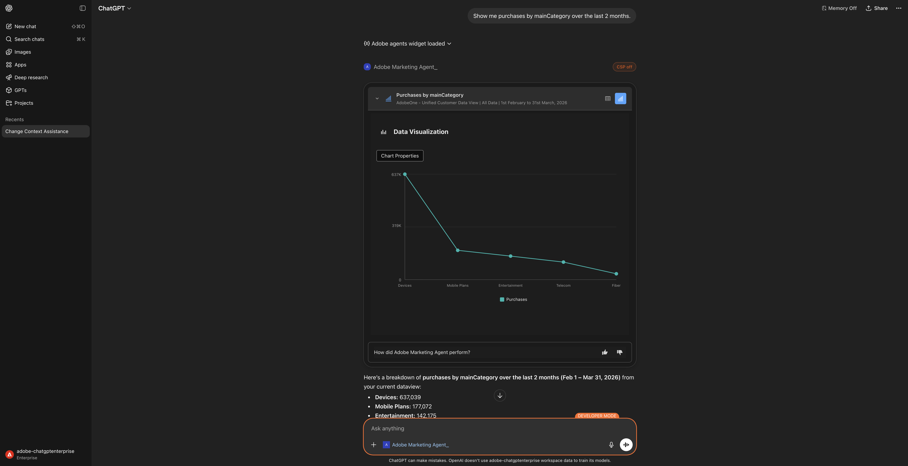

輸入下列&#x200B;**提示**&#x200B;並按一下&#x200B;**傳送**&#x200B;按鈕。

```javascript
Show me purchases by mainCategory = Fiber over the last 2 months per week
```

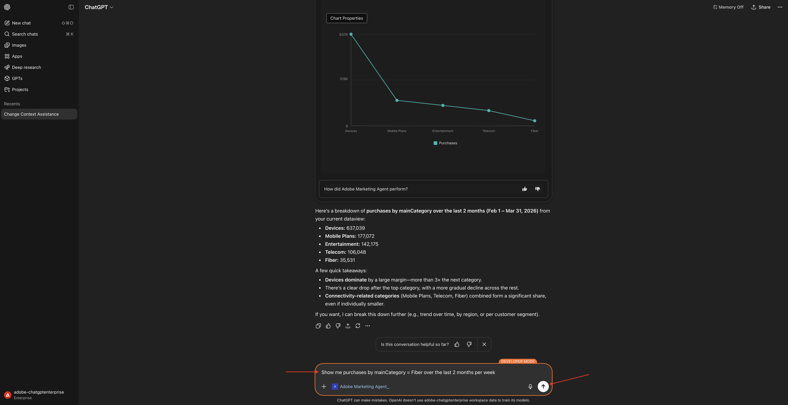

您應該會看到此資訊，深入瞭解光纖特有的趨勢。


## 1.1.2.4將訂單與內容偏好設定建立關聯

**意圖**

測試特定型別（例如SciFi、Sports、Drama）的偏好預測寬頻升級行為的假設 — 尤其是針對高頻寬需求。

首先，您需要找出哪個欄位用於儲存型別偏好設定。

輸入下列&#x200B;**提示**&#x200B;並按一下&#x200B;**傳送**&#x200B;按鈕。

```javascript
Which field is used to store the preferred genre in the sandbox accelerate?
```

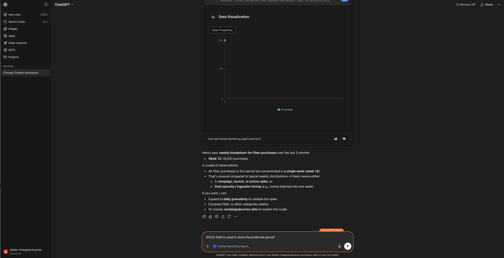

您應該會看到此訊息，其中顯示用於型別的欄位是&#x200B;**_experienceplatform.individualCharacteristics.preferences.preferredGenre**。

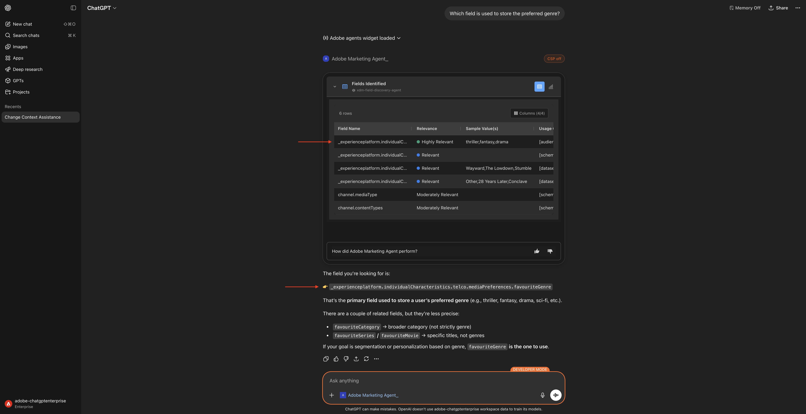

有了這些資訊，您就可以開始向下鑽研購買資料。

輸入下列&#x200B;**提示**&#x200B;並按一下&#x200B;**傳送**&#x200B;按鈕。

```javascript
Show me ordersYTD by preferredGenre for the last 2 months
```


您應該會看到此訊息。 按一下&#x200B;**研究**。

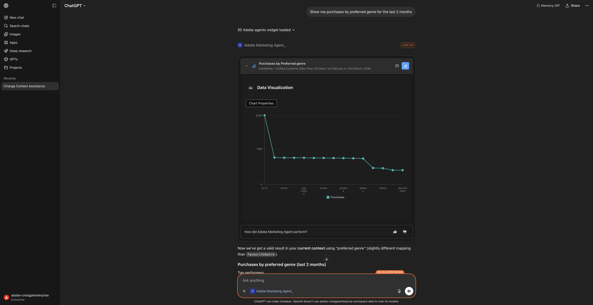

您應該會看到此訊息。


向下捲動以檢視詳細資訊。


## 1.1.2.5識別現有的Fiber歷程

**意圖**

探索標題中包含「Fiber」的活動或最近結束的歷程，例如「Fiber Upgrade NYC - September」、「Fiber Trial - Streaming Bundle」。

輸入下列&#x200B;**提示**&#x200B;並按一下&#x200B;**傳送**&#x200B;按鈕。

```javascript
What journeys exist? 
```

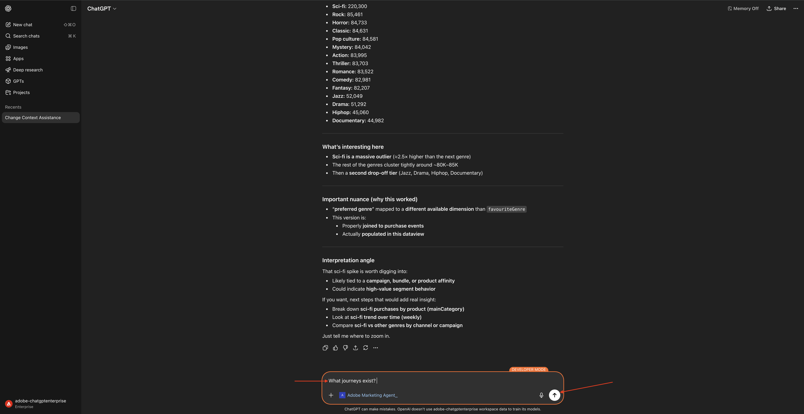

您應該會看到此訊息。 按一下&#x200B;**研究**。

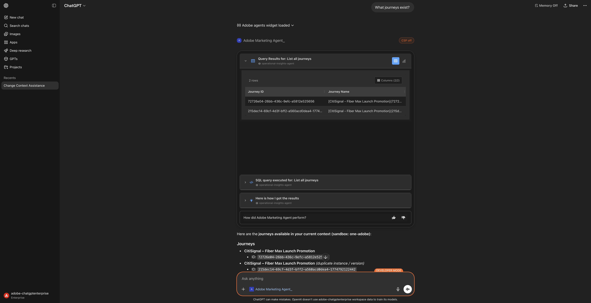

之後，您應該會看到歷程清單。


輸入下列&#x200B;**提示**&#x200B;並按一下&#x200B;**傳送**&#x200B;按鈕。

```javascript
Which of these journeys has 'Fiber' in its name?
```

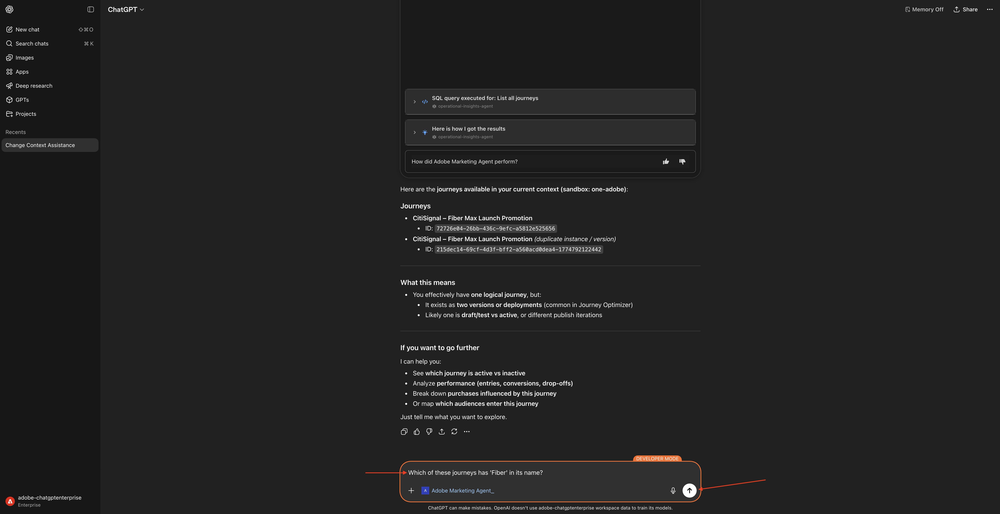

您應該會看到此訊息。 按一下&#x200B;**研究**。

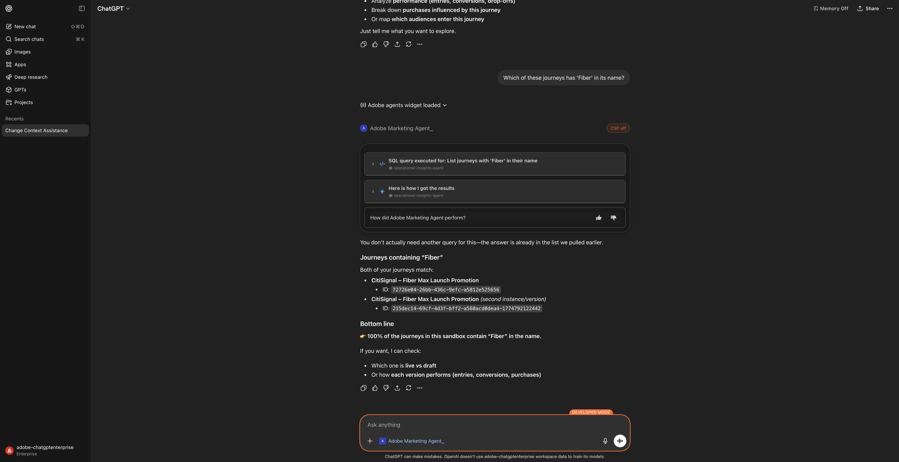

您應該會看到此訊息。


向下捲動以檢視更多詳細資料。


輸入下列&#x200B;**提示**&#x200B;並按一下&#x200B;**傳送**&#x200B;按鈕。

```javascript
show me the details of the journey 'CitiSignal - Fiber Max Launch Promotion'
```

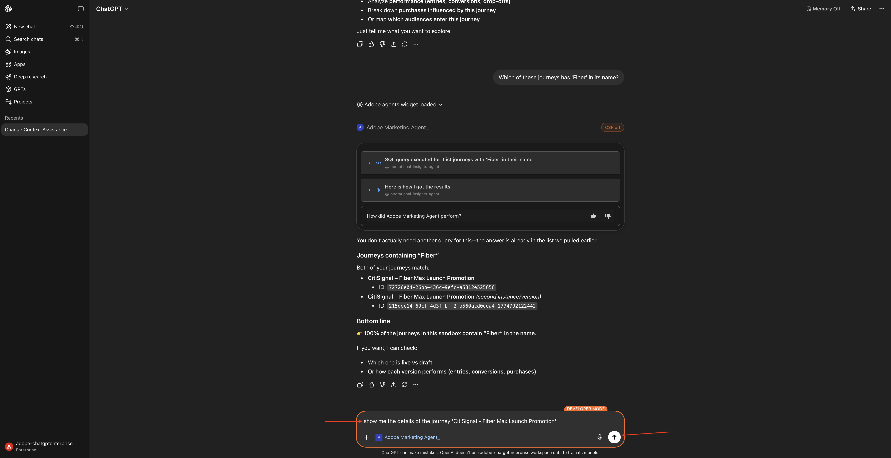

您應該會看到此訊息。

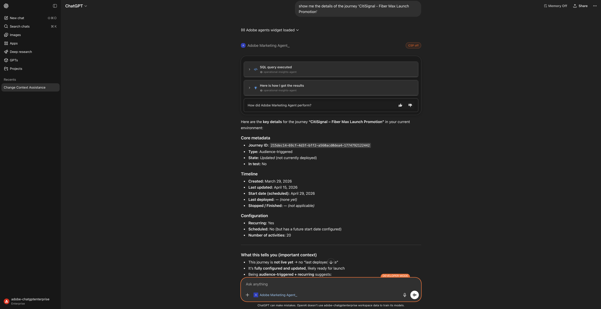

## 1.1.2.6透過流失分析驗證歷程績效

**意圖**

您想要瞭解歷程效能流失，以瞭解歷程中是否有任何節點或條件發生大量設定檔被捨棄的情況。 這有助於瞭解歷程中是否需要其他調整。

輸入下列&#x200B;**提示**&#x200B;並按一下&#x200B;**傳送**&#x200B;按鈕。

```javascript
Create a fall-out report on the "CitiSignal - Fiber Max Launch Promotion" journey
```

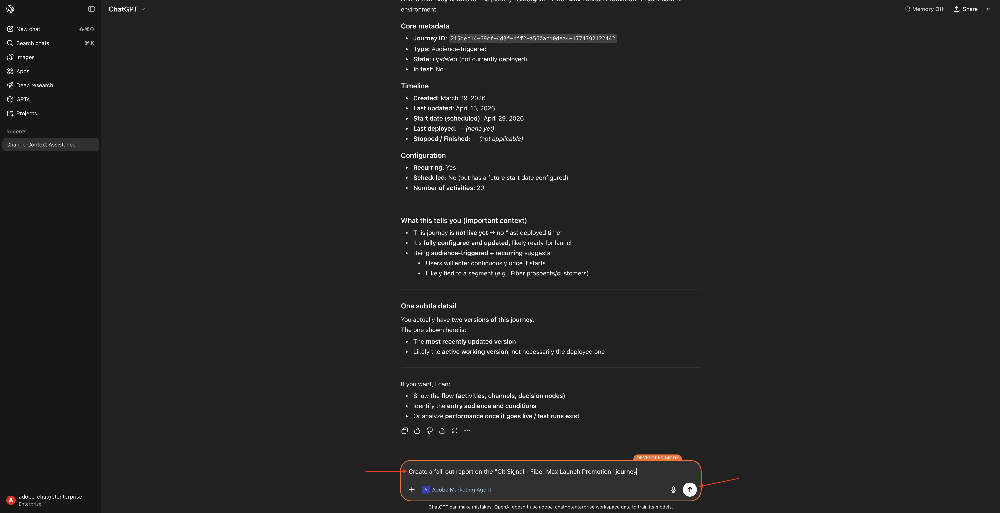

您應該會看到此訊息。

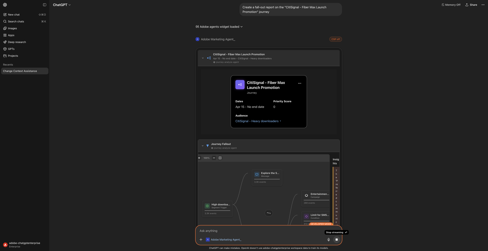

向下捲動一點。 您現在可以透過檢查每個節點及其各自的輸入編號、流失編號和流失率來檢閱表格。

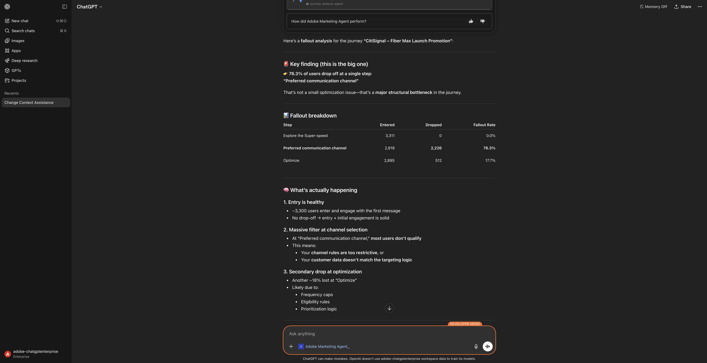

再向下捲動一點以檢視觀察結果和建議。

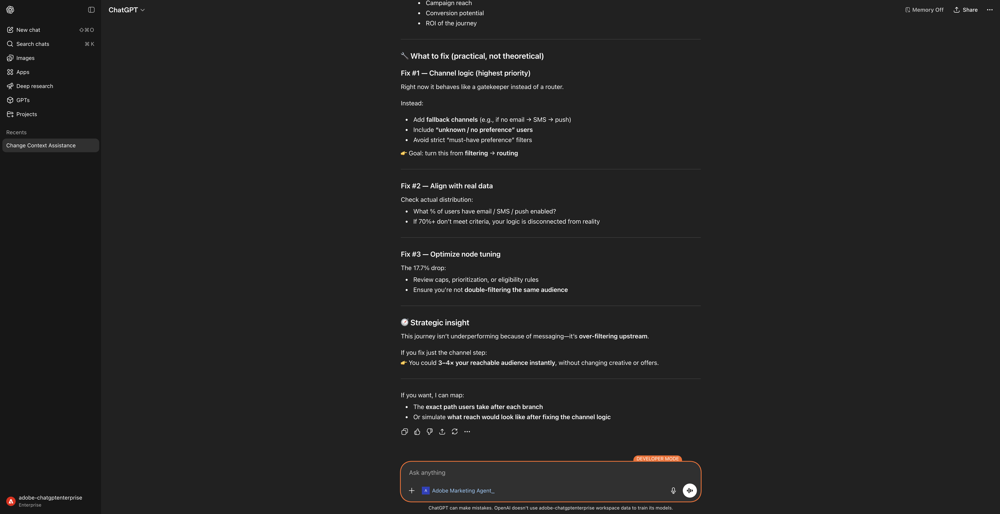

您現在已經完成了這個實驗。

返回[Agent Orchestrator](./agentorchestrator.md){target="_blank"}

[返回所有模組](./../../../overview.md){target="_blank"}