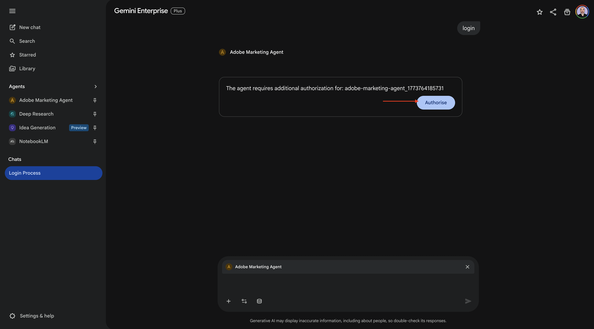
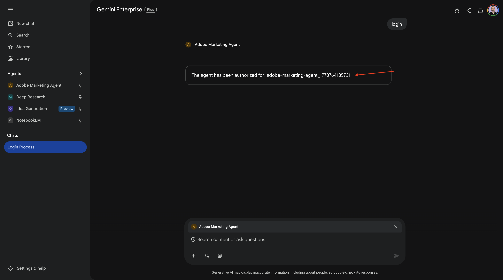
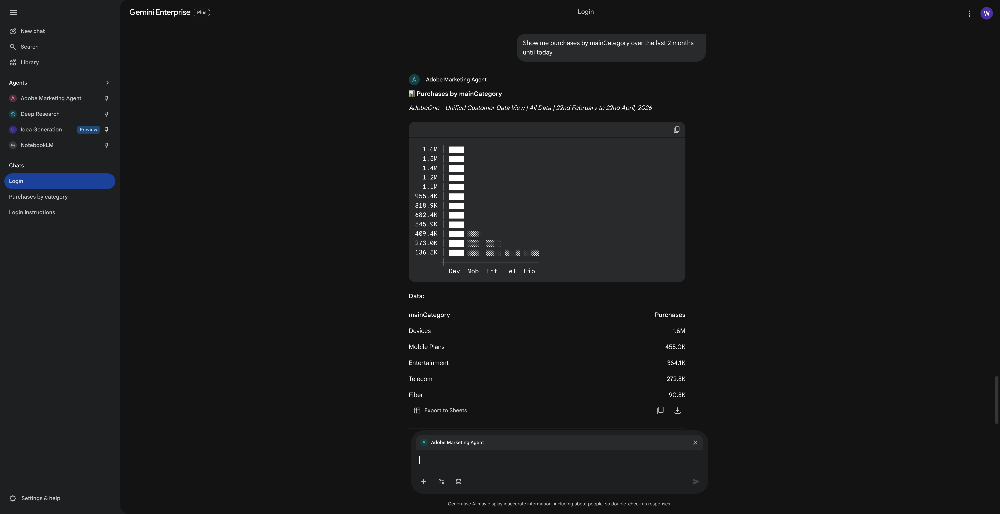
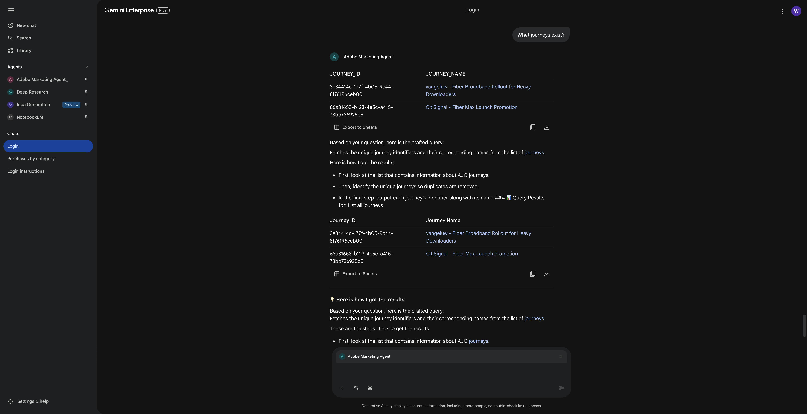
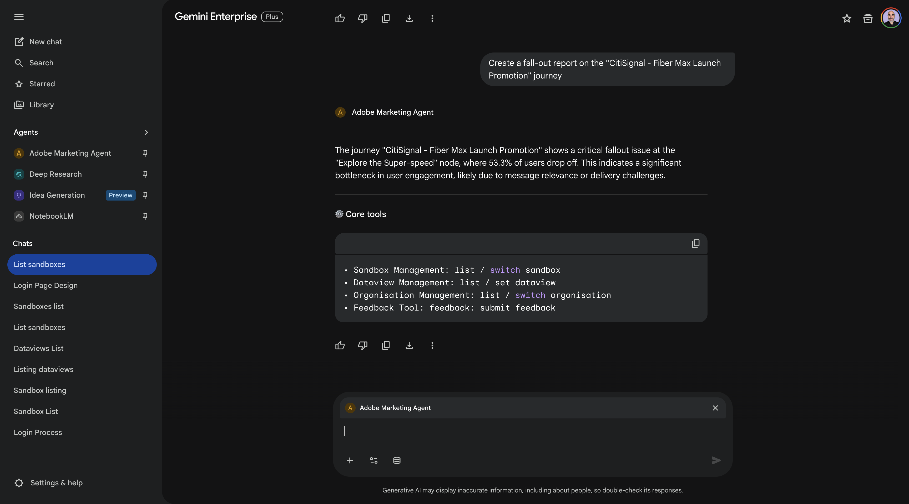

# 1.1.4 Google Gemini Enterprise適用的Adobe Marketing Agent

[!BADGE Beta]

+++Beta詳細資料
藉由將Adobe Marketing Agent與Google Gemini Enterprise Beta搭配使用，即表示您確認Beta係依「現況」提供，並無任何保固。 Adobe沒有義務維護、更正、更新、變更、修改或以其他方式支援Beta。 建議您謹慎使用，切勿依賴這類Beta及/或隨附資料的正確運作或效能。 Beta視為Adobe的機密資訊。  任何「意見回饋」（有關Beta的資訊，包括但不限於您在使用Beta時遇到的問題或缺陷、建議、改進和建議）會在此指派給Adobe，包括所有權利、標題，以及對此等意見回饋的興趣。

+++

## 先決條件

為了遵循本實驗中記錄的步驟，需要以下存取：

- 存取Real-Time CDP、Journey Optimizer和Customer Journey Analytics
- 存取Adobe Experience Cloud中的AI助理
- 存取AEP Agent Orchestrator
- 存取Google Gemini Enterprise

## 影片

在這段影片中，您將獲得本練習中所有步驟的說明和示範。

>[!VIDEO](https://video.tv.adobe.com/v/3481322?quality=12&learn=on)

## 1.1.4.1存取Google Gemini Enterprise

移至[https://cloud.google.com/gemini-enterprise](https://cloud.google.com/gemini-enterprise)。 按一下&#x200B;**開始30天免費試用**。


輸入您的Google帳戶電子郵件地址，然後按一下&#x200B;**繼續傳送電子郵件**。


提供您的名字和姓氏，然後按一下&#x200B;**同意並開始使用**。


按一下&#x200B;**我稍後再做**。


您應該會看到此訊息。


移至[https://cloud.google.com/gemini-enterprise](https://cloud.google.com/gemini-enterprise)。

您應該會看到類似這樣的內容。 您可能還必須先建立您的計費帳戶，然後在這裡選取它。


按一下&#x200B;**開始30天免費試用**。


按一下[繼續]並啟動API **。**


按一下&#x200B;**建立**。


您應該會看到此訊息。


## 1.1.4.2使用A2A建立您的自訂代理程式

移至[https://console.cloud.google.com/gemini-enterprise](https://console.cloud.google.com/gemini-enterprise)。 按一下&#x200B;**代理程式**。


按一下&#x200B;**+新增代理程式**。


選取&#x200B;**透過A2A**&#x200B;的自訂代理程式。


貼上&#x200B;**代理程式卡片JSON**。

>[!NOTE]
>
>請洽詢您的Adobe代表，以取得&#x200B;**代理程式卡JSON**&#x200B;資訊。


貼上&#x200B;**代理程式卡片JSON**&#x200B;後，按一下&#x200B;**預覽代理程式詳細資料**。


您應該會看到類似這樣的內容。 向下捲動並按一下&#x200B;**下一步**。


您應該會看到類似這樣的內容。


填寫您執行個體的欄位。

- **使用者端識別碼**：

```
--aepImsOrgId--
```

- **使用者端密碼**：

```
AdobeMarketingAgent
```

- **授權URL**：

```
https://XXX.adobe.io/authorize
```

- **權杖URL**：

```
https://XXX.adobe.io/token
```

- **領域**：

```
openid email profile
```

按一下&#x200B;**完成**。


您應該會看到此訊息。


## 1.1.4.3登入Adobe Marketing Agent

移至&#x200B;**總覽**，然後按一下&#x200B;**預覽**。


按一下&#x200B;**開始使用**


移至&#x200B;**代理程式**。 您應該在那裡看到&#x200B;**Adobe Marketing Agent**。


按一下3個點&#x200B;**...**，然後選取&#x200B;**圖釘**。


移至&#x200B;**新聊天**&#x200B;並在聊天中輸入符號&#x200B;**@**。 按一下&#x200B;**Adobe Marketing Agent**。


輸入命令`login`，然後按一下&#x200B;**傳送**。


您應該會看到此訊息。 按一下&#x200B;**授權**。



按一下&#x200B;**允許存取**&#x200B;並使用您的Adobe ID完成登入，然後在提示時選取執行個體`--aepImsOrgName--`。


您應該會看到此訊息。



## 1.1.4.4在Adobe Marketing Agent中設定內容

在透過Copilot進一步與Adobe Marketing Agent互動之前，需要設定上下文。

在本練習中，需要將內容設定為使用：

- **沙箱**： **Prod — 加速(VA7)**

  沙箱設定可協助識別在詢問問題時哪個沙箱AI Assistant應該檢視。

- **資料檢視**： **加速2026 B2C**

資料檢視設定可協助識別詢問問題時資料檢視AI助理應該檢視哪個資料檢視。

若要變更沙箱，請輸入以下命令並按一下&#x200B;**傳送**&#x200B;按鈕。

```javascript
list sandboxes
```


之後，您應該會看到類似以下內容。 輸入命令`switch to sandbox accelerate`並按一下&#x200B;**傳送**&#x200B;按鈕。


您應該會看到此訊息。 若要變更資料檢視，請輸入以下命令並按一下&#x200B;**傳送**&#x200B;按鈕。

```javascript
list dataviews
```


之後，您應該會看到類似以下內容。 輸入命令`switch dataview to Accelerate 2026 B2C`並按一下&#x200B;**傳送**&#x200B;按鈕。


您應該會看到此訊息。 內容現在已正確設定，以便您接下來可以開始傳送特定提示。


## 1.1.4.5從整體購買趨勢開始，錨定內容並放大光纖

**意圖**

獲得全方位的類別需求脈衝：行動、有線電話、網際網路、電視、光纖，特別是最近60天的應用。 這會設定紐約推出後的季節性、促銷效果及區域差異的基線。

輸入下列&#x200B;**提示**&#x200B;並按一下&#x200B;**傳送**&#x200B;按鈕。

```javascript
Show me purchases by mainCategory over the last 7 months.
```


您應該會看到以下內容：



輸入下列&#x200B;**提示**&#x200B;並按一下&#x200B;**傳送**&#x200B;按鈕。

```javascript
Show me purchases by mainCategory = Fiber over the last 7 months broken down by week
```


您應該會看到此資訊，深入瞭解光纖特有的趨勢。


## 1.1.4.6將訂單與內容偏好設定建立關聯

**意圖**

測試特定型別（例如SciFi、Sports、Drama）的偏好預測寬頻升級行為的假設 — 尤其是針對高頻寬需求。

首先，您需要找出哪個欄位用於儲存型別偏好設定。

輸入下列&#x200B;**提示**&#x200B;並按一下&#x200B;**傳送**&#x200B;按鈕。

```javascript
Which field is used to store the preferred genre
```


您應該會看到此訊息，其中顯示用於型別的欄位是&#x200B;**_experienceplatform.individualCharacteristics.preferences.preferredGenre**。


有了這些資訊，您就可以開始向下鑽研購買資料。

輸入下列&#x200B;**提示**&#x200B;並按一下&#x200B;**傳送**&#x200B;按鈕。

```javascript
Show me ordersYTD by preferredGenre for the last 7 months
```


您應該會看到此訊息。


## 1.1.4.7識別現有的Fiber歷程

**意圖**

探索標題中包含「Fiber」的活動或最近結束的歷程，例如「Fiber Upgrade NYC - September」、「Fiber Trial - Streaming Bundle」。

輸入下列&#x200B;**提示**&#x200B;並按一下&#x200B;**傳送**&#x200B;按鈕。

```javascript
What journeys exist? 
```


之後，您應該會看到歷程清單。



輸入下列&#x200B;**提示**&#x200B;並按一下&#x200B;**傳送**&#x200B;按鈕。

```javascript
Which of these journeys has 'Fiber' in its name?
```


您應該會看到此訊息。


輸入下列&#x200B;**提示**&#x200B;並按一下&#x200B;**傳送**&#x200B;按鈕。

```javascript
Show me the details of the journey 'CitiSignal - Fiber Max Launch Promotion'
```


您應該會看到此訊息。


## 1.1.4.8透過流失分析驗證歷程績效

**意圖**

您想要瞭解歷程效能流失，以瞭解歷程中是否有任何節點或條件發生大量設定檔被捨棄的情況。 這有助於瞭解歷程中是否需要其他調整。

輸入下列&#x200B;**提示**&#x200B;並按一下&#x200B;**傳送**&#x200B;按鈕。

```javascript
Create a fall-out report on the "CitiSignal - Fiber Max Launch Promotion" journey
```


您應該會看到此訊息。



您現在已經完成了這個實驗。

## 後續步驟

移至Claude的[1.1.5 Adobe Marketing Agent](./ex5.md){target="_blank"}

返回[Agent Orchestrator](./agentorchestrator.md){target="_blank"}

[返回所有模組](./../../../overview.md){target="_blank"}
