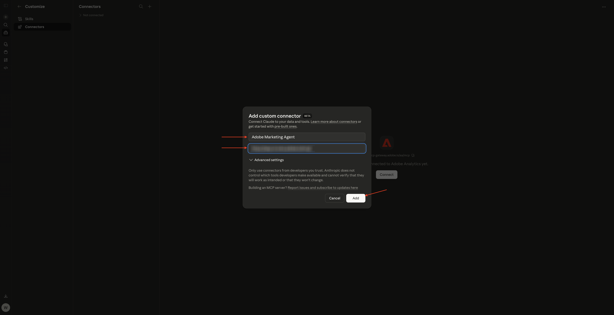
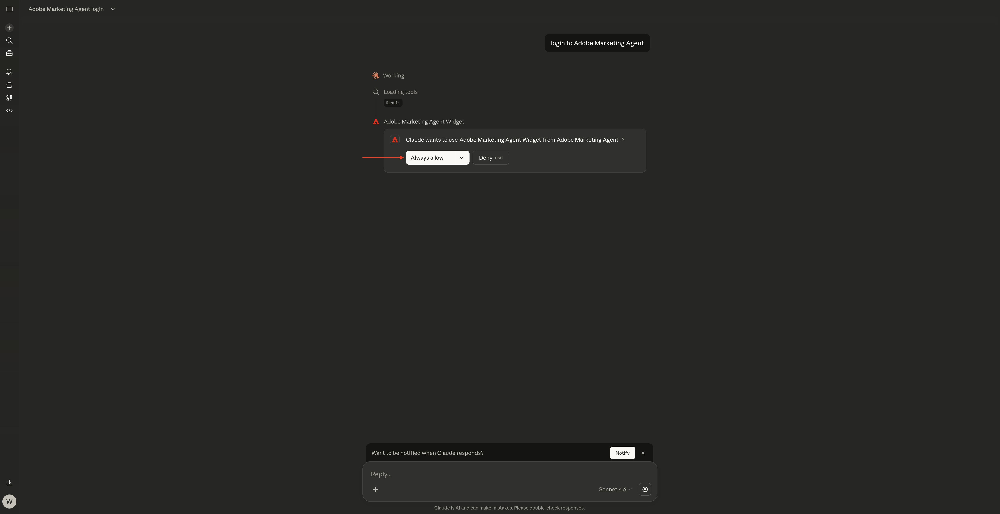
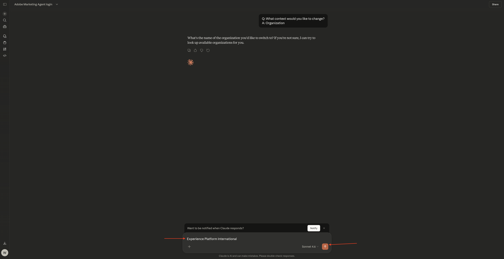
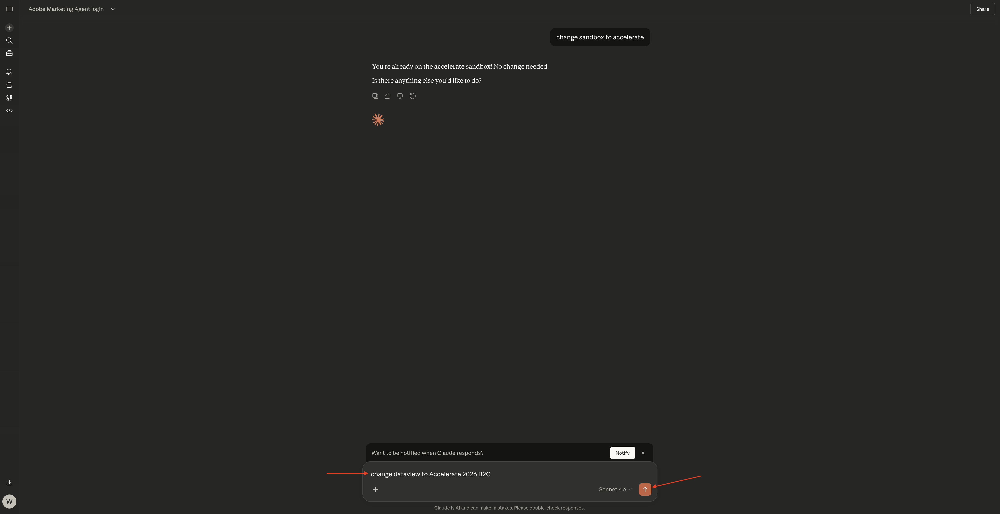

# 1.1.5克勞德的Adobe Marketing Agent

[!BADGE Beta]

+++Beta詳細資料
藉由將Adobe Marketing Agent與Claude Beta搭配使用，您在此確認Beta係依「現況」提供，並無任何保證。 Adobe沒有義務維護、更正、更新、變更、修改或以其他方式支援Beta。 建議您謹慎使用，切勿依賴這類Beta及/或隨附資料的正確運作或效能。 Beta視為Adobe的機密資訊。  任何「意見回饋」（有關Beta的資訊，包括但不限於您在使用Beta時遇到的問題或缺陷、建議、改進和建議）會在此指派給Adobe，包括所有權利、標題，以及對此等意見回饋的興趣。

+++

## 先決條件

In order to follow the steps in this lab as documented below, the following access is required:

- Access to Real-Time CDP, Journey Optimizer and Customer Journey Analytics
- Access to AI Assistant in Adobe Experience Cloud
- Access to AEP Agent Orchestrator
- Access to Claude

## 影片

在這段影片中，您將獲得本練習中所有步驟的說明和示範。

>[!VIDEO](https://video.tv.adobe.com/v/3482212?quality=12&learn=on)

本實驗室正在開發中。

## 1.1.5.1在Claude.ai中為CJA建立自訂應用程式

>[!NOTE]
>
>Using Adobe Marketing Agent in Claude.ai requires the following:
>- a paid version of Claude.ai

移至[https://claude.ai/](https://claude.ai/){target="_blank"}並使用您的帳戶詳細資料登入。 登入後，您應該會看到此訊息。


按一下以開啟您的帳戶，然後選取&#x200B;**設定**。


移至&#x200B;**聯結器**，然後按一下&#x200B;**移至[自訂]**。


按一下&#x200B;**+**，然後選取&#x200B;**新增自訂聯結器**。


填寫欄位，如下所示：

- **名稱**： `Adobe Marketing Agent`
- **MCP伺服器URL**：詢問您的Adobe代表

按一下&#x200B;**新增**。



您應該會看到此訊息。 Click **+** to start a new chat.


Click the **+** icon, go to **Connectors** and make sure **Adobe Marketing Agent** is enabled.


## 1.1.5.2 Authenticate &amp; set context

Before interacting further with Adobe Marketing Agent through Claude.ai, you need to login and set the context.

輸入以下提示並按一下&#x200B;**傳送**。

```
login to Adobe Marketing Agent
```


選取&#x200B;**永遠允許**。



按一下連結，登入Adobe Marketing Agent**。


按一下&#x200B;**開啟連結**。


Click **Allow Access**.


After authenticating successfully, you should see this. Go back to Claude.


Enter the following command and click **send**.

```javascript
logged in
```


您現在已成功登入。 下一步是設定內容。 輸入以下提示並按一下&#x200B;**傳送**。


```javascript
change context
```


選取&#x200B;**組織**。 You can also repeat this command to change sandbox and dataview later.


輸入執行個體的名稱，然後按一下&#x200B;**傳送**。



選取&#x200B;**永遠允許**。


您應該會看到類似這樣的內容。


如果沙箱尚未正確設定，您可以使用以下命令來變更為您需要使用的沙箱。 按一下&#x200B;**傳送**。 或者，您可以使用上述命令`change context`，然後選取&#x200B;**沙箱**

```javascript
change sandbox to --aepSandboxName--
```


如果資料檢視尚未正確設定，您可以使用以下命令來變更為您需要使用的沙箱（以下命令中的XXX以資料檢視的名稱取代）。 按一下&#x200B;**傳送**。 Alternatively, you can use the above command `change context` and then select **dataview**

```javascript
change dataview to XXX
```



Once the **Organization**, **Sandbox** and **Dataview** are set properly, you&#39;re ready to start asking questions to Adobe Marketing Agent.

## 後續步驟

Go back to [Agent Orchestrator](./agentorchestrator.md){target="_blank"}

[返回所有模組](./../../../overview.md){target="_blank"}
