# 1.1.6 Agent Orchestrator v2

[!BADGE Beta]

+++Beta詳細資料
藉由使用Agent Orchestrator v2 Beta，您在此確認Beta係依「現況」提供，並無任何保證。 Adobe沒有義務維護、更正、更新、變更、修改或以其他方式支援Beta。 建議您謹慎使用，切勿依賴這類Beta及/或隨附資料的正確運作或效能。 Beta視為Adobe的機密資訊。  任何「意見回饋」（有關Beta的資訊，包括但不限於您在使用Beta時遇到的問題或缺陷、建議、改進和建議）會在此指派給Adobe，包括所有權利、標題，以及對此等意見回饋的興趣。

+++

## 先決條件

為了遵循本實驗中記錄的步驟，需要以下存取：

- 存取Real-Time CDP、Journey Optimizer和Customer Journey Analytics
- 存取Adobe Experience Cloud中的AI助理
- 存取AEP Agent Orchestrator v2
- 您的系統上必須安裝Node.js 18+

## 1.1.6.1設定Agent Orchestrator v2

### IAM

使用IAM將您新增至下列群組，以存取LLM認證。

>[!NOTE]
>
>以下某些指示特定於Adobe。 請向您的Adobe代表詢問要使用的GRP的相關資訊。

```
GRP-XXX
```

### 安裝Agent Orchestrator v2

在電腦上開啟新的終端機視窗。


>[!NOTE]
>
>以下命令需要使用特定URL。 請向您的Adobe代表詢問要使用的URL。

執行以下命令。

```
npm login --registry=https://XXX/ --auth-type=web
```


您應該會看到此訊息。 按&#x200B;**Enter**。


選取&#x200B;**SAML SSO**。


按一下&#x200B;**是**。

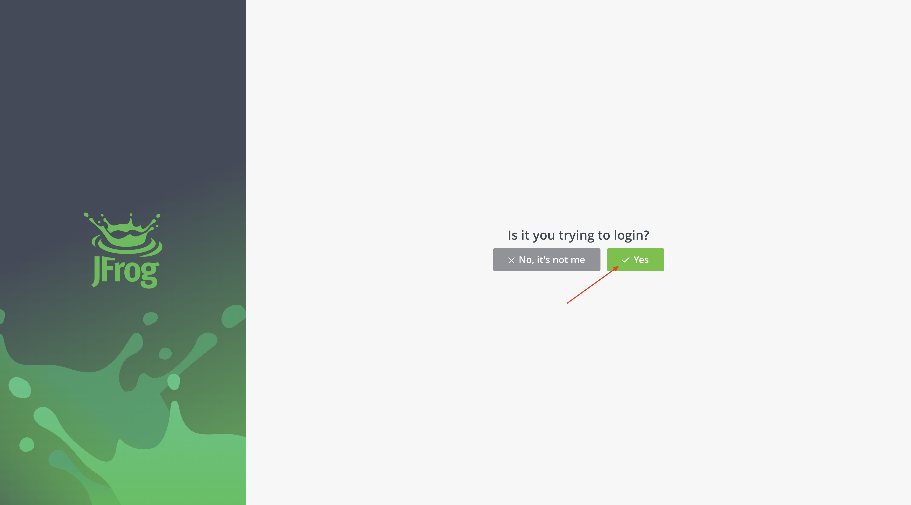

您應該會看到此訊息。


執行以下命令。

```
npm install -g ao --no-fund --registry=https://XXX/
```

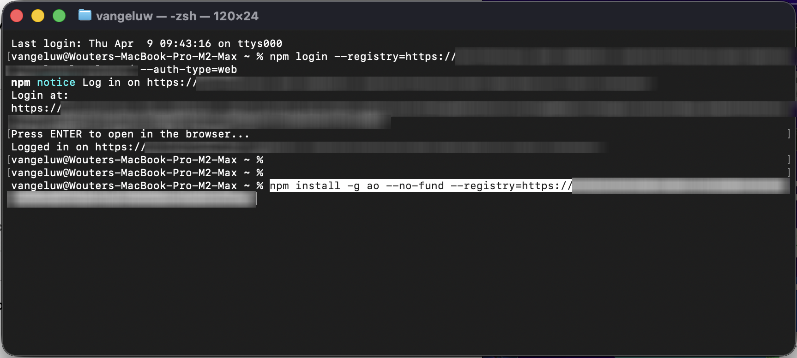

您應該會看到此訊息。 執行以下命令：

```
ao --help
```

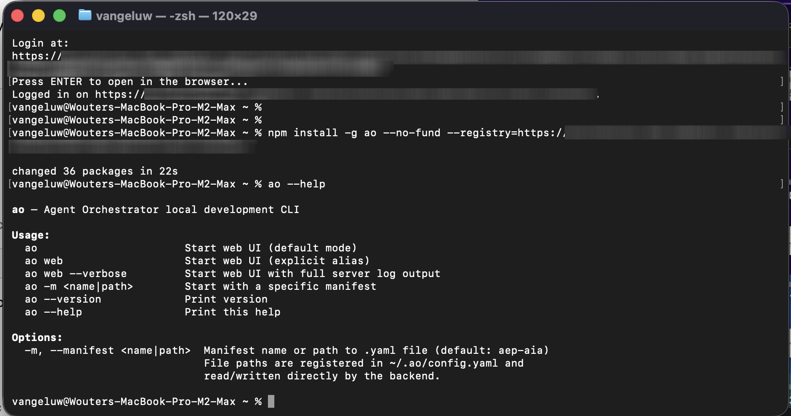

Agent Orchestrator v2現已安裝。 執行以下命令以啟動&#x200B;**Agent Orchestrator v2**。

```
ao web
```

您應該會看到此訊息。 按&#x200B;**Enter**&#x200B;以開啟Agent Orchestrator v2 Web UI。

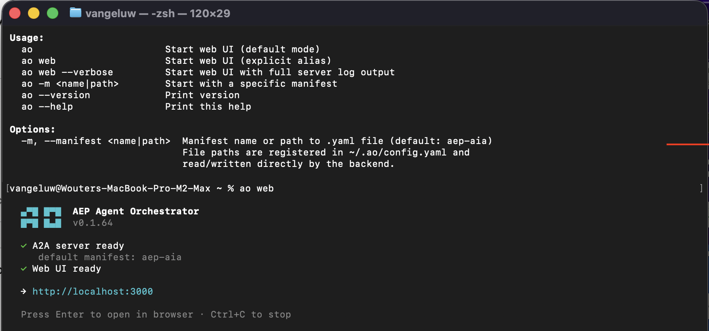

## 1.1.6.2設定Agent Orchestrator v2

按一下&#x200B;**使用AO LLM**。

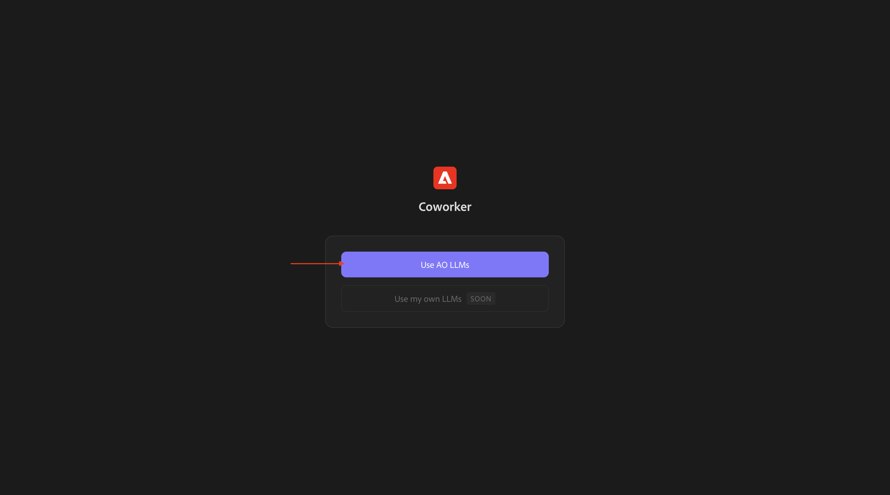

按一下&#x200B;**登入生產環境**。

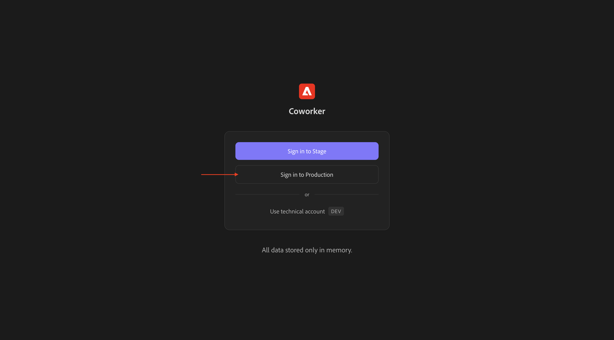

按一下&#x200B;**圖層**&#x200B;圖示。


選取&#x200B;**AEP AI助理（程式碼執行 — BashKit）**。

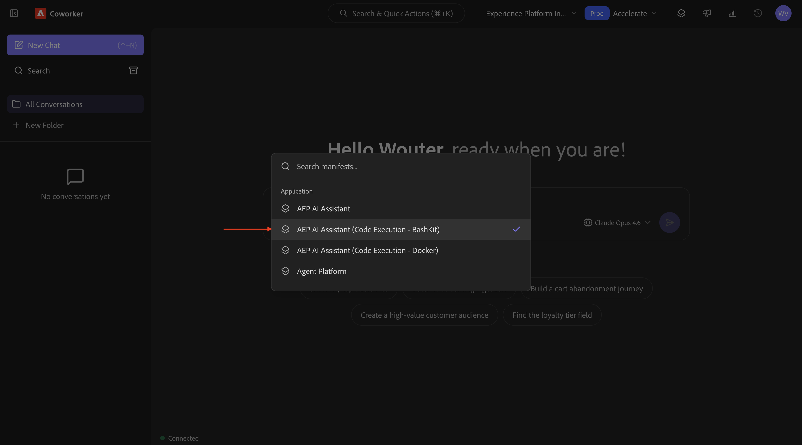

按一下您的&#x200B;**設定檔**&#x200B;圖示，然後選取&#x200B;**設定**。

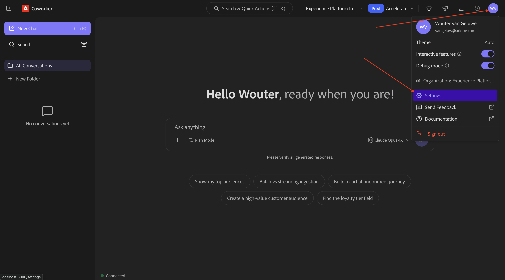

移至&#x200B;**外掛程式**&#x200B;並按一下&#x200B;**cja**。


按一下&#x200B;**安裝**。


## 1.1.6.3設定您的內容

按一下&#x200B;**新增聊天**。

確認您的執行個體已設定為使用執行個體&#x200B;**Experience Platform International**&#x200B;和沙箱&#x200B;**加速**。

輸入下列命令，然後按一下&#x200B;**傳送**。

```
list dataviews
```


輸入下列命令，然後按一下&#x200B;**傳送**。

```
switch to dataview Accelerate 2026 B2C
```

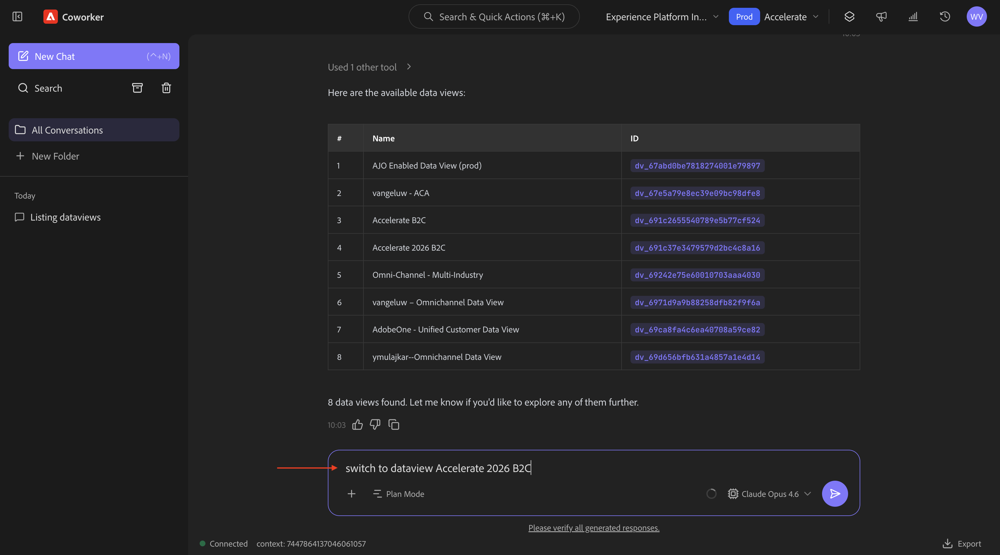

您應該會看到此訊息。

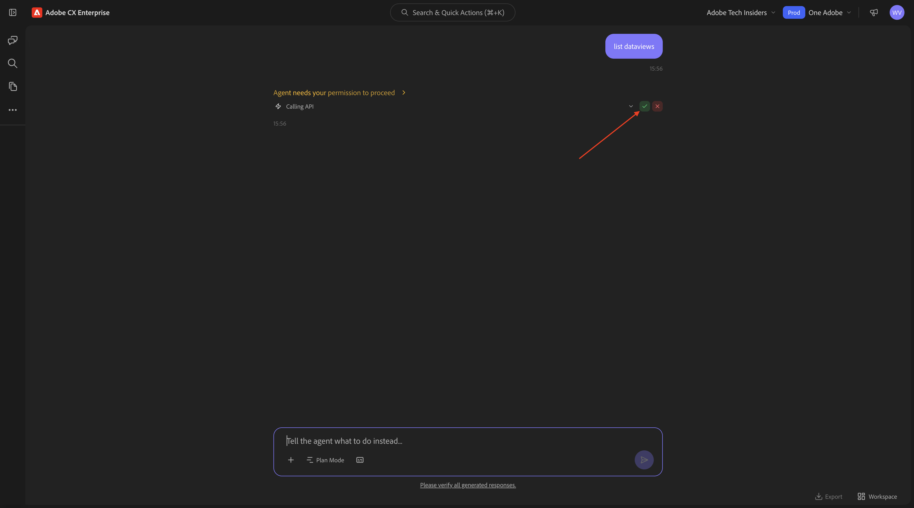

## 1.1.6.4從整體購買趨勢開始，錨定內容並放大光纖

**意圖**

獲得全方位的類別需求脈衝：行動、有線電話、網際網路、電視、光纖，特別是最近60天的應用。 這會設定紐約推出後的季節性、促銷效果及區域差異的基線。

輸入下列&#x200B;**提示**&#x200B;並按一下&#x200B;**傳送**&#x200B;按鈕。

```javascript
Show me purchases by mainCategory over the last 7 months.
```


您應該會看到以下內容：


輸入下列&#x200B;**提示**&#x200B;並按一下&#x200B;**傳送**&#x200B;按鈕。

```javascript
Show me purchases by mainCategory = Fiber over the last 7 months per week
```

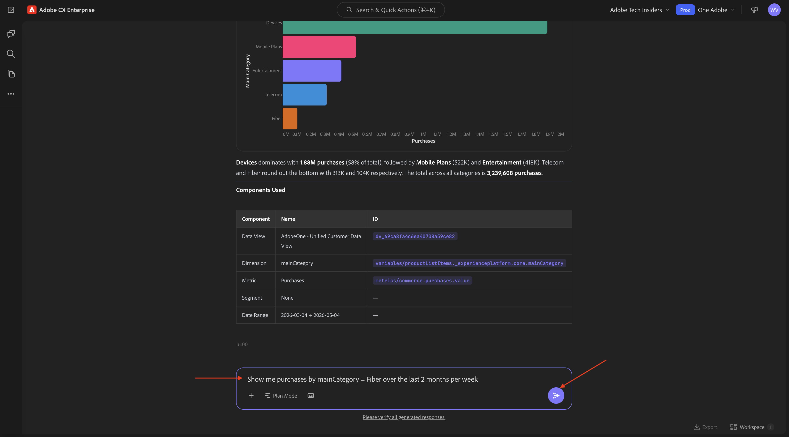

您應該會看到此資訊，深入瞭解光纖特有的趨勢。


## 1.1.6.5將訂單與內容偏好設定建立關聯

**意圖**

測試特定型別（例如SciFi、Sports、Drama）的偏好預測寬頻升級行為的假設 — 尤其是針對高頻寬需求。

首先，您需要找出哪個欄位用於儲存型別偏好設定。

輸入下列&#x200B;**提示**&#x200B;並按一下&#x200B;**傳送**&#x200B;按鈕。

```javascript
Which field is used to store the preferred genre?
```


您應該會看到此訊息，其中顯示用於型別的欄位是&#x200B;**_experienceplatform.individualCharacteristics.preferences.preferredGenre**。


有了這些資訊，您就可以開始向下鑽研購買資料。

輸入下列&#x200B;**提示**&#x200B;並按一下&#x200B;**傳送**&#x200B;按鈕。

```javascript
Show me ordersYTD by preferredGenre for the last 7 months
```


您應該會看到此訊息。

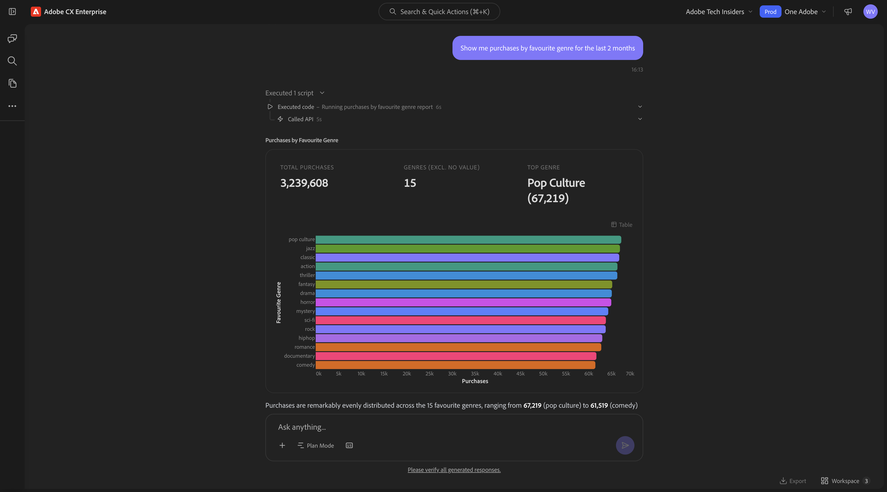


## 1.1.6.6識別現有的Fiber歷程

**意圖**

探索標題中包含「Fiber」的活動或最近結束的歷程，例如「Fiber Upgrade NYC - September」、「Fiber Trial - Streaming Bundle」。

輸入下列&#x200B;**提示**&#x200B;並按一下&#x200B;**傳送**&#x200B;按鈕。

```javascript
What journeys exist? 
```


您應該會看到此訊息。


輸入下列&#x200B;**提示**&#x200B;並按一下&#x200B;**傳送**&#x200B;按鈕。

```javascript
Which of these journeys has 'Fiber' in its name?
```

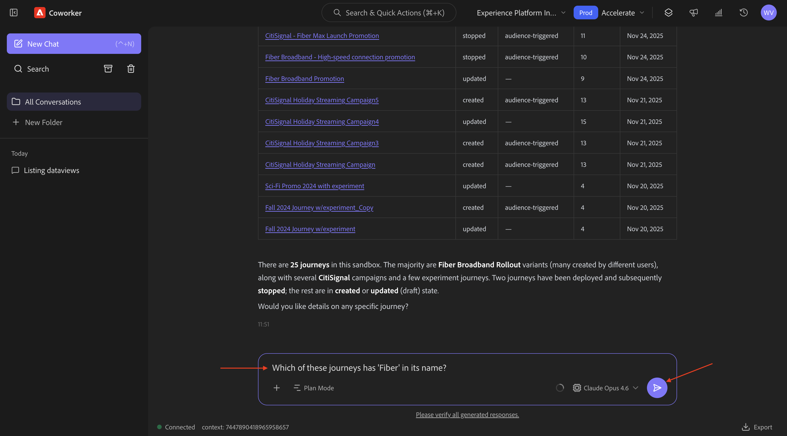

您應該會看到此訊息。 按一下其中一個歷程上的連結。

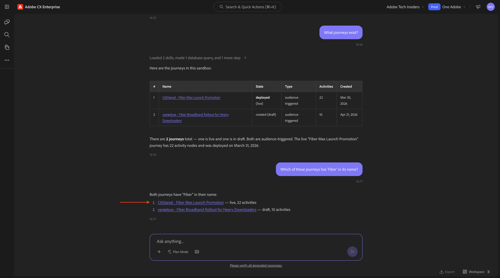

將會開啟新視窗，並立即帶您前往歷程詳細資訊總覽。


## 1.1.6.7檢查使用的對象

**意圖**：

瞭解「CitiSignal - Fiber Max啟動促銷活動」歷程的種子定義 — 哪些特徵會推動目標定位（例如「SciFi型別偏好」、「4+裝置」、「串流≥300GB/月」）。

輸入下列&#x200B;**提示**&#x200B;並按一下&#x200B;**傳送**&#x200B;按鈕。

```javascript
What was the initial audience in the journey named CitiSignal - Fiber Max Launch Promotion Winter 2026?
```


您應該會看到此訊息。

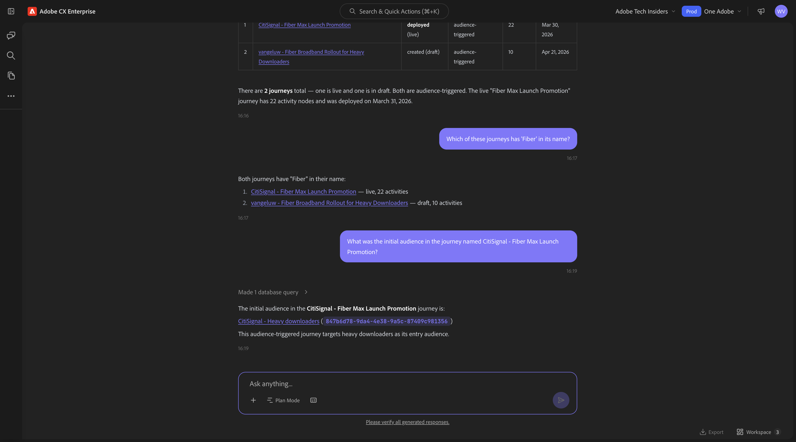

## 1.1.6.8透過流失分析驗證歷程績效

**意圖**

您想要瞭解歷程效能流失，以瞭解歷程中是否有任何節點或條件發生大量設定檔被捨棄的情況。 這有助於瞭解歷程中是否需要其他調整。

輸入下列&#x200B;**提示**&#x200B;並按一下&#x200B;**傳送**&#x200B;按鈕。

```javascript
Create a fall-out report on the "CitiSignal - Fiber Max Launch Promotion" journey
```


您應該會看到此訊息。


## 1.1.6.9建立新對象

**意圖**

根據上述發現與研究，消費大量資料且偏好科幻或幻想型別的客戶之間存在相關性。 您現在可以在對象中組合這些屬性。

輸入下列&#x200B;**提示**&#x200B;並按一下&#x200B;**傳送**&#x200B;按鈕。

```javascript
Create an audience that combines people with an average download usage per month of over 2000 GB and a preferred genre of sci-fi or fantasy.
```

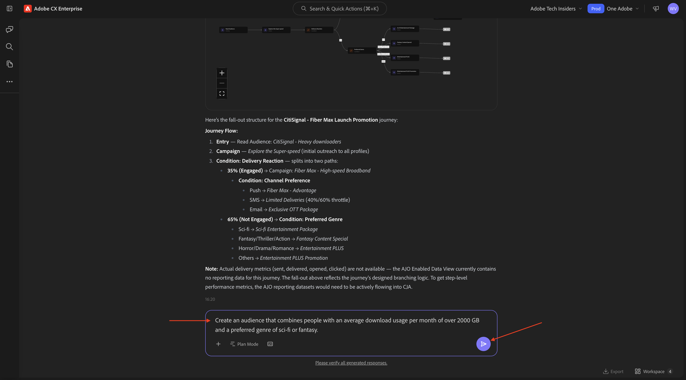

檢閱計畫。 按一下&#x200B;**接受計畫**。


您的對象現已建立。

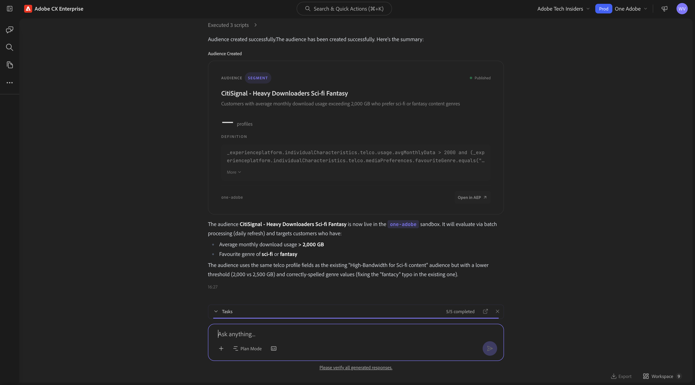

>[!NOTE]
>
>建立新受眾時，需要24小時的時間，AI Assistant才能使用受眾以供進一步使用。

## 1.1.6.10尋找符合高使用率的現有對象，並檢查它們是否在使用中

**意圖**：

找出任何具有「大量下載者」（依每月資料使用量臨界值定義）的受眾。

>[!NOTE]
>
>在上一步中，您建立了新對象，請記住，對象需要24小時才能供AI助理進一步使用。 您現在應該改用其他已存在的對象。

輸入下列&#x200B;**提示**&#x200B;並按一下&#x200B;**傳送**&#x200B;按鈕。

```javascript
Is there an audience that has "heavy downloaders" in the title?
```


您應該會看到此訊息。 您現在想要檢視您的所有對象，以及這些對象在過去幾天內的變更程度。

輸入下列&#x200B;**提示**&#x200B;並按一下&#x200B;**傳送**&#x200B;按鈕。

```javascript
List how much these audiences changed over the last few days.
```

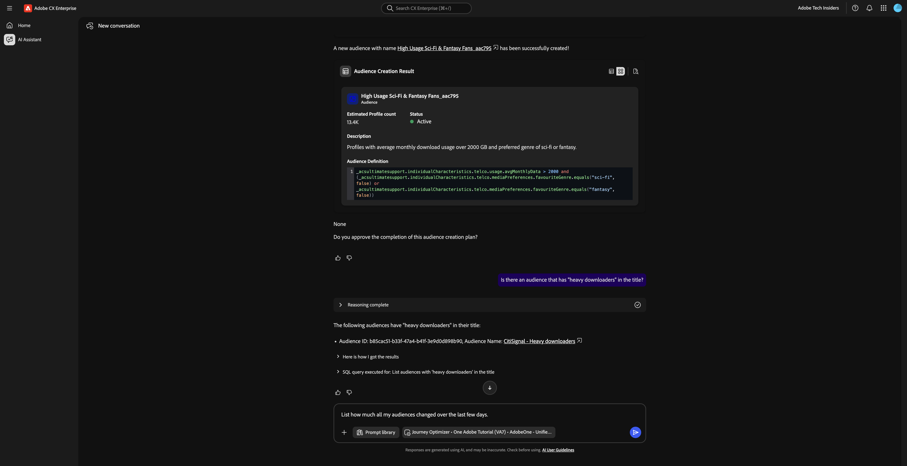

您應該會看到此訊息。 按一下&#x200B;**顯示更多**。


您應該會看到此訊息。 按一下以關閉右窗格。


向下捲動一點以檢閱AI Assistant採取的步驟。


已經有一些針對「大量下載者」的現有受眾。 讓我們看看它們是否已在使用中。

輸入下列&#x200B;**提示**&#x200B;並按一下&#x200B;**傳送**&#x200B;按鈕。

```javascript
Which of the above are used in a journey? 
```


之後，您應該會看到類似以下內容。


您現在應該確認該歷程是否有效。 輸入下列&#x200B;**提示**&#x200B;並按一下&#x200B;**傳送**&#x200B;按鈕。

```javascript
Are these journeys active? 
```


之後，您應該會看到類似以下內容。 這些歷程目前都沒有執行。


對於即將推出的Fiber Max，您現在應該建立新的歷程。

## 1.1.6.11建立Fiber Max啟動的新歷程

**意圖**：

建立以複合對象為目標的新歷程：

大量下載者∩SciFi偏好設定。

輸入下列&#x200B;**提示**&#x200B;並按一下&#x200B;**傳送**&#x200B;按鈕。

```javascript
Create a  journey towards the audience Heavy Downloaders - Sci-Fi Preference_kbaa_5207bf. The journey is for the rollout of fiber broadband. There will 2 versions of an email  based on  a split of the audience based on who is in the "Eligble for Fiber upgrade" audience.  After 3 days, profiles from both email treatments who have not purchased fibre max will be sent a follow up email. 
```


您應該會看到此訊息。 輸入`yes`並按一下[產生]。


您應該會看到此訊息。 輸入`yes`並按一下[產生]。


您應該會看到此訊息。 輸入`The first one`並按一下[傳送]。

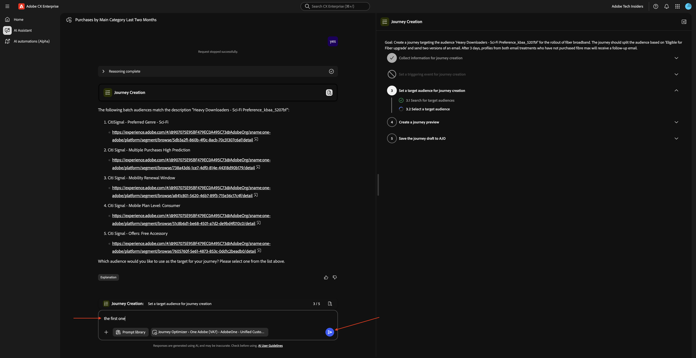

您應該會看到此訊息。 輸入`yes`並按一下[傳送]。


檢閱回應。 輸入`yes`並按一下[傳送]。


按一下&#x200B;**檢閱**。


使用您的LDAP更新歷程名稱，使其成為唯一名稱。 按一下&#x200B;**儲存**。

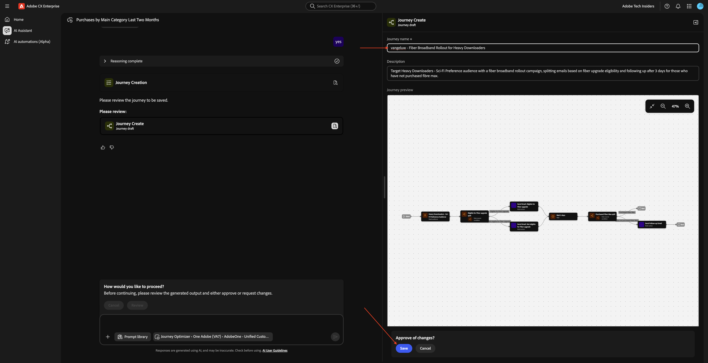

您的歷程現在已建立為草稿模式。


## 1.1.6.12歷程衝突管理

輸入下列&#x200B;**提示**&#x200B;並按一下&#x200B;**傳送**&#x200B;按鈕。

```javascript
How can I manage journey conflicts?
```


檢閱資訊。

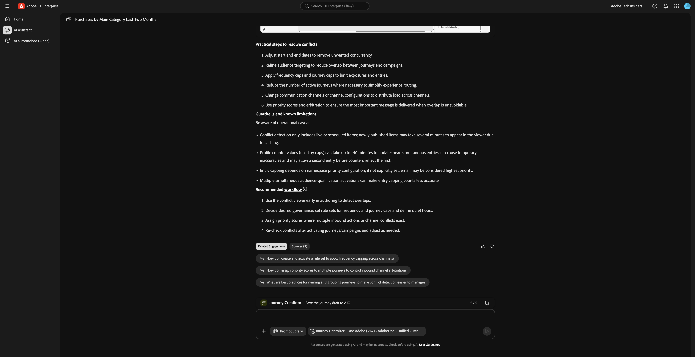

向下捲動並選取&#x200B;**來源**，以找出資訊來源於Experience League。

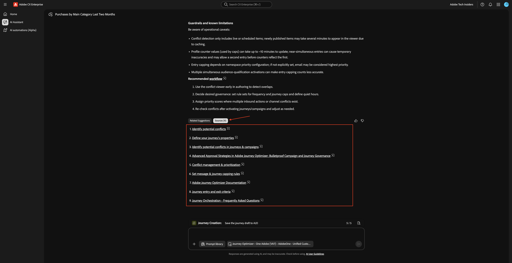

輸入下列&#x200B;**提示**&#x200B;並按一下&#x200B;**傳送**&#x200B;按鈕。

```javascript
List any conflicts for the journey +CitiSignal Fiber Max
```

然後從清單中手動選取歷程&#x200B;**CitiSignal - Fiber Max啟動促銷活動**。


您應該會看到此訊息。 按一下&#x200B;**傳送**。

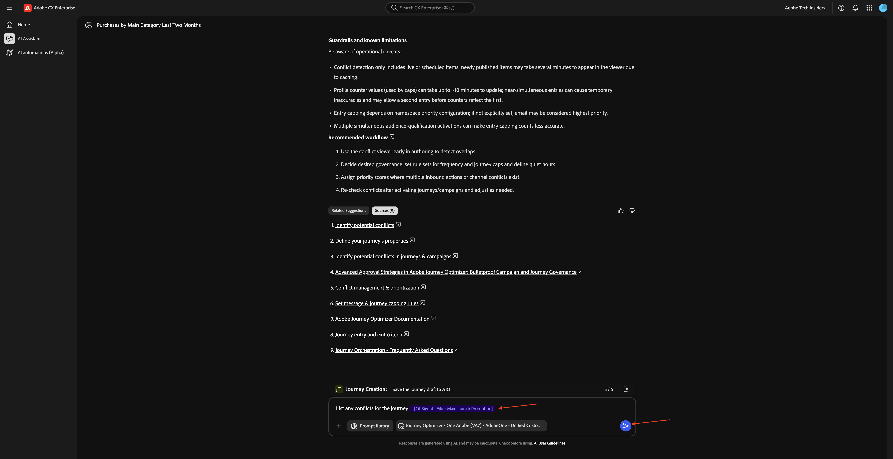

檢閱歷程衝突資訊。


向下捲動以尋找更多歷程衝突詳細資料。


## 1.1.6.13個實驗

輸入下列&#x200B;**提示**&#x200B;並按一下&#x200B;**傳送**&#x200B;按鈕。

```javascript
How are the experiments performing for the journey named 'CitiSignal - Fiber Max Launch Promotion'?
```


您應該會看到以下內容：


向下捲動，然後按一下其中一個建議。 按一下&#x200B;**傳送**。

>[!NOTE]
>
>建議是動態的，因此在每次產生回應時，您應該會看到不同的建議。 您的建議可能會與此熒幕擷圖中所顯示的建議不同。


之後，您應該會看到與所選建議相關的詳細答案。

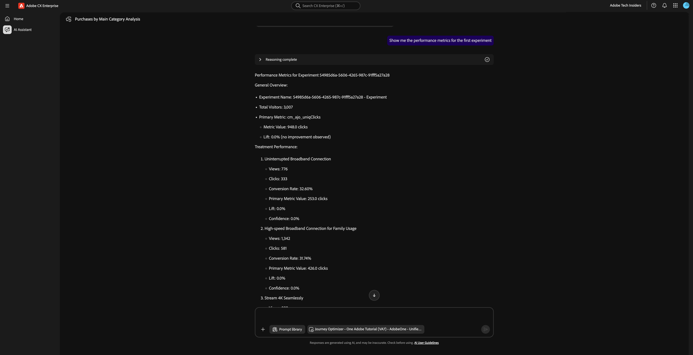

您現在已經完成了這個實驗。

## 後續步驟

返回[Agent Orchestrator](./agentorchestrator.md){target="_blank"}

[返回所有模組](./../../../overview.md){target="_blank"}
