# 1.4.1 Brand Concierge快速入門

## 影片

在這段影片中，您將獲得本練習中所有步驟的說明和示範。

## 1.4.1.1 Brand Concierge概觀

設定Brand Concierge時，您將使用的2個主要元素為：

- **代理程式撰寫器（設定層）**

  用途：用來建置和設定對話式AI體驗的主要UI平台。

  主要職責：

   - 定義及管理資料來源和知識庫
   - 設定品牌表示式（色調、樣式、護欄）
   - 設定會議預約代理程式

- **Agent Orchestrator （執行引擎）**

  用途：解釋使用者請求並執行適當代理動作的推理與協調引擎。

  主要職責：

   - 解讀自然語言使用者意圖
   - 產生並執行多步驟推理計畫
   - 選取並叫用適當的運運算元/工具
   - 強製品牌內容、法規遵循和護欄
   - 協調多代理程式工作流程
   - 彙總及撰寫來自多個資料來源的回應

- **Brand Concierge交談執行階段（服務層）**

  用途：管理聊天工作階段、內容和使用者端互動的面向客戶的對話式服務層。

  主要元件：

   - 網頁代理（使用者端）：使用網頁SDK整合的瀏覽器或行動聊天UI
   - 交談服務（後端）：管理工作階段狀態，並做為協調流程閘道

  主要職責：

   - 管理使用者工作階段和交談記錄
   - 處理使用者驗證和設定檔
   - 在使用者端和Agent Orchestrator之間路由訊息
   - 保留交談內容
   - 將行為和操作事件記錄到AEP以進行Analytics
   - 套用特定表面的組態

## 1.4.1.2 Brand Concierge執行個體設定

若要開始建立您自己的Brand Concierge執行個體，請遵循下列步驟。

移至[https://experience.adobe.com/](https://experience.adobe.com/){target="_blank"}。 開啟&#x200B;**Brand Concierge**。


您應該會看到此訊息。 按一下&#x200B;**沙箱選擇**&#x200B;功能表。

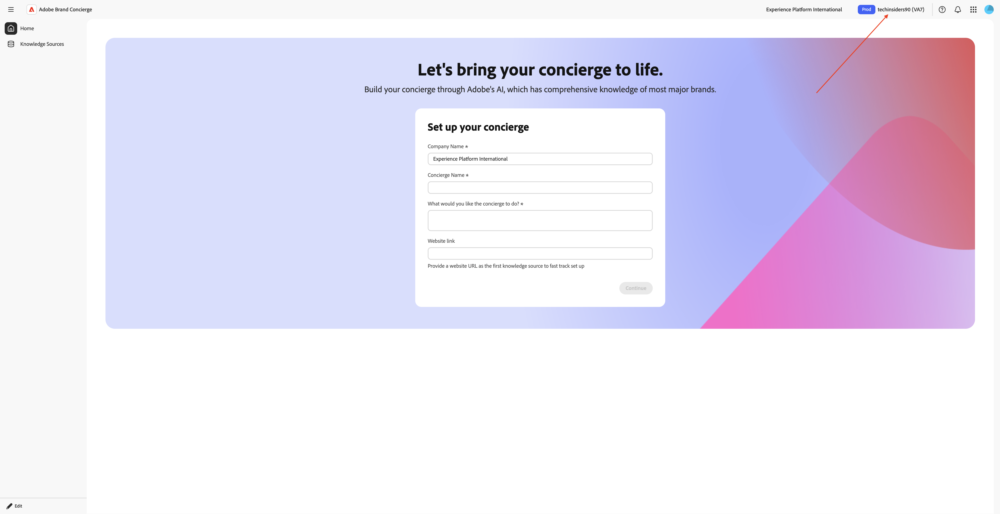

選擇已指派給您的沙箱。 該沙箱應該命名為`--aepUserLdap-- - bc`。


按一下&#x200B;**開始使用**。


對於您的Brand Concierge執行個體的名稱，請使用： `--aepUserLdap-- - CitiSignal Brand Concierge`。

在&#x200B;**下輸入下列文字，您希望服務人員做什麼？**。

```javascript
Brand Concierge should help customers find their best device, plan or entertainment deal. Brand Concierge should help users discover internet plans, entertainment deals,  and help find the best available packages. Brand Concierge should also answer questions about devices such as phones and watches.
```

按一下&#x200B;**建立**。

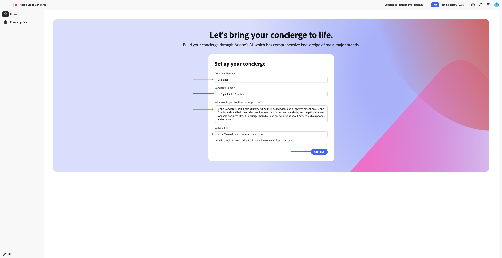

您應該會看到此訊息。 按一下&#x200B;**開始使用**&#x200B;以新增知識來源。

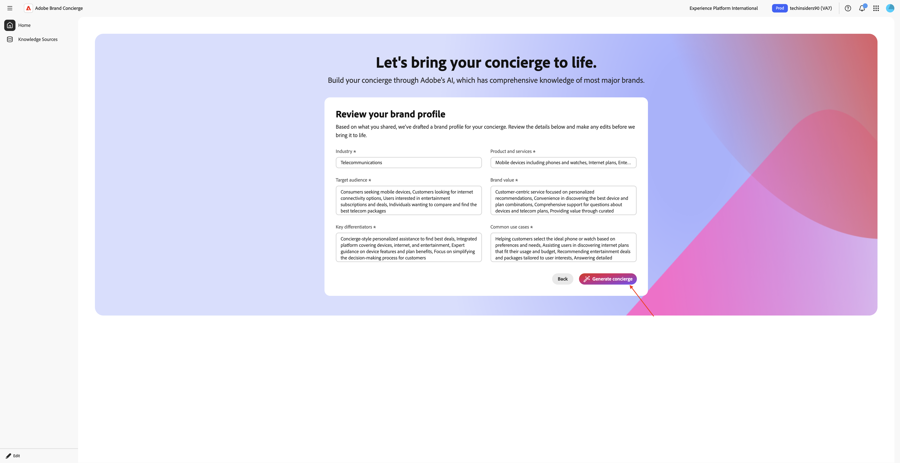

選取&#x200B;**網站連結**&#x200B;並按一下&#x200B;**繼續**。

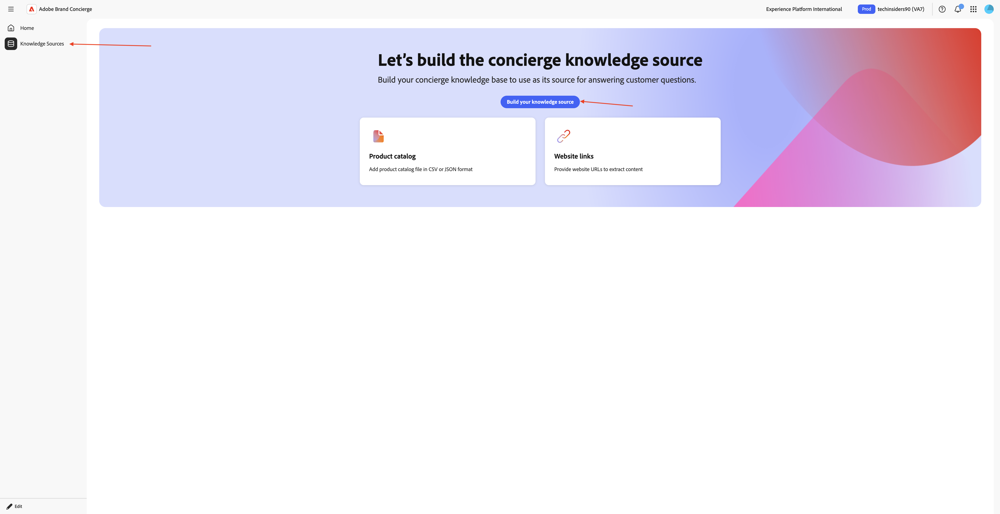

您應該會看到此訊息。 輸入`CitiSignal website`作為知識來源的名稱。

您現在需要上傳包含網站連結的csv檔案。 下載[CitiSignal網站連結CSV檔案](./assets/citisignal-website-links.csv)到您的案頭。

按一下&#x200B;**瀏覽檔案**。

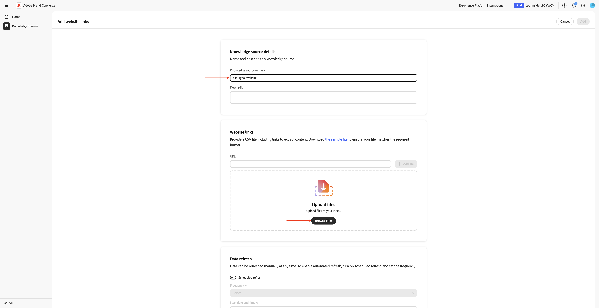

開啟檔案&#x200B;**citisignal-website-links.csv**&#x200B;並更新連結，以指向您自己的CitiSignal網站。

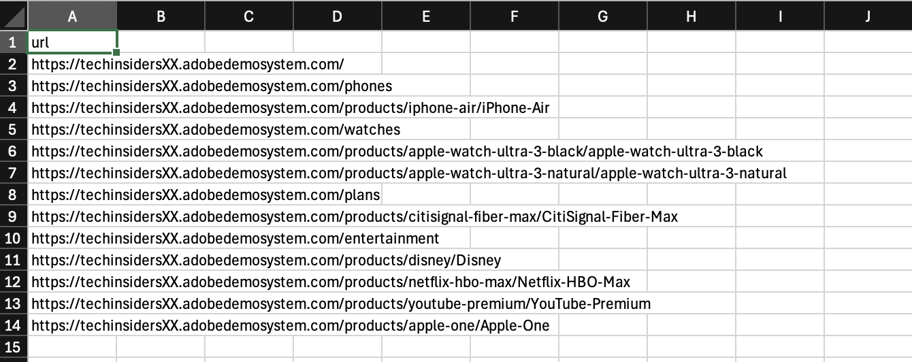

選取您剛下載並編輯的檔案&#x200B;**citisignal-website-links.csv**。 按一下&#x200B;**「開啟」**。

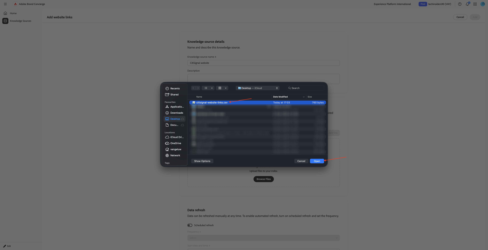

您的檔案現在已新增至此知識來源。 按一下&#x200B;**新增**。

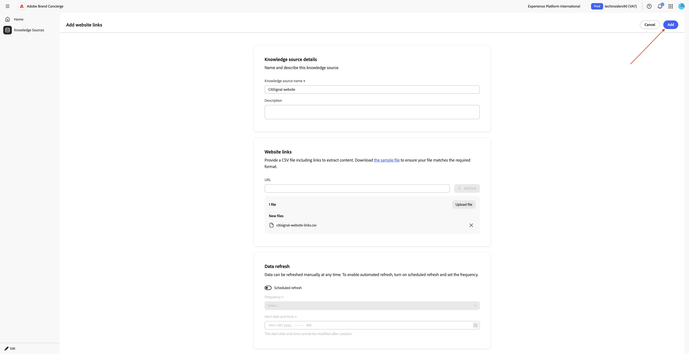

您應該會看到此訊息。 按一下&#x200B;**帶我回家**。

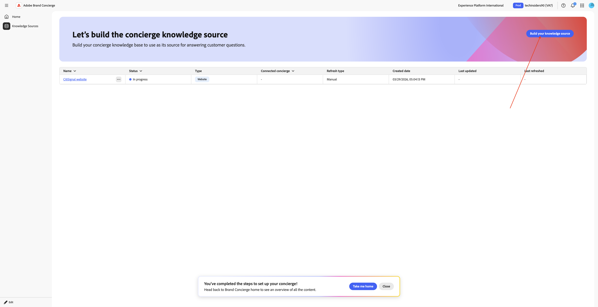

您應該會看到此訊息。 在&#x200B;**消費者產品建議**&#x200B;卡片上按一下&#x200B;**開始使用**。


您應該會看到此訊息。 使用以下文字填寫以下欄位。

**服務人員在提出建議前，應該先瞭解產品或對象哪些資訊？**

```
CitiSignal is a telecommunications company that sells devices such as phones and watches and that sells internet services such as their lead product CitiSignal Fiber Max. On top of that, CitiSignal sells entertainment services that offer premium streaming services at a discounted price. CitiSignal is targeting these 3 personas primarily: Smart Home Families, Online Gamers and Remote Professionals.
```

**禮賓員提出建議時，是否有任何商業規則或限制？**

```
Prioritize positioning the CitiSignal Fiber Max offering.
```

**服務生是否應該遵循或避免任何特定的關鍵字或片語？**

```
Competitor pricing, competitor products
```

您的更新會自動儲存。 按一下&#x200B;**箭頭**&#x200B;返回上一個畫面。

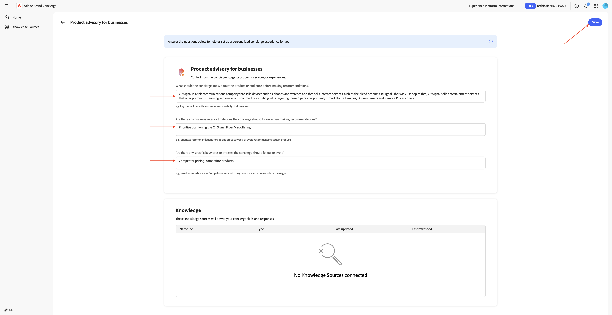

您應該會看到此訊息。 按一下&#x200B;**開始使用**&#x200B;以自訂您的品牌運算式。


您可以在&#x200B;**品牌運算式**&#x200B;頁面上自行選擇，確定已針對每個問題選取選項。


向下捲動並選取欄位&#x200B;**回應長度**&#x200B;的任何設定。

您的更新會自動儲存。


向上捲動並按一下&#x200B;**箭頭**&#x200B;以返回上一個畫面。


然後您就會回到這裡。 按一下&#x200B;**知識來源**。


按一下&#x200B;**建立您的知識來源**。


選取&#x200B;**產品目錄**&#x200B;並按一下&#x200B;**繼續**。

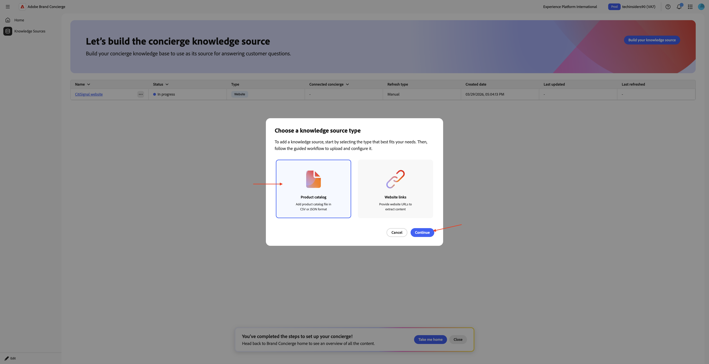

您應該會看到此訊息。 輸入`CitiSignal Products`作為知識來源的名稱。

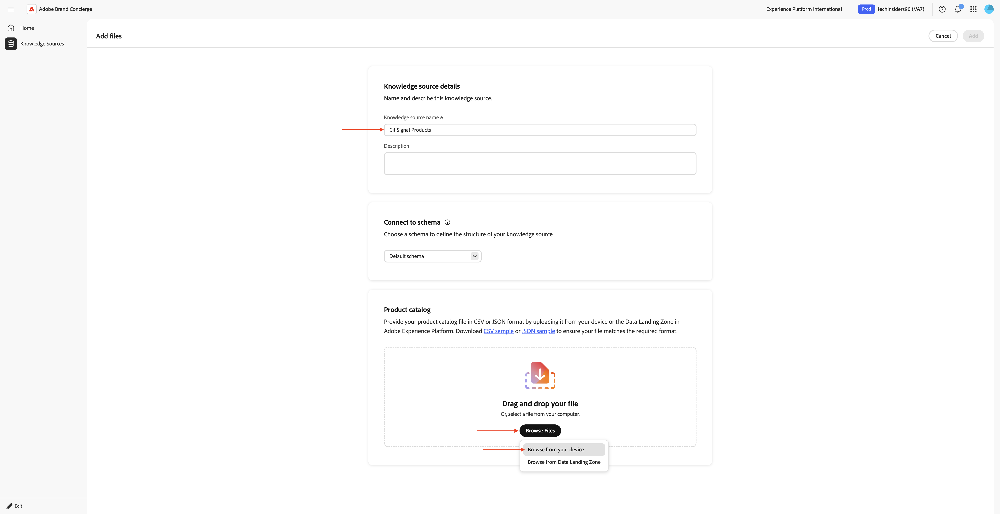

您現在需要上傳包含網站連結的csv檔案。 將[CitiSignal產品目錄](./assets/CitiSignal-catalog.json.zip)下載到您的案頭並解壓縮。


按一下&#x200B;**瀏覽檔案**，然後從您的裝置選取&#x200B;**瀏覽**。


選取檔案&#x200B;**CitiSignal-catalog.json**&#x200B;並按一下&#x200B;**開啟**。

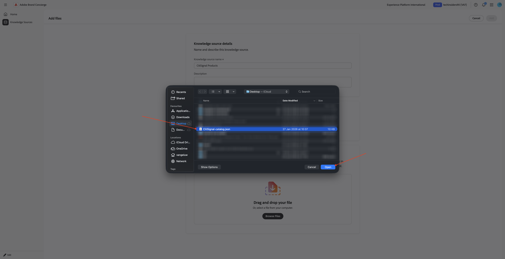

您應該會看到此訊息。 按一下&#x200B;**新增**。

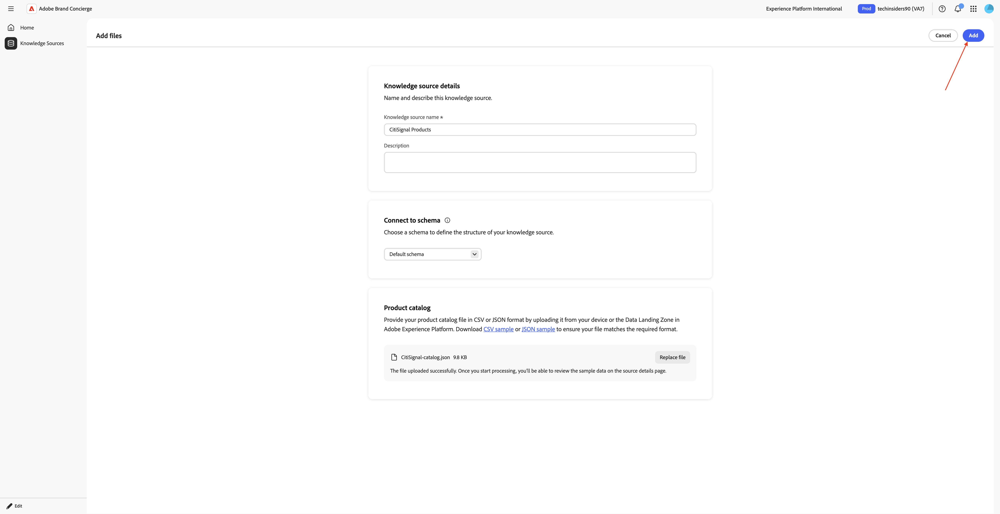

然後您就會回到這裡。

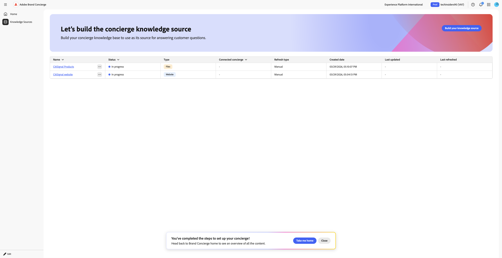

10-20分鐘後，兩個知識來源的&#x200B;**狀態**&#x200B;應該是&#x200B;**已完成**。 按一下&#x200B;**首頁**。


您應該會看到此訊息。 按一下&#x200B;**網站連結**&#x200B;卡片上的&#x200B;**+連線**。

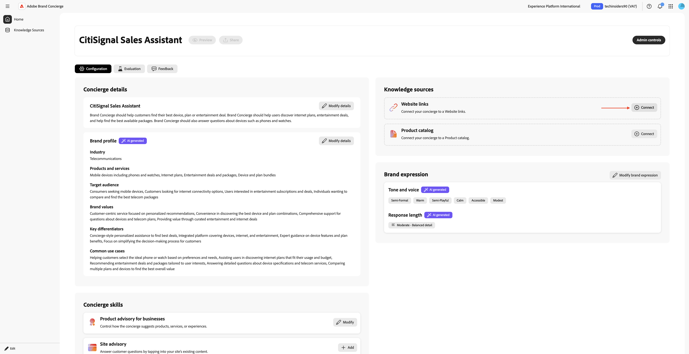

選取知識來源&#x200B;**CitiSignal網站**&#x200B;並按一下&#x200B;**儲存**。

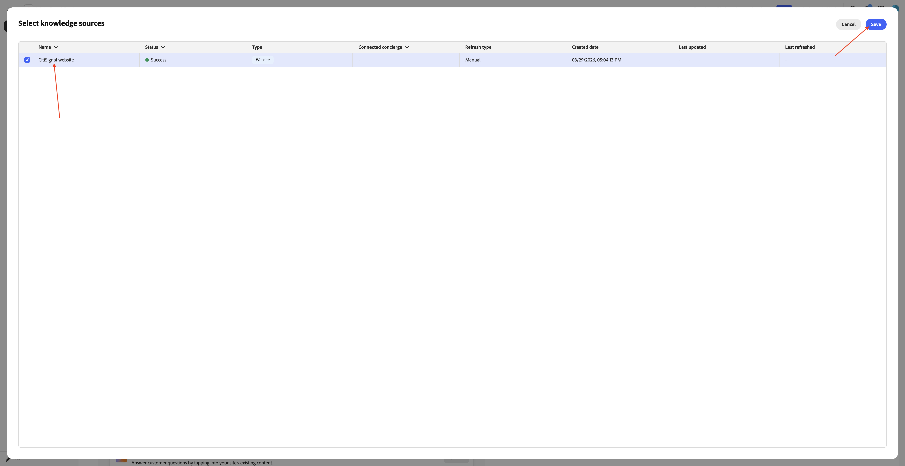

您應該會看到此訊息。 按一下&#x200B;**產品目錄**&#x200B;卡片上的&#x200B;**+連線**。

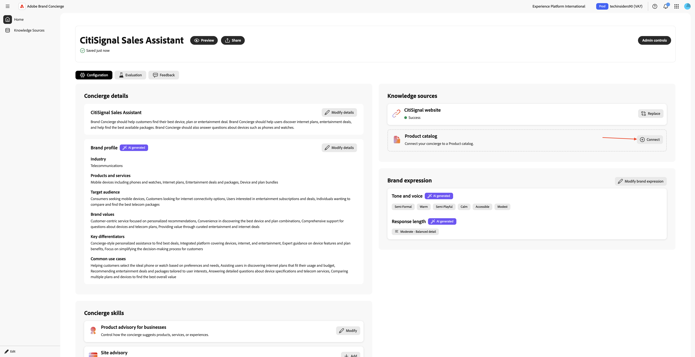

選取知識來源&#x200B;**CitiSignal產品**，然後按一下&#x200B;**儲存**。

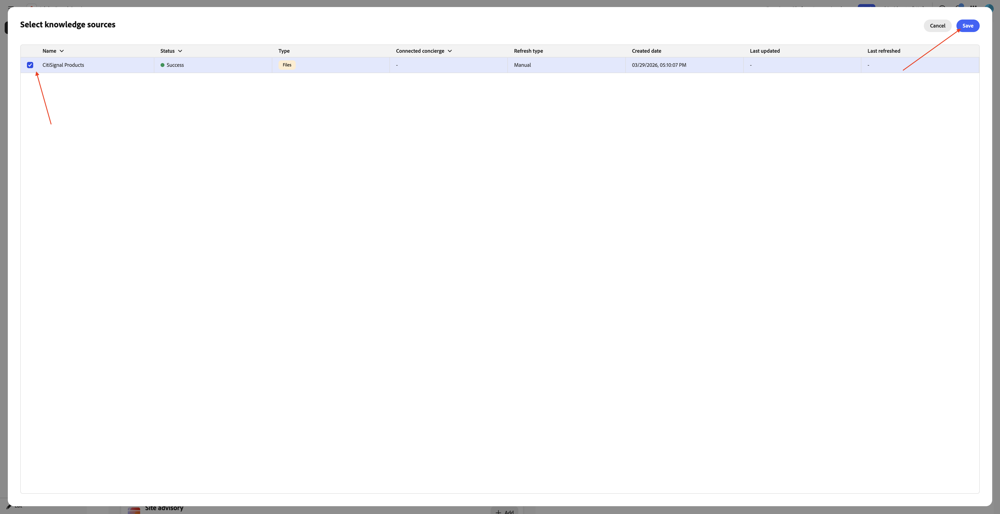

您應該會看到此訊息。 按一下&#x200B;**預覽**&#x200B;以開始與您的Brand Concierge互動。

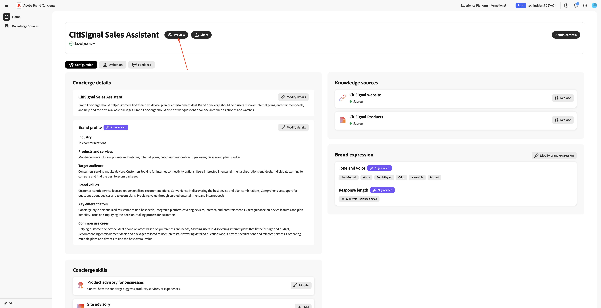

您現在可以開始詢問與所提供的知識來源相關的問題。

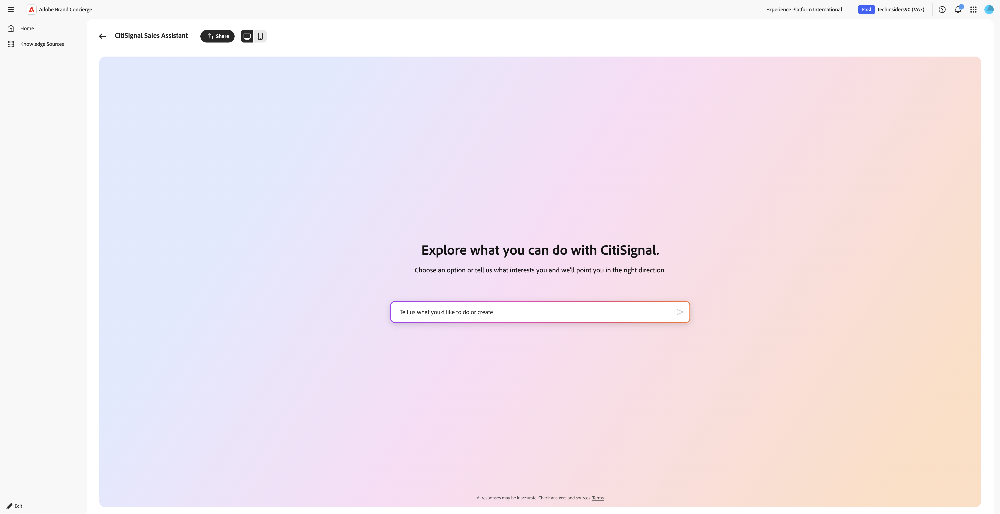

## 1.4.1.3 AEP上線步驟

Brand Concierge使用Adobe Experience Platform來儲存對話的互動資料。 Brand Concierge與Experience Platform之間的連線需要Brand Concierge設定及使用資料流。

### 資料流

移至[https://experience.adobe.com/](https://experience.adobe.com/){target="_blank"}。 開啟&#x200B;**Experience Platform**。


確定您已選取正確的沙箱，其應命名為`--aepUserLdap-- - bc`。 在左側功能表中，向下捲動並選取&#x200B;**資料串流**。

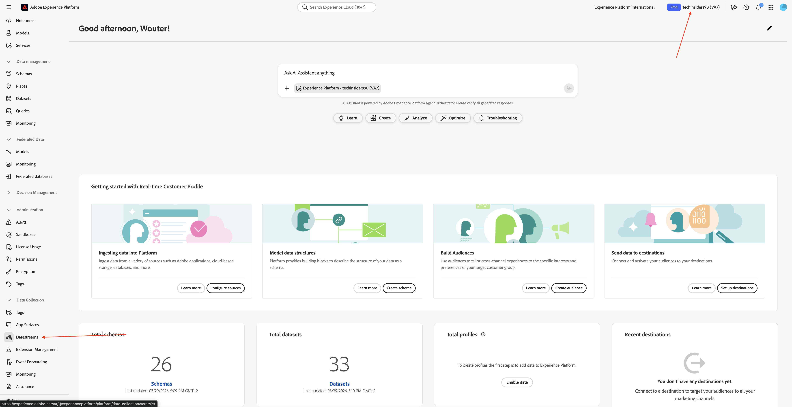

按一下&#x200B;**新增資料流**。

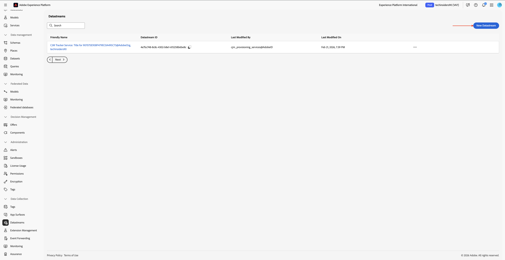

輸入&#x200B;**資料流名稱** `--aepUserLdap-- - Brand Concierge`，然後選取&#x200B;**對應結構描述** `cja-brand-concierge-sb-XXX`。

按一下&#x200B;**儲存**。

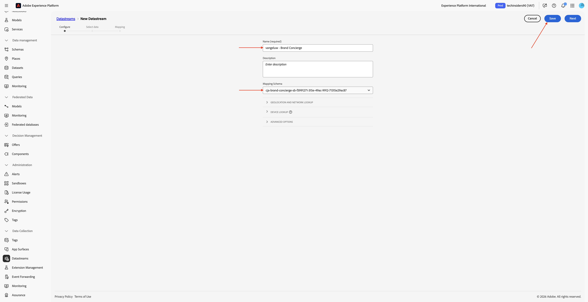

您的資料流現已設定完成。 複製資料串流名稱和資料串流ID，並將其寫入您電腦上的文字檔案中。

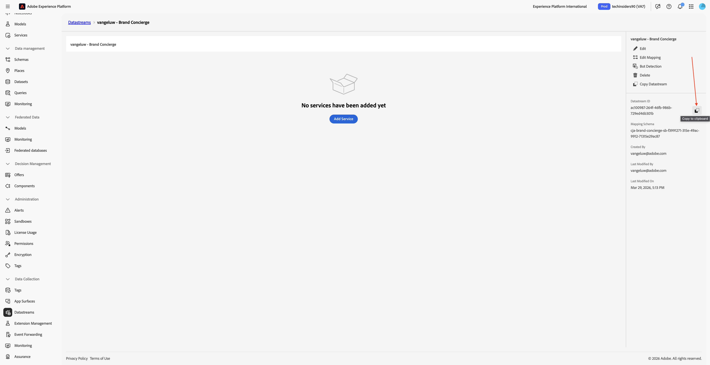

### Brand Concierge設定管理API

下一步是啟用Brand Concierge設定管理API來設定您剛才建立的資料流。 在請求處理期間，需要此屬性來解析IMS組織ID和沙箱詳細資訊。

此為目前需執行的內部Adobe步驟。 此為必要步驟，否則資料串流的設定不適用於Brand Concierge使用。

下一步：[在您的網站上實作Brand Concierge](./ex2.md){target="_blank"}

返回[Brand Concierge](./brandconcierge.md){target="_blank"}

[返回所有模組](./../../../overview.md){target="_blank"}