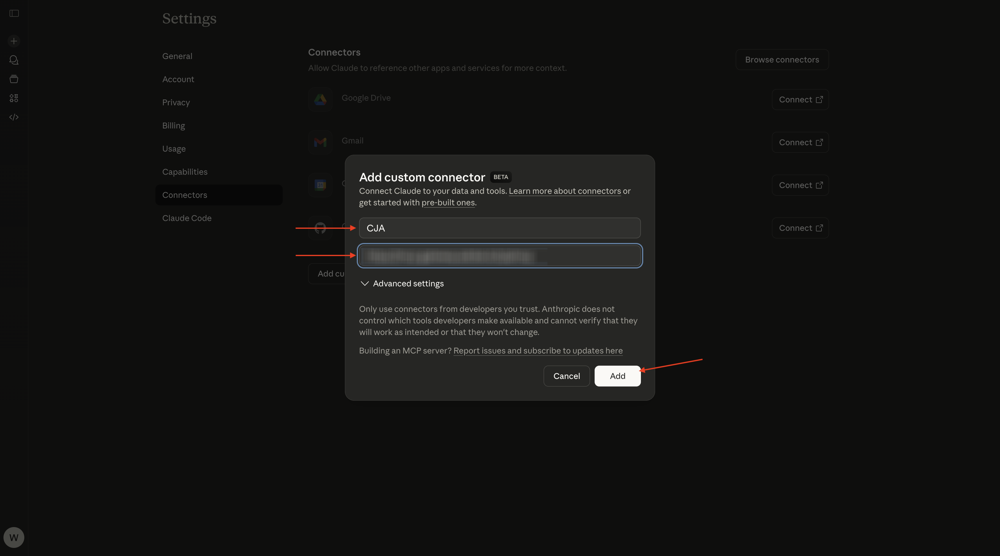
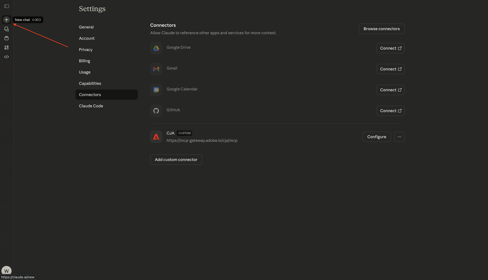
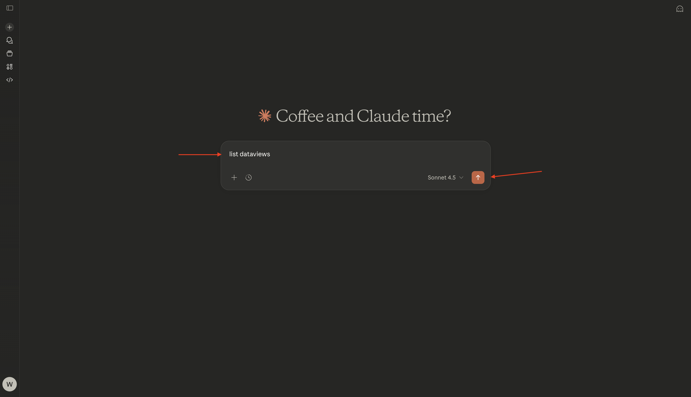
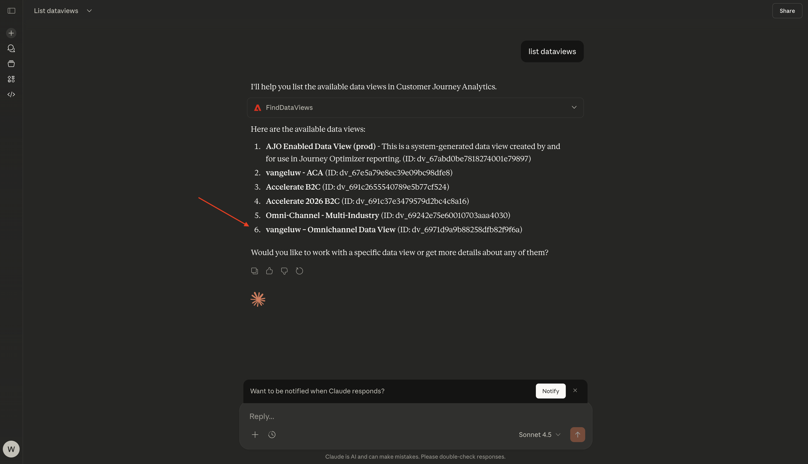
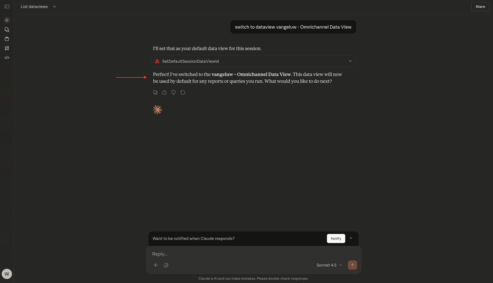
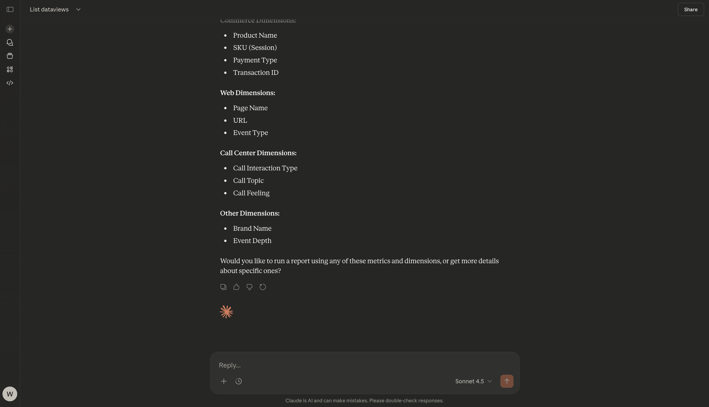
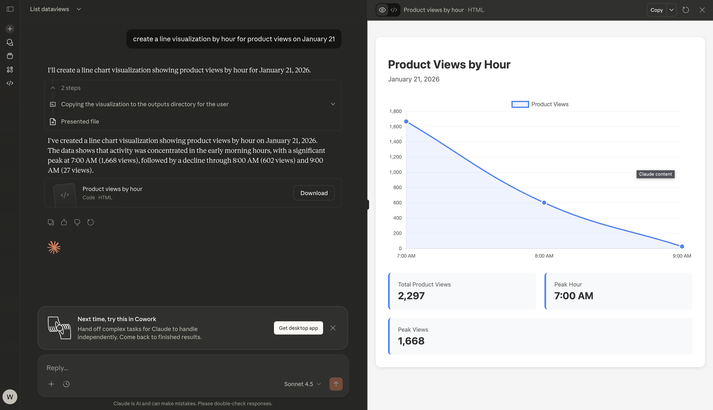
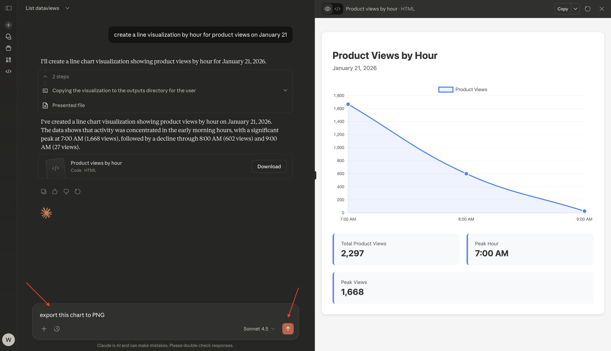
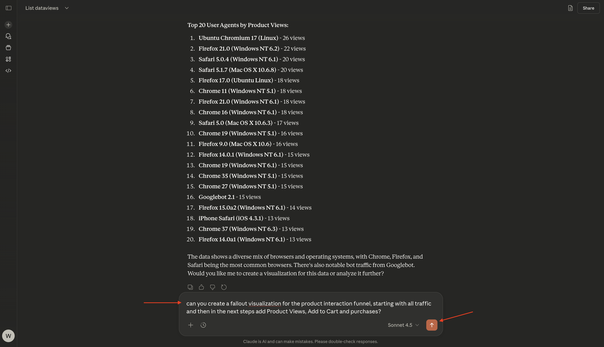

# 1.5.2 CJA和Claude.ai搭配MCP伺服器

[!BADGE Alpha]

+++Alpha詳細資料
藉由將CJA &amp; Claude.ai與MCP伺服器Alpha搭配使用，您在此確認Alpha係依「現況」提供，並無任何保證。 Adobe沒有義務維護、更正、更新、變更、修改或以其他方式支援Alpha。 建議您謹慎使用，切勿依賴這類Alpha及/或隨附資料的正確運作或效能。 Alpha視為Adobe的機密資訊。 任何「意見回饋」(有關Alpha的資訊，包括但不限於您在使用Alpha時遇到的問題或缺陷、建議、改進和建議)會在此指派給Adobe Adobe，包括所有權利、標題，以及對此等意見回饋的興趣。

+++


>[!NOTE]
>
>此關於設定及使用MCP伺服器搭配Claude.ai連線至CJA的練習與此練習[1.1 Customer Journey Analytics：使用Analysis Workspace在Adobe Experience Platform上建置儀表板](./../../../modules/reporting-insights/cja-b2c/cjab2c-1/customer-journey-analytics-build-a-dashboard.md)相關。 以下練習中使用的CJA資料檢視和連線是在該練習中設定的資料檢視和連線。 如果要複製以下結果，您應該先按照這些指示操作。

## 影片

在這段影片中，您將獲得本練習中所有步驟的說明和示範。

>[!VIDEO](https://video.tv.adobe.com/v/3479159?quality=12&learn=on)

## 1.5.1.1在Claude.ai中為CJA建立自訂應用程式

>[!NOTE]
>
>在Claude.ai中使用CJA需要下列專案：
>- 付費版本的Claude.ai
>- 使用Claude.ai網頁使用者端

移至[https://claude.ai/](https://claude.ai/){target="_blank"}並使用您的帳戶詳細資料登入。 登入後，您應該會看到此訊息。 按一下&#x200B;**+**&#x200B;圖示。


選取&#x200B;**新增聯結器**。


按一下&#x200B;**新增自訂專案**。


填寫欄位，如下所示：

- **名稱**： `CJA`
- **MCP伺服器URL**：請洽詢您的Adobe代表

按一下&#x200B;**新增**。



您應該會看到此訊息。 按一下&#x200B;**新增**。


成功驗證後，您應會看到此訊息。 按一下&#x200B;**+**&#x200B;圖示以開始新的聊天。



移至&#x200B;**+**&#x200B;移至&#x200B;**聯結器**，您應該會看到&#x200B;**CJA**&#x200B;聯結器現已啟用。


您現在已準備好開始您的資料分析。


## 1.5.1.2在CJA中設定內容

在透過Claude.ai與CJA進一步互動之前，需要設定上下文。

在本練習中，需要將內容設定為使用：

- **資料檢視**： **—aepUserLdap— 全通路資料檢視**

資料檢視設定可協助識別Claude.ai在詢問問題時應檢視的資料檢視。

輸入下列&#x200B;**提示**&#x200B;並按一下&#x200B;**傳送**&#x200B;按鈕。

```javascript
list dataviews
```



選取&#x200B;**永遠允許**。


之後，您應該會看到類似的可用資料檢視清單。



若要將其變更為需要使用的資料檢視，請輸入下列&#x200B;**提示**&#x200B;並按一下&#x200B;**傳送**&#x200B;按鈕。

```javascript
switch to dataview --aepUserLdap-- - Omnichannel Data View
```


選取&#x200B;**永遠允許**。


您應該會看到此訊息。



您的內容現在已正確設定，以便您接下來可以開始傳送特定提示。

## 1.5.1.3探索資料檢視

>[!NOTE]
>
>此處使用的資料檢視已設定為練習[建立資料檢視](./../../../modules/reporting-insights/cja-b2c/cjab2c-1/ex3.md)的一部分。

輸入下列&#x200B;**提示**&#x200B;並按一下&#x200B;**傳送**&#x200B;按鈕，以探索哪些量度和維度可供您使用。

```javascript
list the available metrics and dimensions
```


選取&#x200B;**永遠允許**&#x200B;兩次，一次用於擷取&#x200B;**量度**，另一次用於擷取&#x200B;**維度**。


您應該會看到此回應，其中包含練習[建立資料檢視](./../../../modules/reporting-insights/cja-b2c/cjab2c-1/ex3.md)中設定的量度和維度。



## 1.5.1.4自由格式表格 — 產品檢視

您現在可以開始探索資料。 首先輸入以下提示，然後按一下&#x200B;**傳送**&#x200B;以提交您的報表請求。

```javascript
how many product views happened on January 21, 2026?
```


選取&#x200B;**永遠允許**。


之後，您應該會看到如下的回應。


您現在可以新增維度來劃分回應。 輸入下列&#x200B;**提示**&#x200B;並按一下&#x200B;**傳送**&#x200B;按鈕。

```javascript
break down product views by product name
```


之後，您應該會看到如下的回應。


您現在也可以建立視覺效果。 輸入下列&#x200B;**提示**&#x200B;並按一下&#x200B;**傳送**&#x200B;按鈕。

```javascript
create a line visualization by hour for product views on January 21
```


您應該會看到此訊息。



您現在也可以下載此折線圖。 輸入下列&#x200B;**提示**&#x200B;並按一下&#x200B;**傳送**&#x200B;按鈕。

```javascript
export this chart to PNG
```



您應該會看到此訊息。 按一下&#x200B;**下載**。


接著，您可以開啟下載的PNG，並用於其他檔案。


輸入下列&#x200B;**提示**&#x200B;並按一下&#x200B;**傳送**&#x200B;按鈕。

```javascript
can you breakdown product views by user agent?
```


您應該會看到此訊息。


## 1.5.1.5流失視覺效果

輸入下列&#x200B;**提示**&#x200B;並按一下&#x200B;**傳送**&#x200B;按鈕。

```javascript
can you create a fallout visualization for the product interaction funnel, starting with all traffic and then in the next steps add Product Views, Add to Cart and purchases?
```



您應該會看到類似這樣的內容，包括Claude.ai根據Customer Journey Analytics提供的資料產生的視覺效果。


返回[Analytics與代理程式](./analyticsagents.md){target="_blank"}

[返回所有模組](./../../../overview.md){target="_blank"}