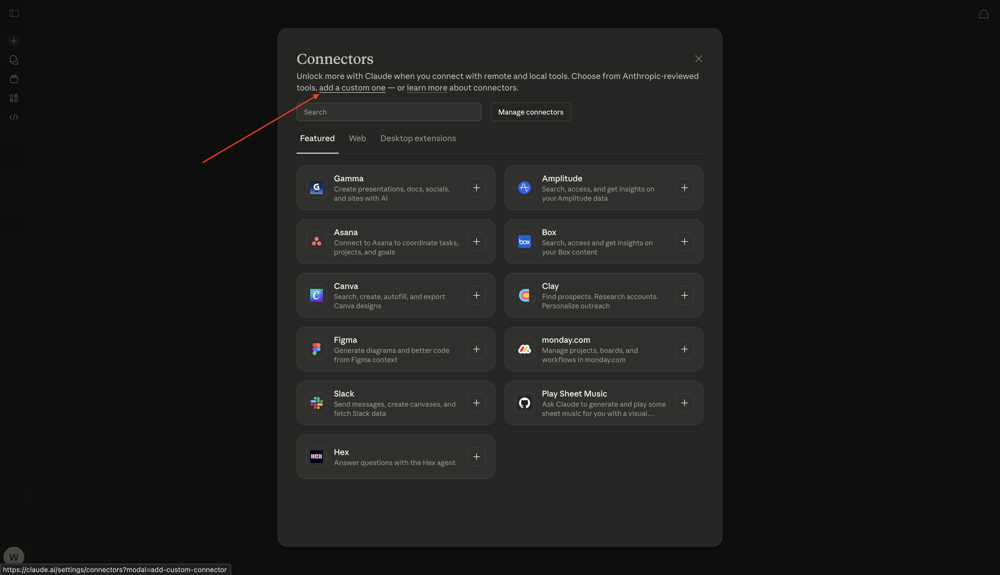
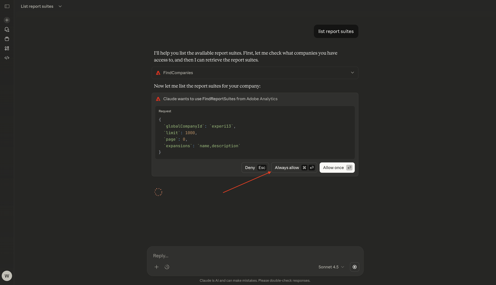
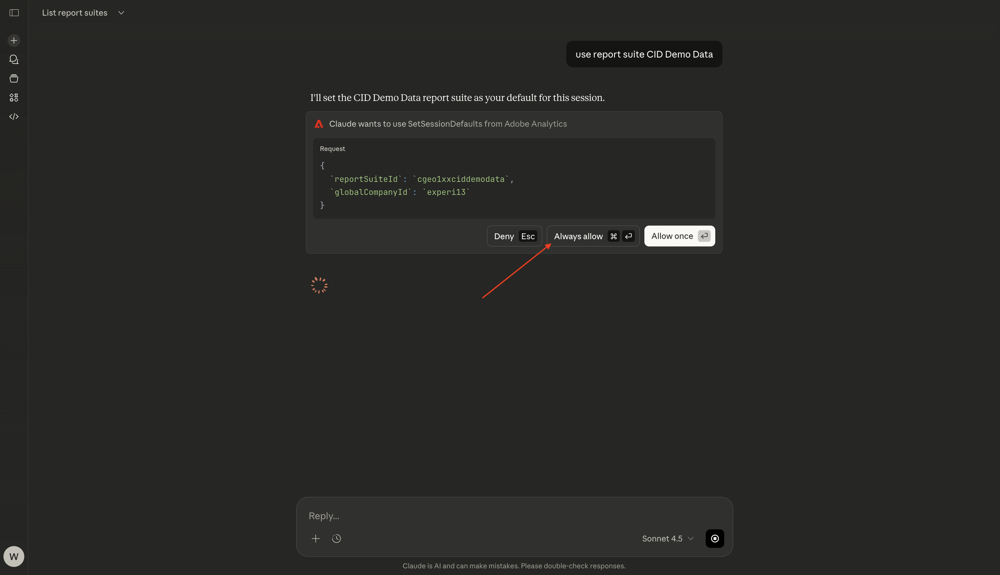
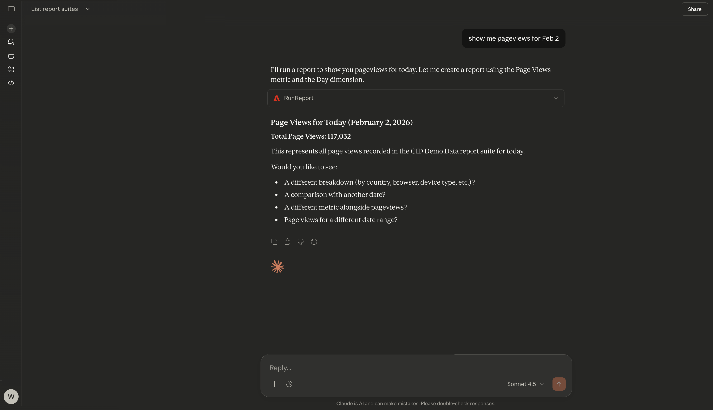
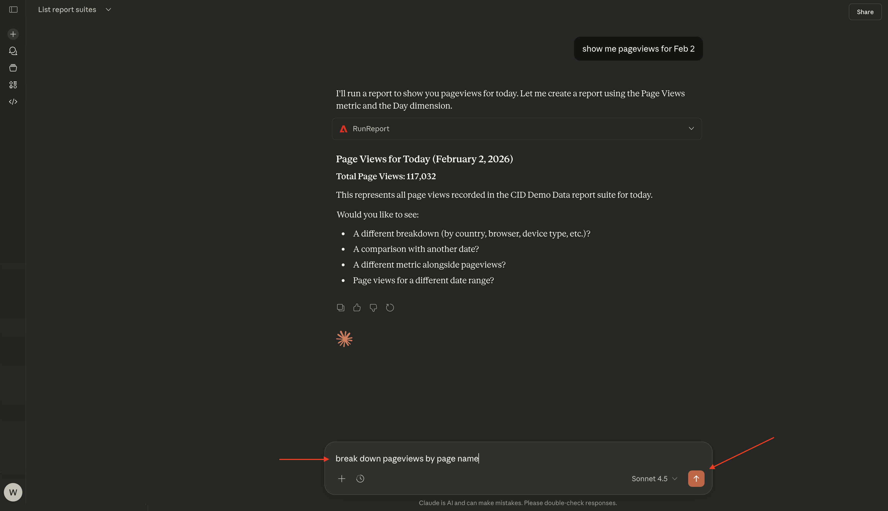
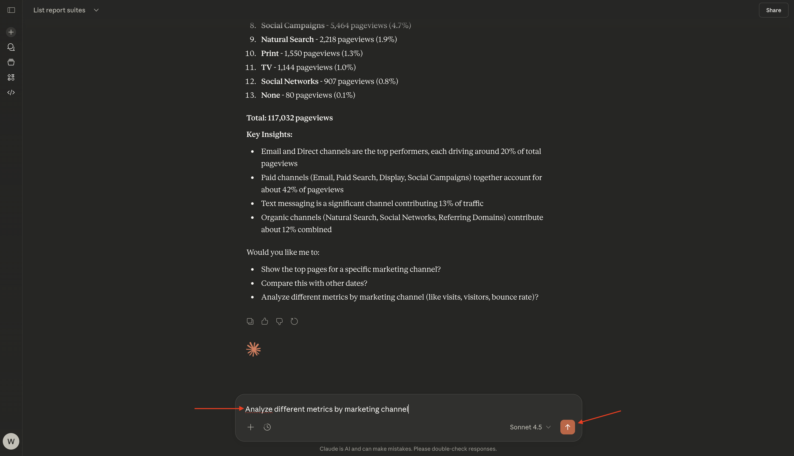
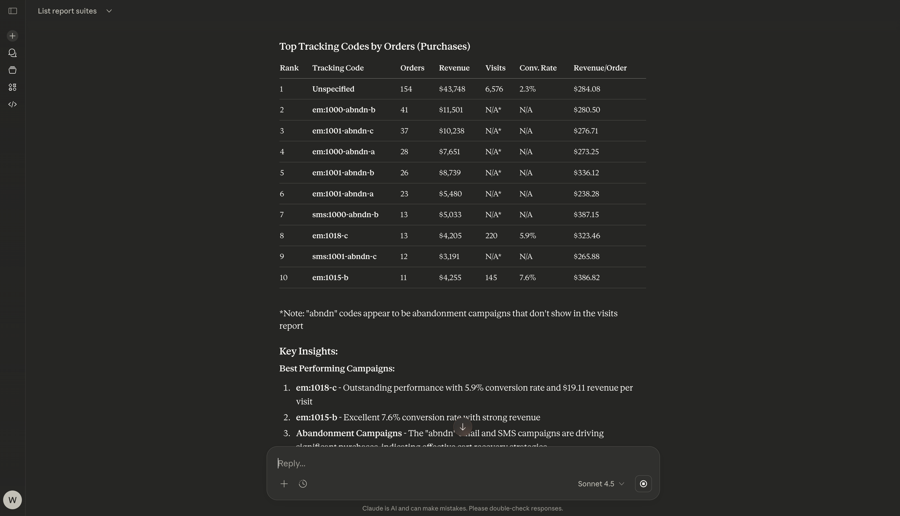
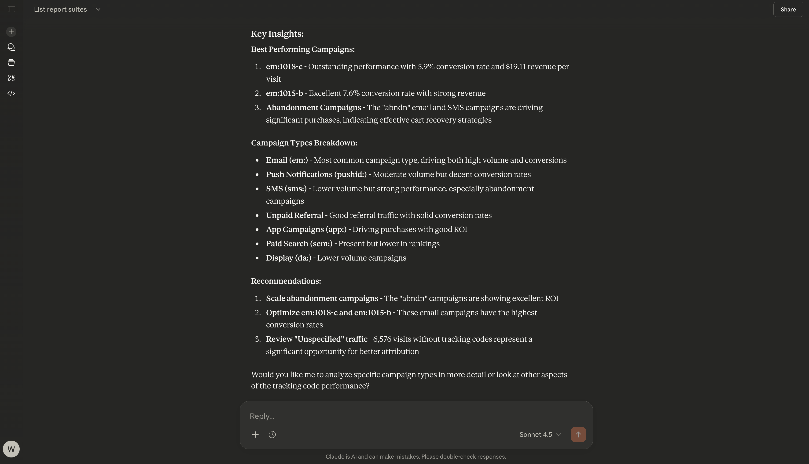

# 1.5.3 Adobe Analytics和Claude.ai搭配MCP伺服器

[!BADGE Alpha]

+++Alpha詳細資料
藉由將CJA &amp; Claude.ai與MCP伺服器Alpha搭配使用，您在此確認Alpha係依「現況」提供，並無任何保證。 Adobe沒有義務維護、更正、更新、變更、修改或以其他方式支援Alpha。 建議您謹慎使用，切勿依賴這類Alpha及/或隨附資料的正確運作或效能。 Alpha視為Adobe的機密資訊。 任何「意見回饋」(有關Alpha的資訊，包括但不限於您在使用Alpha時遇到的問題或缺陷、建議、改進和建議)會在此指派給Adobe Adobe，包括所有權利、標題，以及對此等意見回饋的興趣。

+++

## 影片

在這段影片中，您將獲得本練習中所有步驟的說明和示範。

>[!VIDEO](https://video.tv.adobe.com/v/3479562?quality=12&learn=on)

## 1.5.3.1在Claude.ai中為Adobe Analytics建立自訂應用程式

>[!NOTE]
>
>在Claude.ai中使用Adobe Analytics需要下列專案：
>- 付費版本的Claude.ai
>- 使用Claude.ai網頁使用者端

移至[https://claude.ai/](https://claude.ai/){target="_blank"}並使用您的帳戶詳細資料登入。 登入後，您應該會看到此訊息。 按一下&#x200B;**+**&#x200B;圖示。


選取&#x200B;**新增聯結器**。


按一下&#x200B;**新增自訂專案**。



填寫欄位，如下所示：

- **名稱**： `CJA`
- **MCP伺服器URL**：請洽詢您的Adobe代表

按一下&#x200B;**新增**。


您應該會看到此訊息。 按一下&#x200B;**連線**。


成功驗證後，您應會看到此訊息。 按一下&#x200B;**+**&#x200B;圖示以開始新的聊天。


移至&#x200B;**+**&#x200B;移至&#x200B;**聯結器**，您應該會看到&#x200B;**Adobe Analytics**&#x200B;聯結器現已啟用。


您現在已準備好開始您的資料分析。


## 1.5.3.2在Adobe Analytics中設定內容

在透過Claude.ai與CJA進一步互動之前，需要設定上下文。

在本練習中，需要將內容設定為使用：

- **報告套裝**： **CID — 示範資料**

報表套裝設定可協助識別Claude.ai在詢問問題時應檢視的資料。

輸入下列&#x200B;**提示**&#x200B;並按一下&#x200B;**傳送**&#x200B;按鈕。

```javascript
list report suites
```


選取&#x200B;**永遠允許**。


選取&#x200B;**永遠允許**。



您應該會看到類似這樣的內容。


輸入下列&#x200B;**提示**&#x200B;並按一下&#x200B;**傳送**&#x200B;按鈕。

```javascript
use report suite CID Demo Data
```


選取&#x200B;**永遠允許**。



您的報表套裝現已選取。


## 1.5.2.3探索報表套裝

輸入下列&#x200B;**提示**&#x200B;並按一下&#x200B;**傳送**&#x200B;按鈕，以探索哪些量度和維度可供您使用。

```javascript
list the available metrics and dimensions
```


選取&#x200B;**永遠允許**。


再次選取&#x200B;**永遠允許**。


之後，您應該會看到此回應，其中包含此報表套裝中設定的量度和維度。


## 1.5.2.4個報告

您現在可以開始探索資料。 首先輸入以下提示，然後按一下&#x200B;**傳送**&#x200B;以提交您的報表請求。

```javascript
show me pageviews for Feb 2?
```


您應該會看到類似這樣的內容。



輸入下列&#x200B;**提示**&#x200B;並按一下&#x200B;**傳送**&#x200B;按鈕。

```javascript
break down pageviews by page name
```



您應該會看到此訊息。


輸入下列&#x200B;**提示**&#x200B;並按一下&#x200B;**傳送**&#x200B;按鈕。

```javascript
give me an overview of page names, page views by marketing channel
```


您應該會看到類似這樣的內容。


向下捲動一點以檢視分析。


輸入下列&#x200B;**提示**&#x200B;並按一下&#x200B;**傳送**&#x200B;按鈕。

```javascript
Analyze different metrics by marketing channel
```



您應該會看到類似這樣的內容。


輸入下列&#x200B;**提示**&#x200B;並按一下&#x200B;**傳送**&#x200B;按鈕。

```javascript
which tracking codes drove the most visits and purchases?
```


您應該會看到類似這樣的內容，首先顯示&#x200B;**依造訪排名最前的追蹤代碼**。


您接著可以在&#x200B;**依訂單（購買）**&#x200B;排名最前的追蹤代碼報表中，檢視帶動最多購買的追蹤代碼。



接著，您會找到Claude.ai根據來自Adobe Analytics的資料所提供的其他深入分析。



您現在已經完成此練習。

返回[Analytics與代理程式](./analyticsagents.md){target="_blank"}

[返回所有模組](./../../../overview.md){target="_blank"}