# 1.6.1 AEM Agents快速入門

>[!IMPORTANT]
>
>若要完成此練習，您需要具有對使用中AEM Sites和Assets CS搭配EDS環境的存取權，並且需要為您使用的IMS組織啟用各種AEM代理程式。
>
>如果您還沒有這樣的環境，請前往練習[Adobe Experience Manager Cloud Service和Edge Delivery Services](./../../../modules/asset-mgmt/module2.1/aemcs.md){target="_blank"}。 按照這裡的指示操作，您將可以存取這樣的環境。

>[!IMPORTANT]
>
>如果您先前已使用AEM Sites和AEM CS環境設定Assets CS計畫，可能是您的AEM CS沙箱已休眠。 鑑於讓這樣的沙箱解除休眠需要10-15分鐘，最好現在開始解除休眠過程，這樣以後就不必等待了。

## 1.6.1.1探索代理程式

Adobe Experience Manager (AEM) Discovery Agent是AEM as a Cloud Service中由AI支援的工具，可讓使用者使用自然語言提示尋找、擷取及利用內容，包括Assets、內容片段和Adaptive Forms。 它可讓您瞭解意圖並在存放庫中搜尋，免除手動、大量點選或複雜的篩選需求。

為了使用&#x200B;**探索代理程式**，您將先在Adobe Experience Manager中建立一些標籤，然後使用這些標籤標籤標籤一些資產。 完成此操作後，您將能夠使用AI Assistant以簡單且商業友好的方式探索資產。

移至[https://my.cloudmanager.adobe.com](https://my.cloudmanager.adobe.com){target="_blank"}。 您應該選取的組織是`--aepImsOrgName--`。

### 透過Assets建立和使用標籤

按一下以開啟您的Cloud Manager程式，程式應該稱為`--aepUserLdap-- - CitiSignal AEM+ACCS`。


按一下環境的URL以開啟。

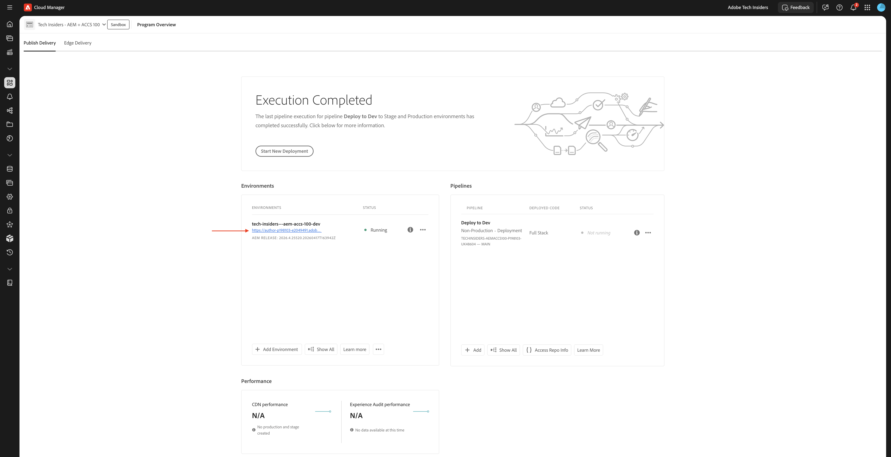

按一下&#x200B;**槌子**&#x200B;圖示。

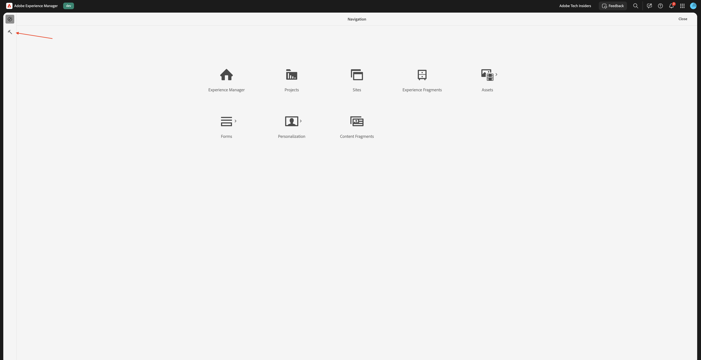

在&#x200B;**一般**&#x200B;底下，按一下&#x200B;**標籤**。

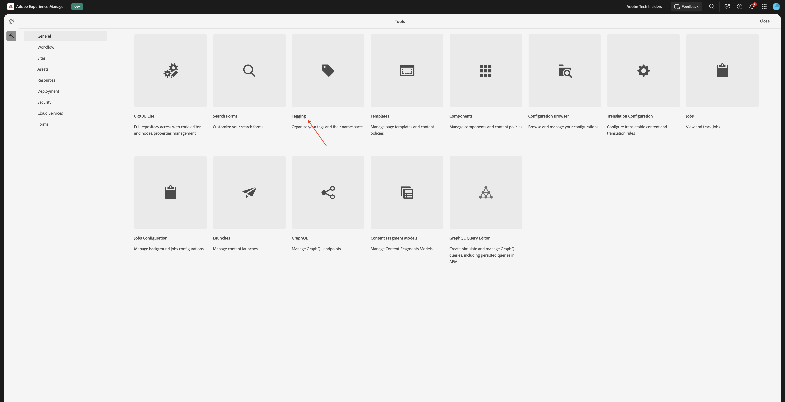

您應該會看到此訊息。 按一下&#x200B;**建立**，然後選取&#x200B;**建立名稱空間**。


在&#x200B;**標題**&#x200B;欄位中，輸入： `CitiSignal`。 按一下&#x200B;**建立**。


按一下名稱空間&#x200B;**CitiSignal**&#x200B;以深入鑽研該名稱空間。 按一下[建立]****，然後選取[建立標籤]****。


在&#x200B;**標題**&#x200B;欄位中，輸入： `Campaign`。 按一下&#x200B;**提交**。


按一下標籤&#x200B;**促銷活動**&#x200B;以選取它。 按一下[建立]****，然後選取[建立標籤]****。


在&#x200B;**標題**&#x200B;欄位中，輸入： `Winter 2026`。 按一下&#x200B;**提交**。


按一下標籤&#x200B;**促銷活動**&#x200B;以選取它。 按一下[建立]****，然後選取[建立標籤]****。


在&#x200B;**標題**&#x200B;欄位中，輸入： `Spring 2026`。 按一下&#x200B;**提交**。


您現在應該擁有此專案。


按一下&#x200B;**Adobe Experience Manager**，然後按一下&#x200B;**Assets**。


按一下&#x200B;**檔案**。

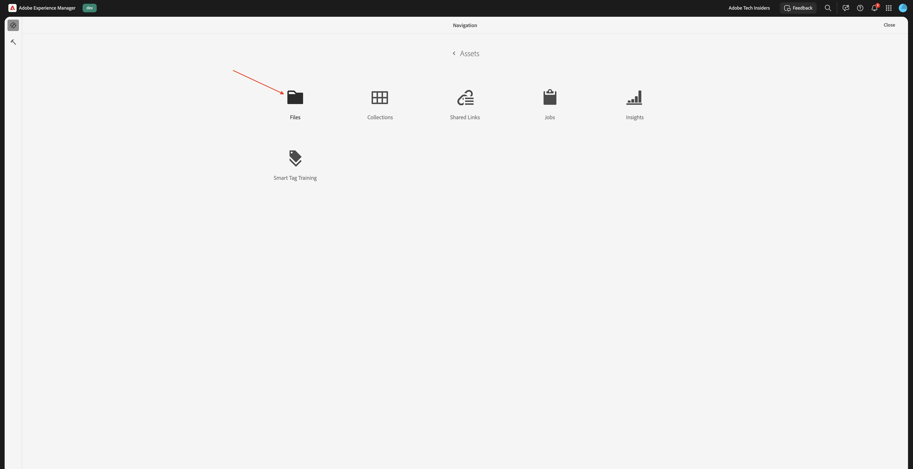

連按兩下資料夾&#x200B;**CitiSignal**&#x200B;以開啟它。


按一下&#x200B;**建立**，然後選取&#x200B;**檔案**。


下載檔案[citisignal-images-campaign.zip](./assets/citisignal-images-campaign.zip)並將其解壓縮至您的案頭。


選取「 」。 您剛下載的3個檔案，然後按一下&#x200B;**開啟**。


按一下&#x200B;**上傳**。

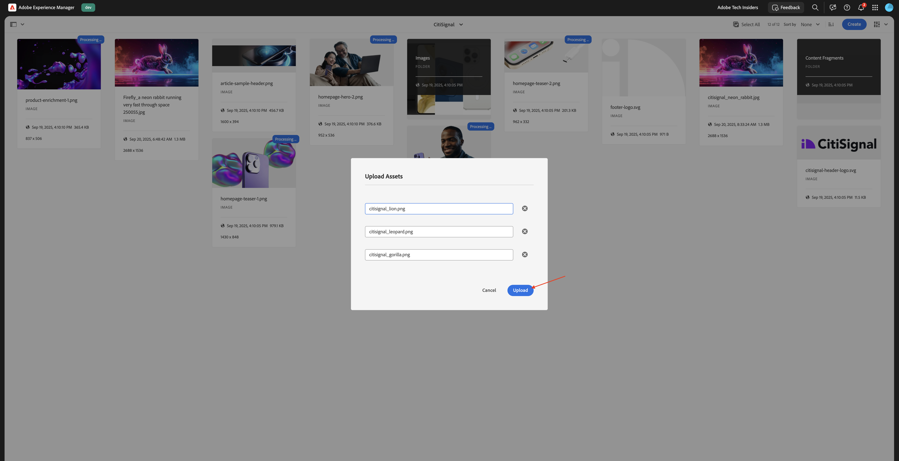

您應該會看到此訊息。


選取第一個影像，然後按一下&#x200B;**屬性**。


按一下「標籤」底下的&#x200B;**資料夾**&#x200B;圖示。


選取標籤&#x200B;**2026年春季**，然後按一下&#x200B;**選取**。 對這些影像重複該程式：

- citisignal_lion.png
- citisignal_leopard.png
- citisignal_gorilla.png
- citisignal_rabbit.png

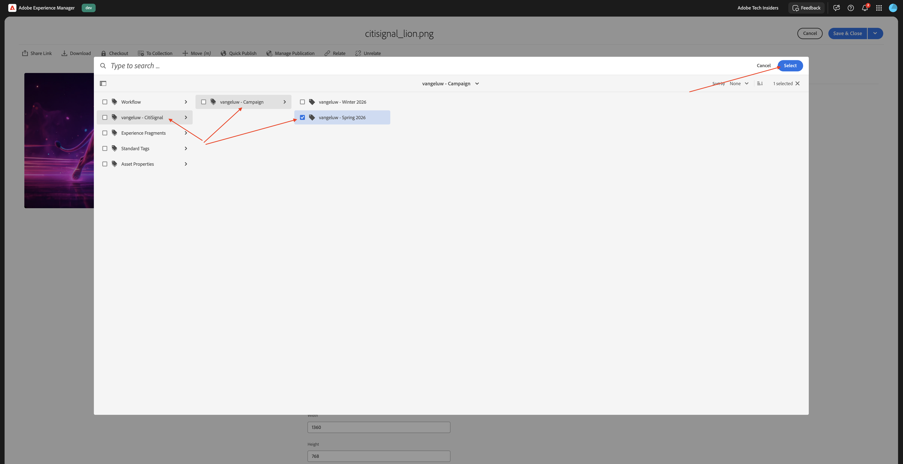

一旦您為所有影像選取該標籤，請移至&#x200B;**Experience Manager Assets**。


選取您正在使用的存放庫。


移至&#x200B;**Assets**&#x200B;並開啟資料夾&#x200B;**CitiSignal**。


開啟第一個影像。


選取&#x200B;**已核准**，然後按一下&#x200B;**儲存**。


在「**標籤**」下方，您可以看到先前選取的標籤。


重複該程式，以便核准所有4個影像。


接著，移至&#x200B;**我的工作區**，然後按一下以開啟&#x200B;**AI小幫手**。

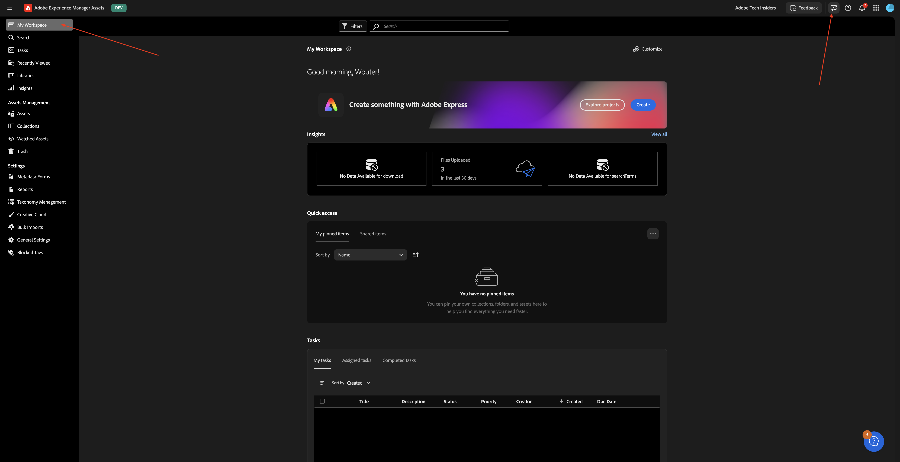

輸入以下提示並按一下&#x200B;**傳送**。

```javascript
find all assets tagged with 'Spring 2026'
```


如果您擁有多個AEM Assets CS環境的存取權，您將會看到類似畫面。 按一下您要使用之環境的建議答案，然後按一下[傳送]。****


您應該會看到類似的答案。 按一下圖示，將AI助理展開至全熒幕。


檢閱答案。


在AI助理視窗中，您可以按一下以檢視其中任何資產。


然後您將被直接帶到AEM Assets CS中檢視特定影像。


然後，您也可以檢閱任何其他可用的中繼資料。


## 1.6.1.2 Experience Production Agent

### 內容更新 — Assets

內容更新技能可輕鬆更新現有內容，包括內容片段、頁面、表單和資產。 代理程式可以執行更新、移除、取代或新增內容元素等動作，以保持體驗精確且最新。 輸入可以是自然語言說明，在搭配Jira PDF使用時，熒幕擷取畫面也可以提供輸入。

返回AI助理畫面。


輸入以下提示並按一下&#x200B;**傳送**。

`Generate multiple social media formats (Instagram 1080x1920, Facebook 1200x630, Twitter 1200x675) for the third image`


幾分鐘後，您應該會看到類似的回應。

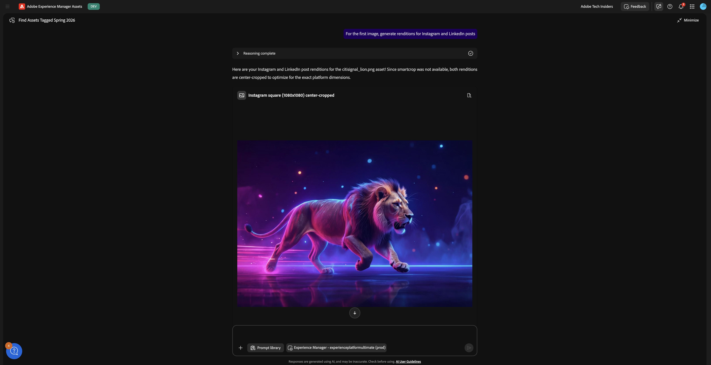

檢閱產生的影像。

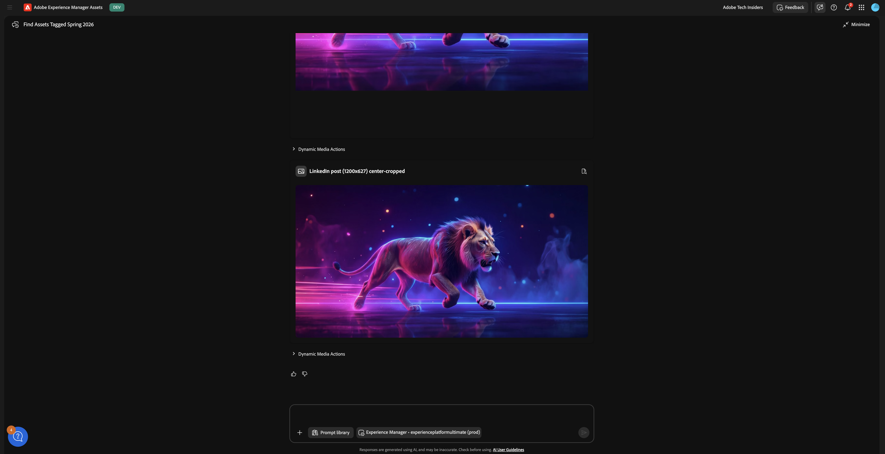

### 內容更新 — 頁面

返回您的Adobe Experience Manager作者環境，然後前往&#x200B;**網站**。

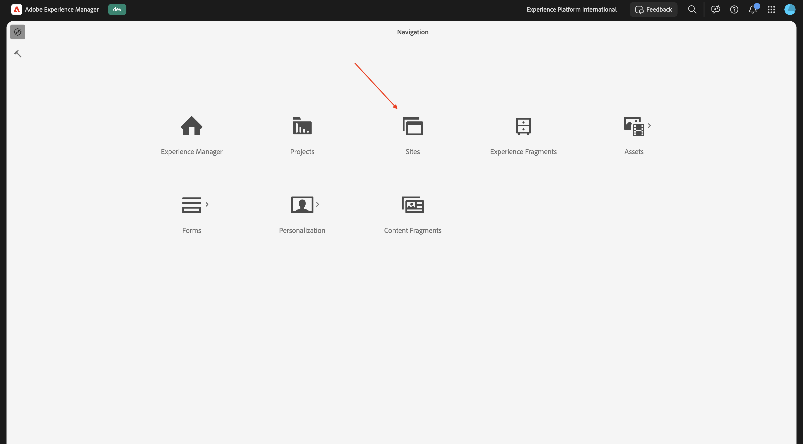

移至&#x200B;**花旗訊號**。 按一下&#x200B;**建立**&#x200B;並選取&#x200B;**頁面**。


選取&#x200B;**頁面**&#x200B;並按一下&#x200B;**下一步**。


輸入下列值：

- 標題： **Fiber Max**
- 名稱： **fiber-max**
- 頁面標題： **Fiber Max**

按一下&#x200B;**建立**。


選取&#x200B;**開啟**。


您應該會看到此訊息。


按一下空白區域以選取&#x200B;**section**&#x200B;元件。 然後，按一下右方功能表中的加號&#x200B;**+**&#x200B;圖示，並選取&#x200B;**Hero**。


您應該會看到此訊息。 按一下&#x200B;**+新增**&#x200B;以新增影像。

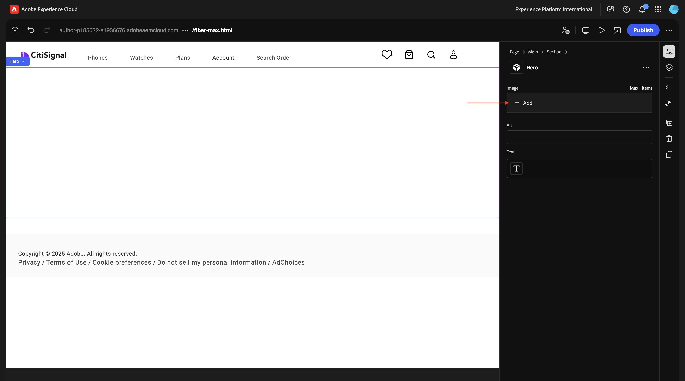

選取您的資產存放庫。 然後，開啟資料夾&#x200B;**CitiSignal**。


選擇您先前上傳的獅子影像。 按一下&#x200B;**選取**。


您應該會看到此訊息。 按一下&#x200B;**文字**&#x200B;區域以變更文字。


將此文字貼到下列位置：

```
This winter, be as fast as a lion.
```

選取&#x200B;**標題1**，然後按一下&#x200B;**完成**。


您應該會看到此訊息。 移至&#x200B;**內容樹狀結構**&#x200B;並選取區域&#x200B;**區段**。


按一下&#x200B;**+**&#x200B;圖示，然後選取&#x200B;**卡片**。


您應該會看到此訊息。 確定在&#x200B;**內容樹狀結構**&#x200B;中選取了&#x200B;**卡片**。

然後，按一下&#x200B;**+**&#x200B;按鈕4次。


您現在應該會看到這個訊息，其中&#x200B;**卡片**&#x200B;物件中有4個&#x200B;**卡片**&#x200B;物件。


選取前&#x200B;**張卡片**。 按一下&#x200B;**文字**&#x200B;區域以變更文字。


貼上下列文字。 確定第一行文字使用&#x200B;**標題1**。 按一下「**完成**」。

```
99.9% network reliability

Game, video chat and stream on multiple devices with ultra low lag.
```


選取第二張&#x200B;**卡片**。 按一下&#x200B;**文字**&#x200B;區域以變更文字。

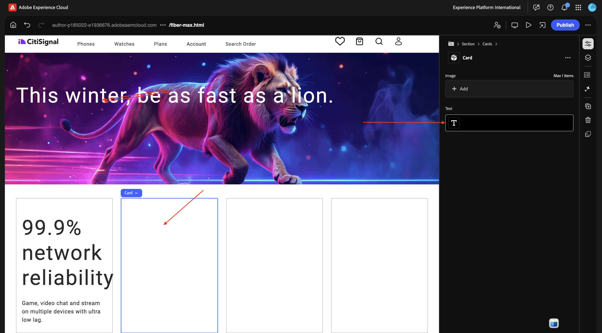

貼上下列文字。 確定第一行文字使用&#x200B;**標題1**。 按一下「**完成**」。

```
3-year

price lock guarantee

For new and existing Fiber Max customers on all internet plans.

No hidden fees.
```


選取第三張&#x200B;**卡片**。 按一下&#x200B;**文字**&#x200B;區域以變更文字。


貼上下列文字。 確定第一行文字使用&#x200B;**標題1**。 按一下「**完成**」。

```
More ways to save

Save over 45% on the best entertainment with CitiSignal
```


選取第四張&#x200B;**卡片**。 按一下&#x200B;**文字**&#x200B;區域以變更文字。


貼上下列文字。 確定第一行文字使用&#x200B;**標題1**。 按一下「**完成**」。

```
Get Fiber Max now!

Fill out the form here to get started.
```


您現在應該擁有此專案。 按一下&#x200B;**發佈**。


再按一下&#x200B;**發佈**。


按一下&#x200B;**開啟頁面**。


複製您下次需要的頁面URL。

URL應類似於： `https://author-pXXXXXX-eXXXXXXX.adobeaemcloud.com/content/CitiSignal/fiber-max.html`。


移至[https://experience.adobe.com/#/experiencemanager/](https://experience.adobe.com/#/experiencemanager/)。 按一下以開啟&#x200B;**AI助理**。


貼上下列提示並按一下&#x200B;**傳送**。 以您在上一步中複製的URL取代此提示中的XXX。

```
On the page XXX, please make the following changes:

- change the word 'winter' to 'spring'
- change the word 'lion' to 'leopard'
- change the image in the hero block to use the image 'citisignal_leopard.png'
- change the text '99.9% network reliability' to '99.999% network reliability'
```


1-2分鐘後，您應該會看到此訊息。 輸入提示`generate`並按一下&#x200B;**傳送**。


幾分鐘後，您應該會看到類似這樣的確認，表示已執行變更。 按一下&#x200B;**預覽更新的頁面**。


您現在會獲得已完成變更的視覺化確認。 此預覽頁面僅供參考，您無法從此頁面執行動作。


若要執行動作，請按一下[在AEM中編輯] ****。


在Universal Editor中，您現在可以看到所有變更的詳細資料，並可變更任何專案。 檢閱完頁面後，請按一下&#x200B;**發佈**。


再按一下&#x200B;**發佈**。 您所做的變更尚未發佈至生產環境。 相反地，它已發佈在AEM中的&#x200B;**啟動**&#x200B;下。

啟動可讓您有效率地開發未來版本的內容。 Launch的建立可讓您在維護目前頁面的同時，進行變更以準備未來發佈。 這表示您同時有效編輯兩個版本：目前發佈的頁面，以及將來同時發佈的這些頁面版本。 到了那一天後，您就可以取代原始頁面並發佈新版本。


若要&#x200B;**升級**&#x200B;您擱置的變更以供未來版本使用，請返回AEM。 按一下頁面頂端的&#x200B;**Adobe Experience Manager**，按一下&#x200B;**槌子**&#x200B;圖示，然後選取&#x200B;**啟動**。


您現在應該會看到擱置中的&#x200B;**啟動**。 核取擱置中的&#x200B;**啟動**&#x200B;前面的核取方塊。


按一下&#x200B;**升級**。


選取&#x200B;**提升完整啟動項**&#x200B;並按一下&#x200B;**下一步**。


按一下&#x200B;**升級**。


您現在應該會看到此訊息。 您的變更目前正在生產中。


重新整理您的頁面，您現在應該會在已發佈的頁面上看到所有變更。


或者，您也可以在AI小幫手中輸入提示`accept`，而不進行手動推進程式。


之後，您應該會收到變更已發佈的確認。


### 內容更新 — 建立表單

在使用Edge Delivery Services[的模組](./../../asset-mgmt/module1.3/aemforms.md){target="_blank"}Adobe Experience Manager Forms中，您可以找到以手動方式建立表單的相關步驟。

表單建立技能現在可讓使用者透過自然語言提示建立最適化表單，而不依賴開發或IT團隊。 此功能可加快表單開發，同時維持品牌一致性，讓業務使用者無須深入瞭解技術產品即可建立表單。

移至[https://experience.adobe.com/#/ai-assistant/chat](https://experience.adobe.com/#/ai-assistant/chat)。


輸入以下提示並按一下&#x200B;**傳送**。

```
Create a new adaptive form using Edge Delivery Services and the existing CitiSignal site, with the following details:
- Form name: "citisignal-fiber-max-interest-2"
- Form fields: 4 text input fields are needed, for "first-name", "last-name", "email" and "city"
- When the form is submitted, send the submission to a spreadsheet, with this URL: https://docs.google.com/spreadsheets/d/1WwKrcM8mZ2d_W3sMheUAw3nFhP_OFk05TsqxhHkudfQ/edit?usp=sharing.
```

## 後續步驟

移至[1.6.2 AEM MCP伺服器與游標](./ex2.md){target="_blank"}

返回[AEM與代理程式](./aemagents.md){target="_blank"}

[返回所有模組](./../../../overview.md){target="_blank"}
