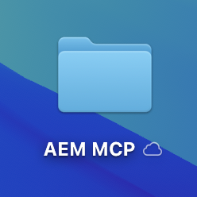
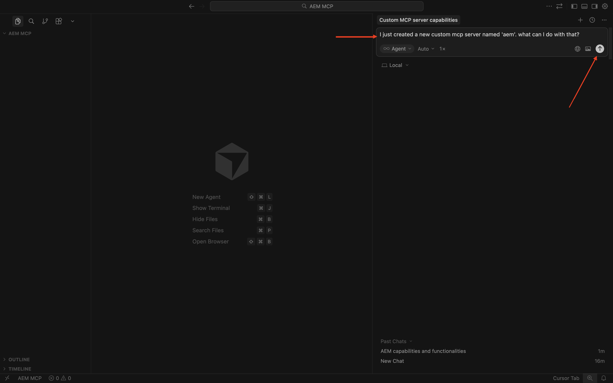
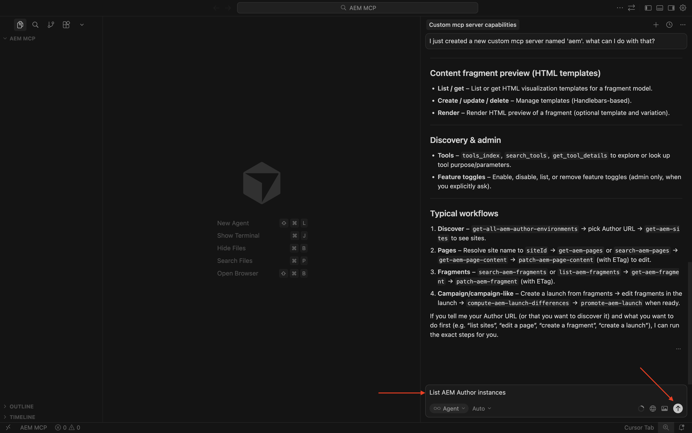
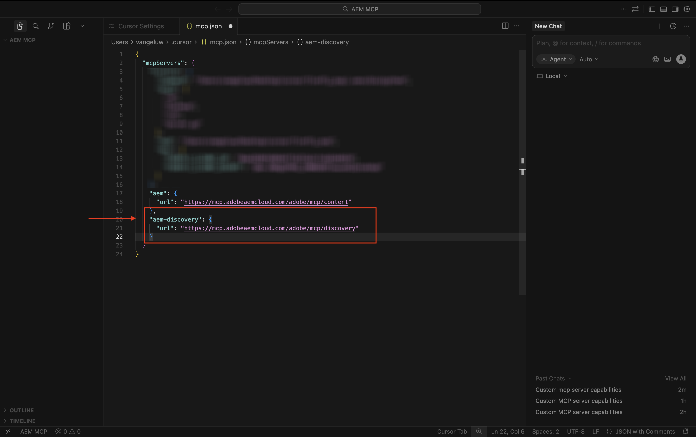
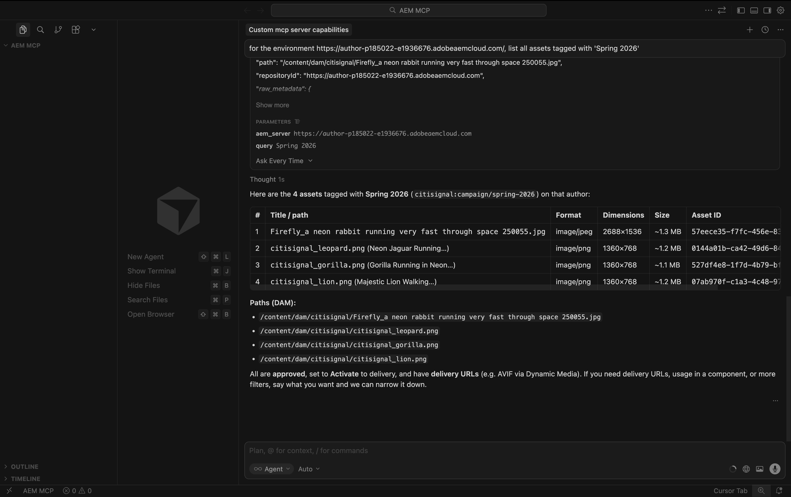

# 1.6.2 AEM MCP伺服器及游標

>[!IMPORTANT]
>
>若要完成此練習，您需要具有對使用中AEM Sites和Assets CS搭配EDS環境的存取權，並且需要為您使用的IMS組織啟用各種AEM代理程式。
>
>如果您還沒有這樣的環境，請前往練習[Adobe Experience Manager Cloud Service和Edge Delivery Services](./../../../modules/asset-mgmt/module2.1/aemcs.md){target="_blank"}。 按照這裡的指示操作，您將可以存取這樣的環境。

>[!IMPORTANT]
>
>如果您先前已使用AEM Sites和AEM CS環境設定Assets CS計畫，可能是您的AEM CS沙箱已休眠。 鑑於讓這樣的沙箱解除休眠需要10-15分鐘，最好現在開始解除休眠過程，這樣以後就不必等待了。


以下是所有可用的AEM MCP伺服器：

- https://mcp.adobeaemcloud.com/adobe/mcp/content
- https://mcp.adobeaemcloud.com/adobe/mcp/content-readonly （唯讀內容作業）
- https://mcp.adobeaemcloud.com/adobe/mcp/content-updater （公開Experience Production Agent的對應技能）
- https://mcp.adobeaemcloud.com/adobe/mcp/experience-governance （公開取得及檢查頁面品牌原則的技能）
- https://mcp.adobeaemcloud.com/adobe/mcp/discovery (公開在AEM環境中探索內容的技能)

在本練習中，您會找到如何使用這些特定MCP伺服器的指示：

- https://mcp.adobeaemcloud.com/adobe/mcp/content
- https://mcp.adobeaemcloud.com/adobe/mcp/discovery

您可以使用以下指示為其他可用的AEM MCP伺服器設定類似的MCP伺服器，因為程式非常類似。

## 1.6.2.1 Experience Production Agent游標MCP伺服器安裝程式

在您的案頭上建立新的空白資料夾。



開啟游標。 按一下&#x200B;**開啟專案**。


選取您之前建立的資料夾，然後按一下[開啟]。****


按一下&#x200B;**是，我信任作者**。


您應該會看到此訊息。 使用鍵盤快速鍵`Cmd + Shift + J`開啟[游標]設定。 您應該會看到此訊息。 移至&#x200B;**Tools&amp; MCP**。


按一下&#x200B;**+新MCP伺服器**。


將下列MCP伺服器新增至檔案&#x200B;**mcp.json**。 可能有其他MCP伺服器已在此檔案中指定 — 請勿移除這些伺服器，而只新增下列新行。 儲存您的變更。

```json
"aem": {
    "url": "https://mcp.adobeaemcloud.com/adobe/mcp/content"
    }
```


切換回索引標籤&#x200B;**資料指標設定**。 您現在應該會在MCP伺服器清單中看到名為&#x200B;**aem**&#x200B;的工具。 按一下&#x200B;**連線**&#x200B;以使用您的Adobe帳戶進行驗證。


按一下&#x200B;**開啟**，以防您看到此訊息。 接著，您應該使用瀏覽器進行驗證。


在成功驗證後，您應該會看到類似這樣的內容。


關閉&#x200B;**游標設定**&#x200B;和&#x200B;**mcp.json**&#x200B;索引標籤。 在聊天中貼上以下提示，然後按一下&#x200B;**傳送**。

```
I just created a new custom mcp server named 'aem'. what can I do with that?
```



按一下&#x200B;**執行**。


您應該會看到類似的回應。


如您所見，相較於前一個練習中使用AI Assistant所可能達到的功能，類似的功能會透過「游標」中的MCP伺服器顯示。

輸入以下提示並按一下&#x200B;**傳送**。

```javascript
List AEM Author instances
```



您應該會看到類似這樣的內容。 搜尋您要使用的環境，然後輸入以下提示並按一下[傳送]。****

```javascript
use environment number X
```


您應該會看到此訊息。


貼上下列提示並按一下&#x200B;**傳送**。 以您在上一個練習中複製的URL取代此提示中的XXX。

```
On the page https://author-p185022-e1936676.adobeaemcloud.com/content/CitiSignal/fiber-max.html, please make the following changes:

- change the word 'winter' to 'summer'
- change the text 'be as fast as a leopard' to 'dominate your internet like a gorilla'
- change the image in the hero block to use the image 'citisignal_gorilla.png'
- change the text '99.9% network reliability' to '99.998% network reliability'
```


1-2分鐘後，您應會收到類似的回應。 複製URL並在瀏覽器中開啟頁面。


您應該會看到此訊息。


輸入以下提示並按一下&#x200B;**傳送**。

```javascript
promote the changes by creating a new launch and promoting it
```


1-2分鐘後，變更已升級。


您現在可以在網站上看到即時變更。


歡迎探索AEM MCP伺服器的其他功能。

## 1.6.2.2探索代理程式游標MCP伺服器安裝程式

使用鍵盤快速鍵`Cmd + Shift + J`開啟[游標]設定。 您應該會看到此訊息。 移至&#x200B;**Tools&amp; MCP**。 按一下&#x200B;**+新MCP伺服器**。


將下列MCP伺服器新增至檔案&#x200B;**mcp.json**。 可能有其他MCP伺服器已在此檔案中指定 — 請勿移除這些伺服器，而只新增下列新行。 儲存您的變更。

```
,
"aem-discovery": {
    "url": "https://mcp.adobeaemcloud.com/adobe/mcp/discovery"
}
```



切換回索引標籤&#x200B;**資料指標設定**。 您現在應該會在MCP伺服器清單中看到名為&#x200B;**aem**&#x200B;的工具。 按一下&#x200B;**連線**&#x200B;以使用您的Adobe帳戶進行驗證。


驗證後，您應該會看到此訊息。


關閉&#x200B;**游標設定**&#x200B;和&#x200B;**mcp.json**&#x200B;索引標籤。 在聊天中貼上以下提示，然後按一下&#x200B;**傳送**。

```
I just created a new custom mcp server named 'aem-discovery'. what can I do with that?
```


```
for the environment https://author-pXXXXXX-eXXXXXXX.adobeaemcloud.com/, list all assets tagged with 'Spring 2026'
```


您應該會看到類似這樣的內容。



## 後續步驟

移至[1.6.3使用ChatGPT和MCP伺服器縮放內容片段](./ex3.md){target="_blank"}

返回[AEM與代理程式](./aemagents.md){target="_blank"}

[返回所有模組](./../../../overview.md){target="_blank"}
