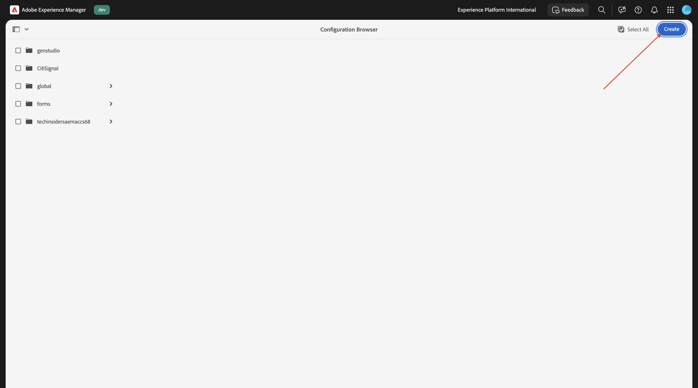
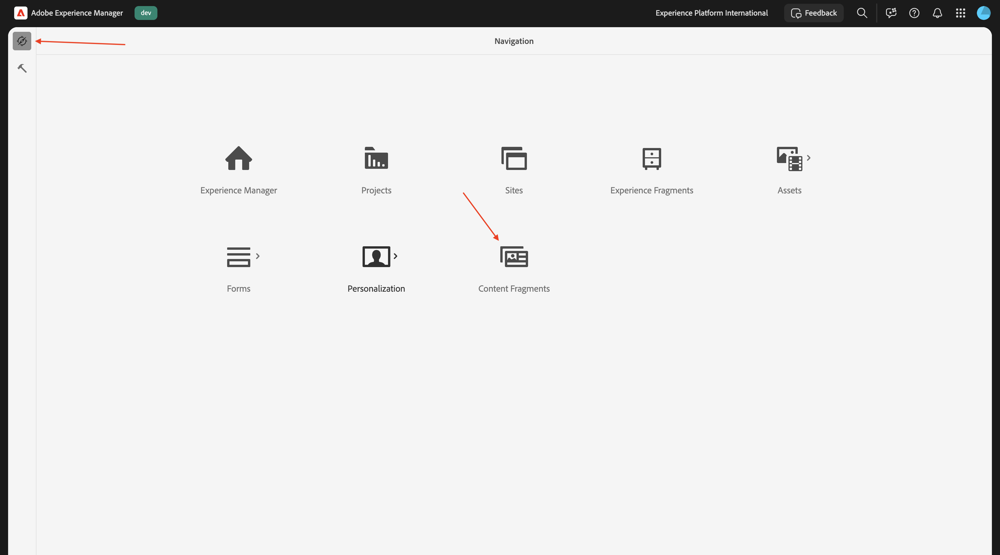
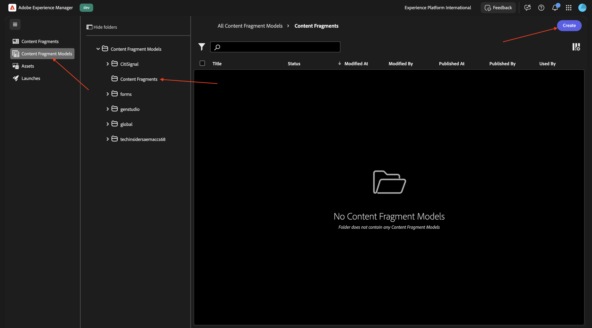
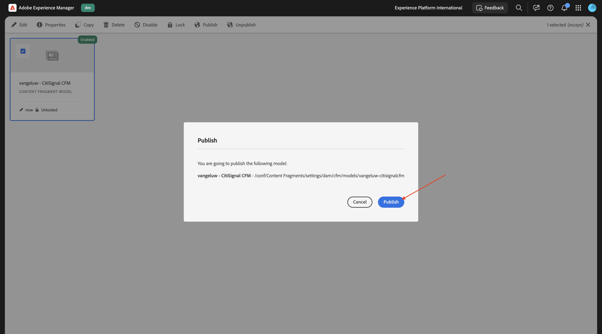
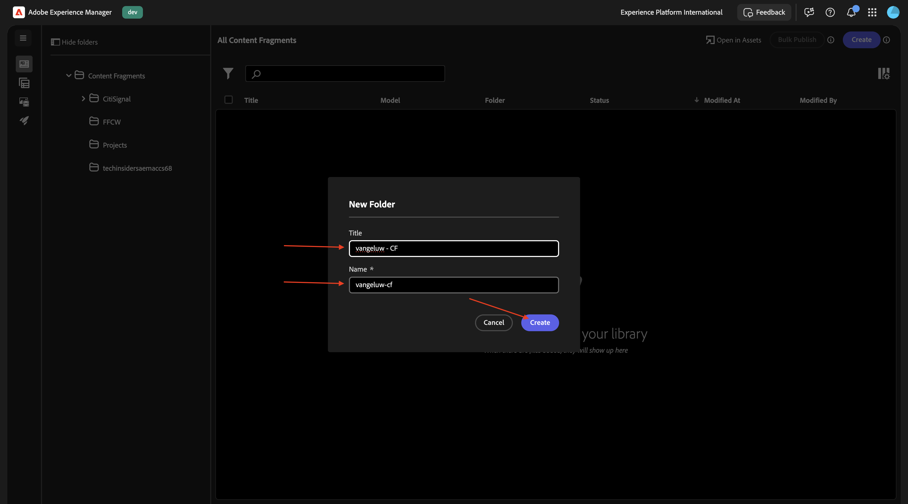
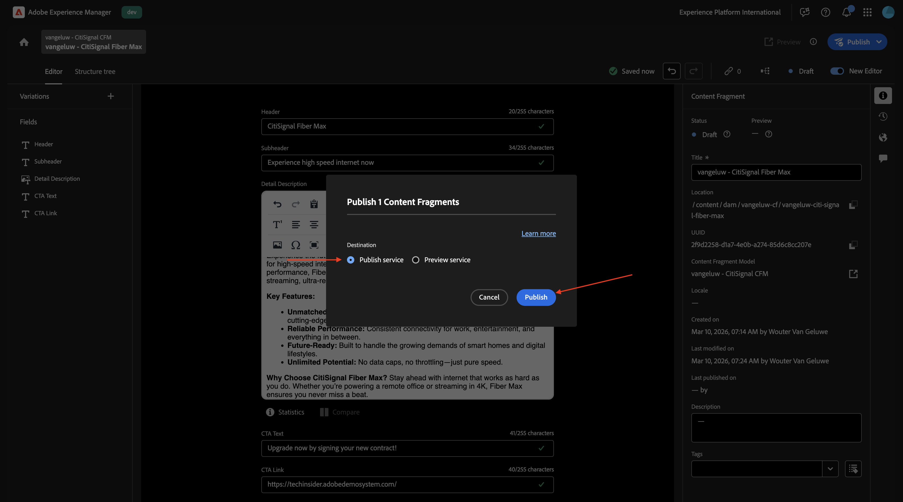
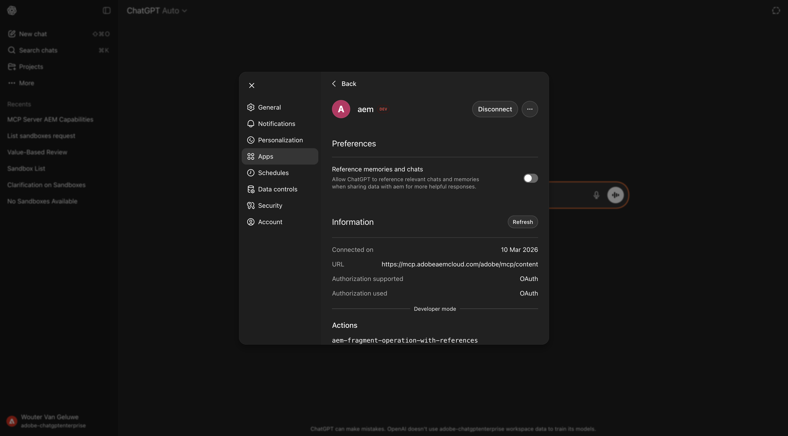
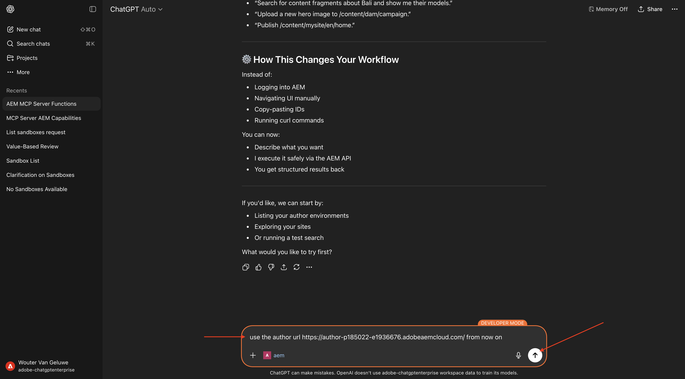
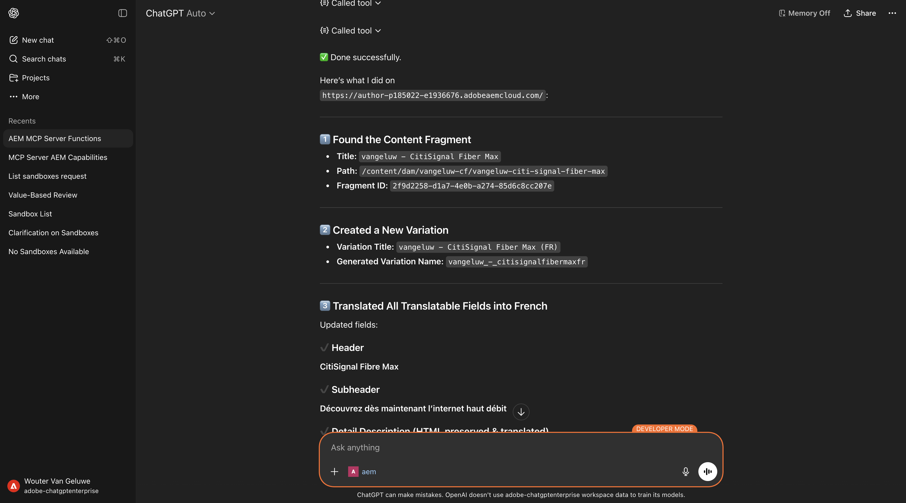

# 1.6.3使用ChatGPT和MCP伺服器縮放內容片段

>[!IMPORTANT]
>
>若要完成此練習，您需要具有對使用中AEM Sites和Assets CS搭配EDS環境的存取權，並且需要為您使用的IMS組織啟用各種AEM代理程式。
>
>如果您還沒有這樣的環境，請前往練習[Adobe Experience Manager Cloud Service和Edge Delivery Services](./../../../modules/asset-mgmt/module2.1/aemcs.md){target="_blank"}。 按照這裡的指示操作，您將可以存取這樣的環境。

>[!IMPORTANT]
>
>如果您先前已使用AEM Sites和AEM CS環境設定Assets CS計畫，可能是您的AEM CS沙箱已休眠。 鑑於讓這樣的沙箱解除休眠需要10-15分鐘，最好現在開始解除休眠過程，這樣以後就不必等待了。

## 1.6.3.1建立內容片段模型

返回您的Adobe Experience Manager作者環境，前往&#x200B;**工具**，然後前往&#x200B;**設定瀏覽器**。


按一下&#x200B;**建立**。



`Content Fragments`用於欄位&#x200B;**標題**&#x200B;和&#x200B;**名稱**。

請確定選項&#x200B;**內容片段模型**&#x200B;和&#x200B;**GraphQL持續查詢**&#x200B;皆已啟用。

按一下&#x200B;**建立**。


返回您的Adobe Experience Manager作者環境，然後前往&#x200B;**內容片段**。



移至&#x200B;**內容片段模型**，選取您的設定&#x200B;**內容片段**，然後按一下&#x200B;**建立**。



使用名稱`--aepUserLdap-- - CitiSignal CFM`。 按一下&#x200B;**建立並開啟**。


您應該會看到此訊息。 將&#x200B;**單行文字**&#x200B;欄位拖放到畫布上。


將欄位&#x200B;**欄位標籤**&#x200B;變更為`Header`。


返回&#x200B;**資料型別**。 將&#x200B;**單行文字**&#x200B;欄位拖放到畫布上。


將欄位&#x200B;**欄位標籤**&#x200B;變更為`Subheader`。


返回&#x200B;**資料型別**。 將&#x200B;**多行文字**&#x200B;欄位拖放到畫布上。


將欄位&#x200B;**欄位標籤**&#x200B;變更為`Detail Description`。


返回&#x200B;**資料型別**。 將&#x200B;**單行文字**&#x200B;欄位拖放到畫布上。


將欄位&#x200B;**欄位標籤**&#x200B;變更為`CTA Text`。


返回&#x200B;**資料型別**。 將&#x200B;**單行文字**&#x200B;欄位拖放到畫布上。


將欄位&#x200B;**欄位標籤**&#x200B;變更為`CTA Link`。 按一下&#x200B;**儲存**。


您應該會看到此訊息。


選取您的內容片段模式，然後按一下&#x200B;**發佈**。


按一下&#x200B;**發佈**。



## 1.6.3.2建立內容片段

返回您的Adobe Experience Manager作者環境，然後前往&#x200B;**內容片段**。


您應該會看到此訊息。 按一下&#x200B;**建立**，然後選取&#x200B;**資料夾**。


輸入標題： `--aepUserLdap-- - CF`。 按一下&#x200B;**建立**。



返回您的Adobe Experience Manager作者環境，然後前往&#x200B;**Assets**。


移至&#x200B;**檔案**。


選取您剛建立的資料夾（應該命名為`--aepUserLdap-- - CF`），然後按一下&#x200B;**內容**。


移至&#x200B;**雲端服務**，然後按一下&#x200B;**資料夾**&#x200B;圖示。


選取您之前建立的雲端設定，應命名為&#x200B;**內容片段**。 按一下&#x200B;**選取**。


然後您應該會看到此訊息。 按一下「**儲存並關閉**」。


返回您的Adobe Experience Manager作者環境，然後前往&#x200B;**內容片段**。


您應該會看到此訊息。 按一下&#x200B;**建立**，然後選取&#x200B;**內容片段**。


選取您之前建立的&#x200B;**內容片段模式**，其名稱應該是`--aepUserLdap-- - CitiSignal CFM`。 使用名稱`--aepUserLdap-- CitiSignal Fiber Max`。

按一下&#x200B;**建立並開啟**。


您應該會看到此訊息。


填寫欄位，如下所示：

- **標頭**： `CitiSignal Fiber Max`
- **子標題**： `Experience high speed internet now`
- **詳細描述**：

```
Experience the future of connectivity with CitiSignal Fiber Max, the ultimate solution for high-speed internet. Designed for homes and businesses that demand performance, Fiber Max delivers blazing-fast fiber speeds, ensuring seamless streaming, ultra-responsive gaming, and crystal-clear video calls.

Key Features:

Unmatched Speed: Enjoy lightning-fast downloads and uploads powered by cutting-edge fiber technology.
Reliable Performance: Consistent connectivity for work, entertainment, and everything in between.
Future-Ready: Built to handle the growing demands of smart homes and digital lifestyles.
Unlimited Potential: No data caps, no throttling—just pure speed.
Why Choose CitiSignal Fiber Max? Stay ahead with internet that works as hard as you do. Whether you’re powering a remote office or streaming in 4K, Fiber Max ensures you never miss a beat.
```

**CTA文字**： `Upgrade now by signing your new contract!`
**CTA連結**： `https://techinsiders68.adobedemosystem.com/`

按一下&#x200B;**發佈**，然後選取&#x200B;**立即**。


按一下&#x200B;**發佈**。



## 1.6.3.3在ChatGPT中設定MCP伺服器

>[!NOTE]
>
>在ChatGPT中使用Adobe Marketing Agent需要下列專案：
>- OpenAI的ChatGPT Enterprise付費版本
>- 使用ChatGPT Enterprise Web使用者端

移至[https://chatgpt.com/](https://chatgpt.com/){target="_blank"}並使用您的帳戶詳細資料登入。 登入後，您應該會看到此訊息。 按一下您的使用者名稱，然後選取&#x200B;**設定**。


移至&#x200B;**應用程式**，然後選取&#x200B;**進階設定**。


開啟&#x200B;**開發人員模式**，然後按一下&#x200B;**上一步**。


按一下&#x200B;**建立應用程式**。


填寫欄位，如下所示：

- **名稱**： `aem`
- **MCP伺服器URL**： `https://mcp.adobeaemcloud.com/adobe/mcp/content`
- **驗證**： `OAuth`

勾選&#x200B;**我瞭解並想要繼續**&#x200B;的核取方塊。

按一下&#x200B;**建立**。


ChatGPT現在將嘗試連線至您的Adobe帳戶。 選取&#x200B;**允許存取**，然後您必須使用您的Adobe帳戶登入。

成功登入後，您應該會看到Adobe Marketing Agent現在已成功連線。



## 1.6.3.4在ChatGPT中使用AEM MCP伺服器

關閉此視窗。


您應該會看到此訊息。 按一下&#x200B;**+**&#x200B;圖示，移至&#x200B;**更多**，然後選取&#x200B;**aem**。


輸入以下提示並按一下&#x200B;**傳送**。

```
I just created a new custom mcp server named 'aem'. what can I do with that?
```


您應該會看到類似這樣的內容。 輸入以下提示並按一下&#x200B;**傳送**。

```
use the author url https://author-pXXXXXX-eXXXXXXX.adobeaemcloud.com/ from now on
```



您應該會看到類似這樣的內容。 輸入以下提示並按一下&#x200B;**傳送**。

```
find the content fragment --aepUserLdap-- - CitiSignal Fiber Max and make a variation called --aepUserLdap-- - CitiSignal Fiber Max (FR), then translate all fields into french
```


按一下&#x200B;**CreateFragmentVariation**。


按一下&#x200B;**UpdateFragment**。


您應該會看到此訊息。 已成功建立您的片段變數。



您現在也可以在AEM UI中看到新的變數。


## 後續步驟

返回[AEM與代理程式](./aemagents.md){target="_blank"}

[返回所有模組](./../../../overview.md){target="_blank"}