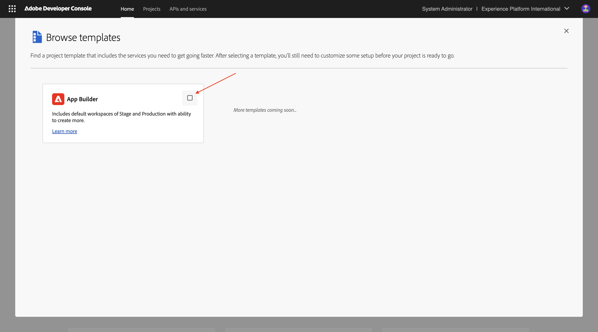
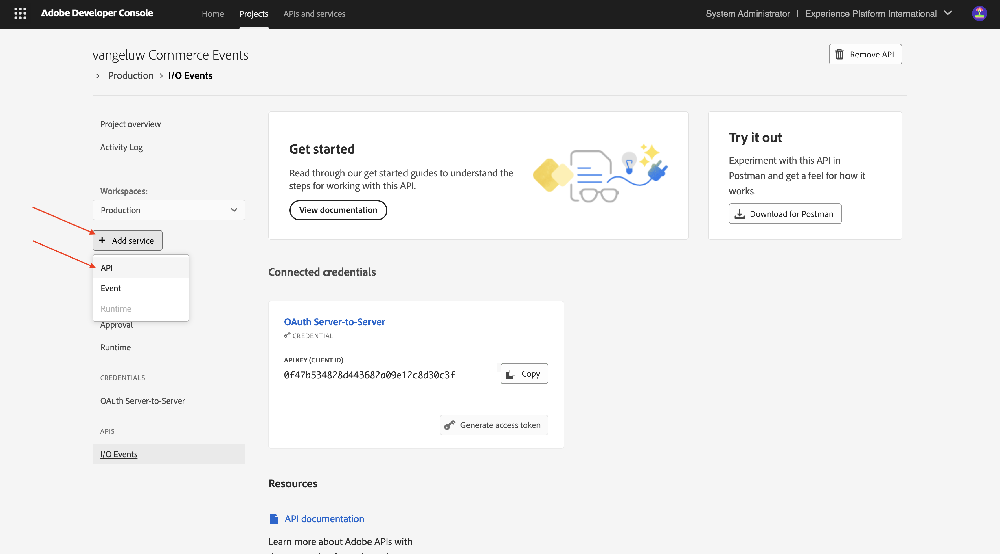
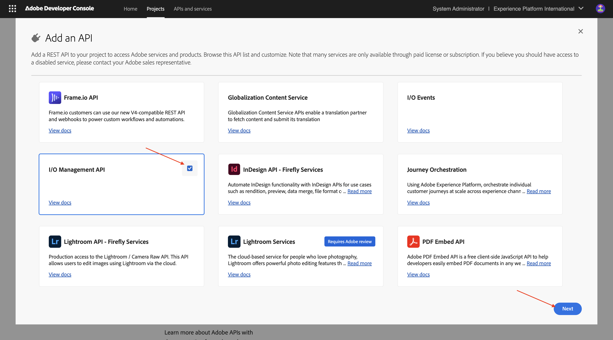
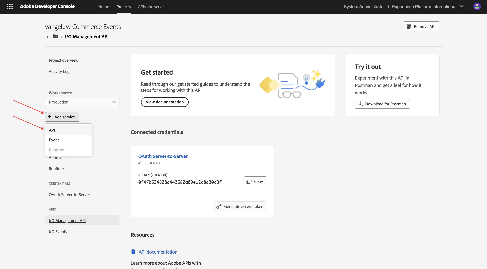
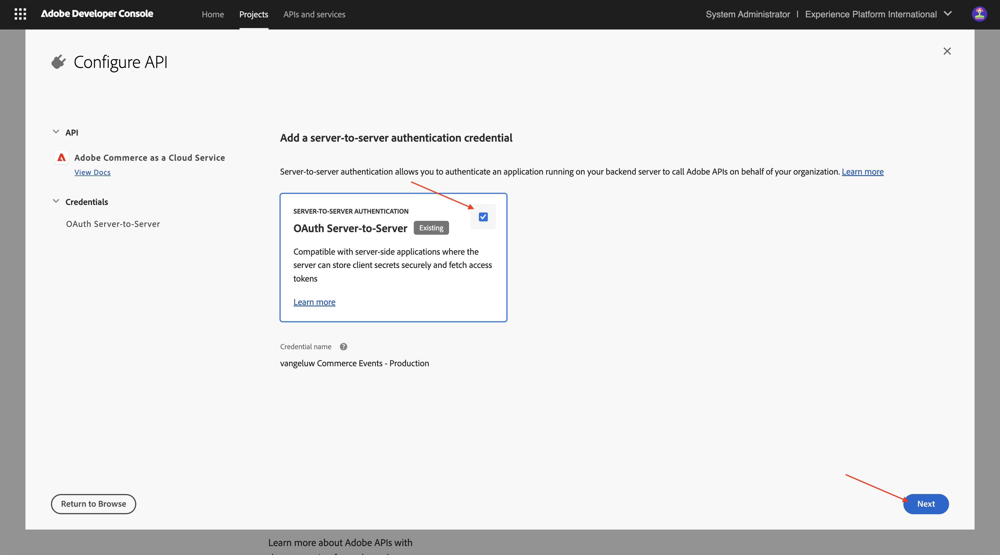
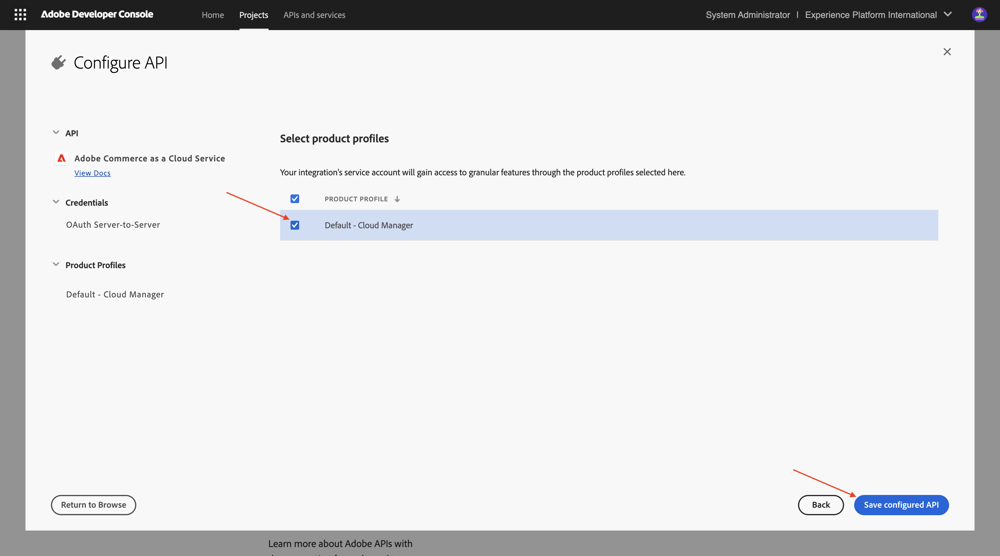
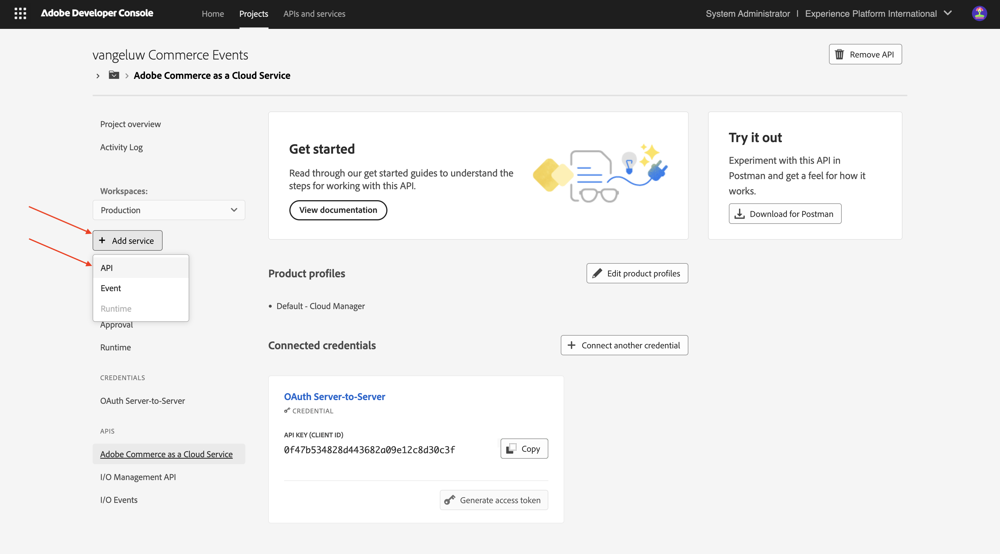
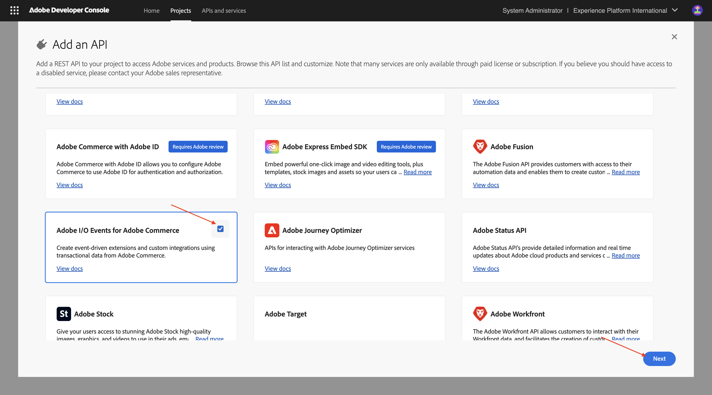

# 1.7.1設定您的開發環境

## 1.7.1.1建立您的Adobe I/O專案

移至[https://developer.adobe.com/console/home](https://developer.adobe.com/console/home){target="_blank"}。

請務必在熒幕右上角選取正確的例項。 您的執行個體是`--aepImsOrgName--`。

>[!NOTE]
>
> 下方熒幕擷圖顯示選取的特定組織。 完成本教學課程時，您的組織很可能有不同的名稱。 當您註冊參加本教學課程時，系統已為您提供要使用的環境詳細資訊，請依照這些指示操作。

接著，選取&#x200B;**從範本**&#x200B;建立專案。

選取&#x200B;**App Builder**。

輸入名稱`--aepUserLdap-- Commerce Events`。 按一下&#x200B;**儲存**。

您應該會看到類似這樣的內容。

按一下「**+新增服務**」，然後選取&#x200B;**API**。

搜尋並選取API **I/O事件**。 按一下&#x200B;**下一步**。

將認證的名稱變更為`vangeluw Commerce Events - Production`。 按一下&#x200B;**儲存設定的API**。

您應該會看到此訊息。 按一下「**+新增服務**」，然後選取&#x200B;**API**。

搜尋並選取API **I/O管理API**。 按一下&#x200B;**下一步**。

按一下&#x200B;**儲存設定的API**。

您應該會看到此訊息。 按一下「**+新增服務**」，然後選取&#x200B;**API**。

搜尋並選取API **Adobe Commerce as a Cloud Service**。 按一下&#x200B;**下一步**。

選取&#x200B;**伺服器對伺服器驗證**。 按一下&#x200B;**下一步**。

按一下&#x200B;**下一步**。

選取&#x200B;**預設 — Cloud Manager**。 按一下&#x200B;**儲存設定的API**。

您應該會看到此訊息。 按一下「**+新增服務**」，然後選取&#x200B;**API**。

搜尋並選取Adobe Commerce **的API** Adobe I/O Events。 按一下&#x200B;**下一步**。

按一下&#x200B;**儲存設定的API**。

您的專案現已設定完畢，可供使用。

## 1.7.1.2設定您的開發環境

為了建立、提交和部署可擴充的應用程式，您電腦上的本機開發環境應已安裝下列應用程式和套件：

- Node.js （20.x版或更新版本）
- npm （與Node.js封裝）
- Adobe Developer命令列介面(CLI)

如果您的電腦尚未安裝這些應用程式或套件，請遵循這些步驟。

### Node.js和npm

移至[https://nodejs.org/en/download](https://nodejs.org/en/download)。 之後，您應該會看到這個畫面，其中包含許多需要執行才能安裝Node.js和npm的終端機命令。 此處顯示的指令適用於MacBook。

首先，開啟新的終端機視窗。 貼上並執行熒幕擷圖第2行提及的命令：

`curl -o- https://raw.githubusercontent.com/nvm-sh/nvm/v0.40.3/install.sh | bash`

接下來，在熒幕擷圖的第5行執行命令：

`\. "$HOME/.nvm/nvm.sh"`

成功執行兩個命令後，請執行此命令：

`node -v`

您應該會看到傳回的版本號碼。

接下來，執行此命令：

`npm -v`

如果尚未安裝NPM，您可以使用以下命令來安裝： `npm install -g npm@11.9.0`。

您應該會看到傳回的版本號碼。

如果最後2個命令成功傳回版本號碼，則表示這2個功能的設定成功。

### Adobe Developer命令列介面(CLI)

若要安裝Adobe Developer命令列介面(CLI)，請在終端機視窗中執行以下命令：

`npm install -g @adobe/aio-cli`

執行此命令可能需要幾分鐘的時間，最終結果應類似如下：

Adobe Developer命令列介面(CLI)現在也已成功安裝。

### 適用於Commerce的Adobe Developer命令列介面(CLI) SDK擴充功能

若要安裝適用於Commerce的Adobe I/O SDK擴充功能，請在終端機視窗中執行以下命令：

`npm install @adobe/aio-commerce-sdk`

### Adobe I/O CLI的Adobe Commerce外掛程式

若要安裝適用於Adobe I/O CLI的Adobe Commerce外掛程式，請在終端機視窗中執行以下命令：

`aio plugins:install https://github.com/adobe-commerce/aio-cli-plugin-commerce @adobe/aio-cli-plugin-app-dev @adobe/aio-cli-plugin-runtime`

您現在已設定基本元素，以便結合Adobe Commerce、Adobe I/O Events和Adobe I/O Runtime執行App Builder專案。

## 後續步驟

移至[使用游標來開發您的專案](./ex2.md){target="_blank"}

返回[適用於Adobe Commerce的智慧型開發人員工具](./aiassisteddev.md){target="_blank"}

[返回所有模組](./../../../overview.md){target="_blank"}
