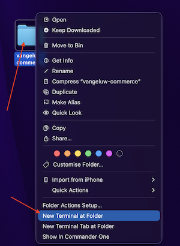
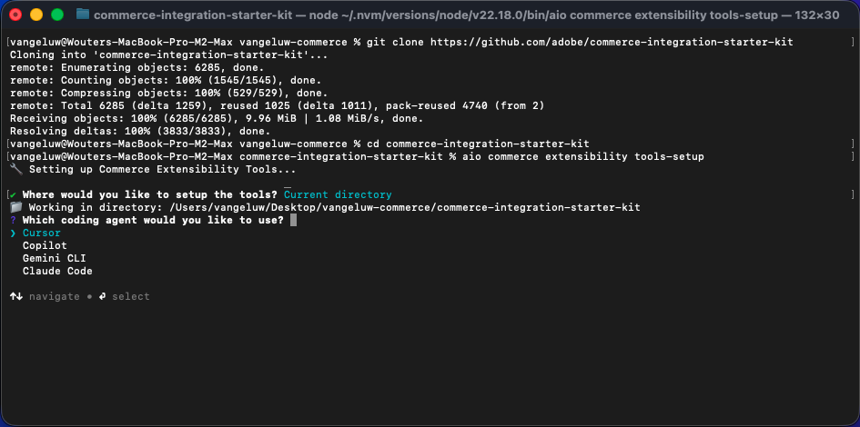
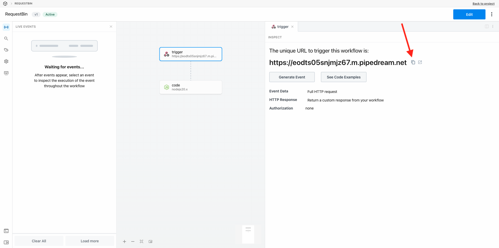

# 1.7.2使用Cursor.ai開發您的專案

## 1.7.2.1設定您的目錄和工具

在您的案頭上，建立名稱為`--aepUserLdap---commerce`的新目錄

在資料夾上按一下滑鼠右鍵，然後選取&#x200B;**資料夾**&#x200B;的新終端機。

您應該會看到此訊息。

您現在需要複製現有的Github存放庫，以便檢視[https://github.com/adobe/commerce-integration-starter-kit](https://github.com/adobe/commerce-integration-starter-kit)。

此存放庫是Adobe的整合入門套件，使用Adobe Developer App Builder來改善即時連線可靠性，並縮短Adobe Commerce與其他後台系統（例如ERP、CRM及PIM）整合的上市時間。

複製此存放庫有數種方式，在此範例中使用「終端機」。

在「終端機」視窗中輸入以下命令並執行它。

`git clone https://github.com/adobe/commerce-integration-starter-kit`

幾秒後，您應該會看到此結果。

接下來，您應該導覽至剛建立的資料夾。 輸入以下命令，然後執行它。

`cd commerce-integration-starter-kit`

您應該會看到此訊息。

接下來，您需要為Cursor.ai設定Commerce擴充性工具。 輸入以下命令，然後執行它。

`aio commerce extensibility tools-setup`

選取&#x200B;**目前的目錄**。

選取&#x200B;**游標**。

選取&#x200B;**npm**。

幾分鐘後，您應該會看到此訊息。

透過安裝適用於Cursor.ai的Commerce擴充性工具，現在有MCP伺服器可作為Cursor.ai環境的一部分使用。 在下個練習中，您將使用該MCP伺服器來協助您開發及部署應用程式產生器專案。

## 1.7.2.2設定您的webhook

在本練習中，您將需要設定webhook，以便在建立訂單時，訂單事件可串流至該webhook。 在本練習中，您將使用[https://pipedream.com/requestbin](https://pipedream.com/requestbin)的範例端點。

移至[https://pipedream.com/requestbin](https://pipedream.com/requestbin)，建立帳戶，然後建立工作區。 建立工作區後，您會看到類似以下畫面。

按一下&#x200B;**複製**&#x200B;以複製URL。 您需要在下一個練習中指定此URL。 此範例中的URL是`https://eodts05snjmjz67.m.pipedream.net`。

## 1.7.2.3 Cursor.ai

開啟Cursor.ai。 按一下&#x200B;**開啟專案**。

導覽至您建立的資料夾，該資料夾應命名為`--aepUserLdap---commerce`。 在該資料夾中，選取名為`commerce-integration-starter-kit`的資料夾。 按一下&#x200B;**「開啟」**。

您應該會看到此訊息。 繼續之前，請確定在Cursor.ai中開啟的頂層資料夾為`commerce-integration-starter-kit`。

`I would like to build an app that subscribes to order created events and sends them to a configurable URL with basic authentication`

## 後續步驟

返回[適用於Adobe Commerce的智慧型開發人員工具](./aiassisteddev.md){target="_blank"}

[返回所有模組](./../../../overview.md){target="_blank"}