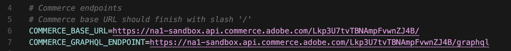
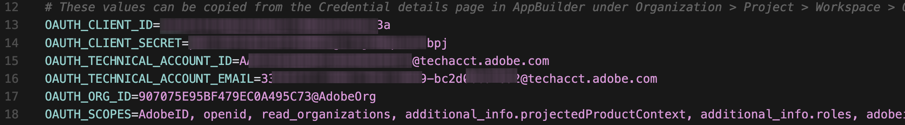
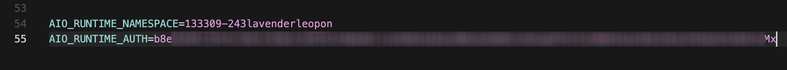
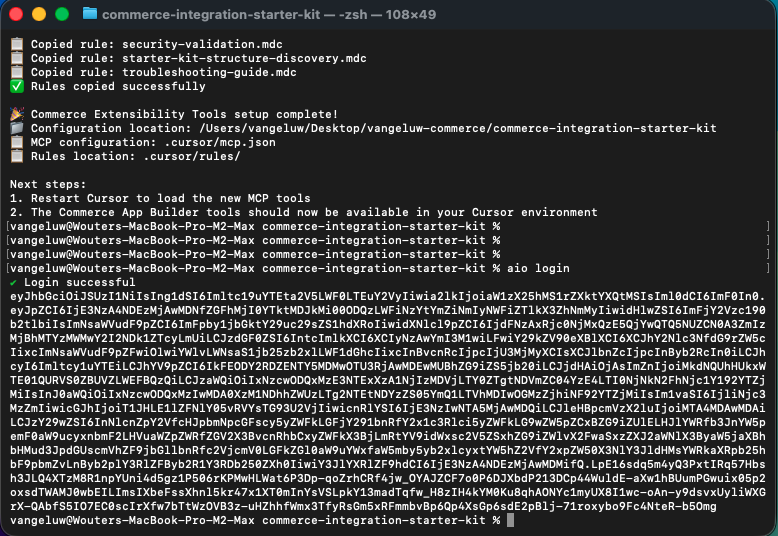
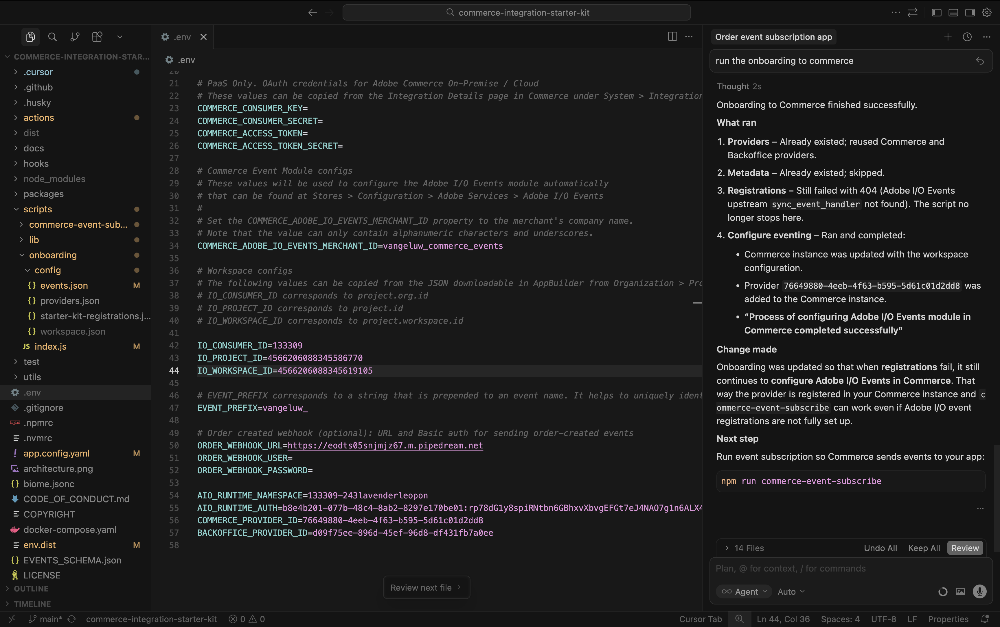
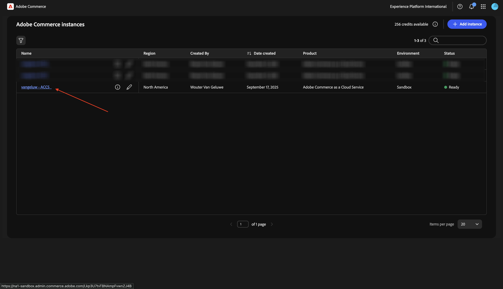
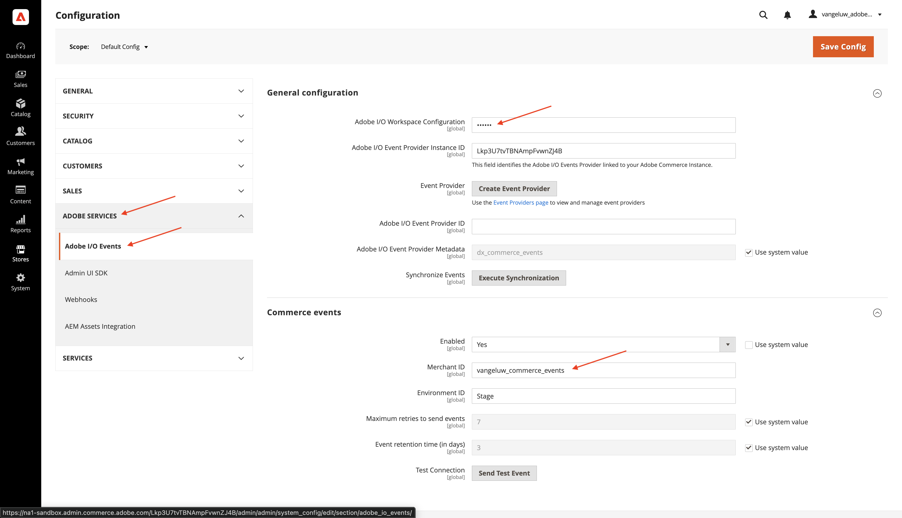
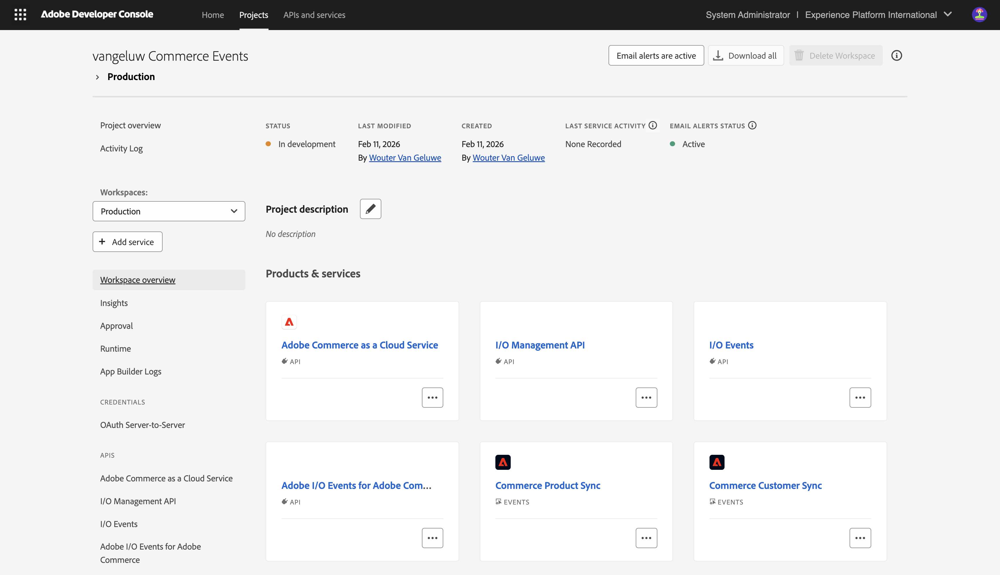

# 1.7.2使用Cursor開發您的專案

## 1.7.2.1設定您的目錄和工具

在您的案頭上，建立名稱為`--aepUserLdap---commerce`的新目錄

在資料夾上按一下滑鼠右鍵，然後選取&#x200B;**資料夾**&#x200B;的新終端機。

您應該會看到此訊息。

您現在需要複製現有的Github存放庫，以便檢視[https://github.com/adobe/commerce-integration-starter-kit](https://github.com/adobe/commerce-integration-starter-kit)。

此存放庫是Adobe的整合入門套件，使用Adobe Developer App Builder來改善即時連線可靠性，並縮短Adobe Commerce與其他後台系統（例如ERP、CRM及PIM）整合的上市時間。

複製此存放庫有數種方式，在此範例中使用「終端機」。

在「終端機」視窗中輸入以下命令並執行它。

`git clone https://github.com/adobe/commerce-integration-starter-kit`

幾秒後，您應該會看到此結果。

接下來，您應該導覽至剛建立的資料夾。 輸入以下命令，然後執行它。

`cd commerce-integration-starter-kit`

您應該會看到此訊息。

接下來，您需要為「游標」設定Commerce擴充性工具。 輸入以下命令，然後執行它。

`aio commerce extensibility tools-setup`

選取&#x200B;**目前的目錄**。

選取&#x200B;**游標**。

選取&#x200B;**npm**。

幾分鐘後，您應該會看到此訊息。

透過安裝適用於Cursor的Commerce擴充性工具，現在有MCP伺服器可作為Cursor環境的一部分使用。 在下個練習中，您將使用該MCP伺服器來協助您開發及部署應用程式產生器專案。

## 1.7.2.2設定您的webhook

在本練習中，您將需要設定webhook，以便在建立訂單時，訂單事件可串流至該webhook。 在本練習中，您將使用[https://pipedream.com/requestbin](https://pipedream.com/requestbin)的範例端點。

移至[https://pipedream.com/requestbin](https://pipedream.com/requestbin)，建立帳戶，然後建立工作區。 建立工作區後，您會看到類似以下畫面。

按一下&#x200B;**複製**&#x200B;以複製URL。 您需要在下一個練習中指定此URL。 此範例中的URL是`https://eodts05snjmjz67.m.pipedream.net`。

## 1.7.2.3使用游標建立應用程式

開啟游標。 按一下&#x200B;**開啟專案**。

導覽至您建立的資料夾，該資料夾應命名為`--aepUserLdap---commerce`。 在該資料夾中，選取名為`commerce-integration-starter-kit`的資料夾。 按一下&#x200B;**「開啟」**。

您應該會看到此訊息。 繼續之前，請確定在Cursor中開啟的頂層資料夾為`commerce-integration-starter-kit`。

使用鍵盤快速鍵`Cmd + Shift + J`開啟[游標]設定。 您應該會看到此訊息。 移至&#x200B;**Tools&amp; MCP**。

啟用MCP伺服器&#x200B;**commerce擴充性**。 完成後，按一下&#x200B;**X**&#x200B;以關閉視窗。

複製下列提示並貼到「游標」中。 然後，按一下&#x200B;**傳送**&#x200B;按鈕。

`I would like to build an app that subscribes to order created events and sends them to a configurable URL with basic authentication`

游標將開始推理和執行。 游標會要求您確認幾次。 發生此情況時，請按一下&#x200B;**執行**。 根據推理和您的設定，這可能發生5到10次。

幾分鐘後，您應該會看到類似以下畫面。

Cursor所指示的下一個步驟是建立名稱為`.env`的檔案，並在該處提供必要的變數。

## 1.7.2.4建立您的.env檔案

選取檔案&#x200B;**env.dist**。 輸入命令`Cmd + C`，然後輸入命令`Cmd + V`。

將新建立的檔案重新命名為`.env`。

接下來，您必須提供檔案&#x200B;**.env**&#x200B;中所有變數的值。

您可以在這裡找到所有必要的資訊。

### Commerce端點

您可以前往[https://experience.adobe.com](https://experience.adobe.com)找到這些變數。 按一下&#x200B;**Commerce**。

您應該會看到此訊息。 按一下ACCS環境旁的&#x200B;**資訊**&#x200B;圖示，其名稱應該是`--aepUserLdap-- - ACCS`。 複製REST端點和GraphQL端點的值。

在此範例中，這些是要複製的值。 將它們貼到檔案&#x200B;**.env**&#x200B;第6行和第7行的以下變數旁。

- **COMMERCE_BASE_URL** = https://na1-sandbox.api.commerce.adobe.com/Lkp3U7tvTBNAmpFvwnZJ4B/
- **COMMERCE_GRAPHQL_ENDPOINT** = https://na1-sandbox.api.commerce.adobe.com/Lkp3U7tvTBNAmpFvwnZJ4B/graphql

然後，您應該將此專案放入檔案&#x200B;**.env**&#x200B;中。

### Adobe I/O專案變數

您可以前往[https://developer.adobe.com/console](https://developer.adobe.com/console)找到這些變數。 移至&#x200B;**專案**，然後按一下以開啟您在上一個練習中建立的Adobe I/O專案，此專案應該命名為`--aepUserLdap-- Commerce Events`。

移至&#x200B;**生產**。

移至&#x200B;**OAuth伺服器對伺服器**。 您應該會看到此訊息。

複製欄位&#x200B;**使用者端識別碼**、**使用者端密碼**、**技術帳戶識別碼**、**技術帳戶電子郵件**&#x200B;和&#x200B;**組織識別碼**&#x200B;的值，並將其貼到檔案&#x200B;**.env**&#x200B;中第13-17行的以下變數旁。

- **OAUTH_CLIENT_ID**= **使用者端識別碼**
- **OAUTH_CLIENT_SECRET**= **使用者端密碼**
- **OAUTH_TECHNICAL_ACCOUNT_ID**= **技術帳戶ID**
- **OAUTH_TECHNICAL_ACCOUNT_EMAIL**= **技術帳戶電子郵件**
- **OAUTH_ORG_ID**= **組織識別碼**

然後，您應該將此專案放入檔案&#x200B;**.env**&#x200B;中。

### Commerce_ADOBE_IO_EVENTS_MERCHANT_ID

針對欄位&#x200B;**COMMERCE_ADOBE_IO_EVENTS_MERCHANT_ID=**，在檔案`--aepUserLdap--_commerce_events`.env **的第34行輸入值**。

然後，您應該將此專案放入檔案&#x200B;**.env**&#x200B;中。

### Workspace設定

若要擷取這些變數，請返回您的Adobe I/O專案，然後按一下&#x200B;**Workspace概觀**。

前往&#x200B;**Workspace總覽**&#x200B;後，請檢視URL，它應該如下所示： **https://developer.adobe.com/console/projects/133309/4566206088345586770/workspaces/4566206088345619105/details**。

此範例中的第一個數字133309是用於欄位&#x200B;**IO_CONSUMER_ID**&#x200B;的值。
此範例中的第二個數字4566206088345586770是用於欄位&#x200B;**IO_PROJECT_ID**&#x200B;的值。
此範例中的第三個數字4566206088345619105是用於欄位&#x200B;**IO_WORKSPACE_ID**&#x200B;的值。

- **IO_CONSUMER_ID**= 133309
- **IO_PROJECT_ID**= 4566206088345586770
- **IO_WORKSPACE_ID**= 4566206088345619105

複製這些值，並將它們貼到檔案&#x200B;**.env**&#x200B;中第42到44行的以下變數旁。

### EVENT_PREFIX

針對欄位&#x200B;**EVENT_PREFIX =**，在檔案`--aepUserLdap--_`.env **的第47行輸入值**。

然後，您應該將此專案放入檔案&#x200B;**.env**&#x200B;中。

### Webhook

對於欄位&#x200B;**ORDER_WEBHOOK_URL**，您應該貼上您先前在本練習中建立之webhook的URL，它應該如下所示： `https://eodts05snjmjz67.m.pipedream.net`。

然後，您應該將此專案放入檔案&#x200B;**.env**&#x200B;中。

### App Builder認證

您應該更新檔案&#x200B;**.env**&#x200B;第54到55行的下列變數：

- **AIO_RUNTIME_NAMESPACE**=
- **AIO_RUNTIME_AUTH**=

您可以返回您的Adobe I/O專案來擷取這些變數的值。 移至&#x200B;**Workspace概觀**&#x200B;並按一下&#x200B;**全部下載**。

如此的檔案將隨後下載。 使用文字編輯器開啟該檔案。

向右捲動，直到看到&#x200B;**執行階段**&#x200B;為止。 您應該會看到包含&#x200B;**AIO_RUNTIME_NAMESPACE**&#x200B;值的欄位&#x200B;**名稱**。

向右捲動直到您看到&#x200B;**auth**，其中包含&#x200B;**AIO_RUNTIME_AUTH**&#x200B;的值。

將這兩個值貼到檔案&#x200B;**.env**&#x200B;的第54到55行上，您應該就會有這個值。

您的&#x200B;**.env**&#x200B;檔案現已完成設定。

## 1.7.2.5 workspace.json

在上一步中，您從Adobe I/O專案下載了類似這樣的檔案。

重新命名該檔案並使用名稱`workspace.json`。

將檔案複製到目錄&#x200B;**指令碼**>**上線**>**設定**。

## 1.7.2.6 Adobe I/O登入

返回您以前使用的終端機視窗。 輸入命令`aio login`。

接著，您應該會在透過瀏覽器登入後看到此訊息。

## 1.7.2.7準備部署

複製下列提示並貼到「游標」中。 然後，按一下&#x200B;**傳送**&#x200B;按鈕。

`Please deploy this code to Adobe I/O`

按一下&#x200B;**執行**&#x200B;以允許動作，游標可能會要求您多次確認動作。

部署將在幾分鐘後完成。

複製下列提示並貼到「游標」中。 然後，按一下&#x200B;**傳送**&#x200B;按鈕。

`run the onboarding to commerce`

幾分鐘後，您應該會看到此訊息。

複製下列提示並貼到「游標」中。 然後，按一下&#x200B;**傳送**&#x200B;按鈕。

`subscribe to commerce events`

幾分鐘後，您應該會看到此訊息。

## 1.7.2.8在Adobe Commerce as a Cloud Service中驗證設定

移至[https://experience.adobe.com](https://experience.adobe.com)。 按一下&#x200B;**Commerce**。

按一下您的Adobe Commerce as a Cloud Service環境以開啟，然後登入。

移至&#x200B;**系統**，然後移至&#x200B;**事件訂閱**。

之後，您應該會看到此事件訂閱清單。

移至&#x200B;**商店**，然後移至&#x200B;**設定**。

移至&#x200B;**Adobe服務**&#x200B;並選取&#x200B;**Adobe I/O Events**。 接著您應該會看到欄位&#x200B;**Adobe I/O Workspace設定**&#x200B;具有兩個星號的值，而欄位&#x200B;**商家識別碼**&#x200B;也應該具有`--aepUserLdap--_commerce_events`之類的值。

備妥此設定後，您現在可以測試設定。

## 1.7.2.9測試您的情境

開啟您的網站。

移至&#x200B;**觀看**&#x200B;並按一下任何產品。

設定產品並按一下&#x200B;**加入購物車**。

按一下&#x200B;**購物車**&#x200B;圖示並選取&#x200B;**結帳**。

填寫您的詳細資料，然後按一下&#x200B;**下訂單**。

之後，您應該會看到訂單確認。

切換至您的webhook應用程式。 您現在應該會看到剛才已確認之訂單的傳入事件。

## 1.7.2.10 Adobe I/O除錯

返回您的Adobe I/O專案。 移至&#x200B;**Workspace概觀**。 您應該會看到類似以下內容。 向下捲動一點。

按一下以開啟&#x200B;**Commerce訂單同步**。

移至&#x200B;**偵錯追蹤**。 您可以在這裡找到最新的傳入事件，及其裝載。 這有助於瞭解已處理哪些事件，以及是否已成功處理這些事件。

## 後續步驟

返回[適用於Adobe Commerce的智慧型開發人員工具](./aiassisteddev.md){target="_blank"}

[返回所有模組](./../../../overview.md){target="_blank"}
