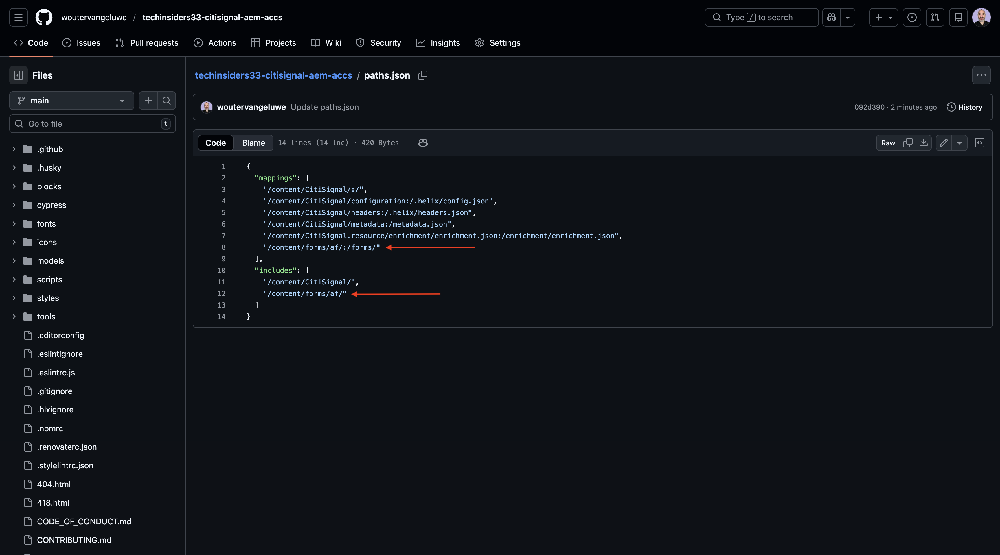
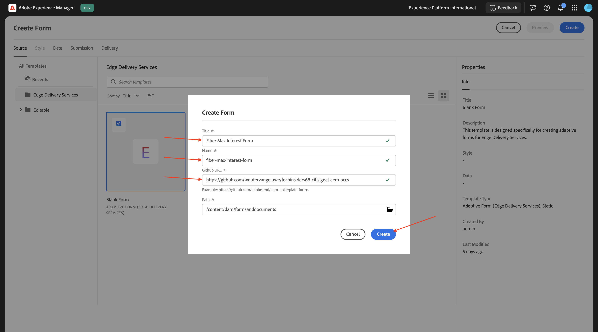
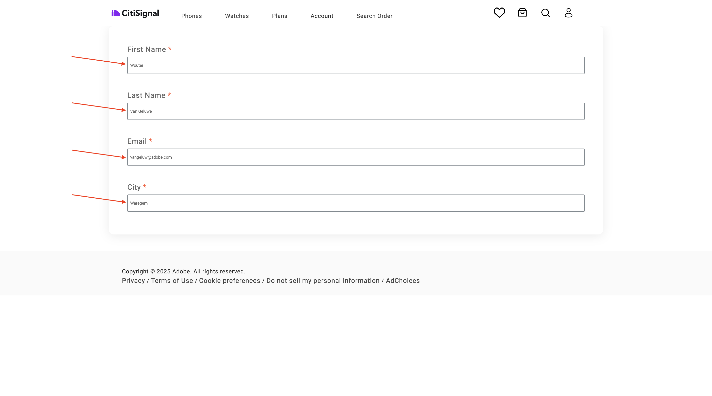
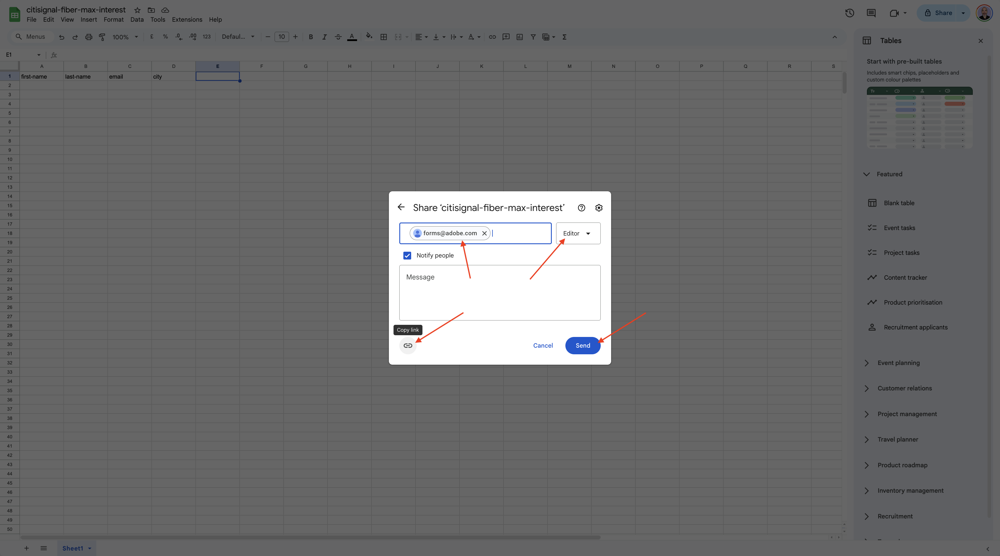

# 1.3.1建立您的第一個表單

>[!IMPORTANT]
>
>若要完成此練習，您需要具有啟用AEM Assets Dynamic Media之有效AEM Assets CS Author環境的存取權。
>
>如果您沒有這類環境，請前往[Adobe Experience Manager Cloud Service和Edge Delivery Services](./../../../modules/asset-mgmt/module2.1/aemcs.md){target="_blank"}。 按照這裡的指示操作，您將可以存取這樣的環境。

>[!IMPORTANT]
>
>如果您先前已使用AEM Assets CS環境設定AEM CS計畫，可能是您的AEM CS沙箱已休眠。 鑑於讓這樣的沙箱解除休眠需要10-15分鐘，最好現在開始解除休眠過程，這樣以後就不必等待了。

## 將AEM Forms與Edge Delivery Services搭配使用的1.3.1.1環境需求

在設定您的第一個表單之前，在您可以遵循以下步驟之前，需要滿足許多要求。

### 計畫設定

在您的Cloud Manager程式的&#x200B;**解決方案和附加元件**&#x200B;中，**Forms**&#x200B;需要啟用。


### 個區塊

在您的Github存放庫中，您需要有下列可用的區塊：

- **表單**
- **embed-adaptive-form**


### 指令碼

在您的Github存放庫中，您需要有以下可用的指令碼：

- **form-editor-support.css**
- **form-editor-support.js**


此外，在&#x200B;**editor-support.js**&#x200B;檔案中，必須完成下列變更，才能在通用編輯器中編輯表單。

- 將函式宣告從&#x200B;**function attachEventListners(main)**&#x200B;變更為&#x200B;**async function attachEventListners(main)**
- 加入第152和153行：

```
const module = await import('./form-editor-support.js');
module.attachEventListners(main);
```


此外，在檔案&#x200B;**editor-support.js**&#x200B;中，將第90-92行變更如下：

```
if (block.dataset.aueModel === 'form') {
        return true;
      } else if (newBlock) {
```


### paths.json

請確認您的Github存放庫組態，尤其是檔案&#x200B;**paths.json**。 檔案中必須存在以下行：

- 在對映之下： **&quot;/content/forms/af/：/forms/&quot;**
- 下包含： **&quot;/content/forms/af/&quot;**

```json
{
  "mappings": [
    "/content/CitiSignal/:/",
    "/content/CitiSignal/configuration:/.helix/config.json",
    "/content/CitiSignal/headers:/.helix/headers.json",
    "/content/CitiSignal/metadata:/metadata.json",
    "/content/CitiSignal.resource/enrichment/enrichment.json:/enrichment/enrichment.json",
    "/content/forms/af/:/forms/"
  ],
  "includes": [
    "/content/CitiSignal/",
    "/content/forms/af/"
  ]
}
```



設定好這些需求後，您就可以建立第一個表單。

## 1.3.1.1建立表單

移至[https://my.cloudmanager.adobe.com](https://my.cloudmanager.adobe.com){target="_blank"}。 您應該選取的組織是`--aepImsOrgName--`。 開啟您的環境。


移至&#x200B;**Forms**。


移至&#x200B;**Forms與檔案**。


按一下&#x200B;**建立**，然後選取&#x200B;**最適化表單**。


選取&#x200B;**Edge Delivery Services**，然後選取&#x200B;**空白頁面**。 按一下&#x200B;**建立**。


您應該會看到此訊息。 填寫下列欄位：

- **標題**： `Fiber Max Interest Form`
- **名稱**：應該根據欄位&#x200B;**標題**&#x200B;自動填入。
- **Github URL**：提供連結至您網站的Github存放庫路徑

按一下&#x200B;**建立**。



按一下&#x200B;**建立**&#x200B;後，**通用編輯器**&#x200B;應該會自動開啟，您應該會看到類似這樣的內容。 按一下圖示以開啟&#x200B;**內容樹狀結構**。


在&#x200B;**內容樹狀結構**&#x200B;中，選取物件&#x200B;**最適化表單**。


然後，按一下&#x200B;**+**&#x200B;圖示以新增元素，並選取&#x200B;**文字輸入**。


在&#x200B;**內容樹狀結構**&#x200B;中，選取欄位&#x200B;**文字輸入**。


移至&#x200B;**基本**&#x200B;檢視。 您應該會看到此訊息。

填寫下列欄位：

- **名稱**： `first-name`
- **標題**： `First Name`

接著，移至&#x200B;**驗證**。


翻轉切換器以使其成為必填欄位。 填寫下列欄位：

- **錯誤訊息**： `Enter your first name`
- **模式**： `[A-Za-z][A-Za-z ]+`
- **模式錯誤訊息**： `Letters only!`


在&#x200B;**內容樹狀結構**&#x200B;中，選取欄位&#x200B;**最適化表單**。 按一下&#x200B;**+**&#x200B;圖示，然後選取&#x200B;**文字輸入**。


在&#x200B;**內容樹狀結構**&#x200B;中，選取新建立的欄位&#x200B;**文字輸入**。 移至&#x200B;**屬性**。


移至&#x200B;**基本**&#x200B;檢視。 您應該會看到此訊息。

填寫下列欄位：

- **名稱**： `last-name`
- **標題**： `Last Name`

接著，移至&#x200B;**驗證**。


翻轉切換器以使其成為必填欄位。 填寫下列欄位：

- **錯誤訊息**： `Enter your last name`
- **模式**： `[A-Za-z][A-Za-z ]+`
- **模式錯誤訊息**： `Letters only!`


在&#x200B;**內容樹狀結構**&#x200B;中，選取欄位&#x200B;**最適化表單**。 按一下&#x200B;**+**&#x200B;圖示，然後選取&#x200B;**文字輸入**。


在&#x200B;**內容樹狀結構**&#x200B;中，選取新建立的欄位&#x200B;**文字輸入**。 移至&#x200B;**屬性**。


移至&#x200B;**基本**&#x200B;檢視。 您應該會看到此訊息。

填寫下列欄位：

- **名稱**： `email`
- **標題**： `Email`

接著，移至&#x200B;**驗證**。


翻轉切換器以使其成為必填欄位。 填寫下列欄位：

- **錯誤訊息**： `Enter your email address`
- **模式**： `^[^@]+@[^@]+\.[^@]+$`
- **模式錯誤訊息**： `Please verify your email address!`


在&#x200B;**內容樹狀結構**&#x200B;中，選取欄位&#x200B;**最適化表單**。 按一下&#x200B;**+**&#x200B;圖示，然後選取&#x200B;**文字輸入**。


在&#x200B;**內容樹狀結構**&#x200B;中，選取新建立的欄位&#x200B;**文字輸入**。


移至&#x200B;**基本**&#x200B;檢視。 您應該會看到此訊息。

填寫下列欄位：

- **名稱**： `city`
- **標題**： `city`

接著，移至&#x200B;**驗證**。


翻轉切換器以使其成為必填欄位。 填寫下列欄位：

- **錯誤訊息**： `Enter your city`
- **模式**： `[A-Za-z][A-Za-z ]+`
- **模式錯誤訊息**： `Letters only!`


按一下&#x200B;**發佈**。


再按一下&#x200B;**發佈**。


按一下以開啟您的表單。


您之後可以填寫表單，但尚未能提交。



發佈表單後，您的Edge Delivery Services網域現在也可使用它，如下所示：

`https://main--techinsidersXX-citisignal-aem-accs--woutervangeluwe.aem.page/forms/fiber-max-interest-form`


## 1.3.1.2提交表單

若要提交表單，需要2件事：

- **提交**&#x200B;按鈕
- **提交**&#x200B;動作

此外，在本練習中，您應使用Google試算表來記錄此表單的提交內容。

### Google試算表

移至[https://drive.google.com](https://drive.google.com)並建立新的空白試算表。


為檔案命名`citisignal-fiber-max-interest`。

在第1行中，在儲存格A-B-C-D中輸入下列欄位名稱：

- 名字
- 姓氏
- 電子郵件
- 城市

然後，按一下&#x200B;**共用**。


使用&#x200B;**編輯器**&#x200B;層級存取許可權與&#x200B;**forms@adobe.com**&#x200B;共用檔案。

然後，按一下&#x200B;**複製連結**。

按一下&#x200B;**傳送**。



您必須在下一個步驟中使用複製的連結。

### 提交按鈕

若要設定&#x200B;**提交**&#x200B;按鈕，請移至&#x200B;**內容樹狀結構**，選取&#x200B;**最適化表單**，按一下&#x200B;**+**&#x200B;圖示，然後選取&#x200B;**提交**。


您應該會看到此訊息。


### 提交動作

提交動作是Universal Editor擴充功能的一部分。

>[!NOTE]
>
>如果您沒有看到&#x200B;**編輯表單屬性**&#x200B;圖示，表示您的環境尚未啟用此擴充功能。 若要啟用此擴充功能，請移至[https://experience.adobe.com/#/aem/extension-manager](https://experience.adobe.com/#/aem/extension-manager)並啟用&#x200B;**編輯表單屬性**&#x200B;擴充功能。
>
>

按一下&#x200B;**編輯表單屬性**&#x200B;圖示。


選取&#x200B;**提交至試算表**。 貼上您先前建立之Google工作表的URL。

按一下「**儲存並關閉**」。


>[!NOTE]
>
>如果您收到錯誤401 — 未獲授權，則可能是錯誤。 因為您的環境尚未啟用以搭配Google工作表使用。 請聯絡您的Adobe代表以啟用您的環境。

按一下&#x200B;**發佈**。


再按一下&#x200B;**發佈**。


然後您可以重新整理網站、填寫表單並按一下&#x200B;**提交**。


您的提交應該會成功。


若您接著檢視Google工作表，您應該也會看到成功的提交。


您現在已成功完成此練習。

## 後續步驟

返回[Adobe Experience Manager Forms與Edge Delivery Services](./aemforms.md){target="_blank"}

[返回所有模組](./../../../overview.md){target="_blank"}
